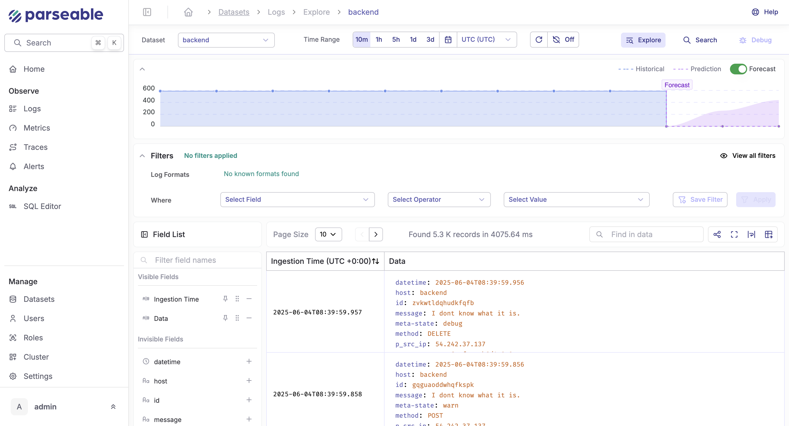

<Callout type="info">
  <EnterpriseBadge /> This feature requires an Enterprise license.
</Callout>

Parseable's AI-powered forecasting feature helps you predict future data volumes and optimize resource allocation by analyzing historical ingestion patterns.

## How It Works

The forecasting engine uses your recent log ingestion patterns to predict what's coming next. Enable it, and you'll see projected ingestion volumes right in your dashboards.

## Key Features

- **Extended Filter Support**: AI-based ingestion forecasting works with any filter you apply, allowing you to get automatic predictions for specific views (e.g., logs for a specific team or region)

- **Visualized Integration**: Forecasts appear directly in the Parseable Explore UI, so you can compare historical and predicted loads at a glance

- **Customizable Time Ranges**: Select different time ranges to see short-term or long-term forecasts based on your planning needs

## Benefits

- **Capacity Planning**: Anticipate storage and processing needs before they arise

- **Cost Optimization**: Allocate resources efficiently based on predicted usage patterns

- **Anomaly Detection**: Identify unusual spikes or drops in data volume that deviate from forecasted patterns

- **Proactive Management**: Move from reactive to proactive infrastructure management

## Use Cases

1. **Infrastructure Scaling**: Determine when to scale your infrastructure based on predicted log volume increases

2. **Budget Planning**: Forecast storage costs and resource requirements for financial planning

3. **Seasonal Pattern Analysis**: Identify cyclical patterns in your data to better understand your application behavior

4. **Anomaly Investigation**: Compare actual ingestion with forecasted values to quickly identify unexpected behavior

## Configuration

Forecasting is enabled by default in your Enterprise license. You can configure forecast settings including:

- Forecast horizon (how far into the future to predict)
- Confidence interval display
- Refresh frequency