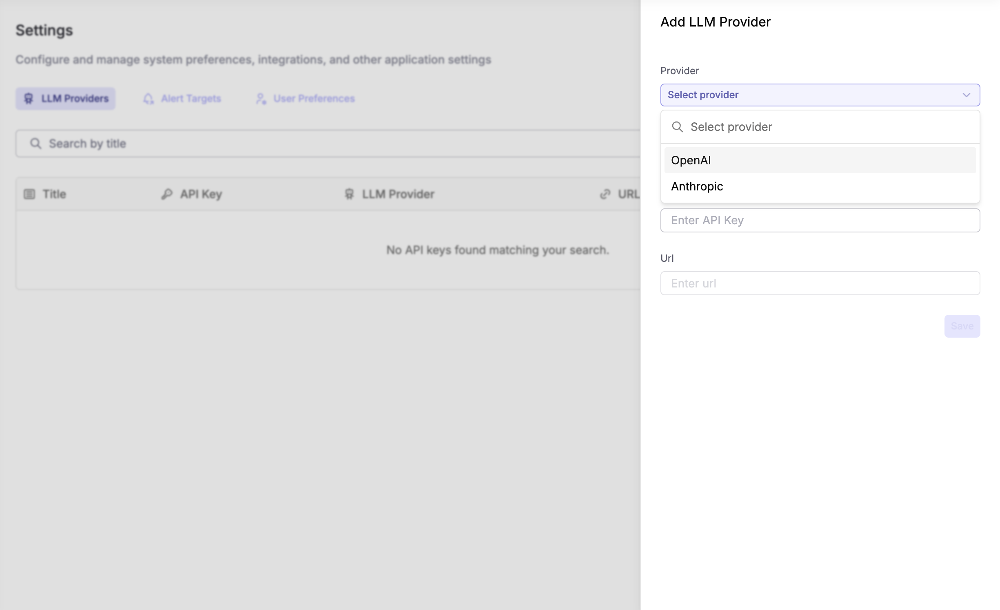

<OfferingPills pro enterprise className="mb-4" />

## Introduction

The core idea behind Keystone is to let you get to the answers you are looking in the shortest possible time. Specifically, Keystone is built to help you explore and analyze your observability data using natural language questions.

But why natural language? Because it allows you to ask questions without needing to know the underlying data structure or query languages. Traditionally, dashboards have served this purpose to show you trends and metrics. However, dashboards are limited to predefined views and often require you to know what you're looking for in advance.

For example, if you're a SRE investigating a sudden spike in error rates, you might start with a dashboard showing overall error trends. But what if you need to drill down into specific error codes, affected services, or time periods? You might find yourself switching between multiple dashboards, each providing only a piece of the puzzle - this slows down the investigation significantly. 

This is where Keystone comes in. By allowing you to ask specific questions in natural language, Keystone can quickly guide you to the relevant data, generate the necessary queries, and even visualize the results. This not only speeds up your investigation but also empowers you to explore your data more intuitively.

## How Keystone works

Keystone uses three specific agents working together to answer your questions:

- **Overview Agent**: Identifies which datasets contain the data you need and time-range. The overview agent is also the leader that orchestrates the other agents to get you the best answer.
- **SQL Agent**: Generates and runs multiple SQL queries to find the best answer. It also works with the overview agent to validate the results from each query.
- **Charting Agent**: Creates visualizations if asked by users to explain the results. 


<iframe width="560" height="315" src="https://www.youtube.com/embed/cvX01iZZ_tE?si=Mp6VR2pTjkbLaFHy" title="YouTube video player" frameBorder="0" allow="accelerometer; autoplay; clipboard-write; encrypted-media; gyroscope; picture-in-picture; web-share" referrerPolicy="strict-origin-when-cross-origin" allowFullScreen></iframe>

### Sample Q&A workflow

Let's walk through a typical workflow of using Keystone to answer a question.

#### User asks a question

Start by asking a question in natural language:

```
What are the top 5 error codes in the last 24 hours?
```

#### Dataset & time range selection

Keystone processes the question and extracts two key pieces of information:

- Relevant datasets: Which datasets contain the data needed
- Time-range: The time period to query (e.g., last 24 hours, last week)

You'll be presented with these selections for validation before proceeding.


#### Query generation & execution within guardrails

Once you validate the selection

1. The Q&A agent collaborates with the SQL agent
2. Multiple SQL queries are generated to approach your question from different angles
3. All queries are executed against the selected datasets
4. The overview agent validates the results from each query, acting as a guardrail to ensure accuracy
5. The best answer is curated based on which query results most accurately address your question

#### Answer & visualization

- A natural language answer to your question
- Raw data results from the query
- Optional visualizations (charts/graphs) for clearer understanding

## Configuration

To enable Keystone, configure your LLM provider in your Parseable instance:

* Go to **Settings** > **AI Assistant**.
* Choose your preferred LLM provider (OpenAI GPT or Anthropic Claude).
* Add your API key.
* Save your preferences.

Note that Keystone currently supports the following models and providers:

- **OpenAI**: GPT-4 and GPT-3.5 models
- **Anthropic**: Claude models


