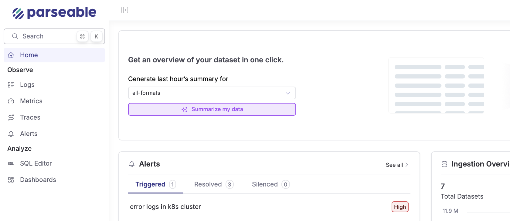

<OfferingPills pro enterprise className="mb-4" />

Parseable's AI-powered summarization feature simplifies data analysis and debugging by automatically generating concise overviews of your datasets.

## How It Works

1. Select any dataset within Parseable
2. Click on `Summarize my data` to generate a concise overview
3. The AI identifies key patterns, anomalies, and potential faults
4. Receive actionable recommendations and SQL queries to drill deeper



## Benefits

- **Quick Insights**: Gain insights without manually combing through extensive datasets
- **Reduced Troubleshooting Time**: Pinpoint anomalies and root causes effortlessly
- **Simplified Collaboration**: Share clear, concise summaries across your team
- **Proactive Issue Resolution**: Leverage AI-driven recommendations to address issues before they escalate

## Example Use Case

When troubleshooting elevated error rates in your logs, the summarization feature can instantly highlight:

- Unusual spikes in errors between specific timestamps
- Affected services and hosts
- Suggested SQL queries to drill down further, such as:

```sql
SELECT host, COUNT(*) as error_count
FROM logs
WHERE status='error' AND timestamp BETWEEN '2025-07-20T00:00:00' AND '2025-07-20T06:00:00'
GROUP BY host
ORDER BY error_count DESC;
```

## Configuration

The summarization feature is available out of the box with your Enterprise license. No additional configuration is required beyond setting up your preferred LLM provider in the settings page.