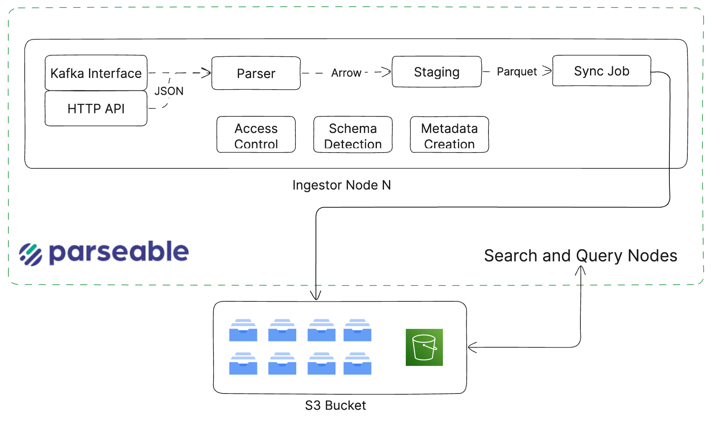

This document outlines the overall architecture of the Parseable Observability Platform, detailing the flow of MELT data from ingestion to storage and querying. 

This document is organiszed into specific sections for each sub-system like ingestion, query, search, and index. To understand the specific decisions and trade-offs, refer the [design choices document](./design-choices.mdx).

## Overview

Parseable is shipped as a single unified binary (or container image if you prefer). This includes the Prism UI and Parseable DB. There is no additional dependency to run Parseable.

The binary can be run in different modes. You’d generally run standalone mode to test and experience Parseable on your laptop, or a small testing server. 

As you move to a production setup, we recommend running the distributed mode. Here each node has a specific role, i.e. ingestion, query or search.  

## Ingestion

Parseable ingestion nodes follow a shared-nothing architecture, meaning each node independently handles the entire ingestion pipeline. In production, you typically place a load balancer in front of two or more ingestion nodes, allowing ingestion requests to be distributed across nodes seamlessly.

When a node receives an ingestion request (via HTTP or Kafka), it first validates the request, then converts the payload into an Apache Arrow-based file format. During this process, it also performs auto schema detection, enabling Parseable to intelligently classify logs and generate structured schemas on the fly. This makes it easy for users to filter, search, and analyze across diverse log types with minimal upfront configuration.

The Arrow files are temporarily staged in a dedicated local disk area. Once the disk write completes, the ingestion node acknowledges the request with a success response.

To ensure data durability during staging, we recommend attaching a small, reliable disk (such as NFS, Azure Files, or EFS) to each ingestion node.

A background job then reads the staged Arrow files, converts them into highly compressed Parquet files, and uploads them to S3 or any configured object store. During this transformation, the ingestion node also generates query metadata, which significantly enhances performance during log searches and queries.

## Query

Query node is primarily responsible responding to query API. This node also serves as the leader node in a Parseable cluster and hence it also responds to other API. 

The query workflow starts when someone calls the query API with (a PostgreSQL compatible) SQL query, and a start and end timestamp. The query node looks up the metadata locally first, falling back to object store only if not found. 

Based on metadata, the node identifies the relevant parquet files and uses the object store API to get these files. Here again, this only happens if the files are not already present locally. If the files are to be downloaded from object storage - this adds to latency and hence the occasional cold queries. 

Another node called Prism node responds to all the role, user management, dataset management API.   

## Benchmarking

ParseableDB is an OLAP database purpose built for high volume ingestion, and fast querying of observability signals. It uses object storage as the primary data store, for cost efficiency and scale. For fast query response, it uses caching mechanisms to keep the frequently accessed data in memory and on local disk. 

Parseable ranks among the **fastest databases** on ClickBench, outperforming several OLAP systems in structured query benchmarks.
Parseable benchmarks are available on [ClickBench](https://benchmark.clickhouse.com/).

Refer to the benchmark results here: [ParseableDB Benchmark](https://benchmark.clickhouse.com/#eyJzeXN0ZW0iOnsiQWxsb3lEQiI6ZmFsc2UsIkFsbG95REIgKHR1bmVkKSI6ZmFsc2UsIkF0aGVuYSAocGFydGl0aW9uZWQpIjpmYWxzZSwiQXRoZW5hIChzaW5nbGUpIjpmYWxzZSwiQXVyb3JhIGZvciBNeVNRTCI6ZmFsc2UsIkF1cm9yYSBmb3IgUG9zdGdyZVNRTCI6ZmFsc2UsIkJpZ3F1ZXJ5IjpmYWxzZSwiQnlDb25pdHkiOmZhbHNlLCJCeXRlSG91c2UiOmZhbHNlLCJDZWRhckRCIjpmYWxzZSwiY2hEQiAoRGF0YUZyYW1lKSI6ZmFsc2UsImNoREIgKFBhcnF1ZXQsIHBhcnRpdGlvbmVkKSI6dHJ1ZSwiY2hEQiI6ZmFsc2UsIkNIWVQiOmZhbHNlLCJDaXR1cyI6ZmFsc2UsIkNsaWNrSG91c2UgQ2xvdWQgKGF3cykiOmZhbHNlLCJDbGlja0hvdXNlIENsb3VkIChhenVyZSkiOmZhbHNlLCJDbGlja0hvdXNlIENsb3VkIChnY3ApIjpmYWxzZSwiQ2xpY2tIb3VzZSAoZGF0YSBsYWtlLCBwYXJ0aXRpb25lZCkiOmZhbHNlLCJDbGlja0hvdXNlIChkYXRhIGxha2UsIHNpbmdsZSkiOmZhbHNlLCJDbGlja0hvdXNlIChQYXJxdWV0LCBwYXJ0aXRpb25lZCkiOnRydWUsIkNsaWNrSG91c2UgKFBhcnF1ZXQsIHNpbmdsZSkiOnRydWUsIkNsaWNrSG91c2UgKHdlYikiOmZhbHNlLCJDbGlja0hvdXNlIjpmYWxzZSwiQ2xpY2tIb3VzZSAodHVuZWQpIjpmYWxzZSwiQ2xpY2tIb3VzZSAodHVuZWQsIG1lbW9yeSkiOmZhbHNlLCJDbG91ZGJlcnJ5IjpmYWxzZSwiQ3JhdGVEQiAodHVuZWQpIjpmYWxzZSwiQ3JhdGVEQiI6ZmFsc2UsIkNydW5jaHkgQnJpZGdlIGZvciBBbmFseXRpY3MgKFBhcnF1ZXQpIjpmYWxzZSwiRGFmdCAoUGFycXVldCwgcGFydGl0aW9uZWQpIjp0cnVlLCJEYWZ0IChQYXJxdWV0LCBzaW5nbGUpIjp0cnVlLCJEYXRhYmVuZCI6ZmFsc2UsIkRhdGFGdXNpb24gKFBhcnF1ZXQsIHBhcnRpdGlvbmVkKSI6dHJ1ZSwiRGF0YUZ1c2lvbiAoUGFycXVldCwgc2luZ2xlKSI6dHJ1ZSwiQXBhY2hlIERvcmlzIjpmYWxzZSwiRHJpbGwiOmZhbHNlLCJEcnVpZCI6ZmFsc2UsIkR1Y2tEQiAoRGF0YUZyYW1lKSI6ZmFsc2UsIkR1Y2tEQiAobWVtb3J5KSI6ZmFsc2UsIkR1Y2tEQiAoUGFycXVldCwgcGFydGl0aW9uZWQpIjp0cnVlLCJEdWNrREIiOmZhbHNlLCJFbGFzdGljc2VhcmNoIjp0cnVlLCJFbGFzdGljc2VhcmNoICh0dW5lZCkiOnRydWUsIkdsYXJlREIgKFBhcnF1ZXQsIHNpbmdsZSkiOmZhbHNlLCJHcmVlbnBsdW0iOmZhbHNlLCJIZWF2eUFJIjpmYWxzZSwiSHlkcmEiOmZhbHNlLCJTYWxlc2ZvcmNlIEh5cGVyIChQYXJxdWV0KSI6ZmFsc2UsIlNhbGVzZm9yY2UgSHlwZXIiOmZhbHNlLCJJbmZvYnJpZ2h0IjpmYWxzZSwiS2luZXRpY2EiOmZhbHNlLCJNYXJpYURCIENvbHVtblN0b3JlIjpmYWxzZSwiTWFyaWFEQiI6ZmFsc2UsIk1vbmV0REIiOmZhbHNlLCJNb25nb0RCIjpmYWxzZSwiTW90aGVyRHVjayI6ZmFsc2UsIk15U1FMIChNeUlTQU0pIjpmYWxzZSwiTXlTUUwiOmZhbHNlLCJPY3RvU1FMIjpmYWxzZSwiT3B0ZXJ5eCI6ZmFsc2UsIk94bGEiOmZhbHNlLCJQYW5kYXMgKERhdGFGcmFtZSkiOmZhbHNlLCJQYXJhZGVEQiAoUGFycXVldCwgcGFydGl0aW9uZWQpIjp0cnVlLCJQYXJhZGVEQiAoUGFycXVldCwgc2luZ2xlKSI6dHJ1ZSwiUGFyc2VhYmxlIChQYXJxdWV0LCBwYXJ0aXRpb25lZCkiOnRydWUsInBnX2R1Y2tkYiAod2l0aCBpbmRleGVzKSI6ZmFsc2UsInBnX2R1Y2tkYiAoTW90aGVyRHVjayBlbmFibGVkKSI6ZmFsc2UsInBnX2R1Y2tkYiI6ZmFsc2UsInBnX2R1Y2tkYiAoUGFycXVldCkiOmZhbHNlLCJQb3N0Z3JlU1FMIHdpdGggcGdfbW9vbmNha2UiOmZhbHNlLCJwZ3Byb190YW0gKHBhcnF1ZXQsIGxvY2FsIHN0b3JhZ2UpIjpmYWxzZSwicGdwcm9fdGFtIChwYXJxdWV0LCBsb2NhbCwgcGFyYWxsZWwpIjpmYWxzZSwicGdwcm9fdGFtIChwYXJxdWV0LCBsb2NhbCArIGNhY2hlKSI6ZmFsc2UsInBncHJvX3RhbSAoZmVhdGhlciwgbG9jYWwgKyBjYWNoZSkiOmZhbHNlLCJQaW5vdCI6ZmFsc2UsIlBvbGFycyAoRGF0YUZyYW1lKSI6ZmFsc2UsIlBvbGFycyAoUGFycXVldCkiOmZhbHNlLCJQb3N0Z3JlU1FMICh3aXRoIGluZGV4ZXMpIjpmYWxzZSwiUG9zdGdyZVNRTCI6ZmFsc2UsIlF1ZXN0REIiOmZhbHNlLCJSZWRzaGlmdCI6ZmFsc2UsIlNlbGVjdERCIjpmYWxzZSwiU2lnTGVucyI6ZmFsc2UsIlNpbmdsZVN0b3JlIjpmYWxzZSwiU25vd2ZsYWtlIjpmYWxzZSwiU3BhcmsiOmZhbHNlLCJTUUxpdGUiOmZhbHNlLCJTdGFyUm9ja3MiOmZhbHNlLCJUYWJsZXNwYWNlIjpmYWxzZSwiVGVtYm8gT0xBUCAoY29sdW1uYXIpIjpmYWxzZSwiVGltZXNjYWxlIENsb3VkIjpmYWxzZSwiVGltZXNjYWxlREIgKG5vIGNvbHVtbnN0b3JlKSI6ZmFsc2UsIlRpbWVzY2FsZURCIjpmYWxzZSwiVGlueWJpcmQgKEZyZWUgVHJpYWwpIjpmYWxzZSwiVW1icmEiOmZhbHNlLCJVcnNhIjpmYWxzZSwiVmljdG9yaWFMb2dzIjpmYWxzZSwiWURCIjpmYWxzZSwiQXBhY2hlIERvcmlzIChQYXJxdWV0LCBwYXJ0aXRpb25lZCkiOnRydWV9LCJ0eXBlIjp7IkMiOnRydWUsImNvbHVtbi1vcmllbnRlZCI6dHJ1ZSwiUG9zdGdyZVNRTCBjb21wYXRpYmxlIjp0cnVlLCJtYW5hZ2VkIjp0cnVlLCJnY3AiOnRydWUsInN0YXRlbGVzcyI6dHJ1ZSwiSmF2YSI6dHJ1ZSwiQysrIjp0cnVlLCJNeVNRTCBjb21wYXRpYmxlIjp0cnVlLCJyb3ctb3JpZW50ZWQiOnRydWUsInNlcnZlcmxlc3MiOnRydWUsIkNsaWNrSG91c2UgZGVyaXZhdGl2ZSI6dHJ1ZSwiZW1iZWRkZWQiOnRydWUsImRhdGFmcmFtZSI6dHJ1ZSwiWVRzYXVydXMiOnRydWUsImF3cyI6dHJ1ZSwiYXp1cmUiOnRydWUsImFuYWx5dGljYWwiOnRydWUsIlJ1c3QiOnRydWUsInNlYXJjaCI6dHJ1ZSwiZG9jdW1lbnQiOnRydWUsIkdvIjp0cnVlLCJzb21ld2hhdCBQb3N0Z3JlU1FMIGNvbXBhdGlibGUiOnRydWUsInBhcnF1ZXQiOnRydWUsInRpbWUtc2VyaWVzIjp0cnVlLCJsb2dzIjp0cnVlLCJTaWdMZW5zIjp0cnVlLCJvYnNlcnZhYmlsaXR5Ijp0cnVlLCJkZWRpY2F0ZWQiOnRydWV9LCJtYWNoaW5lIjp7IjE2IHZDUFUgMTI4R0IiOmZhbHNlLCI4IHZDUFUgNjRHQiI6ZmFsc2UsInNlcnZlcmxlc3MiOmZhbHNlLCIxNmFjdSI6ZmFsc2UsImM2YS40eGxhcmdlLCA1MDBnYiBncDIiOnRydWUsIkwiOmZhbHNlLCJNIjpmYWxzZSwiUyI6ZmFsc2UsIlhTIjpmYWxzZSwiYzZhLm1ldGFsLCA1MDBnYiBncDIiOmZhbHNlLCIxMiB2Q1BVIDQ4R0IiOmZhbHNlLCIxMCB2Q1BVIDQwR0IiOmZhbHNlLCIxMkdpQiwgMSByZXBsaWNhKHMpIjpmYWxzZSwiOEdpQiwgMSByZXBsaWNhKHMpIjpmYWxzZSwiMTJHaUIsIDIgcmVwbGljYShzKSI6ZmFsc2UsIjEyMEdpQiwgMiByZXBsaWNhKHMpIjpmYWxzZSwiMTZHaUIsIDIgcmVwbGljYShzKSI6ZmFsc2UsIjIzNkdpQiwgMiByZXBsaWNhKHMpIjpmYWxzZSwiMzJHaUIsIDIgcmVwbGljYShzKSI6ZmFsc2UsIjY0R2lCLCAyIHJlcGxpY2EocykiOmZhbHNlLCI4R2lCLCAyIHJlcGxpY2EocykiOmZhbHNlLCIxMkdpQiwgMyByZXBsaWNhKHMpIjpmYWxzZSwiMTIwR2lCLCAzIHJlcGxpY2EocykiOmZhbHNlLCIxNkdpQiwgMyByZXBsaWNhKHMpIjpmYWxzZSwiMjM2R2lCLCAzIHJlcGxpY2EocykiOmZhbHNlLCIzMkdpQiwgMyByZXBsaWNhKHMpIjpmYWxzZSwiNjRHaUIsIDMgcmVwbGljYShzKSI6ZmFsc2UsIjhHaUIsIDMgcmVwbGljYShzKSI6ZmFsc2UsImM1bi40eGxhcmdlLCA1MDBnYiBncDIiOmZhbHNlLCJBbmFseXRpY3MtMjU2R0IgKDY0IHZDb3JlcywgMjU2IEdCKSI6ZmFsc2UsImM1LjR4bGFyZ2UsIDUwMGdiIGdwMiI6ZmFsc2UsImM2YS40eGxhcmdlLCAxNTAwZ2IgZ3AyIjp0cnVlLCJYTCI6ZmFsc2UsIkp1bWJvIjpmYWxzZSwiUHVsc2UiOmZhbHNlLCJTdGFuZGFyZCI6ZmFsc2UsIjE2IHZDUFUgMzJHQiI6ZmFsc2UsImRjMi44eGxhcmdlIjpmYWxzZSwicmEzLjE2eGxhcmdlIjpmYWxzZSwicmEzLjR4bGFyZ2UiOmZhbHNlLCJyYTMueGxwbHVzIjpmYWxzZSwiYzZhLjR4bGFyZ2UsIDMwMGdiIGdwMiI6ZmFsc2UsIlMyIjpmYWxzZSwiUzI0IjpmYWxzZSwiMlhMIjpmYWxzZSwiM1hMIjpmYWxzZSwiNFhMIjpmYWxzZSwiTDEgLSAxNkNQVSAzMkdCIjpmYWxzZSwiYzZhLjR4bGFyZ2UsIDUwMGdiIGdwMyI6ZmFsc2UsIjE2IHZDUFUgNjRHQiI6ZmFsc2UsIjQgdkNQVSAxNkdCIjpmYWxzZSwiOCB2Q1BVIDMyR0IiOmZhbHNlLCI2NCB2Q1BVIDI1NkdCIjpmYWxzZSwiYzZhLjR4bGFyZ2UiOnRydWUsImM2YS5tZXRhbCI6dHJ1ZX0sImNsdXN0ZXJfc2l6ZSI6eyIxIjp0cnVlLCIyIjp0cnVlLCIzIjp0cnVlLCI0Ijp0cnVlLCI4Ijp0cnVlLCI5Ijp0cnVlLCIxNiI6dHJ1ZSwiMzIiOnRydWUsIjY0Ijp0cnVlLCIxMjgiOnRydWUsInNlcnZlcmxlc3MiOnRydWUsInVuZGVmaW5lZCI6dHJ1ZX0sIm1ldHJpYyI6ImhvdCIsInF1ZXJpZXMiOlt0cnVlLHRydWUsdHJ1ZSx0cnVlLHRydWUsdHJ1ZSx0cnVlLHRydWUsdHJ1ZSx0cnVlLHRydWUsdHJ1ZSx0cnVlLHRydWUsdHJ1ZSx0cnVlLHRydWUsdHJ1ZSx0cnVlLHRydWUsdHJ1ZSx0cnVlLHRydWUsdHJ1ZSx0cnVlLHRydWUsdHJ1ZSx0cnVlLHRydWUsdHJ1ZSx0cnVlLHRydWUsdHJ1ZSx0cnVlLHRydWUsdHJ1ZSx0cnVlLHRydWUsdHJ1ZSx0cnVlLHRydWUsdHJ1ZSx0cnVlXSwicHJvcHJpZXRhcnkiOnsieWVzIjp0cnVlLCJubyI6ZmFsc2V9LCJ0dW5lZCI6eyJ5ZXMiOnRydWUsIm5vIjpmYWxzZX19)

Steps on how to run the benchmarks are available in the [ClickBench documentation](https://github.com/ClickHouse/ClickBench/tree/main/parseable).

## Limitations

- ParseableDB is not an OLTP database. It is designed specifically for observability signals and may not be suitable for other use cases that require complex transactions or relationships.

- ParseableDB requires JSON or Kafka as the input format. Other formats may not be supported or may require additional processing.

- ParseableDB is not a full-fledged SQL database. It is designed for high-performance querying and may not support all SQL features or functions.
