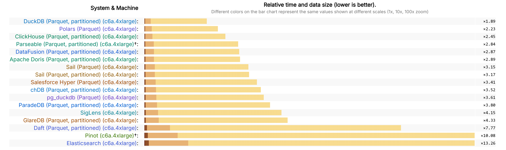

This page provides an overview of Parseable's performance benchmarks.

## ClickBench

Parseable is a top performer on the [ClickBench](https://benchmark.clickhouse.com/) benchmark. ClickBench is an industry-standard benchmark for analytical databases.

[**View Parseable on ClickBench**](http://logg.ing/clickbench)

Parseable's performance is a result of its modern architecture, designed for observability data, Read more about our performance philosophy in our post: [Performance is Table Stakes](https://www.parseable.com/blog/performance-is-table-stakes).

## Real-World Performance: 100 TB/Day

We tested Parseable's performance with a real-world scenario of ingesting **100 TB of telemetry data per day**.

### Test Results at a Glance

| Metric                | Result                               |
| --------------------- | ------------------------------------ |
| **Ingestion Rate**    | **2 TB/hour** (sustained)            |
| **Query Latency**     | **Millisecond-range** (even at load) |
| **Monthly Cost**      | **~$11,810** (for a 4-node cluster)  |
| **Compression Ratio** | **Up to 90%**                        |

For more details, see our blog post: [The Economics and Physics of 100 TB Telemetry Data Per Day](https://www.parseable.com/blog/the-economics-and-physics-of-100-tb-telemetry-data-per-day).