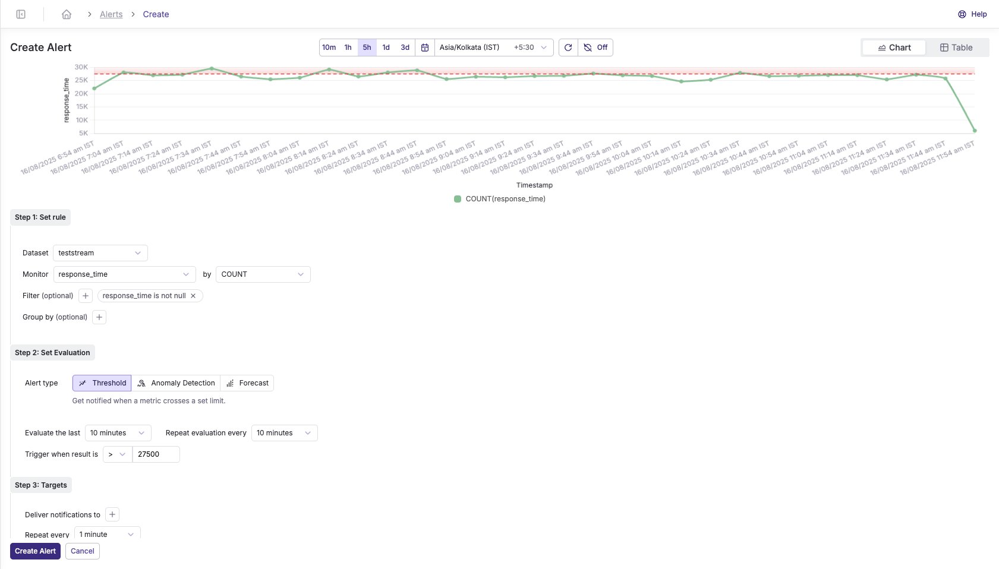
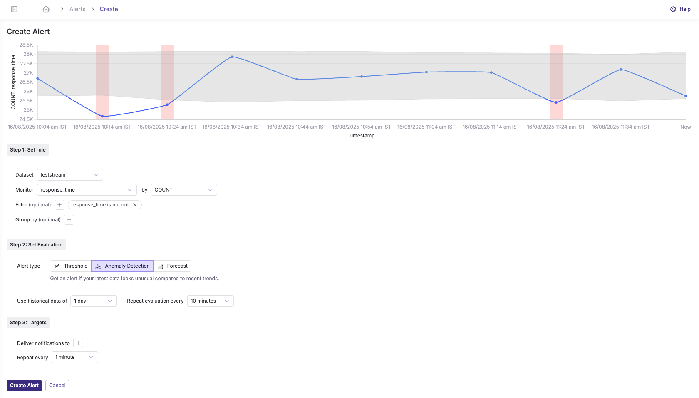
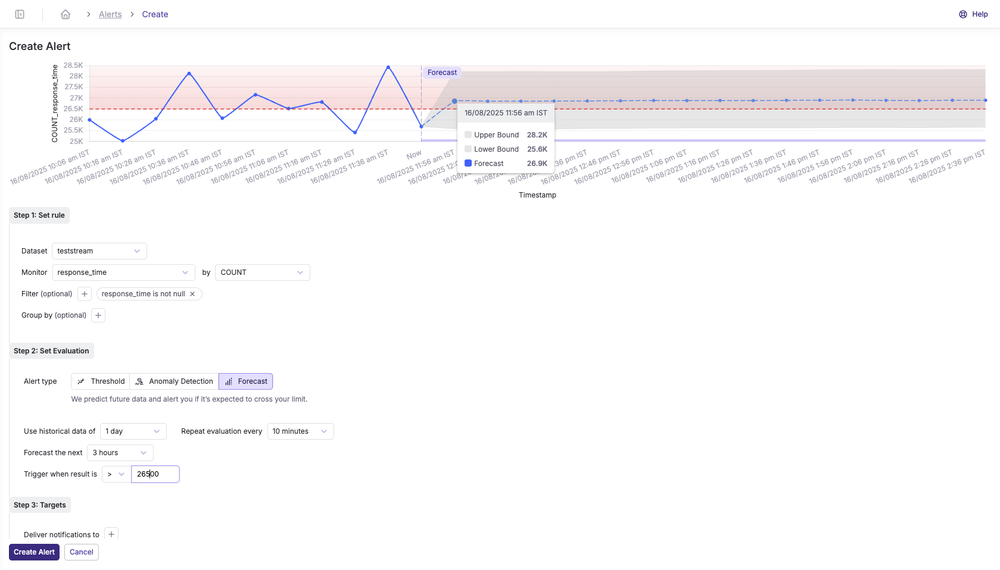

Parseable offers realtime alerting based on contents of incoming events. Each dataset can have several alerts and each alert is evaluated independently.


## Alert Types

Parseable supports three types of alerts:

### Threshold Alerts
Threshold alerts trigger when a metric crosses a defined boundary. For example, alerting when response time exceeds 500ms or when error count is greater than 100.



### Anomaly Detection

<Callout type="info">
  <EnterpriseBadge /> This feature requires an Enterprise license.
</Callout>
Anomaly Detection alerts use machine learning to identify unusual patterns in your data. These alerts automatically detect deviations from normal behavior without requiring you to set specific thresholds.



### Forecasting

<Callout type="info">
  <EnterpriseBadge /> This feature requires an Enterprise license.
</Callout>

Forecasting alerts predict future values based on historical data and alert you if the predicted values are expected to cross your defined limits. This helps you proactively address issues before they occur.



## How it works

Alerts in Parseable work by monitoring your log data in real-time and triggering notifications when specific conditions are met. Here's how it works in simple terms:

1. **Define conditions**: You set up rules that specify what to look for in your logs (like error codes, specific text patterns, threshold values, anomalies, or forecasted trends)
2. **Automatic monitoring**: Parseable continuously checks incoming logs against these rules
3. **Notification**: When a rule condition is met, Parseable sends notifications to your configured targets (like Slack or a webhook)

You can easily set up alerts through Parseable's user interface called Prism, which provides a simple way to configure all aspects of your alerts without writing complex code.

## How to set-up alerts

1. Navigate to the Alerts page from the side navigation menu
2. Click on "Create Alert" to set up a new alert
3. Set the "Preview", it could be either chart or table for 10m, 1h, 5h 1d or any custom timerange. 
  

### Configure Alert Rules

Configure the alert rules for all alert types:

- **Dataset**: Select the log stream or dataset you want to monitor
- **Monitor**: Choose the specific field to track (e.g., `response_time`, `error_count`, `status_code`)
- **Filter** (Optional): Add conditions to narrow down the data (e.g., `status = 500`, `environment = production`)
- **Group By** (Optional): Group results by specific fields for more granular alerting (e.g., group by `service_name` or `region`)


### Set Evaluation Configuration

#### Threshold Alerts
- **Description**: Get notified when a metric crosses a set limit
- **Evaluate the last**: Time window to analyze (e.g., 10 minutes, 1 hour, 1 day)
- **Repeat evaluation every**: How often to check the condition (e.g., every 10 minutes)
- **Trigger when result is**: Set the comparison operator (`>`, `<`, `=`, `>=`, `<=`, `!=`) and threshold value


#### Anomaly Detection

<Callout type="info">
  <EnterpriseBadge /> This feature requires an Enterprise license.
</Callout>

- **Description**: Get an alert if your latest data looks unusual compared to recent trends
- **Use historical data of**: Training period for the ML model (e.g., 1 day, 1 week, 1 month)
- **Repeat evaluation every**: How often to check for anomalies (e.g., every 10 minutes)
- **Group By behavior**: When using Group By with Anomaly Detection, the system analyzes each group independently. Alerts trigger separately for each group that shows anomalous behavior. You can preview anomalies for individual groups using the dropdown selector in the top-right corner of the preview panel. 


#### Forecasting

<Callout type="info">
  <EnterpriseBadge /> This feature requires an Enterprise license.
</Callout>

- **Description**: We predict future data and alert you if it's expected to cross your limit
- **Use historical data of**: Historical period for prediction model (e.g., 1 day, 1 week)
- **Repeat evaluation every**: How often to run predictions (e.g., every 10 minutes)
- **Forecast the next**: Time window to predict ahead (e.g., 3 hours, 1 day)
- **Group By behavior**: When using Group By with Forecasting, the system analyzes each group independently. Alerts trigger separately for each group that shows anomalous behavior. You can preview anomalies for individual groups using the dropdown selector in the top-right corner of the preview panel. 


### Configure Targets

Targets in Parseable alerts are the destinations where notifications are sent when an alert is triggered. Each alert can be configured to send notifications to multiple targets simultaneously. A target can be a notification service like Slack, a webhook endpoint, or an alert management system like Alertmanager.

When an alert condition is met, Parseable sends the alert message to all the targets specified in the alert configuration. Each target has its own configuration parameters, such as endpoint URLs, authentication credentials, and notification frequency settings.

Parseable supports sending alerts to Webhook, Slack, and Alertmanager targets. You can configure multiple targets for each alert.

The list of configured targets can be seen under Settings > Alert Targets.


**Target Configuration**

Targets are the destinations where notifications are sent when an alert is triggered. The targets field is an array of target objects, each with the following common parameters:

| Variable Name | Required | Description |
| --- | --- | --- |
| name | Yes | The name of target. |
| type | Yes | The type of target. Can be alertmanager, webhook, or slack. |
| endpoint | Yes | The URL of the target. |
| notificationConfig | No | Specify the frequency of sending the alert to the target. By default the `notificationConfig` field has interval set to 1 (minute) and times set to 1. `interval` accepts a `u64` and `times` accepts a `usize`. If you want the notification to be sent 5 times, once every minute, you would set `interval` to 1 and `times` to 5. |

Sample target configuration:

```json
{
    "name":"AlertManagerTarget",
    "type": "alertManager",
    "endpoint": "https://some.webhook.com",
    "username": "username",
    "password":"password",
    "skipTlsCheck": true,
    "notificationConfig": {
        "interval": 3,
        "times": 7
    }
}
```

Apart from above common parameters, there are target-specific parameters that can be configured. Refer to the sections below for details.

#### **Alertmanager**

The alertmanager target can be used to send notifications to [Alertmanager](https://github.com/prometheus/alertmanager) instance. Note that by default if you don't provide repeat configuration for this then Parseable will continue to send alerts to Alertmanager while it is active.

Note that Alertmanager expects clients to continuously re-send alerts as long as they are still active (usually on the order of 30 seconds to 3 minutes). Avoid specifying `repeat.times` in configuration unless you want Parseable to stop re-sending alerts after specified number of times.

| Variable Name | Required | Description |
| --- | --- | --- |
| endpoint | Yes | The URL of the Alertmanager api to send notifications to. Compatible with Alertmanager API V2 |
| username | No | Username for basic auth. See [Prometheus Docs](https://prometheus.io/docs/alerting/latest/https/#http-traffic) on how to setup basic auth. |
| password | No | Password for basic auth. |
| skipTlsCheck | No | Whether to skip TLS verification when sending the alert to Alertmanager. |

Example JSON sent by Parseable to Alertmanager. Note that `rule_config_*` may differ depending on the type of rule that triggered the alert.

```json
{
    "labels": {
        "alertname": "Status Alert",
        "deployment_id": "01GTFFFFFFFFFFFF",
        "rule_config_column": "status",
        "rule_config_operator": "exact",
        "rule_config_repeats": "2",
        "rule_config_value": "500",
        "rule_type": "column",
        "status": "firing",
        "stream": "app"
    },
    "annotations": {
        "message": "message that was set for this alert",
        "reason": "status column was equal to 500, 2 times"
    }
}
```

#### **Webhook**

The webhook target can be used to send notifications to a webhook URL. The target object contains the following parameters:

| Variable Name | Required | Description |
| --- | --- | --- |
| endpoint | Yes | The URL of the webhook to send notifications to. |
| headers | No | Any custom headers to include in the webhook request |
| skipTlsCheck | No | Whether to skip TLS verification when sending the webhook request. |

#### **Slack**

The slack target can be used to send notifications to a Slack channel. The target object contains the following parameters:

| Variable Name | Required | Description |
| --- | --- | --- |
| endpoint | Yes | Slack webhook URL. Refer [Slack docs for details](https://api.slack.com/messaging/webhooks). |

**Alert Configuration Fields**

| Field | Description |
| --- | --- |
| `version` | Should be `v1` for now |
| `severity` | Either `low`, `medium`, `high`, `critical` |
| `title` | The title of the alert |
| `stream` | The dataset on which the alert is being configured |
| `alertType` | The type of alert: `threshold`, `anomaly`, or `forecast` |
| `targets` | An array of target IDs to which the notification will be sent |

### Add Title and Save

Finally, configure the alert metadata and save your alert:

- **Title**: Give your alert a descriptive name that clearly identifies its purpose (e.g., "High CPU Usage", "API Error Rate", "GPU Load")
- **Severity**: Select the appropriate severity level:
  - **Low**: Minor issues that need attention but aren't urgent
  - **Medium**: Issues that should be addressed soon
  - **High**: Important issues requiring prompt attention
  - **Critical**: Urgent issues requiring immediate action
- **Tags** (Optional): Add tags to categorize and organize your alerts for easier management

Once all configurations are complete, click **"Save"** to create your alert. The alert will immediately begin monitoring your data based on the configured rules and will send notifications to the specified targets when conditions are met.

## Managing Alerts


After creating alerts, you can manage them from the Alerts page. Each alert has a context menu with the following options:

- **Evaluate alert**: Manually trigger an evaluation of the alert conditions to test if it's working correctly
- **Disable alert**: Temporarily disable an alert without deleting it. Disabled alerts won't monitor data or send notifications
- **Mute notifications**: Keep the alert active and monitoring, but temporarily stop sending notifications. Useful during maintenance windows or known issues
- **Edit alert**: Modify any aspect of the alert configuration including rules, targets, severity, and evaluation settings
- **Delete Alert**: Permanently remove an alert from the system

These management options give you full control over your alert lifecycle, allowing you to adapt to changing monitoring needs without recreating alerts from scratch.
