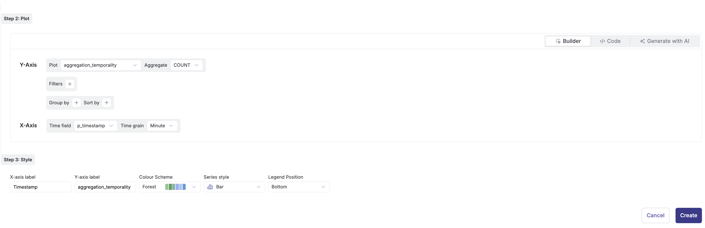
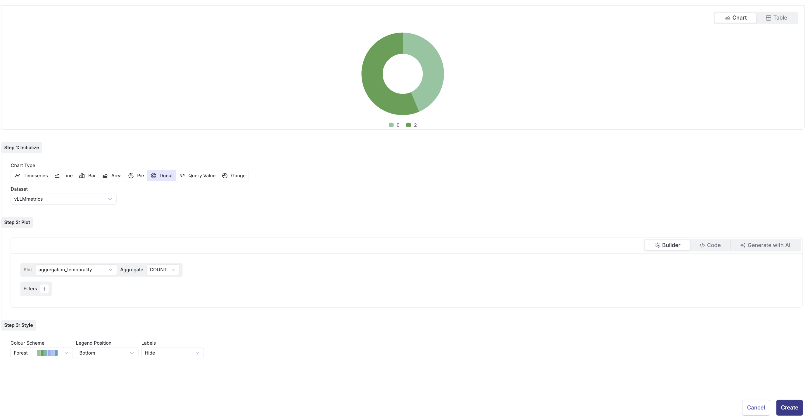
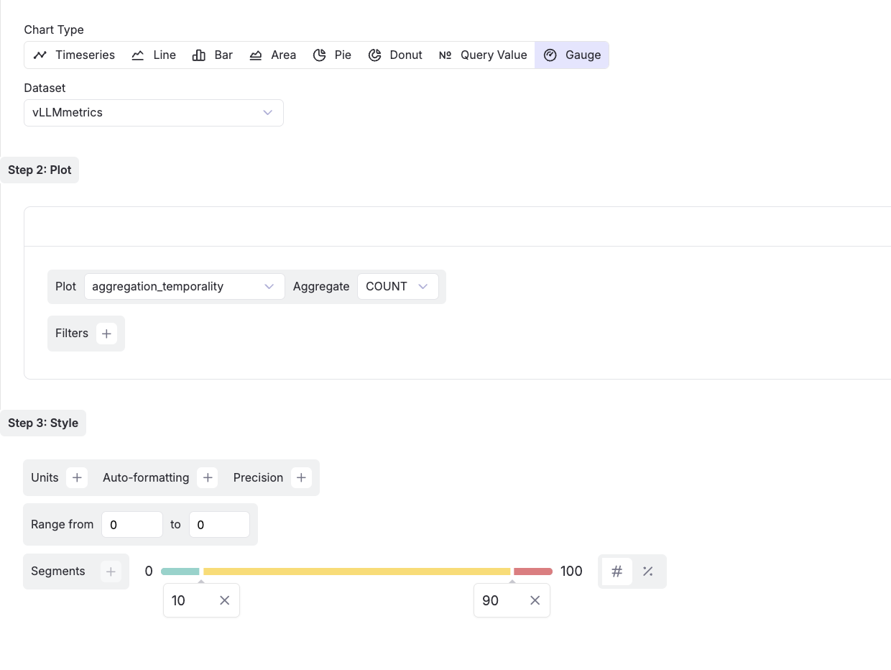

## Introduction

Parseable Dashboards are customisable and support querying multiple data streams for comprehensive insights. You can also leverage text to SQL conversion for quick query creation. The Dashboards feature is designed to help you visualize data insights at a glance, enabling you to make informed decisions based on real-time data.

**How It Works:**

<iframe width="560" height="315" src="https://www.youtube.com/embed/mXO2WtV0vBU?si=t1aW3PQUdN0oc9VC" title="YouTube video player" frameborder="0" allow="accelerometer; autoplay; clipboard-write; encrypted-media; gyroscope; picture-in-picture; web-share" referrerpolicy="strict-origin-when-cross-origin" allowfullscreen></iframe>

- **Start from the Side Nav:** Head over to Dashboards in the sidebar and hit Create New.

- **Name & Tag:** Give your dashboard a name and a tag (for easy organizing), then click Create Dashboard.

- **Build Your Canvas:** Select your new dashboard to land on the dashboard canvas. Click Add Tiles to start building charts.

- **Save and Favorite:** Add as many tiles as you need, then save your dashboard. You can also mark dashboards as favorites for quick access later.

## Chart Builder Workflow

The chart builder follows a 3-step process to create powerful visualizations:

### Step 1: Initialize

**Chart Type Selection:**
- **Timeseries**: For time-based data visualization
- **Line**: For trend analysis and continuous data
- **Bar**: For categorical comparisons
- **Area**: For cumulative values over time
- **Pie**: For showing proportions of a whole
- **Donut**: Similar to pie with a hollow center
- **Query Value**: For displaying single metric values
- **Gauge**: For showing progress or thresholds

**Dataset Selection:**
Choose your data source from the dropdown menu (e.g., vLLMmetrics or your custom log streams).

### Step 2: Plot Configuration

The configuration options vary based on your selected chart type:

#### For Timeseries, Line, Bar, and Area Charts:
- **Y-Axis**: Select the plot field (e.g., `aggregation_temporality_desc`)
- **Aggregate**: Choose aggregation method (COUNT)
- **Filters**: Add conditions to filter your data
- **Group by**: Group data by specific fields for segmentation
- **Sort by**: Order your results (ascending or descending)
- **X-Axis**: Select the dimension field (e.g., `aggregation_temporality`)

#### For Pie and Donut Charts:
- **Plot**: Select the field to visualize
- **Aggregate**: Choose how to aggregate values (COUNT)
- **Filters**: Apply data filters as needed
- **Note**: Grouping and sorting options are not available for these chart types

#### For Query Value and Gauge:
- **Plot**: Select the metric field
- **Aggregate**: Define the aggregation method
- **Filters**: Filter data to focus on specific values
- **Note**: These visualizations display single values, no grouping or sorting needed

### Step 3: Style Your Visualization

**Customization Options:**
- **X-axis Label**: Custom label for the X-axis
- **Y-axis Label**: Custom label for the Y-axis
- **Colour Scheme**: Choose from predefined color palettes (Forest, Ocean, Sunset, etc.)
- **Legend Position**: Place legend where it best fits your layout
- **Grid Lines**: Toggle grid visibility for better readability
- **Data Labels**: Show/hide values on the chart

**Chart-Specific Styling:**
- **Line/Area**: Smooth curves, fill opacity, stroke width
- **Bar**: Orientation (vertical/horizontal), bar spacing
- **Pie/Donut**: Inner radius (for donut), label display

**Gauge and Query Value Specific Styling:**
- **Units**: Add unit labels (e.g., %, ms, GB)
- **Auto-formatting**: Enable automatic number formatting
- **Precision**: Set decimal places for displayed values
- **Range**: Define min and max values (from 0 to 100 for percentages)
- **Segments**: Configure color-coded thresholds
  - Set breakpoints (e.g., 10, 90 for three segments)
  - Assign colors to each segment (green, yellow, red)
  - Use visual indicators for performance levels

**Quick Table View:**
Want to see raw data? Click the **Table** button in the top right corner to skip chart setup and view your query results in a tabular format.

## SQL Based Chart Builder

You can now build Dashboard charts using SQL queries. Follow the steps below to create a chart using SQL queries:

- Select the "Create with SQL" option under the "+Add Tile" button.
- Select the dataset.
- Write your SQL query to fetch the data.
- Select the chart type.
- Configure the chart options.
- Click on "Create" to create the chart.

## How it works

Dashboards in Parseable are a collection of tiles, each representing a visualization of a query result. You can create multiple tiles on a dashboard, each with its own query and chart type. Further, a tile's chart can be configured for different colors, units and formatting. Each tile can be based on a query targeting different dataset. The tiles can be resized, repositioned, and exported in various formats for easy sharing and collaboration.

Dashboard tiles can be dragged and repositioned anywhere on the dashboard. You can also adjust the tile size to fit your layout preferences, selecting from small, medium, large, or full screen widths (1/4, 2/4, 3/4, and full screen).

## Visualization Types

Parseable offers eight distinct visualization types, each optimized for different data patterns:

### Time-Series Charts
- **Timeseries**: Specialized for temporal data with automatic time formatting
- **Line**: Connect data points for trend visualization
- **Area**: Show cumulative values with filled areas

These charts support full configuration: Y-axis plotting, filtering, grouping, and sorting.

### Comparison Charts
- **Bar**: Compare categories with vertical or horizontal bars
  - Supports: Y-axis plot, filters, grouping, sorting
  - Best for: Categorical comparisons, distributions

### Proportion Charts
- **Pie**: Display parts of a whole in circular format
- **Donut**: Similar to pie with hollow center for modern aesthetics
  - Supports: Plot selection, aggregation, filtering
  - Best for: Showing percentages and proportions

### Metric Displays
- **Query Value**: Single metric display for KPIs
- **Gauge**: Visual progress indicator with thresholds
  - Supports: Plot selection, aggregation, filtering
  - Best for: Performance indicators, threshold monitoring

### Data Table
- **Simple Table**: Raw data view with sorting and filtering
  - Access via the Table button in any chart builder
  - Export capabilities for further analysis

Each visualization includes customizable styling options for colors, labels, and formatting to match your dashboard aesthetic.

## Time Range

Set a fixed time range for your dashboard to ensure all tiles load data consistently. You can save this time range with the dashboard, allowing for synchronized data views across all visualizations.

## Proactive Dashboards

<iframe width="560" height="315" src="https://www.youtube.com/embed/Xmon42Ha3Bg?si=Raw2GJPU5a9i-Ig1" title="YouTube video player" frameborder="0" allow="accelerometer; autoplay; clipboard-write; encrypted-media; gyroscope; picture-in-picture; web-share" referrerpolicy="strict-origin-when-cross-origin" allowfullscreen></iframe>

### Create alerts from Dashboard

Visualization gives you a good idea of patterns forming, and many times you want to be alerted when these patterns cross a certain threshold. You can now create alerts directly from the dashboard.

Click on the "three dots" button in a dashboard tile and select "Create Alert" from the dropdown menu. You will be redirected to the Alert Builder page, where your current filters and group-by options are automatically applied. Once satisfied with the configuration, click "Create" to activate your alert.

### Investigation flows

As you analyze the data in your dashboard, you may identify specific trends or anomalies that require further exploration. Our new investigation flows make it easy to dive deeper into the data. You can now drill down into the data from the Dashboard.

In a dashboard tile:

- Select the "Investigate" option under the "three dots" button in chart.
- You'll be redirected to the Explore Page of the dataset with the same filters and group by options as the chart.

