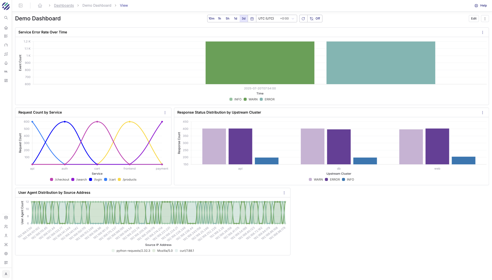
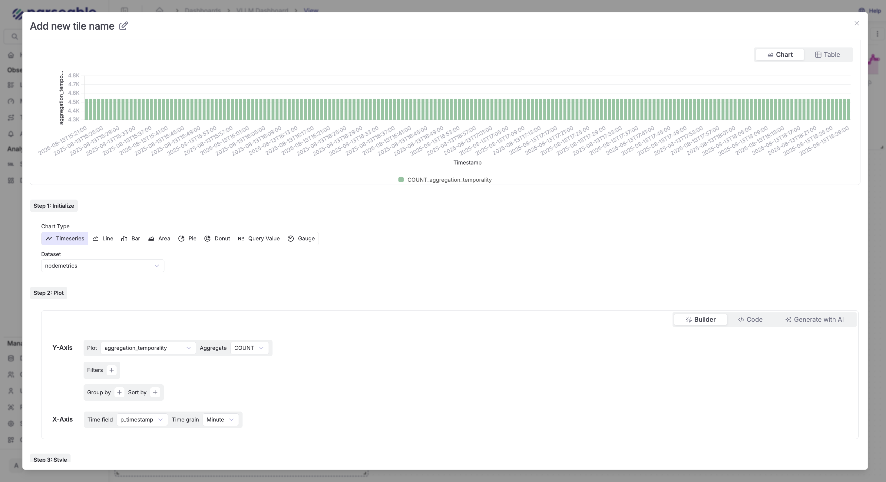

Parseable Dashboards are customizable and support querying multiple data streams for comprehensive insights. You can also leverage text to SQL conversion for quick query creation.

## Adding Charts to Dashboards

Charts can be added to dashboards from multiple sources:

- **SQL Editor**: Run queries in the SQL editor, visualize results, and add charts directly to dashboards
- **Keystone**: AI-generated insights can be added as dashboard tiles
- **Chart Builder**: Build visualizations using the built-in chart builder

## Chart Builder Types

There are two ways to build charts:

### 1. SQL Editor
Write custom SQL queries, visualize the results, and add them to your dashboard. Supports up to 3 datasets simultaneously for complex joins and comparative analysis.

### 2. Visual Chart Builder
Use the point-and-click interface to select chart type, dataset, fields, and styling without writing SQL.

## Visualization Types

Parseable offers eight distinct visualization types:

- **Timeseries**: For time-based data visualization
- **Line**: For trend analysis and continuous data
- **Bar**: For categorical comparisons
- **Area**: For cumulative values over time
- **Pie**: For showing proportions of a whole
- **Donut**: Similar to pie with a hollow center
- **Query Value**: For displaying single metric values
- **Gauge**: For showing progress or thresholds

## Key Features

- **Multi-dataset support**: Each tile can query different datasets
- **Drag and resize**: Reposition and resize tiles to fit your layout
- **Custom styling**: Configure colors, labels, and formatting
- **Time range sync**: Set a fixed time range for all tiles
- **Favorites**: Mark dashboards for quick access

---

For detailed instructions on creating and configuring dashboards, see the [Dashboards User Guide](/docs/user-guide/dashboards).