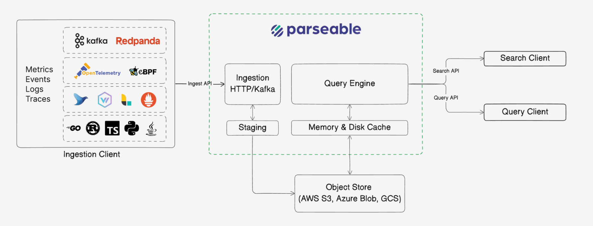

Parseable is an open source, column-oriented data lake built for observability. It brings logs, metrics, traces, and agent telemetry into one system, with SQL and PromQL queries, dashboards, alerting, APM, and AI workflows on top.

Telemetry does not all behave the same way. Logs can be wide and change shape from event to event; metrics can have millions of label combinations; and traces need both individual span lookup and service-level analysis. Parseable stores these signals on a shared, open data lake foundation while letting each be ingested and queried in the way it needs.

## How Parseable works

Parseable treats growing telemetry as a data engineering problem. Data moves through three stages:

1. **Ingest:** The data lake engine accepts events at high volume, stages them locally, and forwards them in batches. Staging helps absorb ingestion spikes while producing efficiently sized objects for storage.
2. **Store:** Events are compressed into columnar Apache Parquet files on object storage. Queries can read only the columns they need, and other Parquet-compatible tools can use the same data.
3. **Query:** A separate query engine runs SQL and PromQL. It caches frequently accessed data on local disk, so hot queries do not need to fetch every file from object storage. Ingestion and query capacity can scale independently.

Parseable is written in Rust for predictable performance without garbage collection pauses. Apache Arrow provides an in-memory columnar format for vectorized execution; Parquet is the open format at rest. This design supports wide events, high-cardinality metrics, and growing volumes without keeping every byte on always-hot storage. Read the [architecture](/architecture) and [key concepts](/key-concepts) for the deeper model.

You can use the self-hosted core as a single binary, run a managed [Cloud workspace](/quickstart/cloud), or choose [Enterprise](/editions/compare) for advanced deployments. See the [edition comparison](/editions/compare) for details.

## Send data from your stack

The [ingestion overview](/ingestion) explains the available protocols. Start with the source you already have:

<Cards>
  <Card href="/ingest-data/logging-agents/otel-collector" title="Collector setup">
    Send telemetry through the OpenTelemetry Collector.
  </Card>
  <Card href="/ingest-data/logging-agents/fluent-bit" title="Fluent Bit">
    Forward logs from lightweight agents and edge workloads.
  </Card>
  <Card href="/ingest-data/logging-agents/vector" title="Vector">
    Route, transform, and send logs with Vector.
  </Card>
  <Card href="/ingest-data/containers/docker" title="Docker">
    Collect logs from Docker containers.
  </Card>
  <Card href="/ingest-data/containers/kubernetes" title="Kubernetes">
    Send logs and telemetry from Kubernetes clusters.
  </Card>
  <Card href="/ingest-data/prometheus" title="Prometheus remote write">
    Ingest Prometheus metrics with remote write.
  </Card>
  <Card href="/ingest-data/programming-languages" title="Programming languages">
    Send telemetry directly from application code.
  </Card>
  <Card href="/ingest-data/ai-agents" title="AI infrastructure">
    Observe agents, LLM gateways, runtimes, and coding assistants.
  </Card>
</Cards>

## Work with each signal

- **Logs:** Work with events that range from unstructured text to JSON with changing fields. Parseable can read selected columns from wide or sparse events, while [LogIQ](/user-guide/log-iq) can extract fields from verbose log strings. [Send OTLP logs](/ingest-data/otel/logs), then use the [log explorer](/user-guide/logs) or [SQL editor](/user-guide/sql-editor).
- **Metrics:** Store numeric time series identified by labels. Parseable stores label values as column data for high-cardinality metrics and provides native PromQL. Send metrics with [OpenTelemetry](/ingest-data/otel/metrics) or [Prometheus remote write](/ingest-data/prometheus), then [explore metrics](/user-guide/metrics) or [query with PromQL](/user-guide/promql).
- **Traces:** Connect spans by trace ID for specific trace lookup and service-level analysis, including latency and error rates. Parseable supports both patterns on the same columnar data. [Send OTLP traces](/ingest-data/otel/traces), then use [traces](/user-guide/traces) or [APM](/user-guide/apm).
- **Agent telemetry:** Bring activity from AI agents and LLM infrastructure into the same observability foundation. Follow the [AI infrastructure guides](/ingest-data/ai-agents) and [agent observability](/user-guide/agent-observability) to inspect it.

## Keep working

- **Investigate and share:** [Build dashboards](/user-guide/dashboards), [set alerts](/user-guide/alerting), or [connect an integration](/integrations).
- **Deploy and manage:** Follow the [self-hosted installation guide](/self-hosted/installation), then review [configuration](/self-hosted/configuration) and [access control](/user-guide/rbac).
- **Use developer tools:** Find endpoints in the [API reference](/api), or use the [MCP server](/mcp) to investigate telemetry with an AI client.
- **Find a cause:** If data is missing, check the [ingestion overview](/ingestion), your source guide above, and [API key setup](/user-guide/api-keys).

## Read with an AI agent

Use [the full documentation as text](/llms-full.txt), or **Copy Markdown** on any page. Individual pages also have `.mdx` text endpoints, such as [/docs/pb-cli/install.mdx](/pb-cli/install.mdx). For terminal workflows, see [pb CLI for agents](/pb-cli/agents).
