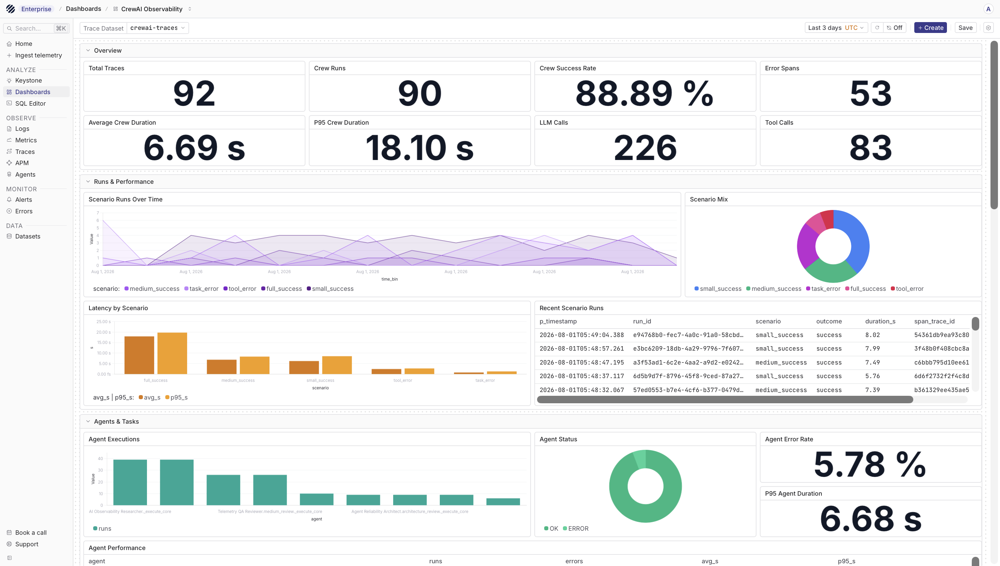
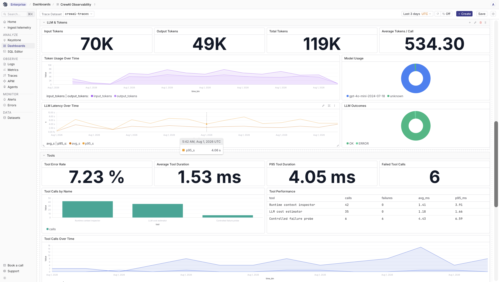
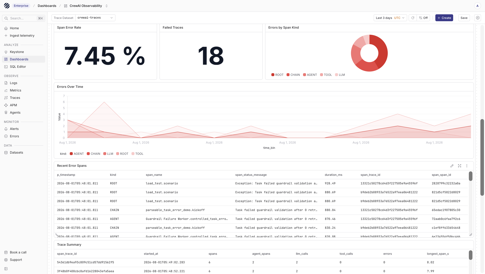

import { Step, Steps } from 'fumadocs-ui/components/steps';

[CrewAI](https://www.crewai.com/) is a Python framework for building agentic workflows where agents take roles, receive tasks, call tools, and work together as a crew. That is useful, but it also makes debugging harder than a normal request-response application. A single run can include multiple agents, task handoffs, model calls, tool calls, retries, and failures before the final output is returned.

Parseable receives CrewAI telemetry as OpenTelemetry traces. In this guide, the CrewAI application is instrumented with [OpenInference](https://github.com/Arize-ai/openinference), exported over OTLP/HTTP, and stored in a Parseable traces dataset. Once the data is in Parseable, you can inspect the full crew run, follow the agent and task spans, review model calls, and debug failed runs from the same trace view.

## How it works

The integration has two layers of instrumentation.

CrewAI instrumentation captures the application workflow. This is where you see the crew, agents, tasks, tool calls, and execution flow. Provider instrumentation captures the underlying model calls. In this example we use OpenAI, so the setup includes `openinference-instrumentation-openai` to capture LLM spans and model attributes.

```text
CrewAI application
  |
  | OpenInference CrewAI instrumentation
  | OpenInference OpenAI instrumentation
  v
OpenTelemetry SDK
  |
  | OTLP/HTTP traces
  v
Parseable /v1/traces
  |
  +--> crewai-traces
       Parseable traces dataset
```

<Callout type="info">
Use the LLM instrumentor that matches the provider your CrewAI app calls. This guide uses OpenAI. If your crew uses Anthropic, LiteLLM, or another provider, pair `openinference-instrumentation-crewai` with that provider's OpenInference instrumentor.
</Callout>

## Prerequisites

Before you start, keep these ready:

- A running Parseable instance
- A Parseable API key with ingest access
- Python 3.10 or later
- A CrewAI 1.0 or later application
- An OpenAI API key for the example in this guide

## Set up CrewAI with Parseable

<Steps>
<Step>

### Create a traces dataset

Set the Parseable connection values:

```bash
export PARSEABLE_URL="https://<your-parseable-host>"
export PARSEABLE_API_KEY="<your-parseable-api-key>"
export PARSEABLE_STREAM="crewai-traces"
```

Create a dataset for CrewAI spans and tag it for Agent Observability:

```bash
curl -X PUT "$PARSEABLE_URL/api/v1/logstream/$PARSEABLE_STREAM" \
  -H "X-API-Key: ${PARSEABLE_API_KEY}" \
  -H "X-P-Log-Source: otel-traces" \
  -H "X-P-Telemetry-Type: traces" \
  -H "X-P-Dataset-Tag: agent-observability"
```

The dataset will be available in the Traces view. Because it is tagged for Agent Observability, it can also be used from the Agents page.

</Step>
<Step>

### Install the packages

Install CrewAI, OpenInference instrumentation, and the OpenTelemetry OTLP HTTP exporter:

```bash
pip install \
  crewai \
  openinference-instrumentation-crewai \
  openinference-instrumentation-openai \
  opentelemetry-sdk \
  opentelemetry-exporter-otlp-proto-http
```

If your crew uses a different model provider, install the matching OpenInference package for that provider as well.

</Step>
<Step>

### Configure the environment

Set the OpenAI API key used by the sample crew:

```bash
export OPENAI_API_KEY="<your-openai-api-key>"
```

Keep `PARSEABLE_URL`, `PARSEABLE_API_KEY`, and `PARSEABLE_STREAM` in the same shell. The Python code below appends `/v1/traces` to `PARSEABLE_URL`.

</Step>
<Step>

### Instrument and run the crew

Set up the OpenTelemetry tracer provider first, then instrument CrewAI and the model provider before creating the crew. This order matters because the instrumentors patch the libraries they observe.

```python
import os

from openinference.instrumentation.crewai import CrewAIInstrumentor
from openinference.instrumentation.openai import OpenAIInstrumentor
from opentelemetry.exporter.otlp.proto.http.trace_exporter import OTLPSpanExporter
from opentelemetry.sdk.resources import Resource
from opentelemetry.sdk.trace import TracerProvider
from opentelemetry.sdk.trace.export import BatchSpanProcessor


parseable_url = os.environ["PARSEABLE_URL"].rstrip("/")
parseable_stream = os.getenv("PARSEABLE_STREAM", "crewai-traces")

provider = TracerProvider(
    resource=Resource.create(
        {
            "service.name": "crewai-research-crew",
            "deployment.environment.name": "development",
        }
    )
)

provider.add_span_processor(
    BatchSpanProcessor(
        OTLPSpanExporter(
            endpoint=f"{parseable_url}/v1/traces",
            headers={
                "X-API-Key": os.environ["PARSEABLE_API_KEY"],
                "X-P-Stream": parseable_stream,
                "X-P-Log-Source": "otel-traces",
            },
        )
    )
)

CrewAIInstrumentor().instrument(tracer_provider=provider)
OpenAIInstrumentor().instrument(tracer_provider=provider)

from crewai import Agent, Crew, Process, Task


researcher = Agent(
    role="Researcher",
    goal="Find accurate facts about {topic}",
    backstory="You verify claims and summarize the strongest evidence.",
    llm="openai/gpt-4o-mini",
    verbose=True,
)

writer = Agent(
    role="Writer",
    goal="Turn research about {topic} into a concise briefing",
    backstory="You write clear technical summaries for engineering teams.",
    llm="openai/gpt-4o-mini",
    verbose=True,
)

research_task = Task(
    description="Research three important facts about {topic}.",
    expected_output="Three verified facts with short explanations.",
    agent=researcher,
)

writing_task = Task(
    description="Use the research to write a five-paragraph briefing about {topic}.",
    expected_output="A concise five-paragraph technical briefing.",
    agent=writer,
    context=[research_task],
)

crew = Crew(
    agents=[researcher, writer],
    tasks=[research_task, writing_task],
    process=Process.sequential,
    verbose=True,
)

try:
    result = crew.kickoff(inputs={"topic": "OpenTelemetry for AI agents"})
    print(result.raw)
finally:
    provider.shutdown()
```

`provider.shutdown()` is useful for scripts and short-running jobs. It flushes buffered spans before the process exits, so the final crew run is not left behind in memory.

Pass the tracer provider directly to the CrewAI and OpenAI instrumentors as shown above. Avoid calling `set_tracer_provider()` in this setup because the OpenTelemetry global provider can only be set once in a process.

</Step>
</Steps>

## What you should see

One `crew.kickoff()` usually becomes one trace. Inside that trace, you should see spans for the crew run, agent execution, task execution, and the underlying LLM calls.

```text
Crew kickoff
├── Agent and task execution
│   └── OpenAI LLM call
└── Agent and task execution
    └── OpenAI LLM call
```

Crews that use tools, delegation, retries, or additional model calls will have more child spans. Depending on what runs, OpenInference records attributes such as span kind, model name, token usage, inputs, outputs, agent role, task description, and error details.

## View in Parseable

Open the Parseable console and go to **Traces**. Select `crewai-traces`, filter by the service name `crewai-research-crew`, and open a trace to inspect the waterfall and span attributes.



The trace overview helps you follow the crew run from start to finish. This is usually the first place to check when a run is slow, when a task took longer than expected, or when you want to see how many model and tool calls were made during the run.



The LLM span shows the model call made under the crew workflow. This is where model name, provider attributes, prompt or response metadata, token usage, and latency become easier to inspect without separating the model call from the agent run that caused it.



When something fails, open the error span and inspect its attributes. This helps you see whether the failure came from a task, tool, model provider, or application code.

## Use with Agent Observability

If the dataset is tagged with `X-P-Dataset-Tag: agent-observability`, you can use the Agents page to explore CrewAI runs from an agent-focused view. This is useful when you want to compare runs, look at model usage, inspect tool behavior, or move from a high-level run into the trace details.

## Production notes

Direct export from the Python process is a good way to get started. For production workloads, send OTLP from the application to an OpenTelemetry Collector and let the Collector forward traces to Parseable. A Collector gives you central batching, retries, filtering, sampling, and redaction without changing the CrewAI code again.

Do not enable multiple instrumentation paths for the same library. For example, avoid using the explicit OpenInference instrumentor in this guide and OpenTelemetry no-code auto-instrumentation for CrewAI at the same time. That can create duplicate spans.

## Protect sensitive data

Agent goals, backstories, task descriptions, prompts, completions, and tool inputs or outputs can contain sensitive data. Review what your spans contain before enabling this in production. If required, use OpenTelemetry processors or OpenInference configuration to redact or suppress content before it reaches Parseable.

## Troubleshooting

- **No traces appear:** Confirm that `PARSEABLE_URL` is reachable from the application, the API key has ingest access, the endpoint is `/v1/traces`, and `X-P-Log-Source` is set to `otel-traces`.

- **Only CrewAI spans appear:** CrewAI instrumentation captures the workflow, but provider-level instrumentation captures the detailed model call. Make sure the matching provider instrumentor runs before the crew executes.

- **LLM spans are missing:** Check that your CrewAI `llm` value matches the provider instrumentor you installed. The example uses OpenAI, so it uses `openinference-instrumentation-openai`.

- **Spans are duplicated:** Use only one instrumentation path per library. Disable no-code auto-instrumentation when using the explicit instrumentor calls shown here.

- **CrewAI says tracing is disabled:** That message refers to CrewAI's own tracing product. It does not mean OpenInference has stopped exporting OpenTelemetry spans to Parseable.

## Next steps

- Explore traces with the [Parseable Traces UI](/docs/user-guide/traces)
- Learn how Parseable presents [Agent Observability](/docs/user-guide/agent-observability)
- Build or customize [dashboards](/docs/user-guide/dashboards)
