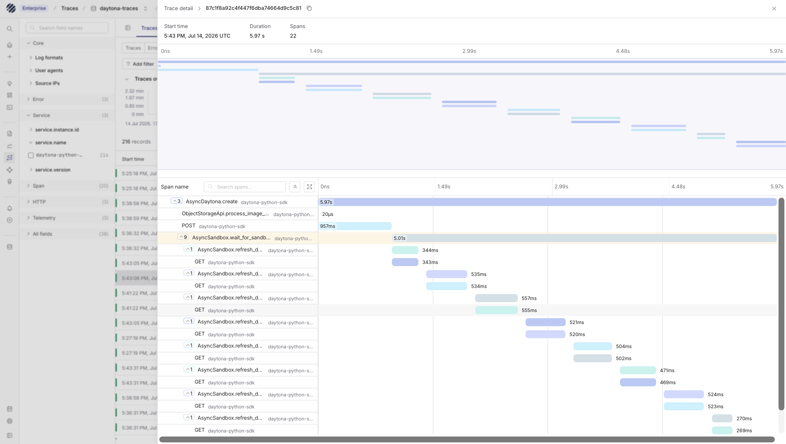

[Daytona](https://www.daytona.io/) provides secure, isolated sandboxes for running code and agent workloads. A typical Daytona workflow might create a sandbox, upload files, execute code, stream logs, inspect results, and then clean up the sandbox when the work is done.

That flow is easy to understand while testing locally, but production sandboxes need more visibility. When a sandbox is slow, fails during execution, or starts using more CPU or memory than expected, you need to see both sides of the run:

- what your application did through the Daytona SDK
- what happened inside the sandbox runtime

Parseable can receive this telemetry over OpenTelemetry, so SDK traces, sandbox logs, sandbox traces, and sandbox metrics can be inspected with the rest of your observability data.

## How the integration works

Daytona has two OpenTelemetry paths.

| Path | Where you configure it | What it sends to Parseable |
|------|------------------------|-----------------------------|
| SDK tracing | In the application that uses the Daytona SDK | Traces for SDK operations such as sandbox creation, file operations, process execution, and API calls |
| Sandbox telemetry collection | Daytona Dashboard, Settings, OpenTelemetry | Logs, traces, sandbox resource metrics, and organization resource metrics |

These paths are independent. You can enable SDK tracing when you only need to understand how your application calls Daytona. You can enable sandbox telemetry when you need to see what happened inside sandboxes. In most production setups, you will want both.

```text
Application using Daytona SDK
  -> SDK traces
  -> Parseable dataset: daytona-sdk-traces

Daytona sandbox telemetry
  -> OpenTelemetry Collector
  -> logs    -> Parseable dataset: daytona-logs
  -> traces  -> Parseable dataset: daytona-traces
  -> metrics -> Parseable dataset: daytona-metrics
```

The OpenTelemetry Collector is recommended for sandbox telemetry because Daytona uses one organization-level OTLP configuration. Parseable needs signal-specific headers such as `X-P-Log-Source=otel-logs`, `otel-traces`, or `otel-metrics`. The Collector receives all signals from Daytona and routes each one to the correct Parseable dataset.

## Prerequisites

Before you start, keep these ready:

- A Daytona account and API key
- A Parseable instance reachable from your application and from the OpenTelemetry Collector
- A Parseable API key with ingest access
- Python 3 if you want to run the SDK example below
- An OpenTelemetry Collector for routing sandbox logs, traces, and metrics

If your Parseable deployment still uses Basic Auth, use the `Authorization` header instead of `X-P-API-Key` in the examples.

## Send SDK traces to Parseable

SDK tracing shows the operations your application performs through the Daytona SDK. This includes sandbox lifecycle calls, file system operations, code execution, process management, and HTTP calls made by the SDK.

Install the Daytona SDK:

```bash
python3 -m venv .venv
source .venv/bin/activate
pip install daytona
```

Set the Daytona and OpenTelemetry environment variables:

```bash
export DAYTONA_API_KEY="<daytona-api-key>"
export DAYTONA_OTEL_ENABLED=true
export OTEL_EXPORTER_OTLP_ENDPOINT="https://parseable.example.com"
export OTEL_EXPORTER_OTLP_PROTOCOL="http/protobuf"
export OTEL_EXPORTER_OTLP_HEADERS="X-P-API-Key=<parseable-api-key>,X-P-Stream=daytona-sdk-traces,X-P-Log-Source=otel-traces"
```

Use the Parseable base URL without `/v1/traces`. The OTLP HTTP exporter appends the signal path.

<Callout type="info">
  Keep `OTEL_EXPORTER_OTLP_HEADERS` quoted. It contains commas and values that shells can parse incorrectly when loaded from an environment file.
</Callout>

Create a small traced operation:

```python
import asyncio
import os

from daytona import AsyncDaytona, DaytonaConfig


async def main() -> None:
    config = DaytonaConfig(
        api_key=os.environ["DAYTONA_API_KEY"],
        otel_enabled=True,
    )

    async with AsyncDaytona(config) as daytona:
        sandbox = await daytona.create()
        try:
            result = await sandbox.process.code_run(
                'print("hello from a Daytona sandbox")'
            )
            print(result.result)
        finally:
            await daytona.delete(sandbox)


if __name__ == "__main__":
    asyncio.run(main())
```

Run it:

```bash
python test_daytona.py
```

Open the `daytona-sdk-traces` dataset in Parseable. You should see traces for the SDK operations that created the sandbox, executed code, and deleted the sandbox.



The line printed inside the sandbox is not exported as a log by SDK tracing. SDK tracing only describes the SDK calls. To collect stdout, stderr, runtime logs, and resource metrics from sandboxes, configure sandbox telemetry.

## Send sandbox telemetry to Parseable

<div className="not-prose my-6 rounded-lg border bg-muted/30 p-4">
  <div className="text-sm font-medium text-muted-foreground">Sandbox telemetry flow</div>
  <div className="mt-4 grid gap-3 md:grid-cols-[1fr_auto_1fr_auto_1.4fr] md:items-center">
    <div className="rounded-md border bg-background p-4">
      <div className="text-sm font-semibold">Daytona sandboxes</div>
      <div className="mt-1 text-xs text-muted-foreground">Runtime logs, traces, and resource metrics</div>
    </div>
    <div className="hidden text-muted-foreground md:block">-&gt;</div>
    <div className="rounded-md border bg-background p-4">
      <div className="text-sm font-semibold">OpenTelemetry Collector</div>
      <div className="mt-1 text-xs text-muted-foreground">Receives OTLP and routes each signal</div>
    </div>
    <div className="hidden text-muted-foreground md:block">-&gt;</div>
    <div className="space-y-2">
      <div className="rounded-md border bg-background px-3 py-2 text-sm">
        logs <span className="text-muted-foreground">to</span> <code>daytona-logs</code>
      </div>
      <div className="rounded-md border bg-background px-3 py-2 text-sm">
        traces <span className="text-muted-foreground">to</span> <code>daytona-traces</code>
      </div>
      <div className="rounded-md border bg-background px-3 py-2 text-sm">
        metrics <span className="text-muted-foreground">to</span> <code>daytona-metrics</code>
      </div>
    </div>
  </div>
</div>

Sandbox telemetry comes from Daytona's organization-level OpenTelemetry configuration. Daytona can collect:

- application stdout and stderr
- system logs, runtime errors, and warnings
- HTTP request traces and custom spans from inside sandboxes
- CPU, memory, and filesystem metrics for sandboxes
- organization-level resource usage and quota metrics

Daytona documents this configuration under **Daytona Dashboard > Settings > OpenTelemetry**. The setting is available to organization owners. After it is saved, allow a few minutes for the change to apply.

Because Daytona sends all sandbox telemetry to one OTLP endpoint, put an OpenTelemetry Collector between Daytona and Parseable.

### Configure the Collector

Create `otel-collector-config.yaml`:

```yaml
receivers:
  otlp:
    protocols:
      grpc:
        endpoint: 0.0.0.0:4317
      http:
        endpoint: 0.0.0.0:4318

processors:
  batch:

exporters:
  otlphttp/parseable_logs:
    endpoint: "${env:PARSEABLE_ENDPOINT}"
    encoding: proto
    headers:
      X-P-API-Key: "${env:PARSEABLE_API_KEY}"
      X-P-Stream: "daytona-logs"
      X-P-Log-Source: "otel-logs"
      Content-Type: "application/x-protobuf"

  otlphttp/parseable_traces:
    endpoint: "${env:PARSEABLE_ENDPOINT}"
    encoding: proto
    headers:
      X-P-API-Key: "${env:PARSEABLE_API_KEY}"
      X-P-Stream: "daytona-traces"
      X-P-Log-Source: "otel-traces"
      Content-Type: "application/x-protobuf"

  otlphttp/parseable_metrics:
    endpoint: "${env:PARSEABLE_ENDPOINT}"
    encoding: proto
    headers:
      X-P-API-Key: "${env:PARSEABLE_API_KEY}"
      X-P-Stream: "daytona-metrics"
      X-P-Log-Source: "otel-metrics"
      Content-Type: "application/x-protobuf"

service:
  pipelines:
    logs:
      receivers: [otlp]
      processors: [batch]
      exporters: [otlphttp/parseable_logs]
    traces:
      receivers: [otlp]
      processors: [batch]
      exporters: [otlphttp/parseable_traces]
    metrics:
      receivers: [otlp]
      processors: [batch]
      exporters: [otlphttp/parseable_metrics]
```

Run the Collector:

```bash
export PARSEABLE_ENDPOINT="https://parseable.example.com"
export PARSEABLE_API_KEY="<parseable-api-key>"

docker run --rm \
  -p 4317:4317 \
  -p 4318:4318 \
  -e PARSEABLE_ENDPOINT \
  -e PARSEABLE_API_KEY \
  -v "$PWD/otel-collector-config.yaml:/etc/otelcol-contrib/config.yaml:ro" \
  otel/opentelemetry-collector-contrib:latest
```

Expose the Collector through a public HTTPS endpoint that Daytona can reach, for example `https://otel.example.com`. Protect this endpoint with authentication at your ingress, proxy, or load balancer. Do not expose an unauthenticated OTLP receiver to the internet.

### Configure Daytona

In Daytona, open **Settings > OpenTelemetry** and enter the Collector base URL:

```text
OTLP Endpoint: https://otel.example.com
```

Do not append `/v1/logs`, `/v1/traces`, or `/v1/metrics`. Daytona sends each signal to the matching OTLP path.

If your Collector endpoint requires an auth header, add it in the Daytona OpenTelemetry settings:

```text
Authorization: Bearer <collector-ingest-token>
```

Once saved, Daytona will export sandbox telemetry to the Collector, and the Collector will forward each signal to the matching Parseable dataset.

## Add useful labels

Daytona adds resource attributes such as organization, region, and snapshot information to sandbox telemetry. You can add your own labels with `DAYTONA_SANDBOX_OTEL_EXTRA_LABELS`.

For example:

```bash
DAYTONA_SANDBOX_OTEL_EXTRA_LABELS="team=agents,env=staging,app=code-runner"
```

These labels become OpenTelemetry resource attributes. In Parseable, they help you filter by team, environment, application, or any other dimension that matters for your setup.

## Validate in Parseable

After the setup is saved, run a sandbox workload and keep it active for at least a minute so Daytona can collect resource samples.

```python
import asyncio
import os

from daytona import AsyncDaytona, DaytonaConfig


async def main() -> None:
    config = DaytonaConfig(api_key=os.environ["DAYTONA_API_KEY"])

    async with AsyncDaytona(config) as daytona:
        sandbox = await daytona.create()
        try:
            result = await sandbox.process.code_run(
                """
import time

print("starting Daytona telemetry workload")
end = time.time() + 90

while time.time() < end:
    sum(i * i for i in range(250000))

print("finished Daytona telemetry workload")
""",
                timeout=150,
            )
            print(result.result)
        finally:
            await daytona.delete(sandbox)


if __name__ == "__main__":
    asyncio.run(main())
```

Then check these datasets in Parseable:

| Dataset | What to expect |
|---------|----------------|
| `daytona-sdk-traces` | SDK operations from your application, if SDK tracing is enabled |
| `daytona-logs` | stdout, stderr, system logs, runtime errors, and warnings from sandboxes |
| `daytona-traces` | HTTP request traces and custom spans emitted inside sandboxes |
| `daytona-metrics` | sandbox CPU, memory, filesystem metrics, and organization resource metrics |

Daytona organization metrics are pushed periodically, so allow at least 60 to 90 seconds before checking the metrics dataset.

Useful metric names include:

```text
daytona.sandbox.cpu.utilization
daytona.sandbox.memory.utilization
daytona.sandbox.filesystem.utilization
daytona.sandbox.used_cpu
daytona.sandbox.used_ram
daytona.sandbox.used_storage
```

## Direct export or Collector

Direct export to Parseable is fine for SDK traces because the SDK trace exporter only needs one signal-specific configuration.

For sandbox telemetry, use the Collector. Daytona's organization setting uses one endpoint and one header set for logs, traces, and metrics. The Collector lets you send each signal to Parseable with the correct `X-P-Log-Source` and dataset name.

## Troubleshooting

- If SDK traces do not appear, confirm `DAYTONA_OTEL_ENABLED=true`, use `OTEL_EXPORTER_OTLP_PROTOCOL=http/protobuf`, and close the Daytona client so buffered spans flush.
- If the exporter reaches the wrong path, use the Parseable base URL in `OTEL_EXPORTER_OTLP_ENDPOINT`. Do not append `/v1/traces`.
- If authentication fails, check `X-P-API-Key` or use `Authorization: Basic <base64 username:password>` for older Parseable deployments.
- If sandbox logs or metrics are missing from SDK tracing, that is expected. Configure Daytona sandbox telemetry in the dashboard.
- If no sandbox telemetry appears, confirm the Daytona organization setting has applied and the Collector is reachable over HTTPS from Daytona.
- If only one signal appears, check that the Collector has separate logs, traces, and metrics pipelines, and that each exporter uses the matching `X-P-Log-Source`.
- If metrics are delayed, wait at least 60 to 90 seconds after the workload starts.

For more protocol details, see [Daytona OpenTelemetry collection](https://www.daytona.io/docs/en/observability/otel-collection/), [Parseable OTLP logs](/docs/ingest-data/otel/logs), [Parseable OTLP traces](/docs/ingest-data/otel/traces), and [Parseable OTLP metrics](/docs/ingest-data/otel/metrics).
