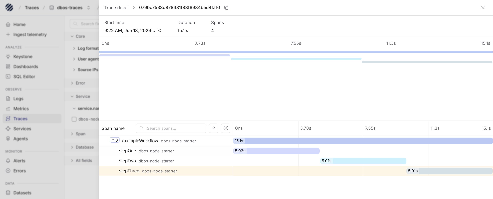
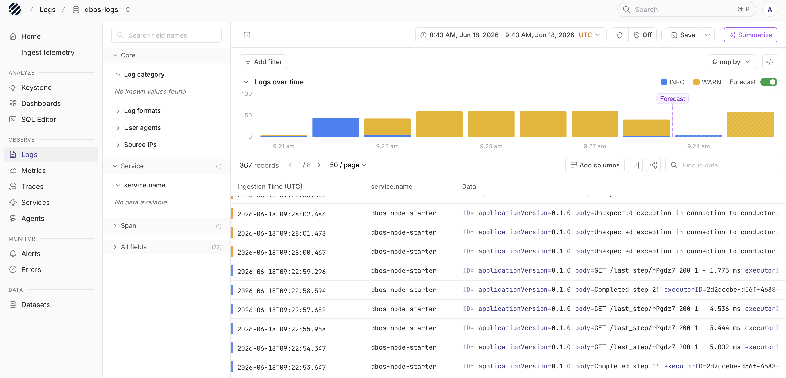
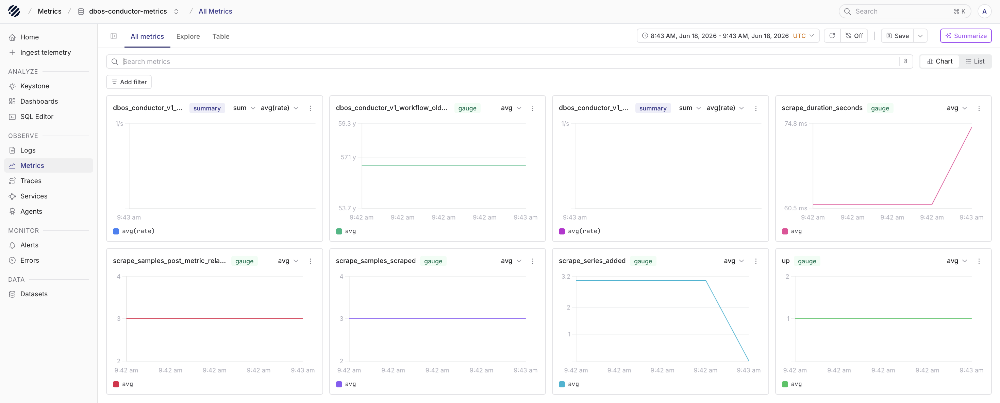

DBOS applications can send workflow observability data to Parseable in two paths:

- **Logs and traces** are exported directly from the DBOS application through OpenTelemetry OTLP HTTP.
- **Metrics** are scraped from DBOS Conductor's Prometheus/OpenMetrics endpoint and forwarded to Parseable.

## Requirements

- A DBOS TypeScript application using `@dbos-inc/dbos-sdk`
- DBOS TypeScript `4.19` or later for the Conductor metrics endpoint
- A reachable Parseable instance for OTLP logs and traces
- Parseable Enterprise for PromQL metrics storage and querying
- DBOS Conductor for metrics. DBOS Conductor is part of the DBOS Enterprise offering.

<Callout type="warn">
  Metrics require both Parseable Enterprise and DBOS Conductor. Without DBOS Conductor, there is no DBOS `/v1/metrics` endpoint to scrape. Without Parseable Enterprise, metrics cannot be queried through Parseable's PromQL support.
</Callout>

## Logs and traces

Enable OTLP export in the DBOS app and point logs and traces to Parseable's OTLP ingest endpoints.

```ts
import { DBOS } from '@dbos-inc/dbos-sdk';

DBOS.setConfig({
  name: 'dbos-node-starter',
  systemDatabaseUrl: process.env.DBOS_SYSTEM_DATABASE_URL,
  applicationVersion: '0.1.0',
  enableOTLP: true,
  otlpLogsEndpoints: [`${process.env.PARSEABLE_OTLP_ENDPOINT}/v1/logs`],
  otlpTracesEndpoints: [`${process.env.PARSEABLE_OTLP_ENDPOINT}/v1/traces`],
  otelAttributeFormat: 'semconv',
});

await DBOS.launch({
  conductorURL: process.env.DBOS_CONDUCTOR_URL,
  conductorKey: process.env.DBOS_CONDUCTOR_KEY,
});
```

Configure Parseable OTLP headers separately for logs and traces. Use `X-P-Stream` for the destination stream name; Parseable derives the signal type from the endpoint path.

```bash
PARSEABLE_OTLP_ENDPOINT=http://parseable.example:8000

OTEL_EXPORTER_OTLP_LOGS_HEADERS=Authorization=Bearer <parseable-api-key>,X-P-Stream=dbos-logs
OTEL_EXPORTER_OTLP_TRACES_HEADERS=Authorization=Bearer <parseable-api-key>,X-P-Stream=dbos-traces
```

After restarting the DBOS app, trigger a workflow and check the `dbos-logs` and `dbos-traces` streams in Parseable.





## Metrics

DBOS metrics are exposed by DBOS Conductor, not by the application process directly. The app connects to Conductor using the Conductor URL and API key:

```bash
DBOS_CONDUCTOR_URL=ws://localhost:8090
DBOS_CONDUCTOR_KEY=<dbos-conductor-api-key>
```

Conductor exposes metrics at:

```text
/v1/metrics
```

The endpoint is Prometheus/OpenMetrics compatible and requires the Conductor API key as a bearer token.

```bash
curl \
  -H "Authorization: Bearer <dbos-conductor-api-key>" \
  -H "Accept: application/openmetrics-text" \
  http://localhost:8090/v1/metrics
```

Example metrics include:

```text
dbos_conductor_v1_executor_count
dbos_conductor_v1_workflow_pending_count
dbos_conductor_v1_workflow_oldest_pending_timestamp_seconds
```

## Scrape with Prometheus

Use Prometheus to scrape DBOS Conductor and forward metrics to Parseable.

```yaml
scrape_configs:
  - job_name: dbos-conductor
    metrics_path: /v1/metrics
    authorization:
      type: Bearer
      credentials_file: /etc/prometheus/dbos_api_key
    static_configs:
      - targets:
          - conductor:8090

remote_write:
  - url: http://parseable.example:8000/v1/prometheus/write
    authorization:
      type: Bearer
      credentials: <parseable-api-key>
    headers:
      X-P-Stream: dbos-conductor-metrics
```

## Validate

Check that Conductor is available:

```bash
curl http://localhost:8090/healthz
```

Check that Prometheus is scraping Conductor:

```bash
curl 'http://localhost:9090/api/v1/query?query=dbos_conductor_v1_executor_count'
```

Check Parseable:

- `dbos-logs` should contain DBOS application log records.
- `dbos-traces` should contain DBOS workflow and step spans.
- `dbos-conductor-metrics` should contain DBOS Conductor metrics when Parseable Enterprise metrics ingest is enabled.



## Troubleshooting

- **Logs do not appear** - Confirm the logs exporter uses the `/v1/logs` endpoint and restart the DBOS application after changing environment variables.
- **Traces do not appear** - Confirm the traces exporter uses the `/v1/traces` endpoint and restart the DBOS application after changing environment variables.
- **Metrics endpoint returns unauthorized** - Pass the DBOS Conductor API key as a bearer token.
- **No metrics endpoint exists** - Metrics require DBOS Conductor. The regular DBOS application server does not expose `/v1/metrics`.
- **PromQL is unavailable in Parseable** - PromQL metrics querying requires Parseable Enterprise.
