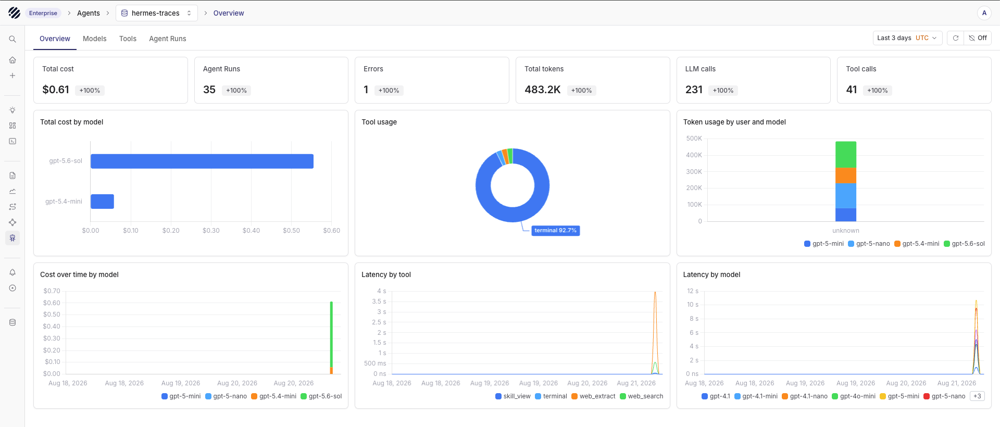
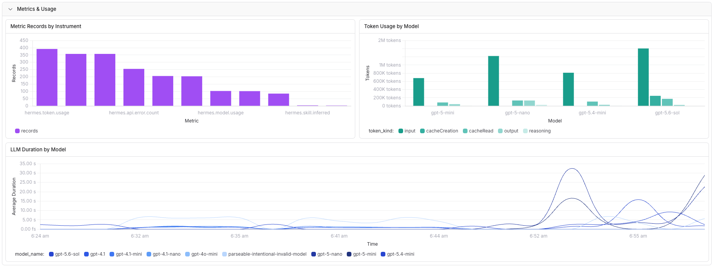

import { Step, Steps } from 'fumadocs-ui/components/steps';

[Hermes Agent](https://github.com/NousResearch/hermes-agent) is an AI agent with model-provider, tool, skill, gateway, and scheduled-task support. The [`hermes-otel`](https://github.com/briancaffey/hermes-otel) plugin observes Hermes lifecycle hooks and exports agent, model, API, tool, and skill activity through OpenTelemetry.

You can send each signal to a separate Parseable dataset:

```text
Hermes Agent hooks
  |
  v
hermes-otel plugin
  |
  +--> OTLP/HTTP traces  --> hermes-traces
  +--> OTLP/HTTP logs    --> hermes-logs
  +--> OTLP/HTTP metrics --> hermes-metrics
  |
  v
Parseable
```

The plugin can send OTLP/HTTP data to Parseable without an OpenTelemetry Collector. Add a Collector when you need central retry policy, redaction, sampling, or routing across several applications.

## Prerequisites

- A working Hermes Agent installation
- A Parseable instance that Hermes can reach
- A Parseable API key with dataset creation and ingest access
- A model-provider API key for Hermes
- Python package access in the environment where Hermes runs

Use the Parseable ingestor base URL, such as `https://parseable.example.com`. In a distributed deployment, the query/UI endpoint might reject ingestion.

## Set up Hermes Agent with Parseable

<Steps>
<Step>

### Create the datasets

Set the Parseable connection values:

```bash
export PARSEABLE_URL="https://parseable.example.com"
export PARSEABLE_API_KEY="<parseable-api-key>"
```

Create one dataset for each OpenTelemetry signal:

```bash
curl -X PUT "$PARSEABLE_URL/api/v1/logstream/hermes-traces" \
  -H "X-API-Key: ${PARSEABLE_API_KEY}" \
  -H "X-P-Log-Source: otel-traces" \
  -H "X-P-Telemetry-Type: traces" \
  -H "X-P-Dataset-Tag: agent-observability"

curl -X PUT "$PARSEABLE_URL/api/v1/logstream/hermes-logs" \
  -H "X-API-Key: ${PARSEABLE_API_KEY}" \
  -H "X-P-Log-Source: otel-logs" \
  -H "X-P-Telemetry-Type: logs"

curl -X PUT "$PARSEABLE_URL/api/v1/logstream/hermes-metrics" \
  -H "X-API-Key: ${PARSEABLE_API_KEY}" \
  -H "X-P-Log-Source: otel-metrics" \
  -H "X-P-Telemetry-Type: metrics"
```

Parseable lists the tagged `hermes-traces` dataset on the Agents page.

</Step>
<Step>

### Install the plugin

Install `hermes-otel` with the Hermes plugin manager:

```bash
hermes plugins install briancaffey/hermes-otel
```

Hermes places the plugin at `~/.hermes/plugins/hermes_otel/`. Install the plugin and its OpenTelemetry dependencies into the Python environment that runs Hermes:

```bash
HERMES_PYTHON="$(dirname "$(command -v hermes)")/python"
uv pip install --python "$HERMES_PYTHON" \
  -e ~/.hermes/plugins/hermes_otel
```

If your Hermes installation uses a named virtual environment, set `HERMES_PYTHON` to that environment's Python executable.

</Step>
<Step>

### Configure direct OTLP export

Copy the plugin configuration template:

```bash
cp ~/.hermes/plugins/hermes_otel/config.yaml.example \
  ~/.hermes/plugins/hermes_otel/config.yaml
chmod 600 ~/.hermes/plugins/hermes_otel/config.yaml
```

Replace the file contents with the configuration below. Set the Parseable ingestor URL and API key before starting Hermes.

```yaml
enabled: true
project_name: hermes-agent

resource_attributes:
  service.name: hermes-agent
  deployment.environment.name: production

capture_previews: false
capture_conversation_history: false
capture_sender_id: false
capture_logs: true
log_level: INFO

emit_genai_metrics: true
force_flush_on_session_end: true
span_batch_export_timeout_ms: 30000

backends:
  - type: otlp
    name: parseable-traces
    endpoint: https://parseable.example.com/v1/traces
    headers:
      X-API-Key: <parseable-api-key>
      X-P-Stream: hermes-traces
      X-P-Log-Source: otel-traces
      X-P-Dataset-Tag: agent-observability
    traces: true
    metrics: false
    logs: false

  - type: otlp
    name: parseable-metrics
    endpoint: https://parseable.example.com/v1/traces
    headers:
      X-API-Key: <parseable-api-key>
      X-P-Stream: hermes-metrics
      X-P-Log-Source: otel-metrics
    traces: false
    metrics: true
    logs: false

  - type: otlp
    name: parseable-logs
    endpoint: https://parseable.example.com/v1/traces
    headers:
      X-API-Key: <parseable-api-key>
      X-P-Stream: hermes-logs
      X-P-Log-Source: otel-logs
    traces: false
    metrics: false
    logs: true
```

`hermes-otel` derives the metrics and logs OTLP paths from each backend's traces endpoint. Keep `/v1/traces` on all three entries.

<Callout type="warn">
The generic OTLP backend stores custom headers in `config.yaml`. Keep the file out of source control and restrict it to the Hermes account. Render the file from your secret manager at startup when you run Hermes in production.
</Callout>

This configuration disables prompt, response, conversation-history, and sender-ID capture. Enable those fields after you define redaction, access, and retention rules for message content.

</Step>
<Step>

### Run an agent invocation

Start Hermes through your usual CLI or gateway path. For a CLI check, run:

```bash
hermes chat \
  --provider openai-api \
  --toolsets terminal \
  --max-turns 4 \
  -q "Use the terminal tool once to print HERMES_OTEL_OK, then return the output."
```

Use the provider and model configured for your Hermes profile. The invocation should create one `agent` span with nested `llm.*`, `api.*`, and `tool.*` spans.

</Step>
<Step>

### Verify ingestion

Run several Hermes invocations, then open **Traces** in Parseable and select `hermes-traces`. Open a recent trace and confirm that it contains:

- one root `agent` span;
- child `llm.*` and `api.*` spans for model activity;
- `tool.*` and `skill.*` spans when the invocation used tools or skills;
- model, token, duration, status, trace ID, and parent span fields.

Open **Agents**, select `hermes-traces`, and use the **Overview**, **Models**, **Tools**, and **Agent Runs** tabs to verify the aggregated agent telemetry. The Overview should show agent runs, errors, total tokens, LLM calls, tool calls, cost, and latency charts.



Check the other signal datasets from their matching Parseable views:

| Dataset | Records to check |
| --- | --- |
| `hermes-traces` | `agent`, `llm.*`, `api.*`, `tool.*`, and `skill.*` spans |
| `hermes-logs` | Hermes Python logs with severity, service name, and trace context when available |
| `hermes-metrics` | `hermes.*` and `gen_ai.*` token, duration, session, model, tool, retry, and error metrics |

</Step>
</Steps>

## Import the dashboard

The [Hermes Agent Observability dashboard](https://github.com/parseablehq/dashboards/tree/main/hermes-agent-observability) combines the three datasets in one view. Its 12 panels cover agent invocations, token usage, model calls, tool outcomes, latency, errors, recent traces, logs, and native metrics.

Download the [dashboard JSON](https://github.com/parseablehq/dashboards/blob/main/hermes-agent-observability/hermes-agent-observability-sql.json) and import it into Parseable. Map its variables to `hermes-traces`, `hermes-logs`, and `hermes-metrics`.



## Content capture

`hermes-otel` can attach prompts, responses, conversation history, tool input and output previews, and sender IDs to telemetry. Those fields can contain credentials, personal data, or proprietary text.

Keep these settings disabled for production until your team approves the data policy:

```yaml
capture_previews: false
capture_conversation_history: false
capture_sender_id: false
```

You can still query token counts, model names, durations, tool names, statuses, and trace relationships after you disable preview capture.

## Troubleshooting

- **Hermes does not load the plugin:** Run `hermes plugins list`, confirm that `hermes_otel` shows `enabled`, and check that the plugin directory contains `plugin.yaml`.
- **OpenTelemetry imports fail:** Install the plugin into the same Python environment that provides the `hermes` command.
- **OTLP requests return 404 or 405:** Point the backend entries at the Parseable ingestor. Keep `/v1/traces` in each configured endpoint.
- **Few traces arrive from short CLI runs:** Keep `force_flush_on_session_end: true` and raise `span_batch_export_timeout_ms` to `30000`.
- **Traces arrive but logs do not:** Set `capture_logs: true`, keep a log-capable OTLP backend entry, and verify `X-P-Log-Source: otel-logs`.
- **Agent Observability reports missing message fields:** Enable the content fields required by your use case after reviewing their privacy impact. The dashboard still works with content capture disabled.
- **Token totals look doubled:** Sum token attributes from the root `agent` spans or from the `api.*` spans. Do not add both sets together.

## Related resources

- [Hermes Agent documentation](https://hermes-agent.nousresearch.com/)
- [`hermes-otel` plugin](https://github.com/briancaffey/hermes-otel)
- [Hermes Agent Observability dashboard](https://github.com/parseablehq/dashboards/tree/main/hermes-agent-observability)
- [Send OpenTelemetry traces to Parseable](/docs/ingest-data/otel/traces)
- [Send OpenTelemetry logs to Parseable](/docs/ingest-data/otel/logs)
- [Send OpenTelemetry metrics to Parseable](/docs/ingest-data/otel/metrics)
