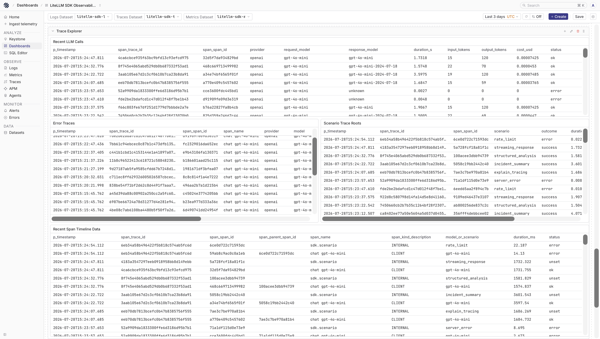
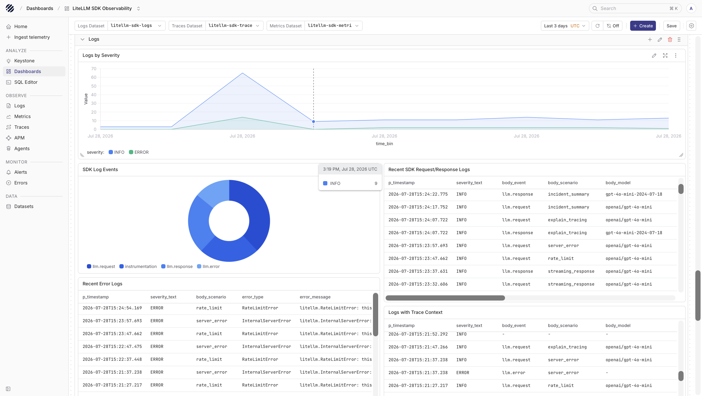
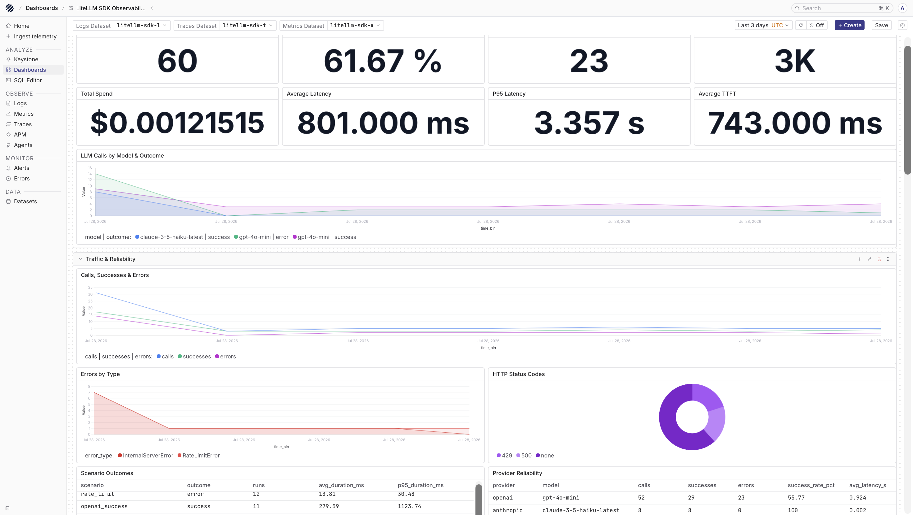

import { Step, Steps } from 'fumadocs-ui/components/steps';

The LiteLLM Python SDK lets your application call models from OpenAI, Anthropic, Gemini, Bedrock, Azure OpenAI, and other providers through one interface. Use this guide when your Python application imports `litellm` directly and you want to observe those model calls without running the LiteLLM Gateway.

Parseable receives the SDK telemetry over OpenTelemetry. Traces show each model call and how it sits inside your application flow. Logs show the GenAI events emitted by the LiteLLM OpenTelemetry integration. Metrics show request duration, token usage, cost, and streaming latency as OpenTelemetry histograms.

For the standalone gateway or proxy setup, see [LiteLLM Gateway](/ingest-data/gateways/litellm).

## How it works

In production, keep Parseable credentials in the OpenTelemetry Collector instead of putting them in application code. The application sends OTLP data to the Collector, and the Collector forwards each signal to a separate Parseable dataset.

```text
Python application using LiteLLM SDK
  |
  | OTLP traces, logs/events, and metrics
  v
OpenTelemetry Collector
  |
  +--> litellm-sdk-traces   traces dataset in Parseable
  +--> litellm-sdk-logs     logs dataset in Parseable
  +--> litellm-sdk-metrics  metrics dataset in Parseable
```

This is different from the gateway path. The SDK does not expose a `/metrics` endpoint for Prometheus scraping. Its traces, logs, and metrics come from the OpenTelemetry integration inside the Python process.

## Prerequisites

Before you start, keep these ready:

- A running Parseable instance
- A Parseable API key with ingest access
- Python 3.9 or newer
- A model-provider API key, such as `OPENAI_API_KEY`
- An OpenTelemetry Collector that your application can reach

## Set up LiteLLM SDK with Parseable

<Steps>
<Step>

### Create Parseable datasets

Create one dataset for each signal. This keeps the views in Prism clean and lets Parseable understand whether the incoming records are logs, traces, or metrics.

```bash
curl -X PUT "$PARSEABLE_URL/api/v1/logstream/litellm-sdk-traces" \
  -H "X-API-Key: ${PARSEABLE_API_KEY}" \
  -H "X-P-Log-Source: otel-traces" \
  -H "X-P-Telemetry-Type: traces" \
  -H "X-P-Dataset-Tag: agent-observability"

curl -X PUT "$PARSEABLE_URL/api/v1/logstream/litellm-sdk-logs" \
  -H "X-API-Key: ${PARSEABLE_API_KEY}" \
  -H "X-P-Log-Source: otel-logs" \
  -H "X-P-Telemetry-Type: logs"

curl -X PUT "$PARSEABLE_URL/api/v1/logstream/litellm-sdk-metrics" \
  -H "X-API-Key: ${PARSEABLE_API_KEY}" \
  -H "X-P-Log-Source: otel-metrics" \
  -H "X-P-Telemetry-Type: metrics"
```

</Step>
<Step>

### Configure the OpenTelemetry Collector

Create `otel-collector-config.yaml`:

```yaml
receivers:
  otlp:
    protocols:
      http:
        endpoint: 0.0.0.0:4318

processors:
  batch: {}

exporters:
  otlphttp/parseable_traces:
    endpoint: "${env:PARSEABLE_URL}"
    encoding: json
    headers:
      X-API-Key: "${env:PARSEABLE_API_KEY}"
      X-P-Stream: litellm-sdk-traces
      X-P-Log-Source: otel-traces

  otlphttp/parseable_logs:
    endpoint: "${env:PARSEABLE_URL}"
    encoding: json
    headers:
      X-API-Key: "${env:PARSEABLE_API_KEY}"
      X-P-Stream: litellm-sdk-logs
      X-P-Log-Source: otel-logs

  otlphttp/parseable_metrics:
    endpoint: "${env:PARSEABLE_URL}"
    encoding: json
    headers:
      X-API-Key: "${env:PARSEABLE_API_KEY}"
      X-P-Stream: litellm-sdk-metrics
      X-P-Log-Source: otel-metrics

service:
  pipelines:
    traces:
      receivers: [otlp]
      processors: [batch]
      exporters: [otlphttp/parseable_traces]

    logs:
      receivers: [otlp]
      processors: [batch]
      exporters: [otlphttp/parseable_logs]

    metrics:
      receivers: [otlp]
      processors: [batch]
      exporters: [otlphttp/parseable_metrics]
```

Start the Collector with your Parseable endpoint and API key:

```bash
export PARSEABLE_URL="https://<parseable-host>:8000"
export PARSEABLE_API_KEY="<parseable-api-key>"

otelcol-contrib --config otel-collector-config.yaml
```

</Step>
<Step>

### Configure the Python application

Install LiteLLM and the OpenTelemetry packages:

```bash
pip install litellm \
  opentelemetry-api \
  opentelemetry-sdk \
  opentelemetry-exporter-otlp
```

Then configure LiteLLM's OpenTelemetry callback. The callback is what emits the SDK spans, GenAI events, and metrics.

```python
import os

import litellm
from litellm.integrations.opentelemetry import OpenTelemetry, OpenTelemetryConfig

os.environ["OPENAI_API_KEY"] = "<openai-api-key>"
os.environ["USE_OTEL_LITELLM_REQUEST_SPAN"] = "true"

litellm.callbacks = [
    OpenTelemetry(
        config=OpenTelemetryConfig(
            exporter="otlp_http",
            endpoint="http://localhost:4318",
            enable_metrics=True,
            enable_events=True,
            capture_message_content="NO_CONTENT",
            semconv_stability="gen_ai_latest_experimental",
        )
    )
]

response = litellm.completion(
    model="openai/gpt-4o-mini",
    messages=[
        {
            "role": "user",
            "content": "Explain distributed tracing in one paragraph.",
        }
    ],
    metadata={
        "scenario": "documentation_example",
        "mask_input": True,
        "mask_output": True,
    },
)

print(response.choices[0].message.content)
```

`USE_OTEL_LITELLM_REQUEST_SPAN=true` gives each SDK call its own model-call span. This is useful when one application span makes more than one LiteLLM call, because each model call keeps its own attributes and duration.

The example uses `capture_message_content="NO_CONTENT"` and request-level masking. This keeps model, provider, token, latency, cost, and error metadata available while avoiding raw prompt and response capture.

</Step>
<Step>

### Send a few requests

Run the application a few times with different models, prompts, and outcomes. For streaming latency metrics, make at least one streaming request and consume the full response. LiteLLM records time-to-first-token and time-per-output-token only after the stream finishes.

</Step>
</Steps>

## What you get in Parseable

Open `litellm-sdk-traces` from the Traces page. Each SDK call shows the provider, requested model, response model, token usage, duration, status, and error details when a call fails. If your application already has its own OpenTelemetry spans, LiteLLM can attach the model call under the current trace context, which makes it easier to connect the LLM call back to the user action or background job that triggered it.



Open `litellm-sdk-logs` from the Logs page. When `enable_events=True`, LiteLLM emits GenAI events as OTLP logs. In semantic-convention mode, those events use the consolidated `gen_ai.client.inference.operation.details` shape. With message content disabled, the log records still help you inspect the request lifecycle without storing raw prompts or completions.



Open `litellm-sdk-metrics` from the Metrics page. The SDK metrics are OpenTelemetry histograms, so the records include fields such as `data_point_sum`, `data_point_count`, and bucket data. Use them to build dashboards for latency, token usage, request volume, streaming behavior, and provider reliability.



## Useful fields

These are the fields you will usually start with while exploring the trace dataset:

| Field | Meaning |
| --- | --- |
| `gen_ai.operation.name` | The GenAI operation, such as `chat` |
| `gen_ai.provider.name` | The model provider |
| `gen_ai.request.model` | The model requested by the application |
| `gen_ai.response.model` | The model returned by the provider |
| `gen_ai.usage.input_tokens` | Input token count |
| `gen_ai.usage.output_tokens` | Output token count |
| `span_status_code` | Whether the SDK span completed successfully |

LiteLLM emits these GenAI metrics when metrics are enabled:

| Metric | Description |
| --- | --- |
| `gen_ai.client.operation.duration` | End-to-end SDK operation duration |
| `gen_ai.client.token.usage` | Input and output token usage |
| `gen_ai.usage.cost` | Computed request cost when LiteLLM can calculate it |
| `gen_ai.server.time_to_first_token` | Time from request start to the first streamed token |
| `gen_ai.server.time_per_output_token` | Average generation time per output token for streaming responses |
| `gen_ai.client.response.duration` | Provider response-generation duration |

## Query SDK metrics

Because the SDK metrics are histograms, use `data_point_sum` for totals and `data_point_count` for sample counts.

Example total token usage:

```sql
SELECT
  attributes->>'gen_ai.token.type' AS token_type,
  SUM(data_point_sum) AS tokens
FROM "litellm-sdk-metrics"
WHERE metric_name = 'gen_ai.client.token.usage'
GROUP BY token_type;
```

Example average operation latency:

```sql
SELECT
  SUM(data_point_sum) / NULLIF(SUM(data_point_count), 0) AS avg_latency_seconds
FROM "litellm-sdk-metrics"
WHERE metric_name = 'gen_ai.client.operation.duration';
```

Example total computed cost:

```sql
SELECT SUM(data_point_sum) AS total_cost_usd
FROM "litellm-sdk-metrics"
WHERE metric_name = 'gen_ai.usage.cost';
```

## SDK or Gateway

Use this SDK integration when the application calls model providers directly through `litellm.completion()` or related SDK methods. It gives you telemetry from inside that Python process.

Use [LiteLLM Gateway](/ingest-data/gateways/litellm) when traffic goes through the LiteLLM Proxy or Gateway. The gateway path adds proxy-level visibility such as authentication, routing, budgets, rate limits, Redis, PostgreSQL, and Prometheus `/metrics` scraping.

## Troubleshooting

- **Traces appear, but logs do not**

  Confirm `enable_events=True` in `OpenTelemetryConfig`, and check that the Collector has a `logs` pipeline exporting to `litellm-sdk-logs` with `X-P-Log-Source: otel-logs`.

- **Metrics do not appear**

  Confirm `enable_metrics=True` and check that the Collector has a `metrics` pipeline exporting to `litellm-sdk-metrics` with `X-P-Log-Source: otel-metrics`.

- **Query reports `No field named data_point_value`**

  LiteLLM SDK metrics are histograms. Use `data_point_sum`, `data_point_count`, and bucket fields instead of `data_point_value`.

- **Streaming metrics are missing**

  Make sure the request uses streaming and the client consumes the stream until it ends. LiteLLM records streaming latency after the final chunk.

- **Prompt or response text appears in telemetry**

  Keep `capture_message_content="NO_CONTENT"` and pass `metadata={"mask_input": True, "mask_output": True}` for requests that may contain sensitive content.

## See also

- [LiteLLM Gateway](/ingest-data/gateways/litellm)
- [Pydantic AI](/ingest-data/ai-agents/pydantic-ai)
- [Traces](/user-guide/traces)
- [Logs](/user-guide/logs)
- [Metrics](/user-guide/metrics)
