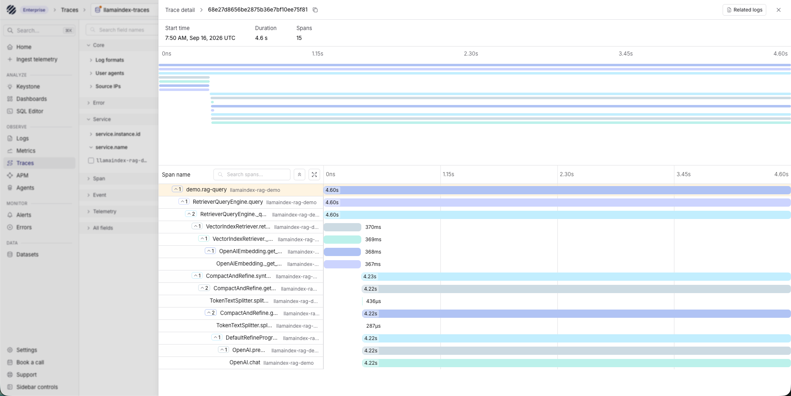

import { Step, Steps } from 'fumadocs-ui/components/steps';

[LlamaIndex](https://www.llamaindex.ai/) is a framework for building agents and retrieval-augmented generation (RAG) applications. A single request can cross query engines, retrievers, embeddings, tools, and model calls before producing an answer.

This guide instruments the LlamaIndex framework with OpenInference and sends its OpenTelemetry traces to Parseable. Framework instrumentation preserves the parent-child relationship between retrieval and generation spans, so you can investigate the complete execution instead of collecting disconnected application logs.

## How it works

```text
LlamaIndex application
  |
  | OpenInference instrumentation
  | OpenTelemetry traces over OTLP/HTTP
  v
Parseable
  |
  +--> llamaindex-traces --> Traces
```

The integration captures framework operations automatically. You do not need to maintain a custom LlamaIndex callback or send an HTTP request for every event.

## Prerequisites

- Python 3.10 or later
- A LlamaIndex application
- A running Parseable instance
- A Parseable API key with ingest access
- An API key for the model provider used by the application

## Set up LlamaIndex with Parseable

<Steps>
<Step>

### Install the packages

Install LlamaIndex, its OpenAI integration, the LlamaIndex OpenInference instrumentor, and the OpenTelemetry OTLP HTTP exporter:

```bash
pip install \
  llama-index \
  llama-index-llms-openai \
  openinference-instrumentation-llama-index \
  opentelemetry-sdk \
  opentelemetry-exporter-otlp-proto-http
```

</Step>
<Step>

### Configure framework instrumentation

Create `app.py`:

```python
import os

from llama_index.core import Document, VectorStoreIndex
from openinference.instrumentation.llama_index import LlamaIndexInstrumentor
from opentelemetry.exporter.otlp.proto.http.trace_exporter import OTLPSpanExporter
from opentelemetry.sdk.resources import Resource
from opentelemetry.sdk.trace import TracerProvider
from opentelemetry.sdk.trace.export import BatchSpanProcessor

parseable_url = os.environ["PARSEABLE_URL"].rstrip("/")
parseable_api_key = os.environ["PARSEABLE_API_KEY"]

tracer_provider = TracerProvider(
    resource=Resource.create(
        {
            "service.name": "llamaindex-rag",
            "deployment.environment.name": "development",
        }
    )
)
tracer_provider.add_span_processor(
    BatchSpanProcessor(
        OTLPSpanExporter(
            endpoint=f"{parseable_url}/v1/traces",
            headers={
                "Authorization": f"Bearer {parseable_api_key}",
                "X-P-Stream": "llamaindex-traces",
            },
        )
    )
)

# Instrument LlamaIndex before creating or running framework components.
LlamaIndexInstrumentor().instrument(tracer_provider=tracer_provider)

documents = [
    Document(
        text=(
            "Parseable is an open-source observability platform for "
            "logs, metrics, traces, and events."
        )
    )
]
index = VectorStoreIndex.from_documents(documents)
query_engine = index.as_query_engine()

try:
    response = query_engine.query("What telemetry does Parseable support?")
    print(response)
finally:
    tracer_provider.force_flush()
    tracer_provider.shutdown()
```

Configure the environment and run it:

```bash
export PARSEABLE_URL="https://<parseable-host>"
export PARSEABLE_API_KEY="<parseable-api-key>"
export OPENAI_API_KEY="<openai-api-key>"

python app.py
```

Parseable creates the `llamaindex-traces` dataset on the first OTLP write when
it does not already exist. No separate dataset-creation request is required.

</Step>
</Steps>

## LlamaIndex workload coverage

LlamaIndex telemetry is not limited to agents. Use the same instrumentation and
exporter for each workload, but interpret the resulting trace according to the
operation that produced it.

| Workload | What the trace shows | Where to inspect it |
| --- | --- | --- |
| Indexing | Document parsing, splitting, embedding, and index construction | Traces |
| Direct LLM | A model completion or chat request | Traces |
| RAG query | Query engine, retrieval, response synthesis, and model calls | Traces |
| Workflow | Workflow execution and instrumented operations inside its steps | Traces |
| Direct tool | Tool invocation, result, duration, or exception | Traces |
| Agent | Agent run, model decisions, and executed tools | Traces; Agents requires GenAI-compatible attributes |

The following examples reuse the tracer provider and instrumentation configured
earlier in this guide.

### Index documents

`VectorStoreIndex.from_documents()` captures the indexing pipeline, including
the embedding request:

```python
documents = [Document(text="A document to index and retrieve later.")]
index = VectorStoreIndex.from_documents(documents)
```

### Call an LLM directly

Direct model calls are useful when an application uses LlamaIndex's model
abstraction without a retriever or agent:

```python
from llama_index.core import Settings
from llama_index.llms.openai import OpenAI

Settings.llm = OpenAI(model="gpt-4o-mini")
response = Settings.llm.complete("Summarize Parseable in one sentence.")
```

### Run a workflow

Workflow handlers are asynchronous. Create and await the handler inside the
same running event loop:

```python
import asyncio

from llama_index.core.workflow import StartEvent, StopEvent, Workflow, step


class TelemetryWorkflow(Workflow):
    @step
    async def classify(self, event: StartEvent) -> StopEvent:
        question = event.get("question", "")
        category = "observability" if "telemetry" in question.lower() else "general"
        return StopEvent(result={"question": question, "category": category})


async def run_workflow():
    return await TelemetryWorkflow(timeout=30).run(
        question="Which telemetry category is this?"
    )


result = asyncio.run(run_workflow())
```

### Execute a tool directly

```python
from llama_index.core.tools import FunctionTool


def telemetry_lookup(topic: str) -> str:
    """Return the telemetry signals supported by Parseable."""
    return "Parseable supports logs, metrics, traces, and events."


tool = FunctionTool.from_defaults(fn=telemetry_lookup)
result = tool.call(topic="signals")
```

### Run a tool-using agent

This is an actual agent workload. `initial_tool_choice` makes the example
deterministic by requiring the first tool invocation:

```python
import asyncio

from llama_index.core.agent.workflow import FunctionAgent
from llama_index.llms.openai import OpenAI


async def run_agent():
    agent = FunctionAgent(
        name="parseable_telemetry_agent",
        description="Answers questions about Parseable telemetry",
        system_prompt="Call telemetry_lookup before answering.",
        tools=[telemetry_lookup],
        llm=OpenAI(model="gpt-4o-mini"),
        initial_tool_choice="telemetry_lookup",
    )
    return await agent.run(
        user_msg="Which telemetry signals does Parseable support?"
    )


result = asyncio.run(run_agent())
```

<Callout type="info">
OpenInference LlamaIndex spans are fully available in Parseable's Traces view.
The specialized Agents page currently expects OpenTelemetry GenAI attributes
such as `gen_ai.operation.name`. Do not classify indexing, retrieval, or direct
LLM traces as agent runs. Use the Agents page only after the actual agent spans
have been emitted or normalized with the required GenAI attributes.
</Callout>

## Capture failures

The OpenTelemetry SDK records exceptions and error status from instrumented
operations. For custom application validation around LlamaIndex, record the
exception on a parent span and re-raise or handle it normally:

```python
from opentelemetry import trace
from opentelemetry.trace import Status, StatusCode

tracer = trace.get_tracer("llamaindex-application")

with tracer.start_as_current_span("validate_retrieval") as span:
    try:
        raise ValueError("No relevant documents returned")
    except ValueError as error:
        span.record_exception(error)
        span.set_status(Status(StatusCode.ERROR, str(error)))
```

## What framework support captures

A typical RAG request produces a trace containing related framework operations such as:

```text
query
├── retrieve
│   └── embedding
└── chat
```

The trace below comes from the runnable example in this guide. Parseable keeps
the complete LlamaIndex execution in one waterfall: the outer RAG query,
retrieval, OpenAI embedding request, response synthesis, prompt refinement, and
final OpenAI chat call. In this example, one query produced 15 correlated spans.



The exact span names and attributes depend on the LlamaIndex components and model provider. Common OpenInference attributes include:

| Attribute | Meaning |
| --- | --- |
| `openinference.span.kind` | Framework operation type, such as retriever or LLM |
| `input.value` | Serialized operation input when content capture is enabled |
| `output.value` | Serialized operation output when content capture is enabled |
| `llm.model_name` | Model used for generation |
| `llm.token_count.prompt` | Input tokens reported by the model provider |
| `llm.token_count.completion` | Output tokens reported by the model provider |
| `retrieval.documents` | Documents returned by a retriever |

<Callout type="warn">
Framework traces can contain prompts, retrieved documents, tool arguments, and model responses. Review your privacy requirements before enabling content capture in production, and apply sampling or an OpenTelemetry Collector processor when necessary.
</Callout>

## Query LlamaIndex traces

Find recent framework spans:

```sql
SELECT
  span_name,
  trace_id,
  start_time,
  duration_nano / 1000000 AS duration_ms
FROM "llamaindex-traces"
ORDER BY start_time DESC
LIMIT 50;
```

Find slow retrieval operations:

```sql
SELECT
  span_name,
  trace_id,
  duration_nano / 1000000 AS duration_ms
FROM "llamaindex-traces"
WHERE attributes->>'openinference.span.kind' = 'RETRIEVER'
ORDER BY duration_nano DESC
LIMIT 20;
```

## Troubleshooting

- **No traces appear:** Confirm the application can reach `$PARSEABLE_URL/v1/traces`, the API key has ingest access, and `LlamaIndexInstrumentor().instrument()` runs before the index and query engine are created.
- **Only model spans appear:** Run a LlamaIndex query-engine or agent operation rather than calling the model SDK directly.
- **A process exits before spans arrive:** Keep the explicit `force_flush()` and `shutdown()` calls for short-lived scripts.
- **Prompts or documents are missing:** Content recording depends on the instrumentor, component, and privacy configuration. Do not enable it without reviewing the data being exported.

## Next steps

- Inspect the dataset in [Agent Observability](/user-guide/agent-observability)
- Configure [LangChain](/ingest-data/ai-agents/langchain) framework tracing
- Create [dashboards](/user-guide/dashboards) for RAG latency and model usage
