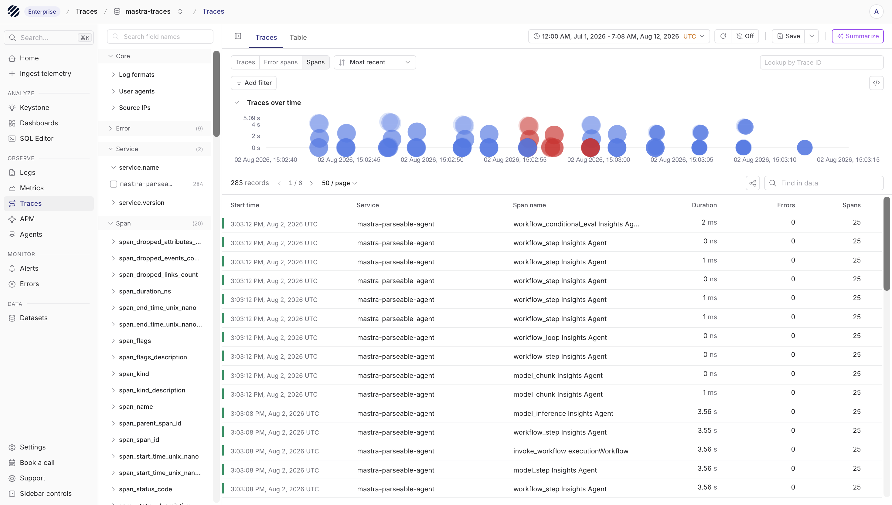
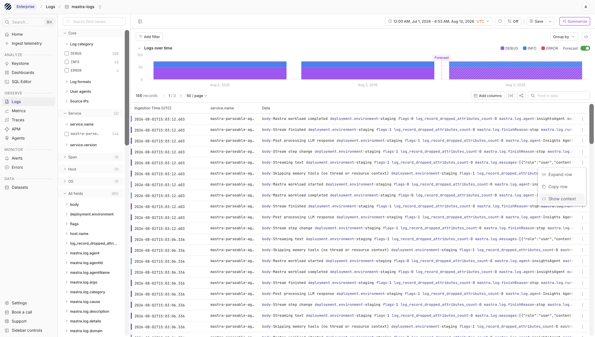
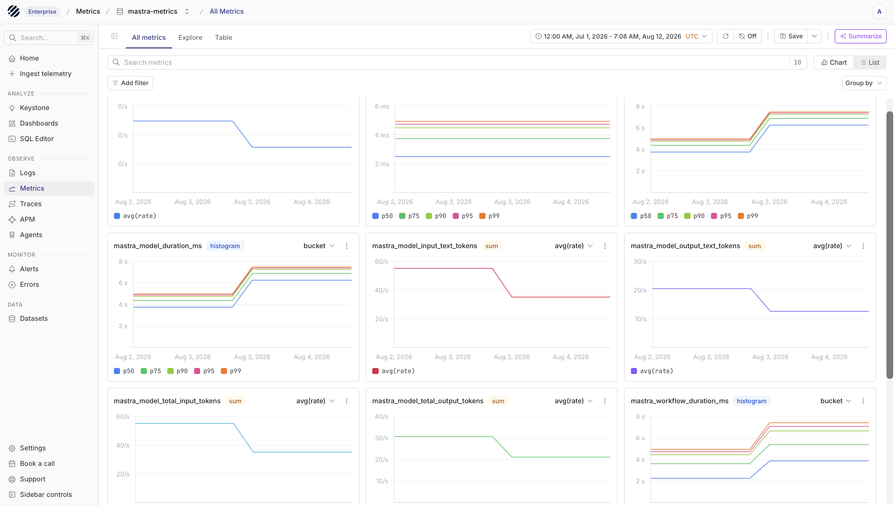
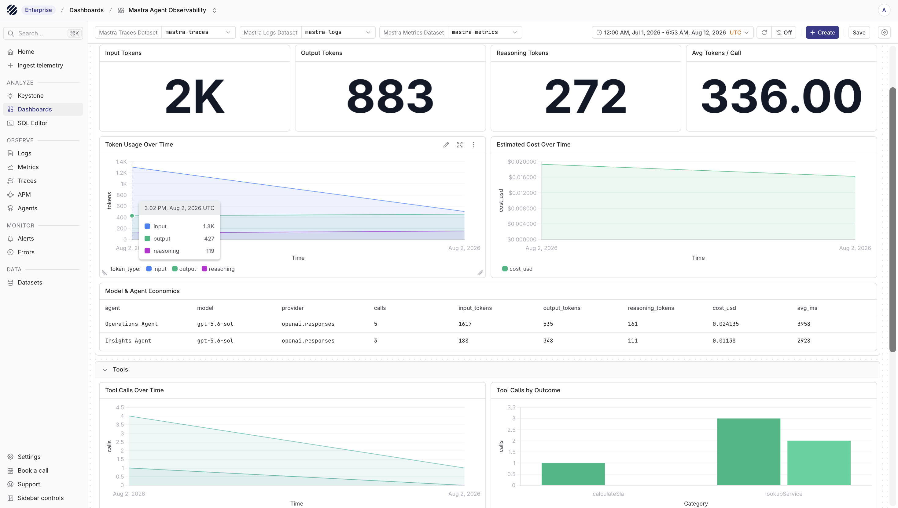
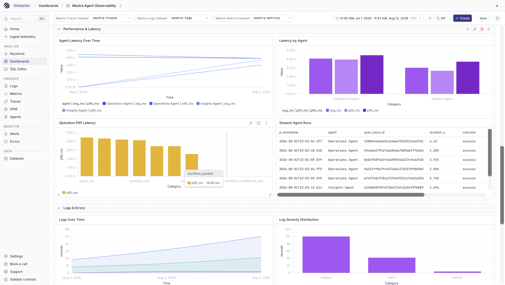
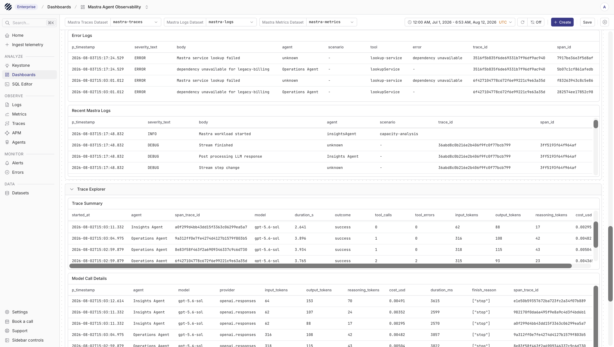

import { Step, Steps } from 'fumadocs-ui/components/steps';

[Mastra](https://mastra.ai/) is a TypeScript framework for building AI agents and workflows. Its observability event bus captures agent, model, and tool activity, including latency, token usage, errors, and correlated logs.

This guide sends each OpenTelemetry signal directly to a dedicated Parseable dataset:

```text
Mastra agent
  |
  |  traces   ->  OTLP/HTTP  ->  mastra-traces
  |  logs     ->  OTLP/HTTP  ->  mastra-logs
  |  metrics  ->  OTLP/HTTP  ->  mastra-metrics
  |
  v
Parseable datasets
```

Traces and logs are sent through Mastra's OpenTelemetry exporter. Metrics come from Mastra observability events and are sent to the metrics dataset using OpenTelemetry metrics.

Keeping the signals in separate datasets makes retention, access control, and dashboard queries easier to manage.

## Prerequisites

- Node.js 22.13 or later
- An existing Mastra application
- A Parseable instance reachable from the application
- A Parseable API key with ingest access
- An LLM provider API key for the agent

Use the Parseable ingestor base URL, for example `https://parseable.example.com`. The exporters append the appropriate OTLP signal path.

<Callout type="warn">
In a distributed Parseable deployment, the query/UI endpoint might not accept ingestion. Use the ingestor URL returned by the Parseable About API or the URL configured for your ingestor.
</Callout>

## Set up Mastra with Parseable

<Steps>
<Step>

### Install the packages

From the Mastra project, install the observability and OpenTelemetry metric packages:

```bash
npm install \
  @mastra/observability \
  @mastra/otel-exporter \
  @opentelemetry/exporter-metrics-otlp-http \
  @opentelemetry/resources \
  @opentelemetry/sdk-metrics
```

The Mastra OpenTelemetry exporter handles traces and logs. The OpenTelemetry metrics packages are used to send Mastra metric events to Parseable.

The example agent below uses OpenAI. Install the provider package if it is not already present:

```bash
npm install @ai-sdk/openai
```

</Step>
<Step>

### Configure the environment

Add these variables to the application environment:

```bash
export PARSEABLE_OTLP_ENDPOINT="https://parseable.example.com"
export PARSEABLE_API_KEY="<parseable-ingest-api-key>"
export OPENAI_API_KEY="<openai-api-key>"
export OPENAI_MODEL="gpt-5-mini"
```

Do not commit API keys to source control.

</Step>
<Step>

### Configure Mastra observability

Create `src/mastra/observability.ts`:

```ts
import type { MetricEvent, TracingEvent } from '@mastra/core/observability';
import { BaseExporter, Observability } from '@mastra/observability';
import { OtelExporter } from '@mastra/otel-exporter';
import { OTLPMetricExporter } from '@opentelemetry/exporter-metrics-otlp-http';
import { resourceFromAttributes } from '@opentelemetry/resources';
import {
  MeterProvider,
  PeriodicExportingMetricReader,
  type Counter,
  type Histogram,
} from '@opentelemetry/sdk-metrics';

const endpoint = process.env.PARSEABLE_OTLP_ENDPOINT?.replace(/\/$/, '');
const apiKey = process.env.PARSEABLE_API_KEY;

if (!endpoint || !apiKey) {
  throw new Error('PARSEABLE_OTLP_ENDPOINT and PARSEABLE_API_KEY are required');
}

const serviceName = 'mastra-agent';
const resourceAttributes = {
  'service.name': serviceName,
  'service.version': '1.0.0',
  'deployment.environment': process.env.NODE_ENV ?? 'development',
};

const headers = (stream: string, source: string) => ({
  'X-API-Key': apiKey,
  'X-P-Stream': stream,
  'X-P-Log-Source': source,
});

const traceExporter = new OtelExporter({
  provider: {
    custom: {
      endpoint,
      protocol: 'http/json',
      headers: headers('mastra-traces', 'otel-traces'),
    },
  },
  signals: { traces: true, logs: false },
  resourceAttributes,
});

const logExporter = new OtelExporter({
  provider: {
    custom: {
      endpoint,
      protocol: 'http/json',
      headers: headers('mastra-logs', 'otel-logs'),
    },
  },
  signals: { traces: false, logs: true },
  resourceAttributes,
});

class ParseableMetricExporter extends BaseExporter {
  name = 'parseable-otlp-metrics';

  private readonly meterProvider: MeterProvider;
  private readonly meter;
  private readonly histograms = new Map<string, Histogram>();
  private readonly counters = new Map<string, Counter>();

  // Optional application metric used by the dashboard's workload panel.
  readonly workloadRequests;

  constructor() {
    super();

    const metricExporter = new OTLPMetricExporter({
      url: `${endpoint}/v1/metrics`,
      headers: headers('mastra-metrics', 'otel-metrics'),
    });

    const reader = new PeriodicExportingMetricReader({
      exporter: metricExporter,
      exportIntervalMillis: 5_000,
      exportTimeoutMillis: 4_000,
    });

    this.meterProvider = new MeterProvider({
      resource: resourceFromAttributes(resourceAttributes),
      readers: [reader],
    });
    this.meter = this.meterProvider.getMeter('@mastra/observability');
    this.workloadRequests = this.meter.createCounter(
      'mastra_workload_requests_total',
      { description: 'Number of Mastra workload requests' },
    );
  }

  protected async _exportTracingEvent(_event: TracingEvent): Promise<void> {}

  async onMetricEvent(event: MetricEvent): Promise<void> {
    const metric = event.metric;
    const attributes: Record<string, string> = {
      ...metric.labels,
      'service.name': serviceName,
    };

    if (metric.costContext?.provider) {
      attributes.provider = metric.costContext.provider;
    }
    if (metric.costContext?.model) {
      attributes.model = metric.costContext.model;
    }
    if (metric.costContext?.costUnit) {
      attributes.cost_unit = metric.costContext.costUnit;
    }

    if (metric.name.endsWith('_duration_ms')) {
      let histogram = this.histograms.get(metric.name);
      if (!histogram) {
        histogram = this.meter.createHistogram(metric.name, { unit: 'ms' });
        this.histograms.set(metric.name, histogram);
      }
      histogram.record(metric.value, attributes);
      return;
    }

    let counter = this.counters.get(metric.name);
    if (!counter) {
      counter = this.meter.createCounter(metric.name);
      this.counters.set(metric.name, counter);
    }
    counter.add(metric.value, attributes);
  }

  async flush(): Promise<void> {
    await this.meterProvider.forceFlush({ timeoutMillis: 20_000 });
  }

  async shutdown(): Promise<void> {
    await this.meterProvider.shutdown({ timeoutMillis: 20_000 });
  }
}

export const parseableMetrics = new ParseableMetricExporter();

export const observability = new Observability({
  configs: {
    default: {
      serviceName,
      exporters: [traceExporter, logExporter, parseableMetrics],
      includeInternalSpans: true,
      logging: { enabled: true, level: 'info' },
      serializationOptions: {
        maxStringLength: 4_096,
        maxArrayLength: 50,
        maxObjectKeys: 100,
      },
    },
  },
});
```

Mastra emits native metric events through its observability bus. The custom exporter above converts duration events to OpenTelemetry histograms and other numeric events to counters before sending them to `mastra-metrics`. Default cardinality protection prevents identifiers such as trace IDs and request IDs from becoming metric labels.

Typical native metric names include:

- `mastra_agent_duration_ms`
- `mastra_tool_duration_ms`
- `mastra_model_duration_ms`
- `mastra_model_total_input_tokens`
- `mastra_model_total_output_tokens`
- `mastra_model_output_reasoning_tokens`

</Step>
<Step>

### Register the agent

Use the observability instance when creating Mastra. For example, in `src/mastra/index.ts`:

```ts
import { openai } from '@ai-sdk/openai';
import { Agent } from '@mastra/core/agent';
import { Mastra } from '@mastra/core/mastra';
import { observability, parseableMetrics } from './observability';

const supportAgent = new Agent({
  id: 'support-agent',
  name: 'Support Agent',
  instructions: 'Answer support questions and use available tools when needed.',
  model: openai(process.env.OPENAI_MODEL ?? 'gpt-5-mini'),
});

export const mastra = new Mastra({
  agents: { supportAgent },
  observability,
});

// Optional: record application workload outcomes for the dashboard.
export function recordWorkload(status: 'started' | 'completed' | 'failed') {
  parseableMetrics.workloadRequests.add(1, {
    agent: 'support-agent',
    status,
  });
}
```

Agent runs, model calls, tool calls, token use, failures, and duration events are recorded automatically. Application-specific counters and structured logs can add business context such as a scenario, tenant, or outcome.

<Callout type="info">
For a short-lived process or serverless function, call `await observability.flush()` before the process exits. Call `await observability.shutdown()` during final application shutdown so buffered telemetry is delivered.
</Callout>

</Step>
<Step>

### Verify ingestion

Run the application and invoke the agent a few times. In Parseable, confirm that all three datasets receive recent events:

| Dataset | What to verify |
| --- | --- |
| `mastra-traces` | Agent, model, and tool spans with trace and span IDs |
| `mastra-logs` | Structured Mastra logs with severity, service, and trace correlation |
| `mastra-metrics` | Duration histograms and model token counters |

The traces view should show agent, model, and tool spans for each run.



The logs view should show structured agent logs with the same service and trace context.



The metrics view should show duration and token metrics emitted from Mastra's observability events.



Useful PromQL checks for the metrics dataset include:

```text
sum(increase(mastra_agent_duration_ms_count[5m]))
```

```text
histogram_quantile(
  0.95,
  sum by (le) (rate(mastra_agent_duration_ms_bucket[5m]))
)
```

If a dataset remains empty, check the application logs for OTLP errors and verify the endpoint, API key, `X-P-Stream`, and `X-P-Log-Source` headers.

</Step>
</Steps>

## Import the dashboard

The [Mastra Agent Observability dashboard](https://github.com/parseablehq/dashboards/tree/main/mastra-agent-observability) includes panels for:

- Overview
- Agent Activity & Reliability
- Models, Tokens & Cost
- Tools
- Performance & Latency
- Logs & Errors
- Trace Explorer
- Metrics & Telemetry

Download the [Mastra dashboard JSON](https://github.com/parseablehq/dashboards/blob/main/mastra-agent-observability/mastra-agent-observability-mixed.json) and import it into Parseable. The template has three dataset variables only. Map them to `mastra-traces`, `mastra-logs`, and `mastra-metrics`, or to your chosen dataset names.

Cost panels use Parseable's `agent_cost()` function with the provider and model recorded on model spans. Unsupported provider/model combinations do not produce an estimate, so keep the model identifier and provider attributes intact during ingestion.

The dashboard gives a ready-made view for token usage, latency, and error investigation once the three datasets are mapped.







## Troubleshooting

- **OTLP requests return 404 or 405**: The application is probably sending telemetry to a query/UI node instead of an ingestor. Change `PARSEABLE_OTLP_ENDPOINT` to the Parseable ingestor base URL.

- **Traces arrive but logs do not**: Keep `logging.enabled` set to `true`, include the log exporter, and verify that its signal configuration is `traces: false, logs: true`.

- **Metrics do not arrive**: Register the metric exporter in the same observability configuration as the trace and log exporters. Keep the metric export interval greater than its export timeout, and flush telemetry before a short-lived process exits.

- **Metric series are too numerous**: Do not add trace IDs, request IDs, user IDs, session IDs, or other unbounded values as metric labels. Keep those values on logs and traces, where they can still be used for correlation.

## Related resources

- [Mastra observability](https://mastra.ai/ai-agent-observability)
- [Mastra OpenTelemetry exporter](https://mastra.ai/docs/observability/integrations/exporters/otel)
- [Send OpenTelemetry traces to Parseable](/docs/ingest-data/otel/traces)
- [Send OpenTelemetry logs to Parseable](/docs/ingest-data/otel/logs)
- [Send OpenTelemetry metrics to Parseable](/docs/ingest-data/otel/metrics)
- [Mastra Agent Observability dashboard](https://github.com/parseablehq/dashboards/tree/main/mastra-agent-observability)
