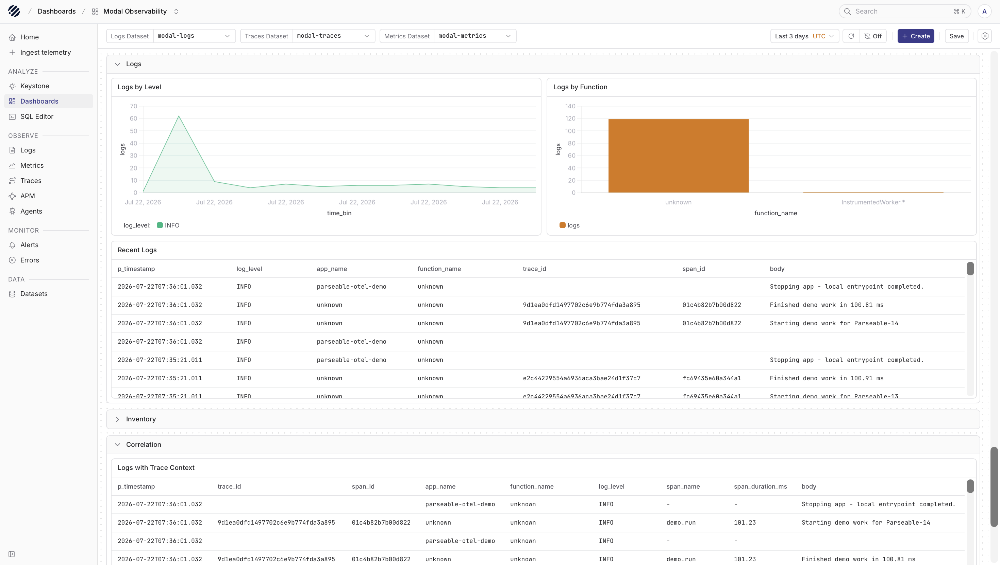
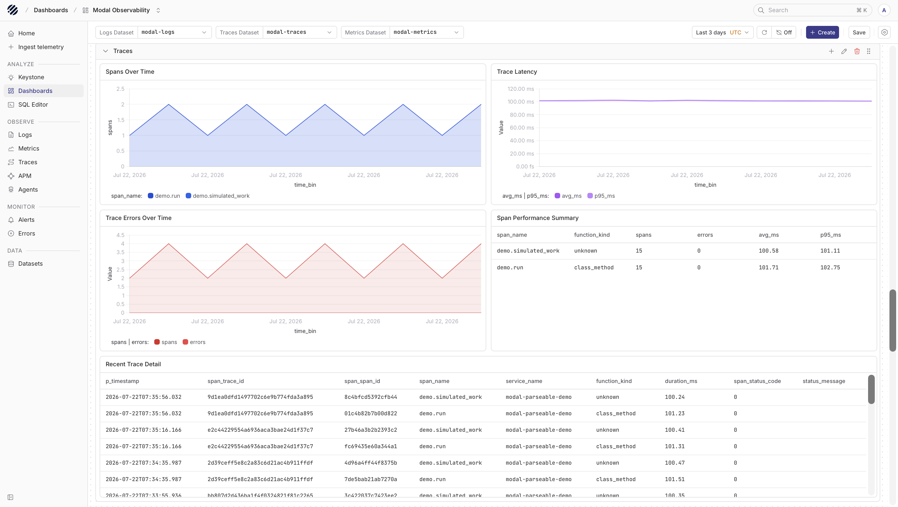
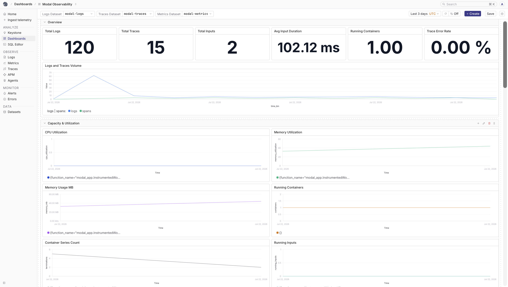

[Modal](https://modal.com/) is a serverless platform for running Python workloads such as AI inference, batch jobs, web endpoints, and sandboxed code. When those workloads move fast or scale across many containers, the useful question is usually simple: what ran, how long did it take, and what happened inside the function when something failed?

Parseable can receive Modal telemetry through OpenTelemetry. In this setup, Modal sends telemetry to an OpenTelemetry Collector, and the Collector forwards logs, traces, and metrics into separate Parseable datasets.

## How it works

There are two useful telemetry paths for Modal.

The first path is Modal's managed OpenTelemetry integration. This is the easiest way to export Modal Function logs and container metrics. Audit logs can also be exported when they are available for your Modal workspace plan.

The second path is application-level OpenTelemetry from your Modal code. Use this when you want custom spans around important work, structured application logs, or metrics that are specific to your own workload.

Both paths send OTLP over HTTP to the same Collector. The Collector keeps the Parseable API key outside your Modal code, receives telemetry from Modal with a bearer token, and forwards each signal to a dedicated Parseable dataset.

```text
Modal managed telemetry ---\
                            +--> OTLP/HTTP --> OpenTelemetry Collector
Modal app OpenTelemetry ----/                         |
                                                     +--> modal-logs
                                                     +--> modal-traces
                                                     +--> modal-metrics
                                                          Parseable
```

<Callout type="info">
OTLP means OpenTelemetry Protocol. Modal sends telemetry in OpenTelemetry format, and Parseable stores it in datasets that you can query, filter, and explore.
</Callout>

## Prerequisites

Before you start, keep these ready:

- A Modal account and workspace
- Python 3.10 through 3.13
- The Modal CLI installed locally
- A Parseable instance reachable from the Collector
- A Parseable API key with ingest access
- An OpenTelemetry Collector reachable from Modal over HTTPS
- Docker, if you want to run the Collector with the example below

Authenticate the Modal CLI first:

```bash
python3.12 -m venv .venv
source .venv/bin/activate
pip install modal
modal setup
modal app list
```

For a new workspace, `modal app list` can return an empty list. That is fine. The important part is that the command completes without an authentication error.

## Configure the OpenTelemetry Collector

Create `otel-collector-config.yaml`:

```yaml
extensions:
  health_check:
    endpoint: 0.0.0.0:13133
  bearertokenauth/ingress:
    token: ${env:OTLP_INGEST_TOKEN}

receivers:
  otlp:
    protocols:
      http:
        endpoint: 0.0.0.0:4318
        auth:
          authenticator: bearertokenauth/ingress

processors:
  memory_limiter:
    check_interval: 1s
    limit_mib: 384
    spike_limit_mib: 96
  batch:
    timeout: 5s
    send_batch_size: 512

exporters:
  otlphttp/parseable_logs:
    endpoint: ${env:PARSEABLE_ENDPOINT}
    encoding: json
    headers:
      X-API-Key: ${env:PARSEABLE_API_KEY}
      X-P-Stream: ${env:PARSEABLE_LOGS_STREAM}
      X-P-Log-Source: otel-logs
      Content-Type: application/json

  otlphttp/parseable_traces:
    endpoint: ${env:PARSEABLE_ENDPOINT}
    encoding: json
    headers:
      X-API-Key: ${env:PARSEABLE_API_KEY}
      X-P-Stream: ${env:PARSEABLE_TRACES_STREAM}
      X-P-Log-Source: otel-traces
      Content-Type: application/json

  otlphttp/parseable_metrics:
    endpoint: ${env:PARSEABLE_ENDPOINT}
    encoding: json
    headers:
      X-API-Key: ${env:PARSEABLE_API_KEY}
      X-P-Stream: ${env:PARSEABLE_METRICS_STREAM}
      X-P-Log-Source: otel-metrics
      Content-Type: application/json

service:
  extensions: [health_check, bearertokenauth/ingress]
  pipelines:
    logs:
      receivers: [otlp]
      processors: [memory_limiter, batch]
      exporters: [otlphttp/parseable_logs]
    traces:
      receivers: [otlp]
      processors: [memory_limiter, batch]
      exporters: [otlphttp/parseable_traces]
    metrics:
      receivers: [otlp]
      processors: [memory_limiter, batch]
      exporters: [otlphttp/parseable_metrics]
```

This Collector accepts OTLP/HTTP on port `4318`. Modal authenticates to the Collector with `OTLP_INGEST_TOKEN`, and the Collector authenticates to Parseable with `PARSEABLE_API_KEY`.

Configure the Collector environment:

```bash
export PARSEABLE_ENDPOINT="https://parseable.example.com"
export PARSEABLE_API_KEY="<parseable-api-key>"
export PARSEABLE_LOGS_STREAM="modal-logs"
export PARSEABLE_TRACES_STREAM="modal-traces"
export PARSEABLE_METRICS_STREAM="modal-metrics"
export OTLP_INGEST_TOKEN="$(openssl rand -hex 32)"
```

Run the Collector:

```bash
docker run --rm \
  -p 127.0.0.1:4318:4318 \
  -p 127.0.0.1:13133:13133 \
  -e PARSEABLE_ENDPOINT \
  -e PARSEABLE_API_KEY \
  -e PARSEABLE_LOGS_STREAM \
  -e PARSEABLE_TRACES_STREAM \
  -e PARSEABLE_METRICS_STREAM \
  -e OTLP_INGEST_TOKEN \
  -v "$PWD/otel-collector-config.yaml:/etc/otelcol-contrib/config.yaml:ro" \
  otel/opentelemetry-collector-contrib:0.130.1 \
  --config=/etc/otelcol-contrib/config.yaml
```

Modal must be able to reach the Collector over HTTPS. For production, run the Collector behind a stable TLS endpoint such as `https://otel.example.com`.

For a short local proof of concept, you can put a temporary tunnel in front of the local Collector:

```bash
cloudflared tunnel --url http://localhost:4318
```

<Callout type="warn">
Do not expose an unauthenticated OTLP receiver to the internet. The example protects Collector ingress with a bearer token. Use a durable Collector deployment and a stable TLS hostname for production.
</Callout>

## Create the Modal Secret

Create a Modal Secret named `parseable-otel`. This Secret is used in two places: Modal's managed OpenTelemetry integration and the sample Modal application later in this guide.

In the [Modal Secrets dashboard](https://modal.com/secrets), add these keys:

| Key | Value |
| --- | --- |
| `OTEL_HEADER_Authorization` | `Bearer <collector-ingest-token>` |
| `OTEL_EXPORTER_OTLP_ENDPOINT` | Collector base URL, such as `https://otel.example.com` |
| `OTEL_EXPORTER_OTLP_PROTOCOL` | `http/protobuf` |
| `OTEL_EXPORTER_OTLP_HEADERS` | `Authorization=Bearer%20<collector-ingest-token>` |

`OTEL_HEADER_Authorization` is used by Modal's managed OpenTelemetry integration. The `OTEL_EXPORTER_*` variables are picked up by OpenTelemetry SDKs running inside your Modal functions. In `OTEL_EXPORTER_OTLP_HEADERS`, `%20` is the encoded space between `Bearer` and the token.

You can also create the Secret from the CLI:

```bash
modal secret create parseable-otel \
  OTEL_HEADER_Authorization="Bearer ${OTLP_INGEST_TOKEN}" \
  OTEL_EXPORTER_OTLP_ENDPOINT="https://otel.example.com" \
  OTEL_EXPORTER_OTLP_PROTOCOL="http/protobuf" \
  OTEL_EXPORTER_OTLP_HEADERS="Authorization=Bearer%20${OTLP_INGEST_TOKEN}"
```

Only the Collector needs the Parseable API key. Modal only needs the Collector ingress token.

## Enable Modal managed telemetry

In the Modal dashboard:

1. Open **Settings > Metrics > OpenTelemetry**.
2. Enter the Collector base URL, such as `https://otel.example.com`.
3. Do not append `/v1/logs`, `/v1/traces`, or `/v1/metrics`.
4. Select the `parseable-otel` Secret.
5. Save the integration.
6. Use **Send test** to confirm the path is working.

A successful test sends a log record from the `modal.test_logs` service. Open the `modal-logs` dataset in Parseable and search for that service name.

Modal's managed integration exports Function logs and container metrics. Audit-log export depends on your Modal plan. Modal documents platform metrics such as CPU utilization, memory usage, GPU usage, running containers, input latency, pending inputs, running inputs, and success counts.

## Add custom application telemetry

Managed telemetry is useful for the platform view. Application telemetry is useful when you want to see what your own code did inside a Modal function.

The following Modal class emits two log records, two spans, a counter, and a histogram. It also flushes the OpenTelemetry providers during container shutdown, which matters because Modal containers can scale down or be preempted.

```python
import logging
import time

import modal

app = modal.App("parseable-otel-demo")

image = modal.Image.debian_slim(python_version="3.12").pip_install(
    "opentelemetry-api==1.36.0",
    "opentelemetry-sdk==1.36.0",
    "opentelemetry-exporter-otlp-proto-http==1.36.0",
)


@app.cls(
    image=image,
    secrets=[modal.Secret.from_name("parseable-otel")],
)
class InstrumentedWorker:
    @modal.enter()
    def setup_telemetry(self):
        from opentelemetry import metrics, trace
        from opentelemetry._logs import set_logger_provider
        from opentelemetry.exporter.otlp.proto.http._log_exporter import OTLPLogExporter
        from opentelemetry.exporter.otlp.proto.http.metric_exporter import OTLPMetricExporter
        from opentelemetry.exporter.otlp.proto.http.trace_exporter import OTLPSpanExporter
        from opentelemetry.sdk._logs import LoggerProvider, LoggingHandler
        from opentelemetry.sdk._logs.export import BatchLogRecordProcessor
        from opentelemetry.sdk.metrics import MeterProvider
        from opentelemetry.sdk.metrics.export import PeriodicExportingMetricReader
        from opentelemetry.sdk.resources import Resource
        from opentelemetry.sdk.trace import TracerProvider
        from opentelemetry.sdk.trace.export import BatchSpanProcessor

        resource = Resource.create({"service.name": "modal-parseable-demo"})

        self.tracer_provider = TracerProvider(resource=resource)
        self.tracer_provider.add_span_processor(BatchSpanProcessor(OTLPSpanExporter()))
        trace.set_tracer_provider(self.tracer_provider)

        self.logger_provider = LoggerProvider(resource=resource)
        self.logger_provider.add_log_record_processor(
            BatchLogRecordProcessor(OTLPLogExporter())
        )
        set_logger_provider(self.logger_provider)

        metric_reader = PeriodicExportingMetricReader(
            OTLPMetricExporter(), export_interval_millis=5_000
        )
        self.meter_provider = MeterProvider(resource=resource, metric_readers=[metric_reader])
        metrics.set_meter_provider(self.meter_provider)

        self.tracer = trace.get_tracer("modal.demo")
        meter = metrics.get_meter("modal.demo")
        self.invocations = meter.create_counter("demo.invocations")
        self.duration = meter.create_histogram("demo.work.duration", unit="ms")

        self.logger = logging.getLogger("modal.demo")
        self.logger.setLevel(logging.INFO)
        self.logger.addHandler(LoggingHandler(logger_provider=self.logger_provider))
        self.logger.propagate = False

    @modal.method()
    def run(self, name="Modal"):
        started = time.perf_counter()
        with self.tracer.start_as_current_span("demo.run") as span:
            span.set_attribute("demo.name", name)
            self.logger.info("Starting demo work for %s", name)

            with self.tracer.start_as_current_span("demo.simulated_work"):
                time.sleep(0.1)

            elapsed_ms = (time.perf_counter() - started) * 1_000
            self.invocations.add(1, {"result": "success"})
            self.duration.record(elapsed_ms, {"operation": "demo.run"})
            self.logger.info("Finished demo work in %.2f ms", elapsed_ms)
            return {"message": f"Hello, {name}!", "telemetry": "exported"}

    @modal.exit()
    def shutdown_telemetry(self):
        self.tracer_provider.force_flush(timeout_millis=5_000)
        self.logger_provider.force_flush(timeout_millis=5_000)
        self.meter_provider.force_flush(timeout_millis=5_000)
        self.logger_provider.shutdown()
        self.meter_provider.shutdown()
        self.tracer_provider.shutdown()


@app.local_entrypoint()
def main(name="Modal"):
    print(InstrumentedWorker().run.remote(name))
```

Save the file as `modal_app.py`, then run it:

```bash
modal run modal_app.py --name Parseable
```

Run it a few times if you want metric charts to show visible points in Parseable.

## Validate in Parseable

After you send the Modal test event and run the sample app, open the three datasets in Parseable.

**Logs**

Open `modal-logs` to check Modal Function output, the `modal.test_logs` test event, and application log messages from `modal-parseable-demo`.



**Traces**

Open `modal-traces` to inspect custom spans such as `demo.run` and `demo.simulated_work`. This is where you can confirm that the application-level spans from your Modal function reached Parseable.



**Metrics**

Open `modal-metrics` to view Modal platform metrics along with custom metrics such as `demo.invocations` and `demo.work.duration`.



Metric names can appear before there are enough points to draw a useful chart. If a metric card says `No data`, run the workload again, wait for the Collector batch interval, and refresh the selected time range.

You can also check the Collector health endpoint:

```bash
curl http://localhost:13133
```

A healthy Collector response tells you the process is running. If Parseable is still empty, check the Collector logs for authentication errors, exporter failures, or connection errors to the Parseable endpoint.

## Troubleshooting

- **The Modal test does not appear in Parseable**: Confirm the Collector URL is public HTTPS, the tunnel or gateway is running, and `OTEL_HEADER_Authorization` matches `OTLP_INGEST_TOKEN`.
- **The Collector returns `401`**: Check the bearer token used by Modal. Managed telemetry uses `OTEL_HEADER_Authorization`; application telemetry uses `OTEL_EXPORTER_OTLP_HEADERS`.
- **The Collector receives data but Parseable is empty**: Verify `PARSEABLE_ENDPOINT`, `PARSEABLE_API_KEY`, `X-P-Stream`, and `X-P-Log-Source` in the Collector exporter config.
- **Logs arrive but traces or metrics do not**: Confirm the application has the matching OTLP exporters installed and that the app calls `force_flush` before shutdown.
- **Metric charts show no visible points**: Run the workload more than once, wait at least one batch interval, and refresh the time range in Parseable.
- **Telemetry stops after a while**: Temporary tunnel URLs stop working when the tunnel process exits. Create a new URL and update the Modal Secret and managed integration.
- **You see duplicate logs**: Modal-managed Function logs and application OpenTelemetry logs are separate sources. Filter by `service.name` or disable one path if you only need one copy.

## Production guidance

For production, run the Collector on durable infrastructure with a stable TLS hostname. Keep Collector ingress authenticated, rotate the ingress token periodically, and store the Parseable API key only in the Collector environment or secret store.

Keep logs, traces, and metrics in separate Parseable datasets. This makes it easier to browse each signal in Prism and keeps retention, access, and query behavior easier to reason about.

Finally, treat application log bodies as sensitive data. Avoid recording credentials, prompts, user identifiers, or payloads unless your team has explicitly decided those fields are safe to collect.
