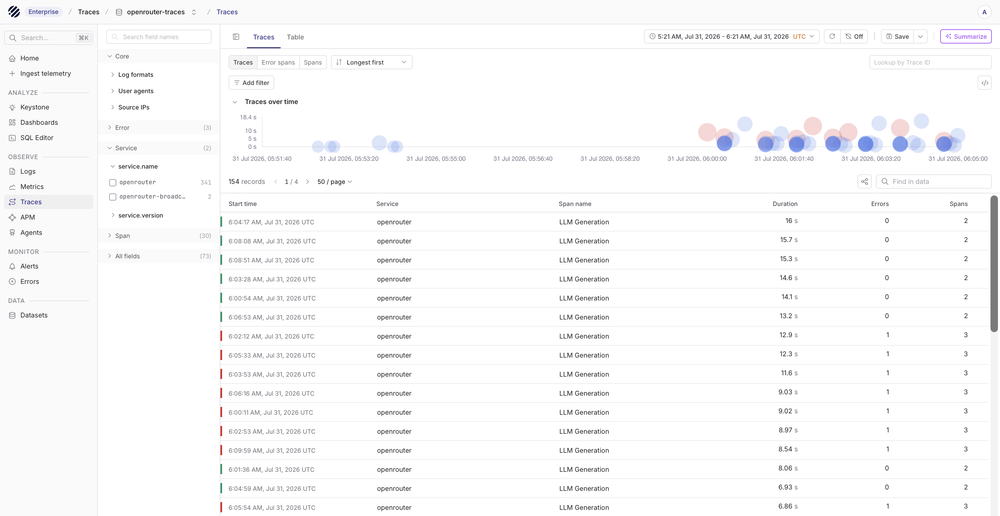
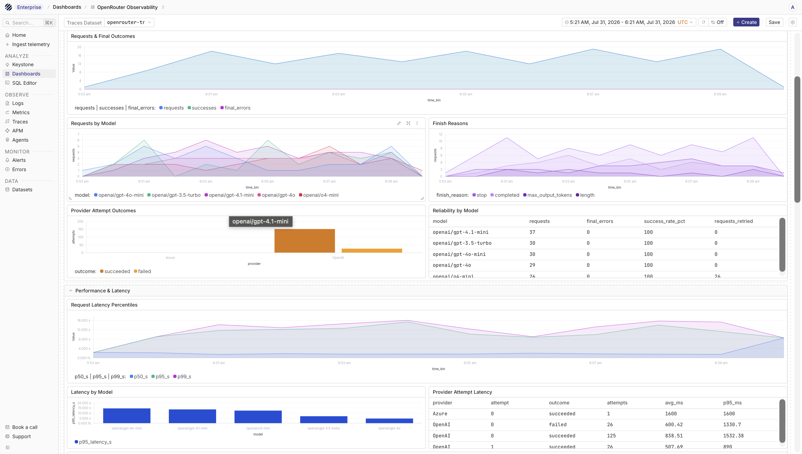
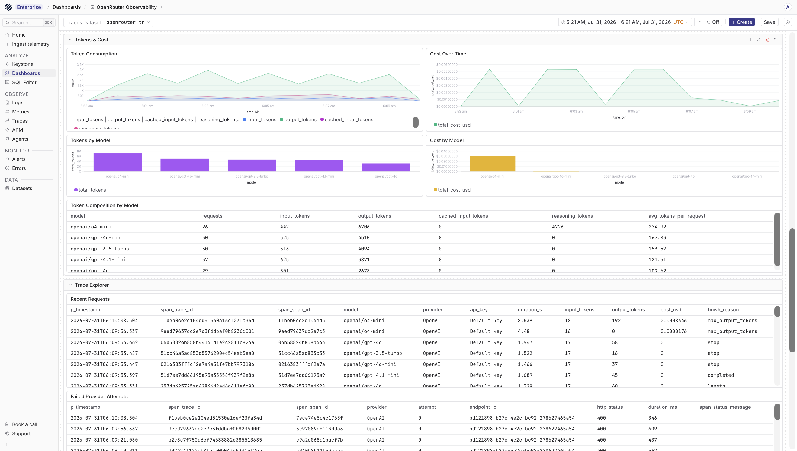

[OpenRouter](https://openrouter.ai/) gives you one API for calling models from different providers. That makes it useful for AI applications that switch models, compare providers, or use fallback routing. Once those requests are running in production, you still need to answer a few basic questions: which model was called, how long it took, how many tokens were used, which provider served the request, and whether a request failed.

OpenRouter Broadcast can send traces for OpenRouter requests to an OpenTelemetry-compatible destination. Parseable can receive those traces on its native OTLP traces endpoint and store them in a trace dataset that you can inspect, query, and use in dashboards.

This guide focuses on traces because that is what OpenRouter Broadcast exports. Once the setup is working, each OpenRouter request can show up in Parseable with model, provider, timing, token usage, cost, status, and request context.

```text
Application
  |
  | OpenRouter API request
  v
OpenRouter
  |
  | Broadcast traces over OTLP/HTTP
  v
Parseable
  |
  +--> openrouter-traces
```

Use the direct setup when your Parseable endpoint is reachable over HTTPS from OpenRouter. Use the Collector setup when Parseable is private, HTTP-only, or when you want the Collector to handle authentication and routing.

| Setup path | Use when |
| --- | --- |
| Direct to Parseable | Parseable has a public HTTPS endpoint and you want the shortest path |
| Through a Collector | Parseable is private, HTTP-only, or you want batching, filtering, retry handling, or header injection outside OpenRouter |

## Prerequisites

Before you start, keep these ready:

- An OpenRouter account with access to **Settings > Observability**
- Organization admin access if Broadcast is configured for an OpenRouter organization
- An OpenRouter API key for sending a test request
- A Parseable instance reachable over HTTPS, or an OpenTelemetry Collector Contrib deployment that is reachable over HTTPS
- A Parseable API key with ingest access
- A trace dataset name, for example `openrouter-traces`

<Callout type="info">
OpenRouter Broadcast sends traces. The dataset you create in Parseable should be a traces dataset, not a regular JSON log dataset.
</Callout>

## Send traces directly to Parseable

If Parseable is reachable from the public internet over HTTPS, you can point OpenRouter Broadcast directly at the Parseable OTLP traces endpoint.

Use this endpoint in OpenRouter:

```text
https://<your-parseable-host>:8000/v1/traces
```

Add these headers in the OpenRouter destination configuration:

```json
{
  "X-API-Key": "<parseable-api-key>",
  "X-P-Stream": "openrouter-traces",
  "X-P-Log-Source": "otel-traces"
}
```

`X-API-Key` authenticates the request with Parseable. `X-P-Stream` tells Parseable which dataset should receive the traces. `X-P-Log-Source` tells Parseable that the incoming OTLP payload contains traces.

In the OpenRouter dashboard, open **Settings > Observability**, enable **Broadcast**, and add an **OpenTelemetry Collector** destination. Set the endpoint to the Parseable `/v1/traces` URL and paste the headers JSON above. Use **Test Connection** before saving the destination.

OpenRouter only saves the destination after the test succeeds. The test sends a small synthetic trace, so you may see a connection-test record before your real application traffic arrives. After a successful test, send one real OpenRouter request and check the `openrouter-traces` dataset in Parseable.

<Callout type="warn">
If `openrouter-traces` already exists as a regular log dataset, OTLP trace ingestion can fail because the dataset was created with the wrong telemetry type. Use a fresh dataset name or recreate the dataset through the `/v1/traces` path.
</Callout>

## Send traces through an OpenTelemetry Collector

Use a Collector when the Parseable endpoint should stay private, or when you want one place to add batching, filtering, retries, or routing later. OpenRouter still needs to reach the Collector over HTTPS.

The example below uses `otelcol-contrib` because it includes the `bearertokenauth` extension. The token is only used between OpenRouter and your Collector. It is not your OpenRouter API key and it is not your Parseable API key.

Create `otel-collector-config.yaml`:

```yaml
extensions:
  bearertokenauth/openrouter:
    token: ${env:OPENROUTER_BROADCAST_TOKEN}

receivers:
  otlp:
    protocols:
      http:
        endpoint: 0.0.0.0:4318
        auth:
          authenticator: bearertokenauth/openrouter

processors:
  batch:
    timeout: 5s
    send_batch_size: 512

exporters:
  otlphttp/parseable:
    traces_endpoint: https://<your-parseable-host>:8000/v1/traces
    encoding: json
    headers:
      X-API-Key: ${env:PARSEABLE_API_KEY}
      X-P-Stream: openrouter-traces
      X-P-Log-Source: otel-traces

service:
  extensions: [bearertokenauth/openrouter]
  pipelines:
    traces:
      receivers: [otlp]
      processors: [batch]
      exporters: [otlphttp/parseable]
```

If the Collector and Parseable run inside the same private network, `traces_endpoint` can point to the internal Parseable URL instead. The public HTTPS requirement applies to the endpoint that OpenRouter calls, not necessarily to the private Collector to Parseable hop.

Run the Collector:

```bash
export PARSEABLE_API_KEY="<parseable-api-key>"
export OPENROUTER_BROADCAST_TOKEN="$(openssl rand -hex 32)"

otelcol-contrib --config otel-collector-config.yaml
```

Expose the Collector over HTTPS. For local testing, a temporary tunnel is enough:

```bash
cloudflared tunnel --url http://localhost:4318
```

In OpenRouter, configure the Broadcast destination with:

```text
https://<your-public-collector-host>/v1/traces
```

Set the destination headers to:

```json
{
  "Authorization": "Bearer <openrouter-broadcast-token>"
}
```

The Collector receives the trace from OpenRouter, validates the bearer token, and forwards the trace to Parseable with the Parseable API key and dataset headers.

## Broadcast options

OpenRouter Broadcast has a few options that are worth setting before production traffic starts flowing.

Use **API key filtering** when you want only selected OpenRouter keys to send traces to Parseable. This is useful when development and production use different OpenRouter keys, or when you want one destination to receive only a subset of traffic.

Use **Sampling Rate** when request volume is high. A sampling rate of `1.0` sends all traces. A value such as `0.1` sends a smaller sample. If you send `session_id` with requests, OpenRouter keeps sampling consistent for that session so the traces are not split randomly across the same conversation.

Use **Privacy Mode** if prompts and completions should not be exported. With Privacy Mode enabled, request and response content is removed from the trace, while metadata such as token usage, cost, timing, model information, and custom metadata is still sent.

If you do not need prompts or completions in Parseable, start with **Privacy Mode** enabled. You still get the operational fields needed for usage, latency, model, and cost analysis, and you can decide later whether a debugging environment should receive fuller traces.

## Send a test request

After Broadcast is saved, send a request through OpenRouter:

```bash
curl https://openrouter.ai/api/v1/chat/completions \
  -H "Content-Type: application/json" \
  -H "Authorization: Bearer $OPENROUTER_API_KEY" \
  -d '{
    "model": "openai/gpt-4o-mini",
    "messages": [
      {
        "role": "user",
        "content": "Say OK"
      }
    ]
  }'
```

OpenRouter uses `Authorization: Bearer <OPENROUTER_API_KEY>` for its own API. Parseable uses `X-API-Key` on the OTLP destination or inside the Collector exporter.

Broadcast delivery is asynchronous, so give it a few seconds after the model response is returned.

## Add request context

OpenRouter traces are more useful when requests carry enough context to connect them back to a user, session, or workflow. You can add a `user`, a `session_id`, and a `trace` object to the OpenRouter request body.

```json
{
  "model": "openai/gpt-4o-mini",
  "messages": [
    {
      "role": "user",
      "content": "Summarize this support ticket"
    }
  ],
  "user": "user_12345",
  "session_id": "ticket_789",
  "trace": {
    "trace_name": "Support ticket summarization",
    "environment": "production",
    "feature": "support-assistant"
  }
}
```

Use this for stable, non-sensitive identifiers. Avoid putting emails, raw customer names, or secrets in metadata unless your data handling policy allows it.

## View traces in Parseable

Open the `openrouter-traces` dataset in Parseable and select the **Traces** view. You should see OpenRouter requests as trace records. A trace usually includes the model request, the upstream provider attempt, timing, status, token usage, and the generation ID returned by OpenRouter.



Useful fields to look for include:

- `span_trace_id` and `span_span_id`
- `span_name`
- `span_duration_ns`
- `span_status_code`
- `gen_ai.request.model`
- `gen_ai.response.model`
- `gen_ai.response.id`
- `gen_ai.usage.input_tokens`
- `gen_ai.usage.output_tokens`
- `gen_ai.usage.total_tokens`
- `gen_ai.usage.total_cost`

The exact fields can vary based on the request and OpenRouter response. Start with the trace detail view first, then use SQL once you know which fields are present in your dataset.

To verify the setup, start with three checks:

1. Confirm that the `openrouter-traces` dataset exists.
2. Open the **Traces** view and check that new records appear after an OpenRouter request.
3. Open one trace and confirm that model, token, latency, provider, and status fields are present.

## Query the trace dataset

You can query the trace dataset from the SQL editor.

Token usage by requested model:

```sql
SELECT
  "gen_ai.request.model" AS model,
  COUNT(*) AS requests,
  SUM(CAST("gen_ai.usage.input_tokens" AS BIGINT)) AS input_tokens,
  SUM(CAST("gen_ai.usage.output_tokens" AS BIGINT)) AS output_tokens,
  SUM(CAST("gen_ai.usage.total_tokens" AS BIGINT)) AS total_tokens
FROM "openrouter-traces"
WHERE p_timestamp > NOW() - INTERVAL '24 hours'
GROUP BY model
ORDER BY total_tokens DESC;
```

Latency by model:

```sql
SELECT
  "gen_ai.request.model" AS model,
  COUNT(*) AS requests,
  AVG(span_duration_ns / 1000000.0) AS avg_latency_ms,
  PERCENTILE_CONT(0.95) WITHIN GROUP (ORDER BY span_duration_ns / 1000000.0) AS p95_latency_ms
FROM "openrouter-traces"
WHERE p_timestamp > NOW() - INTERVAL '24 hours'
GROUP BY model
ORDER BY p95_latency_ms DESC;
```

Cost by model:

```sql
SELECT
  "gen_ai.request.model" AS model,
  COUNT(*) AS requests,
  SUM(CAST("gen_ai.usage.total_cost" AS DOUBLE)) AS total_cost_usd
FROM "openrouter-traces"
WHERE p_timestamp > NOW() - INTERVAL '7 days'
GROUP BY model
ORDER BY total_cost_usd DESC;
```

## Dashboards

After traces are flowing, you can build a dashboard for request volume, token usage, cost, latency, and provider behavior. Public Parseable dashboard examples live in [parseablehq/dashboards](https://github.com/parseablehq/dashboards/tree/main/openrouter-observability). Use them as a starting point, then update dataset names and queries for your `openrouter-traces` dataset.

The request dashboard helps you see how request volume changes over time and which models or providers are active.



The token and cost dashboard gives you a quick view of input tokens, output tokens, and cost trends.



## Troubleshooting

- If OpenRouter **Test Connection** fails, check that the endpoint is public HTTPS and points to `/v1/traces`.
- If Parseable returns a missing log source error, check that `X-P-Log-Source` is set to `otel-traces`.
- If the dataset already exists but ingestion fails, make sure it was created as a traces dataset. If it was created earlier as a plain JSON log dataset, use a new dataset name or recreate it through OTLP traces ingestion.
- If traces reach the Collector but not Parseable, check the Collector logs and confirm `X-API-Key`, `X-P-Stream`, and `X-P-Log-Source` are present in the exporter headers.
- If no real requests appear after a successful test, confirm that your application is calling OpenRouter and not a provider API directly. Broadcast only runs for requests that pass through OpenRouter.

## Next steps

- Read the [OpenRouter Broadcast docs](https://openrouter.ai/docs/guides/features/broadcast)
- Read the [OpenRouter OpenTelemetry Collector docs](https://openrouter.ai/docs/guides/features/broadcast/otel-collector)
- Build a Parseable dashboard from the `openrouter-traces` dataset
