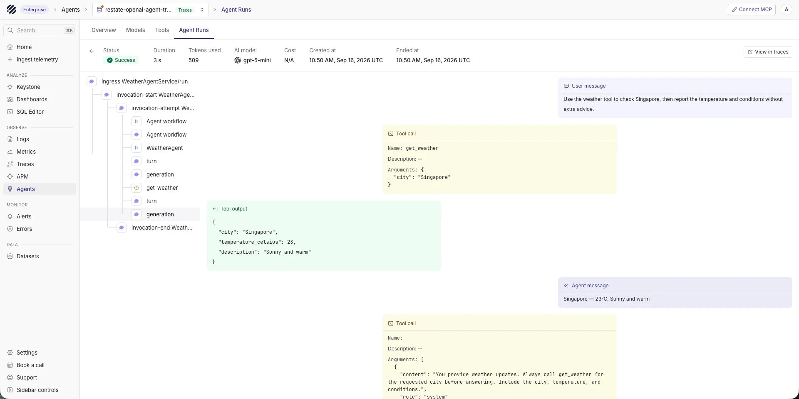

import { Step, Steps } from 'fumadocs-ui/components/steps';

[Restate](https://restate.dev/) journals model calls and tool operations so interrupted agents can resume without repeating completed work. Parseable receives Restate runtime spans and OpenInference spans from the OpenAI Agents SDK in one trace.

## What the integration captures

- Restate ingress, invocation, retry, and journal spans
- OpenAI Agents workflow, agent, turn, and generation spans
- Tool calls and their arguments, results, and duration
- Model names, prompts, responses, token usage, and errors

`RestateTracer` assigns Restate's active invocation context to each OpenInference span. Parseable renders the complete execution as one trace.

## Prerequisites

- A running [Parseable](https://parseable.com/) instance
- Python 3.11 or later
- The [Restate Server and CLI](https://docs.restate.dev/develop/local_dev)
- An OpenAI API key

## Set up Restate with Parseable

<Steps>
<Step>

### Install dependencies

```bash
pip install \
  restate-sdk \
  openai-agents \
  openinference-instrumentation-openai-agents \
  opentelemetry-sdk \
  opentelemetry-exporter-otlp-proto-http \
  hypercorn
```

</Step>
<Step>

### Configure the environment

Set the Parseable connection values and OpenAI API key:

```bash
export PARSEABLE_URL="https://<your-parseable-host>"
export PARSEABLE_API_KEY="<your-parseable-api-key>"
export PARSEABLE_STREAM="restate-openai-agent-traces"
export OPENAI_API_KEY="<your-openai-api-key>"
```

Parseable creates `restate-openai-agent-traces` when it receives the first spans.

</Step>
<Step>

### Define the agent

Create `agent.py`:

```python
import restate
from agents import Agent
from restate.ext.openai import (
    DurableRunner,
    durable_function_tool,
    restate_context,
)


@durable_function_tool
async def get_weather(city: str) -> dict:
    """Get the current weather for a city."""

    async def call_weather_api(city: str) -> dict:
        return {
            "city": city,
            "temperature_celsius": 23,
            "description": "Sunny and warm",
        }

    return await restate_context().run_typed(
        "Get weather", call_weather_api, city=city
    )


weather_agent = Agent(
    name="WeatherAgent",
    instructions=(
        "Provide weather updates. Call get_weather before answering. "
        "Include the city, temperature, and conditions."
    ),
    tools=[get_weather],
)

agent_service = restate.Service("agent")


@agent_service.handler()
async def run(_ctx: restate.Context, message: str) -> str:
    result = await DurableRunner.run(weather_agent, message)
    return result.final_output
```

`durable_function_tool` journals the tool call. `restate_context().run_typed()` records the external operation so Restate can recover it without running it twice.

</Step>
<Step>

### Enable Parseable tracing

Create `telemetry.py`:

```python
import os

from agents import set_trace_processors
from openinference.instrumentation import OITracer, TraceConfig
from openinference.instrumentation.openai_agents._processor import (
    OpenInferenceTracingProcessor,
)
from opentelemetry import trace as trace_api
from opentelemetry.exporter.otlp.proto.http.trace_exporter import OTLPSpanExporter
from opentelemetry.sdk.resources import Resource
from opentelemetry.sdk.trace import TracerProvider
from opentelemetry.sdk.trace.export import BatchSpanProcessor
from restate.ext.tracing import RestateTracer


parseable_url = os.environ["PARSEABLE_URL"].rstrip("/")
provider = TracerProvider(
    resource=Resource.create(
        {"service.name": "restate-openai-agents-demo"}
    )
)
provider.add_span_processor(
    BatchSpanProcessor(
        OTLPSpanExporter(
            endpoint=f"{parseable_url}/v1/traces",
            headers={
                "Authorization": f"Bearer {os.environ['PARSEABLE_API_KEY']}",
                "X-P-Stream": os.getenv(
                    "PARSEABLE_STREAM", "restate-openai-agent-traces"
                ),
            },
        )
    )
)
trace_api.set_tracer_provider(provider)

tracer = OITracer(
    RestateTracer(trace_api.get_tracer("openinference.openai_agents")),
    config=TraceConfig(),
)
set_trace_processors([OpenInferenceTracingProcessor(tracer)])
```

Add the following to the end of `agent.py`. Importing `telemetry` before creating the Restate application initializes the exporter and connects OpenInference spans to the active Restate invocation.

```python
import asyncio

import hypercorn.asyncio
from hypercorn.config import Config

import telemetry

app = restate.app(services=[agent_service])


async def serve() -> None:
    config = Config()
    config.bind = ["0.0.0.0:9080"]
    await hypercorn.asyncio.serve(app, config)


if __name__ == "__main__":
    try:
        asyncio.run(serve())
    finally:
        telemetry.provider.shutdown()
```

The Python process exports the OpenInference spans. Restate Server exports ingress, invocation, retry, and recovery spans. Start Restate with the same Parseable dataset and authorization header:

```bash
export RESTATE_TRACING_HEADERS__AUTHORIZATION="Bearer ${PARSEABLE_API_KEY}"
export RESTATE_TRACING_HEADERS__X_P_STREAM="$PARSEABLE_STREAM"

restate-server \
  --tracing-endpoint "otlp+${PARSEABLE_URL%/}/v1/traces" \
  --tracing-filter "restate=info"
```

Send both exporters to the same dataset. Separate datasets break the trace hierarchy in Parseable.

</Step>
<Step>

### Run the agent

Start the application on port `9080`:

```bash
python agent.py
```

Register it with Restate:

```bash
restate deployments add --yes http://localhost:9080
```

Invoke the agent through Restate:

```bash
curl --fail-with-body \
  http://localhost:8080/agent/run \
  --json '"What is the weather in Bengaluru?"'
```

</Step>
</Steps>

## View the run in Parseable

After the first invocation, add the `agent-observability` tag to `restate-openai-agent-traces` from the dataset settings. Open **Agents** and select the dataset to inspect prompts, responses, model details, token counts, tool calls, and duration.



## Production configuration

Route both OTLP streams through an OpenTelemetry Collector in production. Configure a sending queue and retry policy to handle temporary network failures. Keep the Python service and Restate Server on the same trace dataset.

Disable prompt and response capture when those fields may contain sensitive data. An OpenTelemetry Collector processor can remove specific attributes before export.

## Troubleshooting

- **Traces appear but the dataset is missing from Agents:** Add the `agent-observability` dataset tag. The Agents page only lists tagged datasets.
- **Only Restate spans appear:** Import `telemetry` before creating the Restate application and confirm that `OpenInferenceTracingProcessor` is registered.
- **Only agent spans appear:** Start Restate with `--tracing-endpoint`. Set `RESTATE_TRACING_HEADERS__AUTHORIZATION` and `RESTATE_TRACING_HEADERS__X_P_STREAM`.
- **The hierarchy splits across traces:** Wrap the OpenInference tracer with `RestateTracer` and send both exporters to the same dataset.
- **Duplicate workflow spans appear:** The OpenAI Agents SDK emits a workflow trace and a task span with the default `Agent workflow` name. They represent separate instrumentation levels.
- **The last spans are missing:** Call `provider.shutdown()` when a short-lived process exits so `BatchSpanProcessor` can flush buffered spans.

## Next steps

- Explore runs in [Agent Observability](/user-guide/agent-observability)
- Configure an [OpenTelemetry Collector](/ingest-data/logging-agents/otel-collector)
- Instrument another [OpenAI application](/ingest-data/ai-agents/openai)
