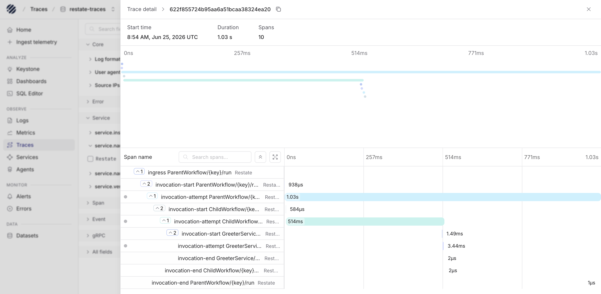
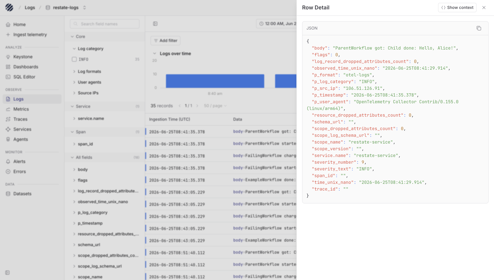

[Restate](https://restate.dev/) is a durable execution engine that handles retries, state, and orchestration for workflows and services. Restate exports **traces** natively via OTLP. Service **logs** are emitted through the OpenTelemetry Logs SDK in your application code. Both signals flow through a single OpenTelemetry Collector that authenticates against Parseable and routes each signal to its own stream.

## Architecture

```
Restate server  ──OTLP HTTP──▶  OTel Collector :4318  ──▶  Parseable  restate-traces
Node.js service ──OTLP HTTP──▶  OTel Collector :4318  ──▶  Parseable  restate-logs
```

The OTel Collector is the single point that holds Parseable credentials. Neither the Restate server nor the application process needs auth configuration.

<Callout type="info">
  Restate exports **traces only**: server-side spans covering ingress, invocation lifecycle, and retry attempts. It does not export metrics or logs via OTLP. Application logs must be instrumented separately using the OpenTelemetry Logs SDK.
</Callout>

## Prerequisites

- Restate Server `1.7.0` or later
- Node.js `20+` and `@restatedev/restate-sdk`
- Docker (for the OTel Collector)
- A reachable Parseable instance

## Step 1: Run the OTel Collector

Create `otel-collector-config.yaml`:

```yaml
receivers:
  otlp:
    protocols:
      http:
        endpoint: 0.0.0.0:4318

processors:
  batch:

exporters:
  otlp_http/traces:
    endpoint: https://<parseable-host>
    headers:
      Authorization: "Basic <base64 user:pass>"
      X-P-Stream: "restate-traces"
      X-P-Log-Source: "otel-traces"

  otlp_http/logs:
    endpoint: https://<parseable-host>
    headers:
      Authorization: "Basic <base64 user:pass>"
      X-P-Stream: "restate-logs"
      X-P-Log-Source: "otel-logs"

service:
  pipelines:
    traces:
      receivers: [otlp]
      processors: [batch]
      exporters: [otlp_http/traces]
    logs:
      receivers: [otlp]
      processors: [batch]
      exporters: [otlp_http/logs]
```

Create `docker-compose.yml`:

```yaml
services:
  otel-collector:
    image: otel/opentelemetry-collector-contrib:latest
    command: ["--config=/etc/otel/config.yaml"]
    volumes:
      - ./otel-collector-config.yaml:/etc/otel/config.yaml:ro
    ports:
      - "4318:4318"
    restart: unless-stopped
```

Start the collector:

```bash
docker compose up -d
```

## Step 2: Start Restate with tracing

<Callout type="warn">
  The `[tracing]` TOML section is silently ignored by `restate-server`. Use the `RESTATE_TRACING_ENDPOINT` environment variable instead.
</Callout>

```bash
RESTATE_TRACING_ENDPOINT=otlp+http://localhost:4318/v1/traces \
  restate-server
```

The `otlp+http://` scheme prefix forces HTTP/1 transport. Without it, Restate defaults to gRPC, which requires a separate port (`4317`) and uses the HTTP/2 framing that some Parseable deployments do not accept.

Save this as a start script (`start-restate.sh`):

```bash
#!/bin/sh
RESTATE_TRACING_ENDPOINT=otlp+http://localhost:4318/v1/traces \
  restate-server
```

## Step 3: Instrument service logs

Install the OTel Logs SDK:

```bash
npm install @opentelemetry/sdk-logs \
            @opentelemetry/exporter-logs-otlp-http \
            @opentelemetry/api-logs \
            @opentelemetry/resources \
            @opentelemetry/semantic-conventions
```

Create `src/telemetry.ts`:

```ts
import { LoggerProvider, BatchLogRecordProcessor } from "@opentelemetry/sdk-logs";
import { OTLPLogExporter } from "@opentelemetry/exporter-logs-otlp-http";
import { resourceFromAttributes } from "@opentelemetry/resources";
import { ATTR_SERVICE_NAME } from "@opentelemetry/semantic-conventions";
import { logs } from "@opentelemetry/api-logs";

const exporter = new OTLPLogExporter({
  url: "http://localhost:4318/v1/logs",
});

const provider = new LoggerProvider({
  resource: resourceFromAttributes({ [ATTR_SERVICE_NAME]: "restate-service" }),
  processors: [new BatchLogRecordProcessor(exporter)],
});

logs.setGlobalLoggerProvider(provider);

export const logger = logs.getLogger("restate-service");

export async function shutdownTelemetry() {
  await provider.shutdown();
}
```

Use the logger in your Restate handlers instead of `console.log`:

```ts
import * as restate from "@restatedev/restate-sdk";
import { logger } from "./telemetry.js";
import { SeverityNumber } from "@opentelemetry/api-logs";

const exampleWorkflow = restate.workflow({
  name: "ExampleWorkflow",
  handlers: {
    run: async (ctx: restate.WorkflowContext, name: string): Promise<string> => {
      const greeting = await ctx.serviceClient(greeterSvc).greet(name);

      await ctx.run("emit-completed", async () => {
        logger.emit({
          severityNumber: SeverityNumber.INFO,
          severityText: "INFO",
          body: `ExampleWorkflow done: ${greeting}`,
          attributes: { workflow: "ExampleWorkflow", name },
        });
      });

      return greeting;
    },
  },
});
```

<Callout type="info">
  Wrap `logger.emit()` inside `ctx.run()` to make log emission durable and replay-safe. Restate replays handler code on retry; calls outside `ctx.run()` execute on every replay and produce duplicate log records.
</Callout>

## Step 4: Register and run

Start the service:

```bash
npx tsx src/app.ts
```

Register the deployment:

```bash
restate deployments register http://localhost:9080
```

Invoke a workflow:

```bash
restate workflow submit ExampleWorkflow my-id '"World"'
```

## Verify

Check the collector is forwarding both signals:

```bash
docker compose logs otel-collector | grep "Preparing to make HTTP request"
```

You should see requests to both `/v1/traces` and `/v1/logs`.

Query Parseable:

```sql
-- Recent traces
SELECT p_timestamp, name, trace_id, span_id, duration_nano
FROM "restate-traces"
WHERE p_timestamp > now() - INTERVAL '5 minutes'
ORDER BY p_timestamp DESC
LIMIT 20;
```

```sql
-- Service logs
SELECT p_timestamp, body, severity_text
FROM "restate-logs"
WHERE p_timestamp > now() - INTERVAL '5 minutes'
ORDER BY p_timestamp DESC
LIMIT 20;
```

## What gets captured

### Traces (`restate-traces`)

These are **Restate server spans** exported via `RESTATE_TRACING_ENDPOINT`. The server emits one trace per invocation:

| Span | Description |
|------|-------------|
| `ingress` | Root span for the HTTP entry point where the request was accepted |
| `invocation` | Logical invocation; child of `ingress` |
| `invocation_attempt` | One span per execution attempt; retries produce new attempt spans |
| `invocation_end` | Marks completion (success, failure, or cancellation) |

`ctx.run()` blocks, `ctx.sleep()`, and outbound service calls appear as **events on the `invocation_attempt` span**, not as child spans. Attempt spans carry `restate.invocation.id`, `restate.service.name`, and `restate.handler.name` as attributes.

In Parseable, the trace stream gives you a timeline of Restate invocations and the span attributes attached to each attempt. This is where you can inspect duration, invocation metadata, and retry behavior for a workflow.



### Logs (`restate-logs`)

Logs are application-defined. The OTel SDK attaches `service.name` and any attributes passed to `logger.emit()`. A minimal schema to adopt:

| Field | Notes |
|-------|-------|
| `body` | Human-readable message |
| `severity_text` | `INFO`, `WARN`, `ERROR` |
| `service.name` | Set in `resourceFromAttributes` |
| `workflow` | Add as attribute for cross-signal correlation |

In the logs stream, Parseable shows the emitted application records along with severity, service attributes, and workflow attributes. This makes it easier to connect what the service wrote with the Restate invocation you are investigating.



## Troubleshooting

- **No traces in collector**: The `[tracing]` TOML key is silently ignored. Confirm `RESTATE_TRACING_ENDPOINT` is set in the environment, not in the config file.
- **gRPC connection refused or FRAME_SIZE_ERROR**: Remove any `grpc://` or bare `http://` prefix. Use `otlp+http://localhost:4318/v1/traces` to force HTTP/1.
- **Duplicate log records on retry**: `logger.emit()` calls must be inside `ctx.run()`. Code outside `ctx.run()` re-executes on every Restate replay.
- **Collector deprecation warning `"otlphttp" alias is deprecated`**: Use `otlp_http/` as the exporter key (underscore, not camel-case). Both work; `otlp_http/` suppresses the warning.
