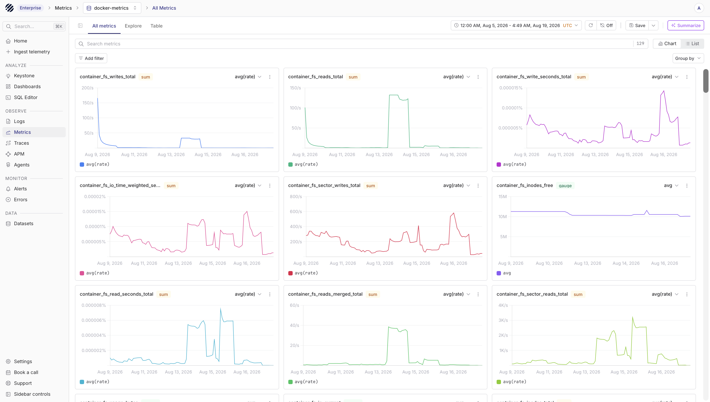
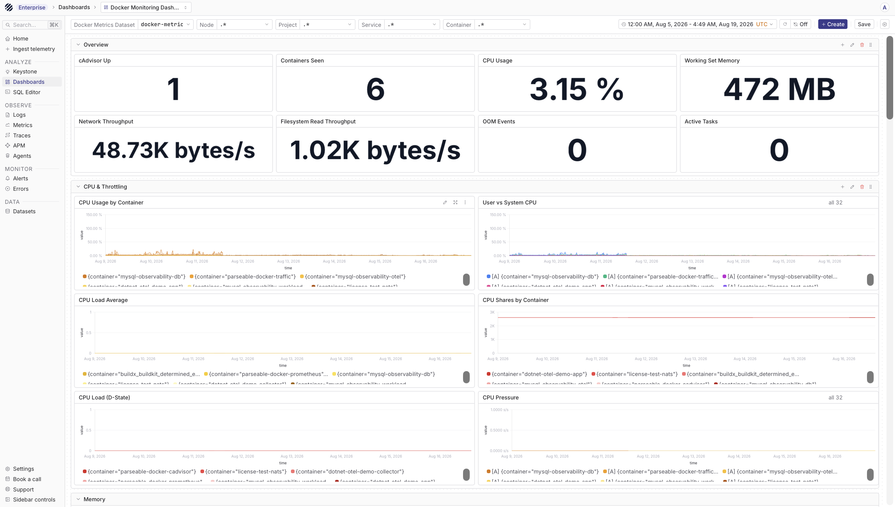
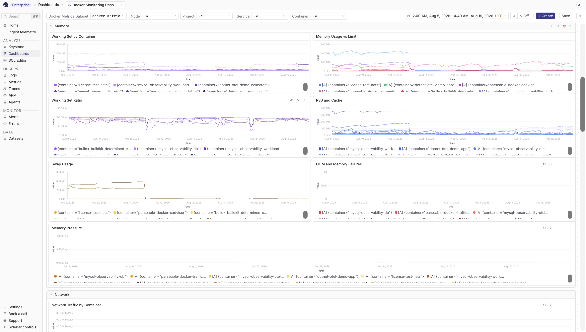
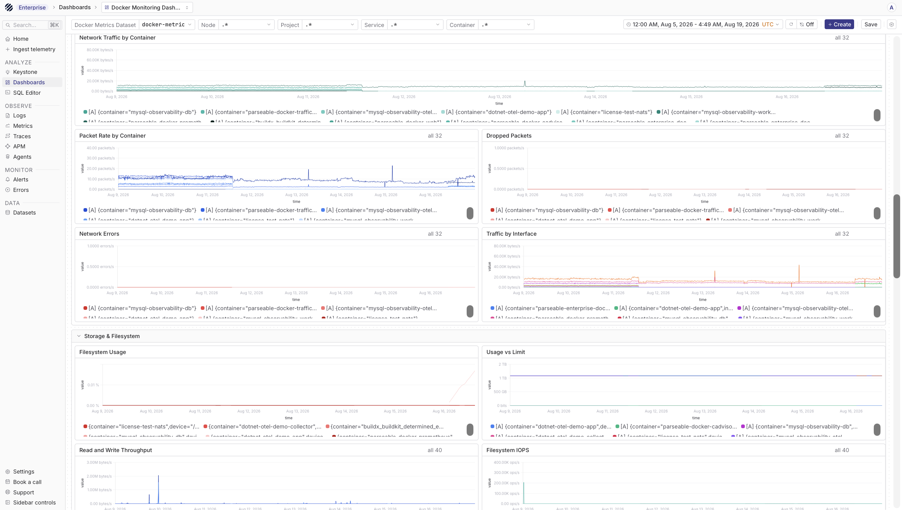
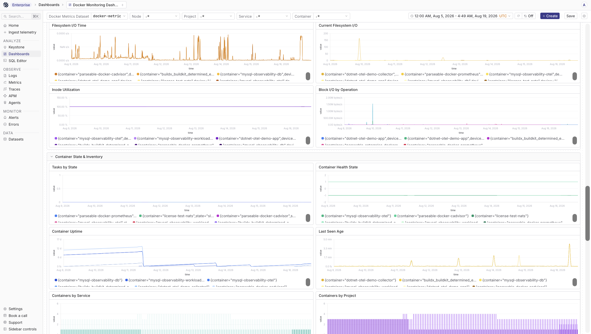

## Overview

Collect Docker container logs and cAdvisor metrics in Parseable, so you can see what your containers are writing and how they are using CPU, memory, network, storage, and other runtime resources. Metrics are collected from cAdvisor and forwarded through Prometheus Remote Write, while logs can move through Fluent Bit or a direct HTTP push.

Along with the raw logs and metrics, you can attach Docker metadata such as container, image, project, and service. Once the data starts flowing, you can also import the Docker Monitoring dashboard to see the same signals in a ready-made view.

## Prerequisites

- Docker installed
- Parseable instance accessible
- Parseable API key with ingest access
- Prometheus and cAdvisor for metrics
- Fluent Bit or a logging driver for logs

## Collect Docker metrics

cAdvisor exports container and machine metrics in Prometheus format. Prometheus scrapes cAdvisor and forwards the samples to Parseable through Prometheus Remote Write.

```text
Docker Engine -> cAdvisor :8080 -> Prometheus -> Parseable /v1/prometheus/write
                                               (docker-metrics dataset)
```

### Configure Prometheus

Create `prometheus.yml`:

```yaml
global:
  scrape_interval: 15s

scrape_configs:
  - job_name: cadvisor
    static_configs:
      - targets: ["cadvisor:8080"]
        labels:
          node: docker-host
    metric_relabel_configs:
      - source_labels: [name]
        target_label: container
      - source_labels: [container_label_com_docker_compose_project]
        target_label: project
      - source_labels: [container_label_com_docker_compose_service]
        target_label: service

remote_write:
  - url: "https://<parseable-ingestor>/v1/prometheus/write"
    headers:
      X-API-Key: <parseable-api-key>
      X-P-Stream: docker-metrics
      X-P-Log-Source: otel-metrics
```

`X-API-Key` authorizes the write to Parseable. `X-P-Stream` selects the Parseable dataset. Keep `X-P-Log-Source` set to `otel-metrics`. Change the `node` label when monitoring more than one Docker host.

The metric relabel rules expose the cAdvisor `name` label as `container` and shorten Docker Compose's project and service label names. These names match the dashboard variables and queries.

### Run cAdvisor and Prometheus

Create `docker-compose.yml` beside `prometheus.yml`:

```yaml
services:
  cadvisor:
    image: ghcr.io/google/cadvisor:v0.60.5
    container_name: cadvisor
    privileged: true
    ports:
      - "8080:8080"
    volumes:
      - /:/rootfs:ro
      - /sys:/sys:ro
      - /var/run/docker.sock:/var/run/docker.sock:ro
    restart: unless-stopped

  prometheus:
    image: prom/prometheus:latest
    container_name: prometheus
    command:
      - --config.file=/etc/prometheus/prometheus.yml
    ports:
      - "9090:9090"
    volumes:
      - ./prometheus.yml:/etc/prometheus/prometheus.yml:ro
    depends_on:
      - cadvisor
    restart: unless-stopped
```

Start both services:

```bash
docker compose up -d
```

Open `http://localhost:9090/targets` and confirm that the `cadvisor` target is **UP**. You can also check cAdvisor directly:

```bash
curl http://localhost:8080/metrics
```

In Parseable, select the `docker-metrics` dataset and run a PromQL query such as:

```text
up{job="cadvisor"}
```

Common cAdvisor families include `container_cpu_usage_seconds_total`, `container_memory_working_set_bytes`, `container_network_receive_bytes_total`, `container_fs_usage_bytes`, and `container_last_seen`.

Once the samples are ingested, open the `docker-metrics` dataset in Parseable. You should be able to see the cAdvisor metric families, filter by labels such as container or node, and move into PromQL when you want to inspect a specific series.



## Collect Docker logs

Docker logs can be sent to Parseable in a few different ways. Fluent Bit is the most common path because it can receive logs from Docker's Fluentd logging driver or tail Docker's JSON log files directly.

### Option 1: Fluent Bit sidecar

Deploy Fluent Bit alongside your containers.

#### Docker Compose example

```yaml
version: '3.8'
services:
  app:
    image: your-app:latest
    logging:
      driver: fluentd
      options:
        fluentd-address: localhost:24224
        tag: app.logs

  fluent-bit:
    image: fluent/fluent-bit:latest
    ports:
      - "24224:24224"
    volumes:
      - ./fluent-bit.yaml:/fluent-bit/etc/fluent-bit.yaml
    command: ["/fluent-bit/bin/fluent-bit", "-c", "/fluent-bit/etc/fluent-bit.yaml"]
```

#### Fluent Bit configuration

```yaml
service:
  flush: 5
  log_level: info

pipeline:
  inputs:
    - name: forward
      listen: 0.0.0.0
      port: 24224

  outputs:
    - name: http
      match: '*'
      host: parseable
      port: 8000
      uri: /api/v1/ingest
      format: json
      header: X-API-Key <parseable-api-key>
      header: X-P-Stream docker-logs
```

### Option 2: Docker log driver

Use Docker's built-in logging drivers.

#### Fluentd Driver

```yaml
version: '3.8'
services:
  app:
    image: your-app:latest
    logging:
      driver: fluentd
      options:
        fluentd-address: "fluent-bit:24224"
        fluentd-async: "true"
        tag: "docker.{{.Name}}"
```

#### JSON file driver with tail

Collect logs from Docker's default JSON file driver:

```yaml
# fluent-bit.yaml
service:
  flush: 5
  log_level: info

pipeline:
  inputs:
    - name: tail
      path: /var/lib/docker/containers/*/*.log
      parser: docker
      tag: docker.*
      refresh_interval: 5
      mem_buf_limit: 5MB
      skip_long_lines: on

  parsers:
    - name: docker
      format: json
      time_key: time
      time_format: "%Y-%m-%dT%H:%M:%S.%L"

  filters:
    - name: modify
      match: docker.*
      add: source docker

  outputs:
    - name: http
      match: '*'
      host: parseable
      port: 8000
      uri: /api/v1/ingest
      format: json
      header: X-API-Key <parseable-api-key>
      header: X-P-Stream docker-logs
```

#### Docker Compose with log collection

```yaml
version: '3.8'
services:
  fluent-bit:
    image: fluent/fluent-bit:latest
    volumes:
      - /var/lib/docker/containers:/var/lib/docker/containers:ro
      - /var/run/docker.sock:/var/run/docker.sock:ro
      - ./fluent-bit.yaml:/fluent-bit/etc/fluent-bit.yaml
    command: ["/fluent-bit/bin/fluent-bit", "-c", "/fluent-bit/etc/fluent-bit.yaml"]

  parseable:
    image: quay.io/parseablehq/parseable:latest
    ports:
      - "8000:8000"
    environment:
      - P_USERNAME=admin
      - P_PASSWORD=admin
```

### Option 3: Direct HTTP logging

Send logs directly from your application.

#### Python example

```python
import logging
import requests
import os
from datetime import datetime

class ParseableHandler(logging.Handler):
    def __init__(self, url, dataset, api_key):
        super().__init__()
        self.url = f"{url}/api/v1/ingest"
        self.dataset = dataset
        self.api_key = api_key
        self.buffer = []
        self.batch_size = 100

    def emit(self, record):
        log_entry = {
            "timestamp": datetime.utcnow().isoformat() + "Z",
            "level": record.levelname.lower(),
            "message": self.format(record),
            "logger": record.name,
            "container": os.environ.get("HOSTNAME", "unknown")
        }
        self.buffer.append(log_entry)
        
        if len(self.buffer) >= self.batch_size:
            self.flush()

    def flush(self):
        if not self.buffer:
            return
        try:
            requests.post(
                self.url,
                json=self.buffer,
                headers={
                    "X-API-Key": self.api_key,
                    "X-P-Stream": self.dataset,
                }
            )
        except Exception as e:
            print(f"Failed to send logs: {e}")
        finally:
            self.buffer = []

# Usage
handler = ParseableHandler(
    url="http://parseable:8000",
    dataset="app-logs",
    api_key=os.environ["PARSEABLE_API_KEY"]
)
logging.getLogger().addHandler(handler)
```

### Option 4: Docker events

Collect Docker daemon events.

#### Event collector script

```python
#!/usr/bin/env python3
import docker
import requests
import os
from datetime import datetime

PARSEABLE_URL = "http://parseable:8000"
PARSEABLE_API_KEY = os.environ["PARSEABLE_API_KEY"]
STREAM = "docker-events"

client = docker.from_env()

for event in client.events(decode=True):
    log_entry = {
        "timestamp": datetime.utcnow().isoformat() + "Z",
        "event_type": event.get("Type"),
        "action": event.get("Action"),
        "actor_id": event.get("Actor", {}).get("ID"),
        "actor_attributes": event.get("Actor", {}).get("Attributes"),
        "status": event.get("status"),
        "from": event.get("from")
    }
    
    try:
        requests.post(
            f"{PARSEABLE_URL}/api/v1/ingest",
            json=[log_entry],
            headers={
                "X-API-Key": PARSEABLE_API_KEY,
                "X-P-Stream": STREAM,
            }
        )
    except Exception as e:
        print(f"Error: {e}")
```

## Container Labels

Add metadata using Docker labels:

```yaml
version: '3.8'
services:
  app:
    image: your-app:latest
    labels:
      - "logging.parseable.dataset=app-logs"
      - "logging.parseable.service=my-app"
      - "logging.parseable.environment=production"
```

### Use Labels in Fluent Bit

```yaml
filters:
  - name: modify
    match: docker.*
    add: service ${LABEL_logging.parseable.service}
    add: environment ${LABEL_logging.parseable.environment}
```

## Querying Docker Logs

```sql
-- Recent container logs
SELECT timestamp, container_name, message, level
FROM "docker-logs"
ORDER BY timestamp DESC
LIMIT 100

-- Error logs by container
SELECT container_name, COUNT(*) as error_count
FROM "docker-logs"
WHERE level = 'error'
  AND timestamp > NOW() - INTERVAL '1 hour'
GROUP BY container_name
ORDER BY error_count DESC

-- Container events
SELECT timestamp, event_type, action, actor_id
FROM "docker-events"
ORDER BY timestamp DESC
LIMIT 50
```

## Docker Monitoring dashboard

The reusable [Docker Monitoring dashboard](https://github.com/parseablehq/dashboards/tree/main/docker-monitoring) is available in the [parseablehq/dashboards](https://github.com/parseablehq/dashboards) repository.

Import `docker-monitoring-mixed.json`, then set **Docker Metrics Dataset** to the dataset configured in `X-P-Stream`. The default is `docker-metrics`. The dashboard includes container CPU, memory, network, storage, task state, health, inventory, cAdvisor scrape health, and metric inventory.

The Project and Service filters are populated from Docker Compose labels. Containers started outside Compose can still be filtered by Node and Container.









## Best Practices

1. **Use Labels** - Add metadata for filtering
2. **Identify Hosts** - Assign a stable `node` label to each cAdvisor scrape target
3. **Buffer Logs** - Batch logs for efficiency
4. **Handle Backpressure** - Configure memory limits
5. **Monitor Collectors** - Watch Prometheus, cAdvisor, and Fluent Bit health
6. **Rotate Logs** - Configure Docker log rotation

## Troubleshooting

### Missing Logs

1. Verify logging driver is configured
2. Check Fluent Bit is running
3. Verify Parseable endpoint is accessible
4. Check container permissions

### Missing Metrics

1. Open the Prometheus Targets page and confirm that cAdvisor is **UP**
2. Check `docker compose logs cadvisor prometheus` for scrape or remote-write errors
3. Verify that Prometheus can reach `/v1/prometheus/write` on the Parseable ingestor
4. Confirm the `X-P-Stream: docker-metrics` and `X-P-Log-Source: otel-metrics` headers
5. Confirm that the cAdvisor container can read the Docker runtime paths mounted in the Compose file

Some metric families are conditional. Health-state metrics require Docker health checks, project and service labels require Docker Compose, and resource-limit metrics require limits on the container.

### High Memory Usage

1. Configure `mem_buf_limit` in Fluent Bit
2. Enable Docker log rotation
3. Reduce batch sizes

## Next Steps

- Configure [Kubernetes](/ingest-data/containers/kubernetes) for orchestration
- Set up [alerts](/user-guide/alerting) for container events
- Import the [Docker Monitoring dashboard](https://github.com/parseablehq/dashboards/tree/main/docker-monitoring)
