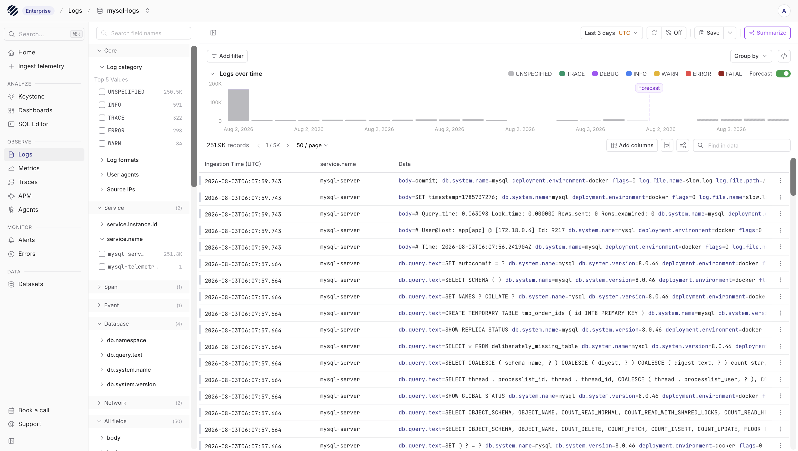
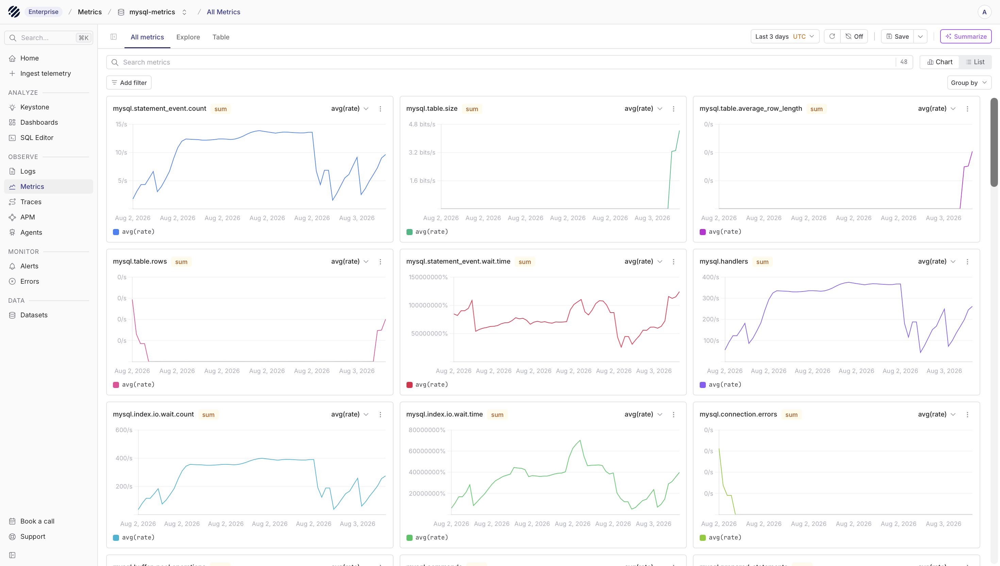
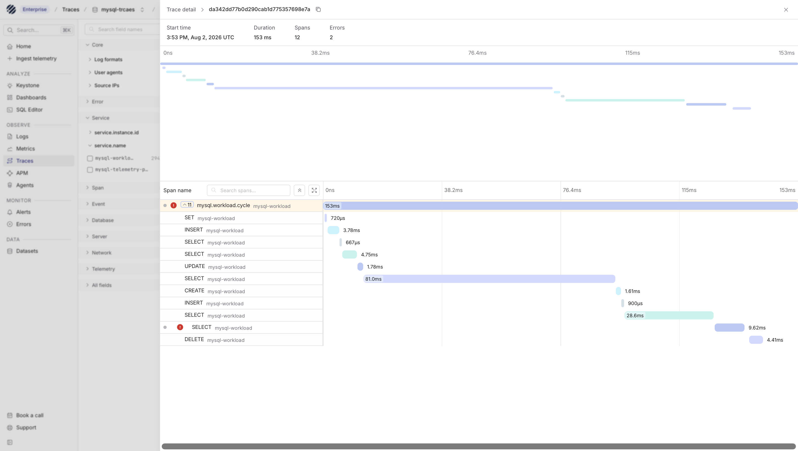
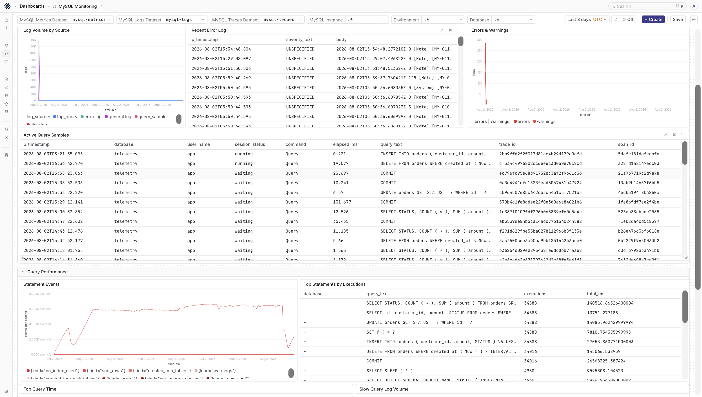
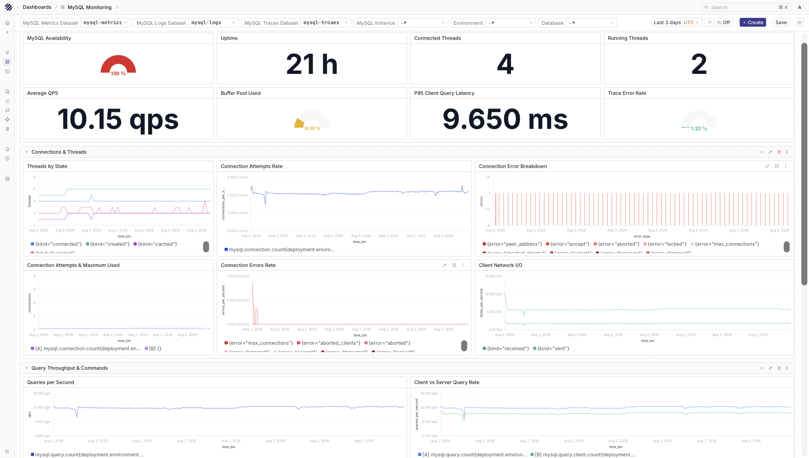
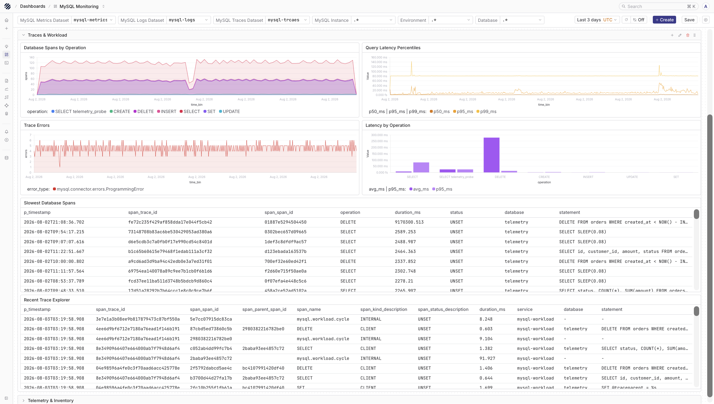

MySQL is usually not the only thing you debug. A slow checkout, a failed job, or a sudden spike in database load usually sits somewhere between the application, the database client, and the MySQL server itself. Parseable helps you bring those signals together so you can move from server logs to metrics to application traces without changing tools.

This guide uses the OpenTelemetry Collector Contrib distribution. The MySQL receiver collects database metrics and optional query events, the `filelog` receiver tails MySQL log files, and the OTLP receiver accepts traces from the application that talks to MySQL.

## What the integration collects

| Signal | Source | Parseable dataset |
|---|---|---|
| Logs | MySQL error and slow query logs, plus optional query sample and top query events from the MySQL receiver | `mysql-logs` |
| Metrics | OpenTelemetry MySQL receiver | `mysql-metrics` |
| Traces | Application-side OpenTelemetry spans from the service or workload that calls MySQL | `mysql-traces` |

The MySQL receiver queries `SHOW GLOBAL STATUS`, InnoDB tables, `information_schema`, and `performance_schema`. Some metric families only appear when the matching MySQL feature is active. For example, replica metrics need replication, and statement level metrics need Performance Schema consumers to be enabled.

<Callout type="info">
The MySQL server does not produce distributed traces by itself. Use OpenTelemetry instrumentation in the application or workload that executes SQL queries, then send those spans to the Collector.
</Callout>

## Prerequisites

- MySQL or MariaDB version supported by the [OpenTelemetry MySQL receiver](https://github.com/open-telemetry/opentelemetry-collector-contrib/tree/main/receiver/mysqlreceiver#supported-database-versions)
- OpenTelemetry Collector Contrib
- A Parseable ingestor endpoint and API key
- Read access to the MySQL error and slow query log files if you want file logs
- Application instrumentation if you want traces in `mysql-traces`

## Configure MySQL

Start by enabling the Performance Schema settings used by the receiver for statement summaries, query samples, and wait timing. The exact file location depends on how MySQL is installed, but the settings usually live under the `[mysqld]` section of your MySQL configuration.

```ini
[mysqld]
performance_schema=ON
performance-schema-consumer-events-statements-current=ON
performance-schema-consumer-events-statements-history=ON
performance-schema-consumer-events-statements-history-long=ON
performance-schema-consumer-events-waits-current=ON
max_digest_length=4096
performance_schema_max_digest_length=4096
performance_schema_max_sql_text_length=4096

slow_query_log=ON
slow_query_log_file=/var/lib/mysql/slow.log
long_query_time=0.05

log_error=/var/lib/mysql/error.log
log_error_verbosity=3
```

Restart MySQL after changing startup options. If you cannot change the server configuration, you can still enable the required consumers at runtime:

```sql
UPDATE performance_schema.setup_consumers
SET ENABLED = 'YES'
WHERE NAME IN (
  'events_statements_current',
  'events_statements_history',
  'events_statements_history_long',
  'events_waits_current'
);
```

Next, create a monitoring user for the Collector. Replace `telemetry` with the application schema that the receiver should inspect.

```sql
CREATE USER IF NOT EXISTS 'otel'@'%' IDENTIFIED BY 'replace-me';

GRANT PROCESS, REPLICATION CLIENT ON *.* TO 'otel'@'%';
GRANT SELECT ON performance_schema.* TO 'otel'@'%';
GRANT SELECT ON telemetry.* TO 'otel'@'%';
GRANT UPDATE ON performance_schema.setup_consumers TO 'otel'@'%';

FLUSH PRIVILEGES;
```

The `SELECT` grant on `performance_schema` is required for query samples. The `UPDATE` grant lets the receiver re-enable `events_waits_current` after reconnects. If your database team does not want the Collector to have that permission, enable the consumer through server configuration instead.

<Callout type="warning">
Slow query logs, query samples, top query events, and traces can contain SQL text. Redact sensitive values in the application when needed, and keep Parseable access scoped to the teams that should inspect this data.
</Callout>

## Configure the Collector

Mount the MySQL log directory read-only into the Collector and create `otel-collector.yaml`. The example below expects `MYSQL_PASSWORD`, `PARSEABLE_ENDPOINT`, and `PARSEABLE_API_KEY` in the Collector environment.

```yaml
receivers:
  otlp:
    protocols:
      grpc:
        endpoint: 0.0.0.0:4317
      http:
        endpoint: 0.0.0.0:4318

  mysql:
    endpoint: mysql:3306
    username: otel
    password: ${env:MYSQL_PASSWORD}
    database: telemetry
    collection_interval: 10s
    initial_delay: 2s
    tls:
      insecure: true

    statement_events:
      digest_text_limit: 240
      time_limit: 24h
      limit: 250

    query_sample_collection:
      max_rows_per_query: 100

    top_query_collection:
      lookback_time: 120
      max_query_sample_count: 5000
      top_query_count: 100
      collection_interval: 15s

    metrics:
      mysql.client.network.io:
        enabled: true
      mysql.commands:
        enabled: true
      mysql.connection.count:
        enabled: true
      mysql.connection.errors:
        enabled: true
      mysql.joins:
        enabled: true
      mysql.max_used_connections:
        enabled: true
      mysql.query.client.count:
        enabled: true
      mysql.query.count:
        enabled: true
      mysql.query.slow.count:
        enabled: true
      mysql.replica.sql_delay:
        enabled: true
      mysql.replica.time_behind_source:
        enabled: true
      mysql.statement_event.count:
        enabled: true
      mysql.statement_event.wait.time:
        enabled: true
      mysql.table.average_row_length:
        enabled: true
      mysql.table.lock_wait.read.count:
        enabled: true
      mysql.table.lock_wait.read.time:
        enabled: true
      mysql.table.lock_wait.write.count:
        enabled: true
      mysql.table.lock_wait.write.time:
        enabled: true
      mysql.table.rows:
        enabled: true
      mysql.table.size:
        enabled: true
      mysql.table_open_cache:
        enabled: true

    events:
      db.server.query_sample:
        enabled: true
      db.server.top_query:
        enabled: true

    resource_attributes:
      db.system.name:
        enabled: true
      db.system.version:
        enabled: true
      mysql.instance.endpoint:
        enabled: true

  filelog/mysql:
    include:
      - /var/lib/mysql/error.log
      - /var/lib/mysql/slow.log
    start_at: end
    include_file_name: true
    include_file_path: true
    operators:
      - type: add
        field: attributes["db.system.name"]
        value: mysql
      - type: add
        field: attributes["mysql.instance.endpoint"]
        value: mysql:3306

processors:
  memory_limiter:
    check_interval: 1s
    limit_mib: 512
    spike_limit_mib: 128
  resource/mysql:
    attributes:
      - key: service.name
        value: mysql-server
        action: upsert
      - key: deployment.environment.name
        value: production
        action: upsert
  batch:
    timeout: 1s

exporters:
  otlphttp/parseable_logs:
    endpoint: ${env:PARSEABLE_ENDPOINT}
    encoding: json
    headers:
      X-API-Key: "${env:PARSEABLE_API_KEY}"
      X-P-Stream: mysql-logs
      X-P-Log-Source: otel-logs
      Content-Type: application/json

  otlphttp/parseable_metrics:
    endpoint: ${env:PARSEABLE_ENDPOINT}
    encoding: json
    headers:
      X-API-Key: "${env:PARSEABLE_API_KEY}"
      X-P-Stream: mysql-metrics
      X-P-Log-Source: otel-metrics
      Content-Type: application/json

  otlphttp/parseable_traces:
    endpoint: ${env:PARSEABLE_ENDPOINT}
    encoding: json
    headers:
      X-API-Key: "${env:PARSEABLE_API_KEY}"
      X-P-Stream: mysql-traces
      X-P-Log-Source: otel-traces
      Content-Type: application/json

service:
  pipelines:
    logs/mysql:
      receivers: [mysql, filelog/mysql]
      processors: [memory_limiter, resource/mysql, batch]
      exporters: [otlphttp/parseable_logs]
    metrics/mysql:
      receivers: [mysql]
      processors: [memory_limiter, resource/mysql, batch]
      exporters: [otlphttp/parseable_metrics]
    traces/mysql:
      receivers: [otlp]
      processors: [memory_limiter, batch]
      exporters: [otlphttp/parseable_traces]
```

`tls.insecure: true` disables TLS between the Collector and MySQL. This is fine for a trusted local or container network, but production deployments should configure certificate verification.

The logs pipeline receives data from both `filelog/mysql` and `mysql`. That means `mysql-logs` can contain server log lines as well as optional query sample and top query events emitted by the receiver.

## Send application traces

Traces come from the application that calls MySQL. Configure your OpenTelemetry SDK or auto instrumentation to export spans to the Collector:

```bash
OTEL_EXPORTER_OTLP_ENDPOINT=http://otel-collector:4318
OTEL_EXPORTER_OTLP_PROTOCOL=http/protobuf
OTEL_SERVICE_NAME=orders-api
OTEL_RESOURCE_ATTRIBUTES=deployment.environment.name=production,db.system.name=mysql
```

Database spans should include attributes such as `db.system.name=mysql`, `db.namespace`, `db.operation.name`, `server.address`, and `server.port`. The exact attributes depend on the language SDK and database instrumentation you use.

If you want receiver query sample events to carry the same trace ID as an application span, set the MySQL session variable `@traceparent` before executing the query:

```sql
SET @traceparent = '00-<32-hex-trace-id>-<16-hex-span-id>-01';
```

The MySQL receiver reads this value from `performance_schema` and attaches the trace ID and span ID to the query sample log record when available.

## Verify ingestion

Once the Collector starts, check the three datasets in Parseable.

```sql
SELECT count(*) FROM "mysql-logs"
WHERE p_timestamp > NOW() - INTERVAL '10 minutes';
```

```sql
SELECT metric_name, metric_type, metric_unit, count(*) AS points
FROM "mysql-metrics"
WHERE p_timestamp > NOW() - INTERVAL '10 minutes'
GROUP BY metric_name, metric_type, metric_unit
ORDER BY metric_name;
```

```sql
SELECT span_name, count(*) AS spans,
       round(avg(span_duration_ns) / 1000000.0, 3) AS avg_ms
FROM "mysql-traces"
WHERE p_timestamp > NOW() - INTERVAL '10 minutes'
GROUP BY span_name
ORDER BY spans DESC;
```

Metrics can also be queried with Parseable PromQL:

```text
sum(rate(mysql.query.count{"mysql.instance.endpoint"=~".*"}[5m]))
```

## View in Parseable

The logs view is useful when you want to inspect MySQL server messages, slow query records, and query sample events around a problem window.



The metrics view helps you follow query activity, connection count, slow query count, InnoDB behavior, table size, and replication signals.



The traces view shows how the application reached MySQL, which operation ran, and how long that part of the request took.



## Dashboards

The reusable [MySQL Monitoring dashboard](https://github.com/parseablehq/dashboards/tree/main/mysql-monitoring) is available in the [parseablehq/dashboards](https://github.com/parseablehq/dashboards) repository. After importing the template, set the metrics, logs, and traces dataset variables to the names used by your deployment.

Exporter and receiver versions can change metric availability. If a panel is empty, first check which `metric_name` values are present in `mysql-metrics`, then update the query in the dashboard.

The dashboard gives you a ready-made view for MySQL logs, metrics, and traces once the datasets are populated.







## Troubleshooting

- If metrics do not arrive, confirm the Collector is running the Contrib distribution and that the monitoring user can run `SHOW GLOBAL STATUS`.
- If query sample events are missing, confirm `performance_schema` is enabled and the required statement consumers are turned on.
- If file logs are missing, confirm the Collector can read `/var/lib/mysql/error.log` and `/var/lib/mysql/slow.log`.
- If traces are missing, confirm the application sends OTLP data to the Collector and that the traces pipeline exports to `mysql-traces`.
- If Parseable returns `405`, the Collector is usually pointed at the query or UI endpoint instead of the ingestor endpoint.
- If a metric is not present, check whether the matching MySQL feature is active. Some optional receiver metrics only appear when the feature exists in the database.
