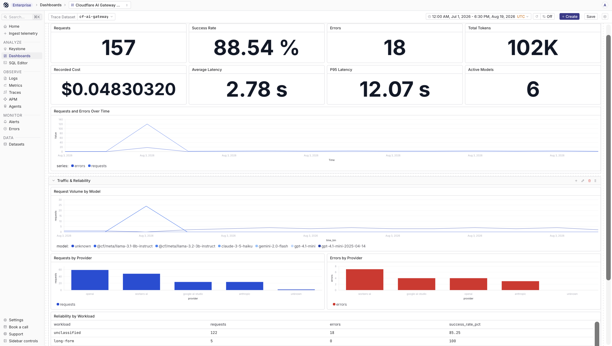
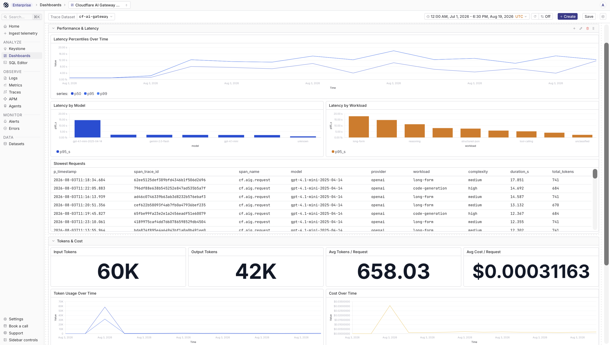
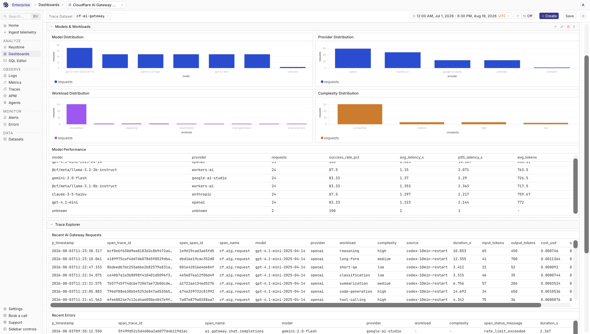

import { Step, Steps } from 'fumadocs-ui/components/steps';

Cloudflare AI Gateway routes requests to model providers and provides caching, rate limiting, retries, and analytics. Its native OpenTelemetry exporter can send gateway traces directly to Parseable, where you can analyze requests, errors, latency, token usage, cost, providers, and models.

## How it works

```text
Application
  |
  v
Cloudflare AI Gateway ----> Model provider
  |
  | OTLP/HTTP traces over HTTPS
  v
Parseable /v1/traces
  |
  v
cf-ai-gateway-traces
```

## Prerequisites

- A Cloudflare account with an AI Gateway
- A Cloudflare API token with AI Gateway Read and Edit permissions
- A model-provider key, Cloudflare unified billing, or Workers AI access
- A running Parseable instance with a publicly reachable HTTPS endpoint
- A Parseable API key with ingest access

## Set up Cloudflare AI Gateway with Parseable

<Steps>
<Step>

### Create the Parseable trace dataset

```bash
export PARSEABLE_URL="https://parseable.example.com"
export PARSEABLE_API_KEY="<parseable-api-key>"
export PARSEABLE_STREAM="cf-ai-gateway-traces"

curl -X PUT "$PARSEABLE_URL/api/v1/logstream/$PARSEABLE_STREAM" \
  -H "X-API-Key: ${PARSEABLE_API_KEY}" \
  -H "X-P-Log-Source: otel-traces" \
  -H "X-P-Telemetry-Type: traces"
```

</Step>
<Step>

### Expose Parseable over HTTPS

Cloudflare must be able to reach the OTLP endpoint over public HTTPS. For production, use a stable HTTPS hostname. For a short local test, run Cloudflare Tunnel on a machine that can reach Parseable:

```bash
cloudflared tunnel --url http://localhost:8010
```

The command prints a temporary URL such as `https://random-words.trycloudflare.com`. Keep the process running and use that hostname in the next step. Quick Tunnel URLs change whenever the tunnel restarts.

</Step>
<Step>

### Add the OpenTelemetry exporter

In the Cloudflare dashboard, open **AI > AI Gateway**, select your gateway, open **Settings**, and add an OpenTelemetry exporter with these values:

| Setting | Value |
| --- | --- |
| Endpoint | `https://parseable.example.com/v1/traces` |
| Format | JSON |
| `X-API-Key` | Your Parseable API key |
| `X-P-Stream` | `cf-ai-gateway-traces` |
| `X-P-Log-Source` | `otel-traces` |

Leave the exporter's **Authorization** field empty when authenticating with `X-API-Key`. Do not configure both authentication methods for the same Parseable endpoint.

When using a Quick Tunnel, replace `https://parseable.example.com` with its `https://...trycloudflare.com` URL.

</Step>
<Step>

### Configure a model provider

Cloudflare AI Gateway supports unified billing, bring-your-own-key (BYOK), and credentials supplied with each request. For BYOK, enable authenticated gateway access, then add the provider key under **Provider Keys** in the gateway settings.

Keep the Cloudflare gateway token and provider key separate. Applications authenticate to an authenticated gateway with `cf-aig-authorization`; Cloudflare uses the stored provider key for the upstream request.

</Step>
<Step>

### Send a test request

Set your Cloudflare identifiers and send an OpenAI request through the provider-specific gateway endpoint:

```bash
export CLOUDFLARE_ACCOUNT_ID="<account-id>"
export CLOUDFLARE_GATEWAY_ID="<gateway-id>"
export CLOUDFLARE_AIG_TOKEN="<authenticated-gateway-token>"

curl -X POST \
  "https://gateway.ai.cloudflare.com/v1/$CLOUDFLARE_ACCOUNT_ID/$CLOUDFLARE_GATEWAY_ID/openai/chat/completions" \
  -H "cf-aig-authorization: Bearer ${CLOUDFLARE_AIG_TOKEN}" \
  -H "Content-Type: application/json" \
  -H 'cf-aig-metadata: {"workload":"validation","environment":"development"}' \
  -d '{
    "model": "gpt-4.1-mini",
    "messages": [
      {
        "role": "user",
        "content": "Explain observability in one sentence."
      }
    ],
    "max_tokens": 100
  }'
```

Use a model enabled for your provider account and plan. A successful model response should produce a trace in Parseable shortly afterward.

</Step>
</Steps>

## What you get in Parseable

Open `cf-ai-gateway-traces` from the Traces page. Cloudflare emits standard GenAI span attributes and converts values from `cf-aig-metadata` into searchable span attributes.

Common fields include:

| Field | Meaning |
| --- | --- |
| `gen_ai.request.model` | Requested model |
| `gen_ai.model.provider` | Model provider |
| `gen_ai.usage.input_tokens` | Input token count |
| `gen_ai.usage.output_tokens` | Output token count |
| `gen_ai.usage.cost` | Request cost reported by the gateway |
| `gen_ai.prompt_json` | Serialized prompt content |
| `gen_ai.completion_json` | Serialized completion content |
| `span_trace_id` | OpenTelemetry trace identifier |
| `span_id` | OpenTelemetry span identifier |

Prompt and completion fields can contain sensitive data. Review Cloudflare logging controls and your retention policy before enabling this integration in production.

## Verify ingestion

In Parseable's SQL editor, select `cf-ai-gateway-traces` and run:

```sql
SELECT
  p_timestamp,
  span_trace_id,
  "gen_ai.model.provider",
  "gen_ai.request.model",
  "gen_ai.usage.input_tokens",
  "gen_ai.usage.output_tokens",
  "gen_ai.usage.cost"
FROM "cf-ai-gateway-traces"
ORDER BY p_timestamp DESC
LIMIT 20;
```

To summarize traffic by provider and model:

```sql
SELECT
  "gen_ai.model.provider" AS provider,
  "gen_ai.request.model" AS model,
  COUNT(*) AS requests,
  SUM(COALESCE("gen_ai.usage.input_tokens", 0)) AS input_tokens,
  SUM(COALESCE("gen_ai.usage.output_tokens", 0)) AS output_tokens,
  SUM(COALESCE("gen_ai.usage.cost", 0)) AS cost
FROM "cf-ai-gateway-traces"
GROUP BY provider, model
ORDER BY requests DESC;
```

## Dashboard template

Parseable provides a ready-to-import [Cloudflare AI Gateway Observability dashboard](https://github.com/parseablehq/dashboards/tree/main/cloudflare-ai-gateway-observability). It contains 32 SQL-backed tiles across six sections:

- Overview
- Traffic and reliability
- Performance and latency
- Tokens and cost
- Models and workloads
- Trace explorer

Download the [dashboard JSON template](https://raw.githubusercontent.com/parseablehq/dashboards/main/cloudflare-ai-gateway-observability/cloudflare-ai-gateway-observability-sql.json), then open **Dashboards** in Parseable and use the dashboard import flow. Map **Trace Dataset** to `cf-ai-gateway-traces` during import or after the dashboard is created.

The template uses native Cloudflare OTLP spans and requires no separate metrics dataset. Custom metadata fields such as `workload`, `complexity`, and `source` improve its breakdowns but are optional. After importing, select a time range that contains your gateway traffic.







## Add custom metadata and trace context

Attach JSON metadata to a request with `cf-aig-metadata`. Use stable dimensions such as workload, environment, tenant, or team so dashboards can group traffic without creating excessive cardinality.

To connect gateway calls to an existing distributed trace, Cloudflare accepts these headers:

- `cf-aig-otel-trace-id`: a 32-character hexadecimal trace ID
- `cf-aig-otel-parent-span-id`: a 16-character hexadecimal parent span ID

## Troubleshooting

- **No traces arrive:** Confirm that the exporter URL is public HTTPS and ends in `/v1/traces`. If you are using a Quick Tunnel, make sure it is still running and that the current URL matches the exporter configuration. Check that the request passed through the same Cloudflare gateway whose exporter you configured, then generate a new request and expand the Parseable `time range`.
- **Parseable returns an authentication error:** Verify `X-API-Key`. When using that header, leave Cloudflare's exporter Authorization field empty.
- **Parseable reports a missing stream or log source:** Create `cf-ai-gateway-traces`, set `X-P-Stream` to that exact value, and set `X-P-Log-Source` to `otel-traces`.
- **The model request is rejected:** Verify the account ID, gateway ID, `cf-aig-authorization` token, stored provider key, model name, and provider plan. Some models are unavailable on free plans.
- **Dashboard charts show no data:** Choose a time range containing ingested traces and confirm that the dashboard dataset variable is `cf-ai-gateway-traces`. Cost, token, or latency charts remain empty when the selected traces do not contain those attributes.

## References

- [Cloudflare OpenTelemetry integration](https://developers.cloudflare.com/ai-gateway/observability/otel-integration/)
- [Cloudflare AI Gateway setup](https://developers.cloudflare.com/ai-gateway/get-started/)
- [Cloudflare bring-your-own-key setup](https://developers.cloudflare.com/ai-gateway/configuration/bring-your-own-keys/)
