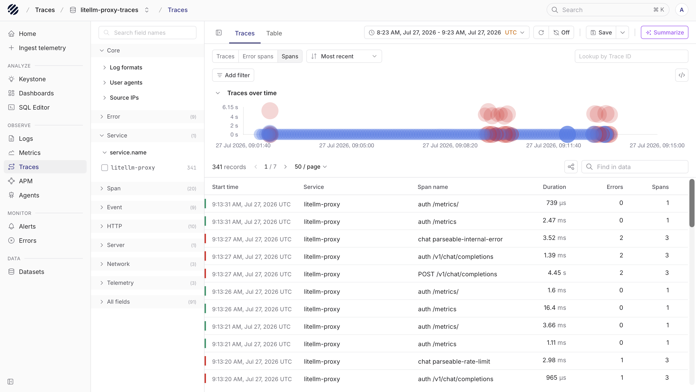
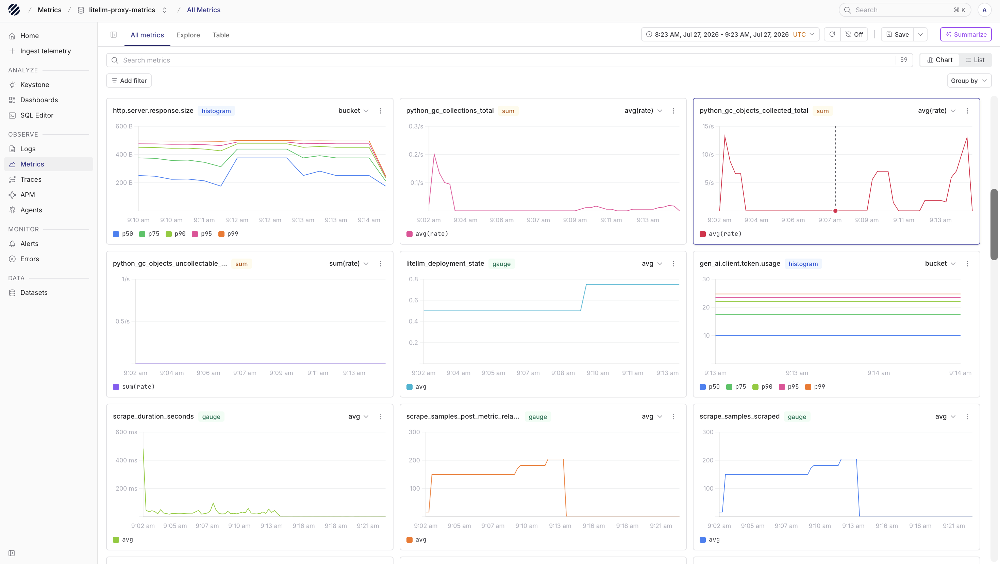

import { Step, Steps } from 'fumadocs-ui/components/steps';

LiteLLM is an OpenAI-compatible gateway for routing model requests across providers such as OpenAI, Anthropic, Azure OpenAI, Vertex AI, Bedrock, and local model endpoints. Teams usually place it in front of applications when they want one place to manage model routing, keys, retries, budgets, fallbacks, and policy.

Parseable helps you see what is happening inside that gateway. With OpenTelemetry enabled, LiteLLM can emit traces for model requests. With the Prometheus callback enabled, LiteLLM exposes gateway metrics at `/metrics`. This guide sends both signals to Parseable so you can inspect request paths, model latency, token usage, errors, and proxy-level behavior from one place.

## How it works

The cleanest production setup is to keep Parseable credentials in an OpenTelemetry Collector. LiteLLM sends OpenTelemetry traces to the Collector, the Collector scrapes LiteLLM's Prometheus metrics endpoint, and both signals are forwarded into Parseable datasets.

```text
Application
  |
  | OpenAI-compatible request
  v
LiteLLM Gateway
  |                                 |
  | OTLP traces                     | Prometheus scrape
  v                                 v
OpenTelemetry Collector
  |
  +--> litellm-traces   traces dataset in Parseable
  +--> litellm-metrics  metrics dataset in Parseable
```

Use separate datasets for traces and metrics. They use different telemetry sources and different `X-P-Log-Source` values.

## Prerequisites

Before you start, keep these ready:

- A running Parseable instance
- A Parseable API key with ingest access
- Python 3.10 or later
- A model-provider API key, such as `OPENAI_API_KEY`
- LiteLLM Proxy or Gateway
- An OpenTelemetry Collector that LiteLLM can reach

## Set up LiteLLM with Parseable

<Steps>
<Step>

### Create Parseable datasets

Create a trace dataset for LiteLLM spans:

```bash
curl -X PUT "$PARSEABLE_URL/api/v1/logstream/litellm-traces" \
  -H "X-API-Key: ${PARSEABLE_API_KEY}" \
  -H "X-P-Log-Source: otel-traces" \
  -H "X-P-Telemetry-Type: traces" \
  -H "X-P-Dataset-Tag: agent-observability"
```

Create a metrics dataset for LiteLLM gateway and GenAI metrics:

```bash
curl -X PUT "$PARSEABLE_URL/api/v1/logstream/litellm-metrics" \
  -H "X-API-Key: ${PARSEABLE_API_KEY}" \
  -H "X-P-Log-Source: otel-metrics" \
  -H "X-P-Telemetry-Type: metrics"
```

The trace dataset appears under traces and agent observability views. The metrics dataset appears in the Metrics page.

</Step>
<Step>

### Configure LiteLLM

Install LiteLLM Proxy and the OpenTelemetry packages:

```bash
pip install "litellm[proxy]" \
  opentelemetry-api \
  opentelemetry-sdk \
  opentelemetry-exporter-otlp-proto-http \
  opentelemetry-instrumentation-fastapi \
  prometheus-client==0.20.0
```

Create `litellm-config.yaml`:

```yaml
model_list:
  - model_name: gpt-4o-mini
    litellm_params:
      model: openai/gpt-4o-mini
      api_key: os.environ/OPENAI_API_KEY

litellm_settings:
  callbacks:
    - otel
    - prometheus

callback_settings:
  otel:
    attributes:
      exclude_list:
        - hidden_params
        - metadata.requester_metadata
        - metadata.requester_ip_address
        - metadata.spend_logs_metadata
        - metadata.mcp_tool_call_metadata
        - metadata.vector_store_request_metadata
        - metadata.prompt_management_metadata
```

The `otel` callback enables LiteLLM OpenTelemetry export. `LITELLM_OTEL_V2=true` turns on the newer trace shape, but the callback still needs to be present. The `prometheus` callback exposes gateway metrics at `/metrics`.

The attribute filter matters in production. Some metadata fields are close to unique for every request. If those fields are attached to metrics, they can create too many time series. The example keeps traces useful while keeping metric cardinality more controlled.

</Step>
<Step>

### Configure the OpenTelemetry Collector

Create `otel-collector-config.yaml`:

```yaml
receivers:
  otlp:
    protocols:
      http:
        endpoint: 0.0.0.0:4318

  prometheus/litellm:
    config:
      scrape_configs:
        - job_name: litellm
          scrape_interval: 15s
          static_configs:
            - targets: ["litellm:4000"]
          authorization:
            type: Bearer
            credentials: "${env:LITELLM_MASTER_KEY}"

processors:
  batch: {}

exporters:
  otlphttp/parseable_traces:
    endpoint: "${env:PARSEABLE_URL}"
    encoding: json
    headers:
      X-API-Key: "${env:PARSEABLE_API_KEY}"
      X-P-Stream: litellm-traces
      X-P-Log-Source: otel-traces

  otlphttp/parseable_metrics:
    endpoint: "${env:PARSEABLE_URL}"
    encoding: json
    headers:
      X-API-Key: "${env:PARSEABLE_API_KEY}"
      X-P-Stream: litellm-metrics
      X-P-Log-Source: otel-metrics

service:
  pipelines:
    traces:
      receivers: [otlp]
      processors: [batch]
      exporters: [otlphttp/parseable_traces]

    metrics:
      receivers: [otlp, prometheus/litellm]
      processors: [batch]
      exporters: [otlphttp/parseable_metrics]
```

This Collector receives OpenTelemetry traces and optional GenAI metrics from LiteLLM. It also scrapes the LiteLLM `/metrics` endpoint, which gives you broader gateway metrics such as proxy requests, failures, routing behavior, spend, token usage, rate limits, queues, Redis, and PostgreSQL metrics.

For local testing, if LiteLLM is running on your host instead of inside the same Docker network as the Collector, replace `litellm:4000` with `host.docker.internal:4000`.

</Step>
<Step>

### Start LiteLLM

Set the LiteLLM and OpenTelemetry environment variables:

```bash
export OPENAI_API_KEY="<openai-api-key>"
export LITELLM_MASTER_KEY="<litellm-master-key>"

export LITELLM_OTEL_V2="true"
export LITELLM_OTEL_INTEGRATION_ENABLE_METRICS="true"
export OTEL_EXPORTER="otlp_http"
export OTEL_ENDPOINT="http://localhost:4318"
export OTEL_SERVICE_NAME="litellm-gateway"
export OTEL_ENVIRONMENT_NAME="production"
export OTEL_INSTRUMENTATION_GENAI_CAPTURE_MESSAGE_CONTENT="no_content"
```

Then start the gateway:

```bash
litellm --config litellm-config.yaml --port 4000
```

Send a request through LiteLLM:

```bash
curl http://localhost:4000/v1/chat/completions \
  -H "Authorization: Bearer ${LITELLM_MASTER_KEY}" \
  -H "Content-Type: application/json" \
  -d '{
    "model": "gpt-4o-mini",
    "messages": [
      {
        "role": "user",
        "content": "Explain observability in one sentence."
      }
    ]
  }'
```

For streaming latency metrics, send a streaming request and consume the full response:

```bash
curl -N http://localhost:4000/v1/chat/completions \
  -H "Authorization: Bearer ${LITELLM_MASTER_KEY}" \
  -H "Content-Type: application/json" \
  -d '{
    "model": "gpt-4o-mini",
    "stream": true,
    "messages": [
      {
        "role": "user",
        "content": "Explain tracing briefly."
      }
    ]
  }'
```

Time-to-first-token and time-per-output-token metrics appear only after successful streaming responses with the required timing data.

</Step>
</Steps>

## What you get in Parseable

Open `litellm-traces` from the Traces page. A request can include the incoming HTTP call, routing work, guardrails, cache or database calls, and the LLM provider call. When an upstream application propagates W3C trace context, LiteLLM can continue that trace so the agent, gateway, and model call are connected.



Open `litellm-metrics` from the Metrics page. You should see LiteLLM proxy metrics from the Prometheus endpoint along with any GenAI metrics emitted by the OpenTelemetry callback.



Common GenAI fields on traces include:

| Field | Meaning |
| --- | --- |
| `gen_ai.operation.name` | GenAI operation name |
| `gen_ai.provider.name` | Model provider |
| `gen_ai.request.model` | Requested model |
| `gen_ai.response.model` | Model returned by the provider |
| `gen_ai.usage.input_tokens` | Input token count |
| `gen_ai.usage.output_tokens` | Output token count |
| `litellm.cost.total` | Estimated request cost when available |

Common GenAI metrics include:

| Metric | Meaning |
| --- | --- |
| `gen_ai.client.operation.duration` | End-to-end model call duration |
| `gen_ai.client.response.duration` | Provider response duration |
| `gen_ai.client.response.time_to_first_token` | Time to first streamed token |
| `gen_ai.client.response.time_per_output_token` | Average generation time per output token |
| `gen_ai.client.token.usage` | Input and output token usage |
| `gen_ai.client.token.cost` | Estimated request cost when available |

LiteLLM Prometheus metrics keep their Prometheus-style names, such as `litellm_proxy_total_requests_metric` and `litellm_deployment_failure_responses`. Prometheus labels become OpenTelemetry attributes after the Collector receives them.

## Message content and privacy

Keep `OTEL_INSTRUMENTATION_GENAI_CAPTURE_MESSAGE_CONTENT="no_content"` unless you have reviewed the privacy and retention impact. Message capture can store prompts and completions in traces or events.

LiteLLM also supports request-level masking with `metadata.mask_input=true` and `metadata.mask_output=true`. For a stronger global setting, use `litellm_settings.turn_off_message_logging=true` in the LiteLLM config.

## Connect LiteLLM to agent traces

If your application already creates agent spans, propagate the W3C `traceparent` header when it calls LiteLLM. Parseable can then show the agent run, tool work, LiteLLM gateway span, and model provider call in the same trace.

For a Pydantic AI example, see [Pydantic AI](/docs/ingest-data/ai-agents/pydantic-ai).

## Troubleshooting

- **No traces arrive**

  Check that `litellm_settings.callbacks` includes `otel`, `LITELLM_OTEL_V2` is set to `true`, and `OTEL_ENDPOINT` points to the Collector OTLP HTTP receiver.

- **No metrics arrive**

  Check that `litellm_settings.callbacks` includes `prometheus`, the `prometheus-client` package is installed, and the Collector can scrape `http://<litellm-host>:4000/metrics` with the LiteLLM bearer token.

- **Metrics show too many series**

  Review the `callback_settings.otel.attributes.exclude_list` in the LiteLLM config. For Prometheus metrics, avoid adding high-cardinality custom labels such as raw user identifiers, request IDs, or unique metadata values.

- **Streaming metrics are missing**

  Confirm the request uses `"stream": true`, the client consumes the response to completion, and the provider returns timing and token usage information.

- **The `/metrics` scrape returns unauthorized**

  LiteLLM requires bearer authentication for `/metrics` by default. Make sure the Collector Prometheus receiver uses the same `LITELLM_MASTER_KEY` that LiteLLM expects.
