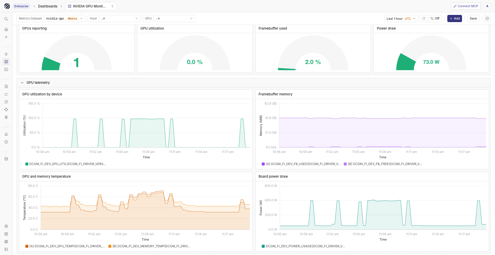

import { Step, Steps } from 'fumadocs-ui/components/steps';

[NVIDIA DCGM Exporter](https://github.com/NVIDIA/dcgm-exporter) exposes GPU telemetry in the Prometheus format. It uses NVIDIA Data Center GPU Manager (DCGM) to collect utilization, memory, temperature, power, PCIe, and hardware health metrics.

Parseable can ingest these metrics through an OpenTelemetry Collector. The Collector scrapes DCGM Exporter and sends the samples to Parseable over OTLP HTTP.

```text
NVIDIA GPU -> DCGM Exporter -> OpenTelemetry Collector -> Parseable
```

## Send DCGM metrics to Parseable

<Steps>
<Step>

### Set up DCGM Exporter

You need:

- A host with a supported NVIDIA GPU and driver
- [DCGM Exporter](https://docs.nvidia.com/datacenter/dcgm/latest/installation/install-dcgm-exporter.html) running on the GPU host
- An OpenTelemetry Collector Contrib distribution
- A Parseable ingestor endpoint and API key

Check that DCGM Exporter serves metrics on port `9400`:

```bash
curl http://<dcgm-exporter-host>:9400/metrics
```

The response should contain metrics such as `DCGM_FI_DEV_GPU_UTIL`, `DCGM_FI_DEV_FB_USED`, and `DCGM_FI_DEV_POWER_USAGE`.

</Step>
<Step>

### Configure the OpenTelemetry Collector

Add a Prometheus receiver and an OTLP HTTP exporter to the Collector configuration:

```yaml
receivers:
  prometheus/dcgm:
    config:
      scrape_configs:
        - job_name: nvidia-dcgm-exporter
          scrape_interval: 30s
          static_configs:
            - targets: ["<dcgm-exporter-host>:9400"]

processors:
  memory_limiter:
    check_interval: 1s
    limit_mib: 256
    spike_limit_mib: 64

  batch:
    timeout: 5s
    send_batch_size: 1024

exporters:
  otlphttp/parseable:
    endpoint: "https://<parseable-ingestor-endpoint>"
    encoding: proto
    compression: gzip
    headers:
      Authorization: "Bearer <parseable-api-key>"
      X-P-Stream: nvidia-gpu-metrics
    retry_on_failure:
      enabled: true
      max_elapsed_time: 0s
    sending_queue:
      enabled: true
      queue_size: 10000

service:
  pipelines:
    metrics/dcgm:
      receivers: [prometheus/dcgm]
      processors: [memory_limiter, batch]
      exporters: [otlphttp/parseable]
```

Use the Parseable base URL for `endpoint`. The OTLP HTTP exporter appends `/v1/metrics`.

</Step>
<Step>

### Run the OpenTelemetry Collector

Run the Collector with the Contrib image:

```bash
docker run --rm \
  --name otel-dcgm \
  -v "$PWD/otel-collector-config.yaml:/etc/otelcol-contrib/config.yaml:ro" \
  otel/opentelemetry-collector-contrib:<version> \
  --config=/etc/otelcol-contrib/config.yaml
```

The Collector must reach DCGM Exporter on port `9400` and the Parseable ingestor over HTTPS. Keep port `9400` on a private network or restrict inbound access to the Collector. DCGM Exporter does not authenticate scrape requests.

</Step>
<Step>

### View GPU metrics

Open the `nvidia-gpu-metrics` dataset from the Metrics page in Parseable. Search for these metrics to check the pipeline:

```text
DCGM_FI_DEV_GPU_UTIL
DCGM_FI_DEV_FB_USED
DCGM_FI_DEV_GPU_TEMP
DCGM_FI_DEV_POWER_USAGE
DCGM_FI_PROF_PIPE_TENSOR_ACTIVE
```

The metric set depends on the GPU model, driver, DCGM version, exporter configuration, and active GPU features. MIG and NVLink metrics appear only when the host supports and enables those features. NVIDIA lists the default and optional fields in the [DCGM Exporter metric reference](https://docs.nvidia.com/datacenter/dcgm/latest/reference/dcgm-exporter-metrics.html).

</Step>
<Step>

### Import the NVIDIA GPU dashboard

Download the [NVIDIA GPU Monitoring dashboard](https://github.com/parseablehq/dashboards/tree/main/nvidia-gpu-monitoring) from the Parseable dashboard repository. Import [`nvidia-gpu-monitoring-promql.json`](https://raw.githubusercontent.com/parseablehq/dashboards/main/nvidia-gpu-monitoring/nvidia-gpu-monitoring-promql.json), then set **Metrics Dataset** to `nvidia-gpu-metrics` or the dataset name used in `X-P-Stream`.

The dashboard includes GPU utilization, framebuffer memory, temperatures, power draw, execution engines, clocks, PCIe throughput, energy use, and hardware reliability metrics.



</Step>
<Step>

### Check the integration

- Use the Parseable ingestor endpoint for writes.
- Give the API key write access to the dataset in `X-P-Stream`.
- Match the DCGM Exporter release with its supported DCGM version.
- Keep the Collector scrape interval at or above the DCGM collection interval.
- Check Collector logs for scrape, authentication, TLS, and export errors.

</Step>
</Steps>
