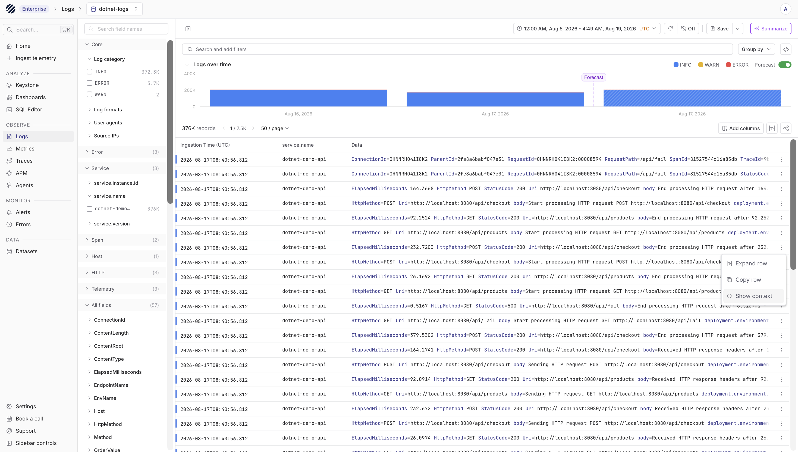
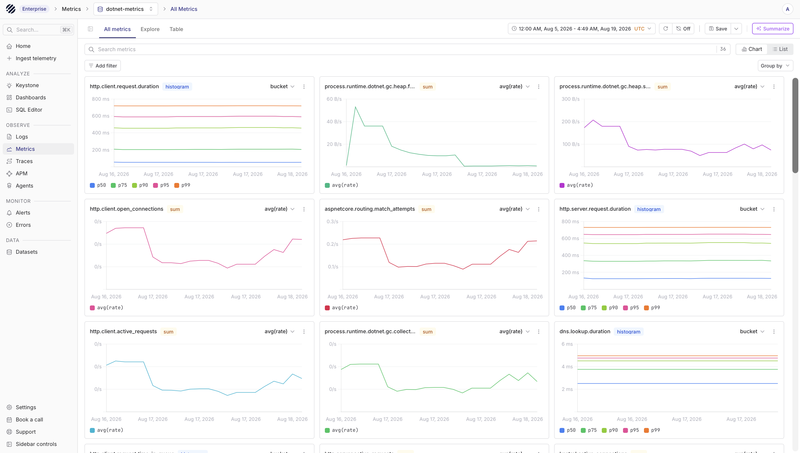
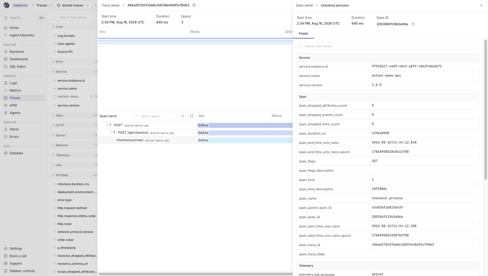

.NET applications already have good hooks for telemetry. Application logs usually come from `ILogger`, traces come from `Activity` and ASP.NET Core instrumentation, and metrics come from `Meter`, HTTP instrumentation, runtime instrumentation, and process instrumentation. With OpenTelemetry, these signals can leave the application over OTLP and flow through an OpenTelemetry Collector before they reach Parseable.

This page uses an ASP.NET Core application as the example. The same pattern works for other .NET services as long as they can export logs, traces, and metrics over OTLP.

## What the integration collects

The setup sends each signal to a separate Parseable dataset. Keeping the datasets separate makes it easier to use the right query mode for each signal later.

| Signal | Source | Parseable dataset |
|---|---|---|
| Logs | `Microsoft.Extensions.Logging` through OpenTelemetry logs | `dotnet-logs` |
| Traces | ASP.NET Core, outgoing HTTP calls, and custom spans | `dotnet-traces` |
| Metrics | ASP.NET Core, HTTP client, process, and .NET runtime metrics | `dotnet-metrics` |

For metrics, exact names can differ slightly by OpenTelemetry .NET package version. Start by checking the metric inventory in Parseable, then use those names in PromQL or dashboards.

## Prerequisites

- .NET 8.0 or later
- OpenTelemetry Collector Contrib
- A Parseable ingestor endpoint
- A Parseable API key
- A Parseable query endpoint for SQL, PromQL, and dashboard reads

<Callout type="info">
In some deployments ingestion and reads use different endpoints. Point the Collector at the Parseable ingestor endpoint. Use the query endpoint only from the UI, API queries, and dashboards.
</Callout>

## Install packages

From your ASP.NET Core project directory, install the OpenTelemetry packages used by the example:

```bash
dotnet add package OpenTelemetry.Extensions.Hosting
dotnet add package OpenTelemetry.Exporter.OpenTelemetryProtocol
dotnet add package OpenTelemetry.Instrumentation.AspNetCore
dotnet add package OpenTelemetry.Instrumentation.Http
dotnet add package OpenTelemetry.Instrumentation.Runtime
dotnet add package OpenTelemetry.Instrumentation.Process
```

## Configure ASP.NET Core

Add OpenTelemetry to `Program.cs`. This example emits normal application logs, automatic HTTP traces, runtime metrics, and one custom span and counter so you can confirm the full path is working.

```csharp
using System.Diagnostics;
using System.Diagnostics.Metrics;
using OpenTelemetry.Logs;
using OpenTelemetry.Metrics;
using OpenTelemetry.Resources;
using OpenTelemetry.Trace;

var builder = WebApplication.CreateBuilder(args);

var serviceName = builder.Configuration["OTEL_SERVICE_NAME"] ?? "dotnet-api";
var activitySource = new ActivitySource("MyCompany.MyApp");
var meter = new Meter("MyCompany.MyApp", "1.0.0");
var ordersCounter = meter.CreateCounter<long>("app.orders.created", unit: "orders");

builder.Services.AddSingleton(activitySource);
builder.Services.AddSingleton(meter);

builder.Services.AddOpenTelemetry()
    .ConfigureResource(resource => resource
        .AddService(serviceName)
        .AddAttributes(new Dictionary<string, object>
        {
            ["deployment.environment.name"] =
                builder.Configuration["DEPLOYMENT_ENVIRONMENT"] ?? "production"
        }))
    .WithTracing(tracing => tracing
        .AddSource("MyCompany.MyApp")
        .AddAspNetCoreInstrumentation()
        .AddHttpClientInstrumentation()
        .AddOtlpExporter())
    .WithMetrics(metrics => metrics
        .AddMeter("MyCompany.MyApp")
        .AddAspNetCoreInstrumentation()
        .AddHttpClientInstrumentation()
        .AddRuntimeInstrumentation()
        .AddProcessInstrumentation()
        .AddOtlpExporter());

builder.Logging.AddOpenTelemetry(logging =>
{
    logging.IncludeFormattedMessage = true;
    logging.IncludeScopes = true;
    logging.ParseStateValues = true;
    logging.SetResourceBuilder(ResourceBuilder.CreateDefault()
        .AddService(serviceName)
        .AddAttributes(new Dictionary<string, object>
        {
            ["deployment.environment.name"] =
                builder.Configuration["DEPLOYMENT_ENVIRONMENT"] ?? "production"
        }));
    logging.AddOtlpExporter();
});

var app = builder.Build();

app.MapGet("/health", () => Results.Ok(new { status = "ok" }));

app.MapPost("/orders", async (ActivitySource source, ILogger<Program> logger) =>
{
    using var activity = source.StartActivity("orders.create", ActivityKind.Internal);

    await Task.Delay(Random.Shared.Next(25, 250));
    var orderId = Guid.NewGuid();

    activity?.SetTag("order.id", orderId);
    ordersCounter.Add(1);
    logger.LogInformation("Created order {OrderId}", orderId);

    return Results.Ok(new { orderId });
});

app.MapGet("/fail", (ActivitySource source, ILogger<Program> logger) =>
{
    using var activity = source.StartActivity("orders.failure", ActivityKind.Internal);
    activity?.SetStatus(ActivityStatusCode.Error, "synthetic failure");
    logger.LogError("Synthetic failure generated for telemetry validation");

    return Results.Problem("Synthetic failure", statusCode: 500);
});

app.Run();
```

Set the application exporter endpoint to the Collector:

```bash
export OTEL_SERVICE_NAME=dotnet-api
export DEPLOYMENT_ENVIRONMENT=production
export OTEL_EXPORTER_OTLP_ENDPOINT=http://otel-collector:4317
export OTEL_EXPORTER_OTLP_PROTOCOL=grpc
export OTEL_METRIC_EXPORT_INTERVAL=10000
```

Use `http://localhost:4317` when the Collector runs on the same host as the application.

## Configure the Collector

Create `otel-collector.yaml`. The Collector receives OTLP from the .NET application and forwards logs, traces, and metrics to Parseable. The exporter examples expect `PARSEABLE_ENDPOINT` and `PARSEABLE_API_KEY` to be set in the Collector environment.

```yaml
receivers:
  otlp:
    protocols:
      grpc:
        endpoint: 0.0.0.0:4317
      http:
        endpoint: 0.0.0.0:4318

processors:
  memory_limiter:
    check_interval: 1s
    limit_mib: 512
    spike_limit_mib: 128
  batch:
    timeout: 5s
    send_batch_size: 256

exporters:
  otlphttp/parseable_logs:
    endpoint: ${env:PARSEABLE_ENDPOINT}
    encoding: proto
    headers:
      X-API-Key: "${env:PARSEABLE_API_KEY}"
      X-P-Stream: dotnet-logs
      X-P-Log-Source: otel-logs
      Content-Type: application/x-protobuf
    retry_on_failure:
      enabled: true
      max_elapsed_time: 0s

  otlphttp/parseable_traces:
    endpoint: ${env:PARSEABLE_ENDPOINT}
    encoding: proto
    headers:
      X-API-Key: "${env:PARSEABLE_API_KEY}"
      X-P-Stream: dotnet-traces
      X-P-Log-Source: otel-traces
      Content-Type: application/x-protobuf
    retry_on_failure:
      enabled: true
      max_elapsed_time: 0s

  otlphttp/parseable_metrics:
    endpoint: ${env:PARSEABLE_ENDPOINT}
    encoding: proto
    headers:
      X-API-Key: "${env:PARSEABLE_API_KEY}"
      X-P-Stream: dotnet-metrics
      X-P-Log-Source: otel-metrics
      Content-Type: application/x-protobuf
    retry_on_failure:
      enabled: true
      max_elapsed_time: 0s

service:
  pipelines:
    logs:
      receivers: [otlp]
      processors: [memory_limiter, batch]
      exporters: [otlphttp/parseable_logs]

    traces:
      receivers: [otlp]
      processors: [memory_limiter, batch]
      exporters: [otlphttp/parseable_traces]

    metrics:
      receivers: [otlp]
      processors: [memory_limiter, batch]
      exporters: [otlphttp/parseable_metrics]
```

Start the Collector:

```bash
export PARSEABLE_ENDPOINT='https://ingestor.example.com'
export PARSEABLE_API_KEY='<your-api-key>'

otelcol-contrib --config otel-collector.yaml
```

## Docker Compose example

The following Compose file runs the application and Collector together:

```yaml
services:
  dotnet-api:
    build: .
    environment:
      ASPNETCORE_URLS: http://+:8080
      OTEL_SERVICE_NAME: dotnet-api
      DEPLOYMENT_ENVIRONMENT: docker-compose
      OTEL_EXPORTER_OTLP_ENDPOINT: http://otel-collector:4317
      OTEL_EXPORTER_OTLP_PROTOCOL: grpc
      OTEL_METRIC_EXPORT_INTERVAL: "10000"
    ports:
      - "8080:8080"
    depends_on:
      - otel-collector

  otel-collector:
    image: otel/opentelemetry-collector-contrib:0.108.0
    command: ["--config=/etc/otelcol-contrib/config.yaml"]
    environment:
      PARSEABLE_ENDPOINT: https://ingestor.example.com
      PARSEABLE_API_KEY: <your-api-key>
    volumes:
      - ./otel-collector.yaml:/etc/otelcol-contrib/config.yaml:ro
    ports:
      - "4317:4317"
      - "4318:4318"
```

Run it:

```bash
docker compose up --build
```

## Generate test telemetry

After the application starts, send a few successful requests and one failing request:

```bash
curl http://localhost:8080/health
curl -X POST http://localhost:8080/orders
curl -X POST http://localhost:8080/orders
curl -i http://localhost:8080/fail
```

Give the Collector a few seconds to batch and export the data.

## Verify in Parseable

Use the Parseable query endpoint to verify each dataset. Quote dataset names that contain hyphens.

```sql
SELECT count(*) AS rows
FROM "dotnet-logs"
WHERE p_timestamp > NOW() - INTERVAL '10 minutes';
```

```sql
SELECT count(*) AS rows
FROM "dotnet-traces"
WHERE p_timestamp > NOW() - INTERVAL '10 minutes';
```

```sql
SELECT metric_name, count(*) AS rows
FROM "dotnet-metrics"
WHERE p_timestamp > NOW() - INTERVAL '10 minutes'
GROUP BY metric_name
ORDER BY rows DESC;
```

You should see log records from `ILogger`, span records from HTTP and custom `Activity` instrumentation, and metric records from ASP.NET Core, HTTP client, process, runtime, and custom meters.

## View the data in Parseable

Open the `dotnet-logs` dataset to inspect application log lines, severity, service metadata, and structured fields captured through OpenTelemetry logs.



Open the `dotnet-metrics` dataset from the Metrics view to inspect runtime and application metrics. Common examples include HTTP request duration, process CPU and memory, runtime GC activity, thread pool activity, and the custom `app.orders.created` counter from the sample application.



Open the `dotnet-traces` dataset from the Traces view to inspect request paths, span duration, service name, status, and error spans.



## Query metrics with PromQL

Parseable exposes ingested OpenTelemetry metrics through the PromQL API. Use the metrics dataset name as the `stream` parameter.

```bash
curl -G "https://query.example.com/prometheus/api/v1/query" \
  -H "X-API-Key: ${PARSEABLE_API_KEY}" \
  --data-urlencode "stream=dotnet-metrics" \
  --data-urlencode 'query=sum by ("service.name") (process.memory.usage)'
```

For range queries:

```bash
curl -G "https://query.example.com/prometheus/api/v1/query_range" \
  -H "X-API-Key: ${PARSEABLE_API_KEY}" \
  --data-urlencode "stream=dotnet-metrics" \
  --data-urlencode 'query=sum by ("service.name") (process.runtime.dotnet.thread_pool.threads.count)' \
  --data-urlencode "start=2026-01-01T00:00:00Z" \
  --data-urlencode "end=2026-01-01T01:00:00Z" \
  --data-urlencode "step=60s"
```

If a PromQL query returns no data, first list available metric names for the dataset:

```bash
curl -G "https://query.example.com/prometheus/api/v1/label/__name__/values" \
  -H "X-API-Key: ${PARSEABLE_API_KEY}" \
  --data-urlencode "stream=dotnet-metrics"
```

## Troubleshooting

- **Datasets are created but no data appears.** Confirm the Collector exports to the ingestor endpoint, not a query-only endpoint. Also check that the `X-P-Stream` values in the Collector match the dataset names you are opening in Parseable.

- **Logs or traces arrive but metrics are empty.** Confirm `.AddOtlpExporter()` is configured inside `.WithMetrics(...)`, and that `OpenTelemetry.Instrumentation.Runtime` and `OpenTelemetry.Instrumentation.Process` are installed. Check Collector logs for failed exports from the metrics pipeline.

- **PromQL returns no data.** Query available metric names first, then use the exact names returned by Parseable. Metric names can differ across OpenTelemetry .NET package versions.

- **Dashboard panels are empty.** Confirm your dashboard variables point to `dotnet-logs`, `dotnet-traces`, and `dotnet-metrics`, or update them if you changed the dataset names in the Collector.

## Next steps

- Explore [OpenTelemetry logs](/ingest-data/otel/logs)
- Explore [OpenTelemetry traces](/ingest-data/otel/traces)
- Explore [OpenTelemetry metrics](/ingest-data/otel/metrics)
- Create [dashboards](/user-guide/dashboards) for .NET service health and runtime behavior
