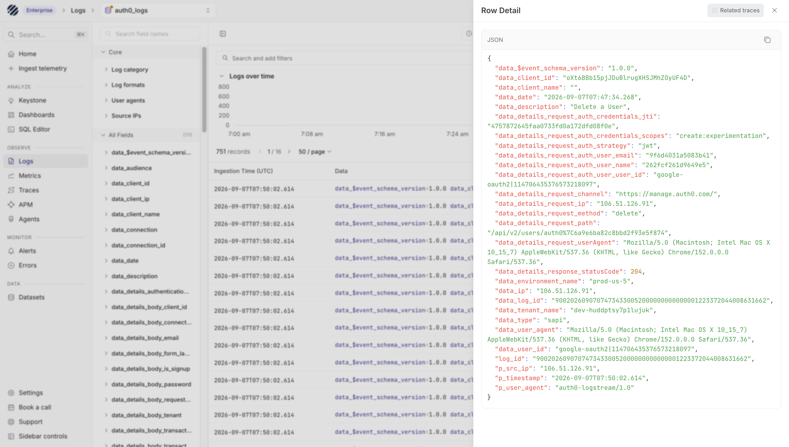
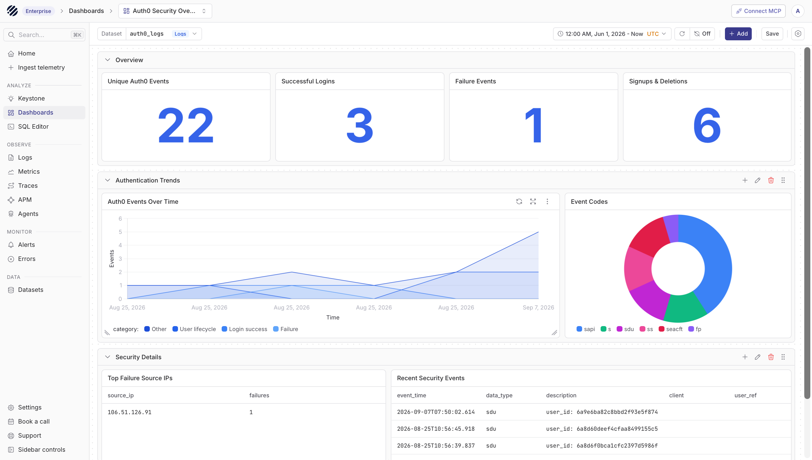

import { Step, Steps } from 'fumadocs-ui/components/steps';

Auth0 manages identity for your applications. Every login, signup, MFA challenge, user update, failed attempt, and security event leaves a useful trail in Auth0 tenant logs. Parseable gives those logs a place where your team can search, retain, dashboard, and alert on them alongside the rest of your operational data.

Instead of checking identity events separately in Auth0, you can stream them into a Parseable dataset and use them for investigation, compliance reviews, and day-to-day security monitoring. This guide shows how to send Auth0 tenant logs to Parseable using an Auth0 Custom Webhook.

## Prerequisites

- An Auth0 tenant with Log Streams enabled
- A Parseable deployment reachable over HTTPS
- A Parseable API key with ingestion access to the target dataset

<Steps>
<Step>

### Create a Dataset in Parseable

- In Parseable, create a dataset named `auth0_logs` and select **Arbitrary logs** as the dataset type.
- Create an API key with ingestion access to `auth0_logs`.

The ingestion endpoint is:

```text
https://<parseable-ingestion-host>/api/v1/logstream/auth0_logs
```

For distributed deployments, use the Parseable ingestion endpoint rather than the query endpoint.

</Step>
<Step>

### Configure the Auth0 Log Stream

- In the Auth0 Dashboard, go to **Monitoring** → **Streams** and create a **Custom Webhook** log stream.
- Use the following webhook settings:

| Setting | Value |
| --- | --- |
| Name | `Parseable` |
| Payload URL | `https://<parseable-ingestion-host>/api/v1/logstream/auth0_logs` |
| Authorization Token | `Bearer <parseable-api-key>` |
| Content Type | `application/json` |
| Content Format | `JSON Array` |

- Select the event categories you want to send to Parseable, then save the log stream.

Auth0 sends the Authorization Token as the HTTP `Authorization` header. The dataset is already part of the endpoint URL, so you do not need to set an `X-P-Stream` header.

</Step>
<Step>

### Verify Log Delivery

- Trigger an Auth0 event, such as a successful login, failed login, signup, MFA challenge, or user deletion.
- In Auth0, check **Monitoring** → **Logs** for the event and the log stream's **Health** tab for successful delivery.
- In Parseable, open the `auth0_logs` dataset and search the recent time range.



Once events start arriving, Parseable stores the Auth0 payload as searchable fields. A few useful fields to check first are:

| Field | What it tells you |
| --- | --- |
| `data_type` | Auth0 event code |
| `data_date` | Event timestamp |
| `data_description` | Event description |
| `data_client_name` | Auth0 application name |
| `data_connection` | Authentication connection |
| `data_user_id` | Auth0 user identifier |
| `data_ip` | Source IP address |
| `log_id` | Auth0 log-event identifier |

These fields make it easier to answer questions such as which users are failing login, which applications are seeing authentication errors, where requests are coming from, and what changed before a security event.

</Step>
</Steps>

## Troubleshooting

- **`401 Unauthorized`:** Confirm the Authorization Token is `Bearer <parseable-api-key>` and that the key has ingestion access to `auth0_logs`.
- **Auth0 shows no deliveries:** Trigger a tenant event and confirm that the selected event filters include its category.
- **Delivery succeeds but no data appears in Parseable:** Confirm that the URL uses the Parseable ingestion endpoint and ends with `/api/v1/logstream/auth0_logs`.

## Import the Auth0 Dashboard

After logs are flowing, you can import the [Auth0 Security Overview dashboard](https://github.com/parseablehq/dashboards/tree/main/auth0-security-overview) to monitor login activity, failures, user lifecycle events, source IPs, and recent security events. Map the dashboard dataset variable to `auth0_logs` after import.


