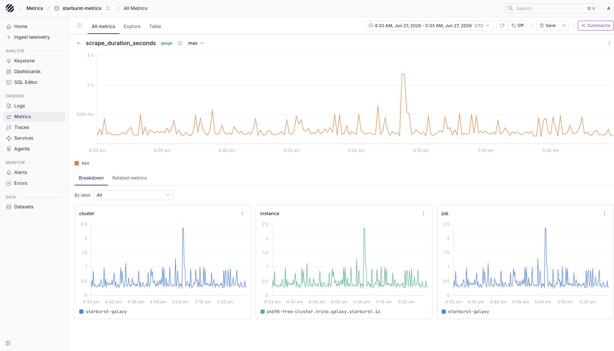

import { Step, Steps } from 'fumadocs-ui/components/steps';

Starburst Galaxy is a fully managed platform for querying data across lakes, warehouses, and databases, with Trino powering query execution under the hood. Alongside that, Galaxy exposes cluster metrics in OpenMetrics format, including CPU usage, memory, cluster size, and running and queued queries.

We will see how to scrape those metrics with Prometheus and send them to Parseable through remote write, so you can keep Starburst cluster telemetry in one place and query it later without guessing which piece does what.

## How the flow works

```text
Starburst Galaxy          Prometheus              Parseable
  /v1/metrics    ----->   scrape + remote  ----->  /v1/prometheus/write
  (OpenMetrics)            write                    (starburst-metrics stream)
```

Starburst Galaxy makes metrics available as a pull endpoint, not a push stream. That means Prometheus or another OpenMetrics-compatible client needs to scrape the cluster first. Parseable then becomes the long-term destination for those metrics through Prometheus remote write.

## Prerequisites

- A Starburst Galaxy account with a running cluster
- Prometheus running somewhere that can reach the cluster
- A reachable Parseable ingestor endpoint
- Parseable credentials for Prometheus remote write

Two details from the Starburst side are worth keeping in mind:

- Galaxy metrics are available only while the cluster is enabled and running
- Each scrape job monitors one cluster. If you want to monitor more than one cluster, create more than one scrape job

## Set up the integration

Use the steps below to connect Starburst Galaxy metrics to Parseable.

<Steps>
<Step>

### Create a role for metrics scraping

Starburst recommends creating a dedicated role just for metrics collection. The role only needs the **Monitor cluster** privilege on the clusters you want to scrape.

In Galaxy, open **Access** > **Roles and privileges**, click **Add role**, and create a role such as `metrics-scraper`. Leave **Grant to the creating role** unchecked. Then open that role, go to **Privileges**, and add the **Monitor cluster** privilege for the cluster you want to observe.

Starburst notes that the `Use cluster` privilege is already inherited from the `public` role, so you only need to grant `Monitor cluster` here. If you plan to scrape multiple clusters, repeat the privilege step for each cluster.

</Step>
<Step>

### Create a service account

Prometheus should authenticate with a service account instead of a personal user account. Starburst’s metrics guide uses that service account as the identity for scraping.

Open **Access** > **Service accounts**, click **Create new service account**, and name it something clear such as `metrics-scraper`. It is better to use a service-style name here instead of a human name. Set the default role to the role you created above, then generate a password and save it somewhere safe.

The password is shown only once, so save it before you leave the screen.

The username format looks like this:

```text
metrics-scraper@<your-account>.galaxy.starburst.io
```

</Step>
<Step>

### Get the cluster host

Prometheus needs the cluster host so it knows where to scrape metrics from.

In Galaxy, open **Partner connect**, select the **Trino Python** tile, choose the cluster you want to monitor, and copy the **Host** value.

Starburst documents the same flow for finding the cluster URL used by monitoring clients.

</Step>
<Step>

### Configure Prometheus

Now wire the two sides together. Prometheus scrapes Starburst Galaxy over HTTPS, then forwards the scraped metrics to Parseable with remote write.

Create a `prometheus.yml` file like this:

```yaml
global:
  scrape_interval: 15s

scrape_configs:
  - job_name: 'starburst-galaxy'
    metrics_path: /v1/metrics
    scheme: https
    basic_auth:
      username: 'metrics-scraper@<your-account>.galaxy.starburst.io'
      password: '<service-account-password>'
    static_configs:
      - targets: ['<cluster-host>']
        labels:
          cluster: 'starburst-galaxy'

remote_write:
  - url: "http://<parseable-ingestor>:8000/v1/prometheus/write"
    basic_auth:
      username: <parseable-username>
      password: <parseable-password>
    headers:
      X-P-Stream: starburst-metrics
      X-P-Log-Source: otel-metrics
```

The Starburst side of this configuration follows their documented scrape pattern for Galaxy metrics, including `metrics_path: /v1/metrics`, HTTPS, and basic authentication with the service account.

On the Parseable side, `remote_write` sends Prometheus metrics into Parseable, `X-P-Stream: starburst-metrics` decides the destination dataset, and `X-P-Log-Source: otel-metrics` marks the payload as metrics data.

</Step>
<Step>

### Run Prometheus and verify the scrape

If you want a quick local setup, a minimal Docker Compose file is enough:

```yaml
# docker-compose.yml
services:
  prometheus:
    image: prom/prometheus:latest
    ports:
      - "9090:9090"
    volumes:
      - ./prometheus.yml:/etc/prometheus/prometheus.yml
    restart: unless-stopped
```

Start it:

```bash
docker-compose up -d
```

Then open:

```text
http://localhost:9090/targets
```

If the scrape is working, the `starburst-galaxy` target should show as **UP**. The Prometheus Targets page is the first place to validate the scrape.

</Step>
<Step>

### Verify data in Parseable

Once Prometheus starts forwarding the metrics, open Parseable, select the `starburst-metrics` dataset, and run a PromQL query like this:

```text
count by (__name__) ({cluster="starburst-galaxy"})
```

This gives you a quick view of which metric series are arriving for that cluster. If the integration is working, you should start seeing JVM, query, and cluster metrics from the Galaxy cluster.



In practice, this is the point where the integration becomes useful. You are no longer just checking whether Prometheus can scrape the endpoint. You can now keep those metrics in Parseable, query them with PromQL, and inspect them next to the rest of your observability data.

</Step>
</Steps>

## Note

- Galaxy metrics are pull-based, so Prometheus must reach the cluster
- The cluster has to be running when Prometheus scrapes it. Auto-suspended clusters will not return live metrics
- One scrape job is tied to one cluster. Add more `scrape_configs` if you monitor more than one cluster
- Parseable creates the `starburst-metrics` stream on first ingest, so you do not need to create it manually beforehand.

<Callout type="info">
This guide covers the Galaxy metrics path because that is the integration Starburst documents for Galaxy today. Starburst Enterprise also documents OpenTelemetry tracing separately.
</Callout>
