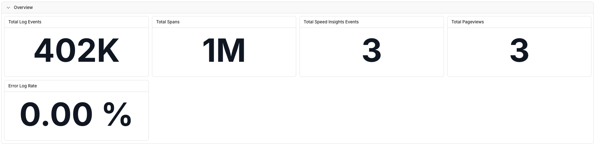
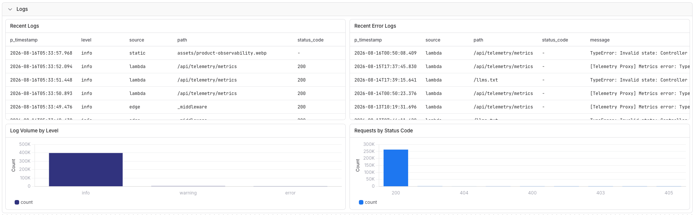
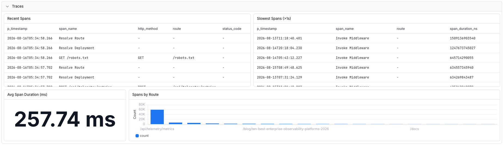
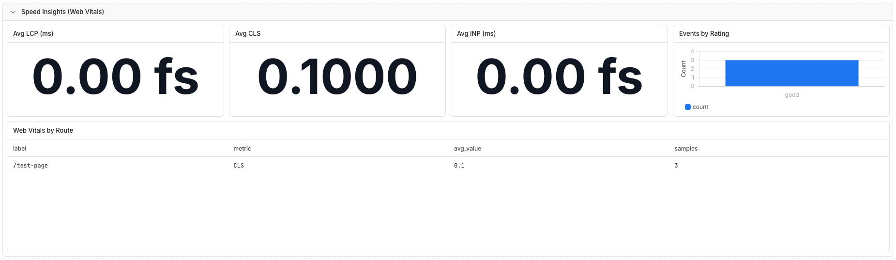

The Parseable integration for Vercel creates and manages Vercel Drains that send telemetry directly to Parseable Cloud or a self-hosted Parseable deployment. You do not need to configure drain endpoints or headers manually.

## What the integration collects

You can enable any of these signals during installation:

| Signal | Default dataset | Delivery |
| --- | --- | --- |
| Logs | `vercel_logs` | JSON over HTTP |
| Traces | `vercel_traces` | OTLP/HTTP JSON |
| Speed Insights | `vercel_speed_insights` | JSON over HTTP |
| Web Analytics | `vercel_analytics` | JSON over HTTP |

Vercel sends each signal straight to your Parseable ingest endpoint. The Parseable control-plane service configures the drains but does not proxy or store telemetry.

## Prerequisites

- A Vercel Pro or Enterprise team. Vercel Drains are available on these plans.
- A Parseable Cloud workspace or a self-hosted Parseable deployment reachable from the public internet.
- Datasets for the signals you plan to enable.
- A Parseable API key with ingest-only access to those datasets. See [API keys](/docs/user-guide/api-keys#dataset-scoped-ingestion-key).

For a self-hosted deployment, expose the Parseable ingest endpoint over HTTPS. An HTTP endpoint sends telemetry and its API key without transport encryption.

## Install from Vercel

### 1. Open the integration

Open the [Parseable integration on Vercel](https://vercel.com/integrations/parseable) and select **Connect Account**.

### 2. Choose the Vercel scope

Select the Vercel team and projects that may send telemetry. Choose all projects or limit the integration to specific projects, then approve the requested Drains permission.

Vercel enforces this project selection. A drain configured for all permitted projects does not receive telemetry from projects outside the integration configuration.

### 3. Choose the Parseable deployment

The setup wizard offers two connection types:

- **Parseable Cloud** — enter a Parseable Cloud API key. The integration discovers the workspace ingest endpoint automatically.
- **Self-hosted** — enter the publicly reachable base URL of your Parseable cluster and a scoped ingest API key.

The self-hosted URL must start with `https://` or `http://`, must be reachable by the integration, and must not redirect to a private or internal network address.

### 4. Select signals and datasets

Enable at least one signal. Keep the default dataset names or replace them with datasets already covered by the API key:

- Logs
- Traces
- Speed Insights
- Web Analytics

The wizard validates the Parseable connection and tests the proposed Vercel delivery settings before it creates a drain for each enabled signal.

### 5. Review and finish

Review the deployment, destination, and signal-to-dataset mappings, then finish the installation. Parseable creates the drains and returns you to Vercel.

If any drain fails, the installation removes drains created during that attempt instead of leaving a partial configuration.

## Verify the installation

In Vercel, open **Team Settings > Drains**. You should see one Parseable drain for every signal enabled during setup.

Generate traffic or deploy the selected Vercel project, then check the corresponding datasets in Parseable. Data can take a short time to appear.

For logs, useful Vercel fields can include project, deployment, environment, source, path, status, and request identifiers. Traces appear through Parseable's native OpenTelemetry trace ingestion.

If the integration was limited to selected projects, generate traffic from both selected and unselected projects. Only telemetry from selected projects should appear.

## Import the Vercel dashboard

Use the [Vercel Integration Observability dashboard](https://github.com/parseablehq/dashboards/tree/main/vercel-integration-observability) to monitor all four signals from one view. The template contains 22 SQL tiles across Overview, Logs, Traces, Speed Insights, and Web Analytics sections.

1. Download the [dashboard JSON](https://raw.githubusercontent.com/parseablehq/dashboards/main/vercel-integration-observability/vercel-integration-observability-mixed.json).
2. In Parseable, open **Dashboards** and use the dashboard import flow.
3. Upload the downloaded JSON file.
4. Map the dashboard's four dataset variables to the datasets selected during Vercel installation.

Sections for signals you did not enable remain empty. You can import the dashboard with only a subset of the four signals and add the remaining dataset mappings later.

### Overview

The overview shows total log events, spans, Speed Insights events, pageviews, and the current log error rate.

### Logs

Inspect recent logs and errors, log volume by level, and requests by HTTP status code.

### Traces

Review recent and slow spans, average span duration, and spans grouped by route.

### Speed Insights

Track Core Web Vitals including LCP, CLS, and INP, with ratings and route-level breakdowns.

### Web Analytics

Analyze recent pageviews and events grouped by path, event type, and origin.

## Update the configuration

Open the installed Parseable integration in Vercel and select **Configure**.

1. Enter the API key currently connected to the installation to verify ownership.
2. Update dataset names as needed.
3. To rotate credentials, enter a replacement API key with ingest access to every configured dataset.
4. Select **Save changes**.

The integration tests the replacement settings, updates the Vercel drains, and then saves the new configuration. Leaving the replacement-key field empty keeps the current key.

The enabled signal set cannot be changed on this page. To add or remove signal types, uninstall and reinstall the integration with the required selection.

## Uninstall

Remove Parseable from the integration settings in Vercel. Vercel stops the associated drains and notifies Parseable that the installation was removed.

Uninstalling does not delete your Parseable datasets or revoke the API key you supplied. Revoke that key separately in Parseable if it is no longer needed.

## Troubleshooting

### Installation cannot start

Start installation from the Parseable listing in Vercel. The Parseable redirect URL only works when Vercel supplies a one-time authorization code and configuration parameters; opening it directly produces an installation error.

### Parseable rejects the API key

- Confirm the key is active and copied without surrounding whitespace.
- Confirm its role grants ingest access to every selected dataset.
- For Parseable Cloud, confirm the key belongs to a running workspace.
- For self-hosted Parseable, confirm the URL points to the ingest endpoint associated with that key.

### Self-hosted validation fails

- Confirm the cluster is reachable from the public internet.
- Use the Parseable base URL, without an ingestion path such as `/api/v1/ingest` or `/v1/traces`.
- Use HTTPS with a valid certificate when possible.
- Check firewalls, allowlists, proxies, and DNS resolution.
- Private, loopback, link-local, and cloud-metadata addresses are rejected.

### Drain creation or delivery fails

- Verify the Vercel team uses a Pro or Enterprise plan.
- In **Team Settings > Drains**, inspect the affected drain and its latest delivery error.
- Confirm the target dataset exists and the API key can ingest into it.
- Confirm the selected Parseable endpoint accepts both JSON ingestion and OTLP traces when those signals are enabled.
- Reopen **Configure** to correct dataset mappings or rotate the key.

### No data appears

- Generate fresh traffic for a project included in the integration scope.
- Confirm the expected signal was enabled during installation.
- Check the dataset selected for that signal rather than only the default dataset name.
- Confirm the Vercel drain is active and its delivery tests succeed.

## Security notes

- Use a dedicated, dataset-scoped ingestion key rather than an administrator or query key.
- Store the key securely. Parseable encrypts the saved credential and never displays it from the configuration page.
- Telemetry flows directly from Vercel to the selected Parseable cluster.
- Rotating or uninstalling the integration does not revoke customer-owned Parseable keys automatically.
