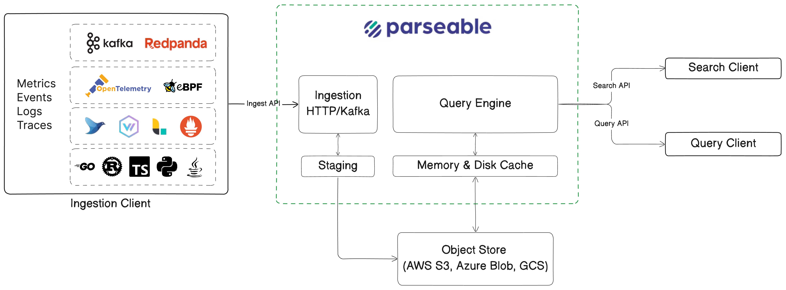

import { IconCpu2,IconSortDescendingSmallBig,IconBolt,IconTelescope,IconCloudDataConnection,IconFileTextShield } from '@tabler/icons-react';

Parseable is a modern observability platform, built ground up on the principles of simplicity, performance, efficiency and ease of use. It is designed to handle large volumes of telemetry data, like logs, metrics, and traces, with a focus on efficient data ingestion, storage and fast querying.

At the core of Parseable is purpose built, OLAP style diskless database [Parseable DB](https://github.com/parseablehq/parseable). ParseableDB integrated natively with the observability first frontend called Prism UI. 

<Cards>

<Card icon={<IconCpu2 />} title='Up to 70% less compute resources'>
70% less CPU than traditional Java solutions like Elasticsearch under similar workloads. 
</Card>

<Card icon={<IconSortDescendingSmallBig />} title='Up to 90% compression'>
Built-in compression to compress observability and telemetry data by up to 90%. 
</Card>

<Card icon={<IconBolt />} title='Fast query'>
Fast query response with Rust based design, modern query techniques, and intelligent caching on SSDs / NVMe and memory.
</Card>

<Card icon={<IconCloudDataConnection />} title='Object store first'>
Excellent storage efficiency and cost with object stores like S3, GCS, Azure Blob as the primary storage layer.
</Card>

<Card icon={<IconTelescope />} title='OpenTelemetry native'>
Ingest, manage and query OpenTelemetry logs, metrics or traces natively. Zero configuration needed. 
</Card>

<Card icon={<IconFileTextShield />} title='Data privacy and security'>
Deploy across public or private clouds, containers, VMs, or bare metal environments with complete data security and privacy.
</Card>

</Cards>

<Callout type="info">
Want to use a LLM to ask questions on Parseable docs? Copy the docs text from http://parseable.com/llms.txt and paste into the LLM.
</Callout>
