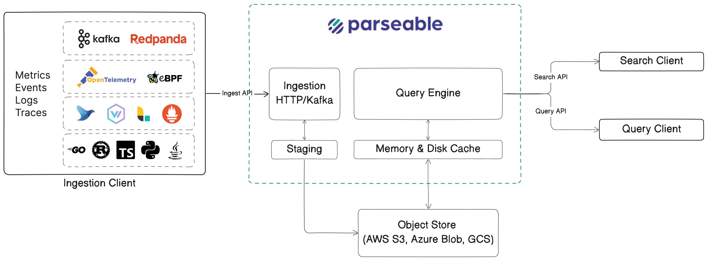

import { IconCpu2,IconSortDescendingSmallBig,IconLayersIntersect,IconRocket,IconBolt,IconTelescope,IconCloudDataConnection,IconFileTextShield } from '@tabler/icons-react';

Parseable is an open source, column-oriented data lake platform, purpose built for observability. It treats the growth of observability data as a data engineering problem rather than a search or time-series problem — telemetry is big data, and it should be stored, compressed, and queried like big data, in open formats, instead of being forced into systems that were never designed for this scale or cardinality.

Parseable is written in Rust and built on Apache Arrow and Apache Parquet. Rust gives predictable, low-latency performance with no garbage collection pauses and a small memory footprint. 

Arrow is the in-memory columnar representation, which makes query execution vectorized and data exchange zero copy. Parquet is the storage at rest format — open, columnar, and widely supported. Because every telemetry signal is stored as standard Parquet on object storage, the data is never trapped inside Parseable: any Parquet compatible engine can read it.

- <strong>Data lake engine</strong>: At the core of Parseable is the data lake engine, built for high-throughput ingestion. Incoming telemetry is staged locally and then forwarded to object storage in batches — a stage-and-forward design that absorbs ingestion spikes without pushing backpressure onto the sender, and writes efficiently sized objects to the store. The engine handles compression, object storage prefix and partition layout, and metadata management, so the cost, durability, and consistency characteristics of object storage stay abstracted away from the user.

- <strong>Query engine</strong>: The query engine supports SQL and PromQL natively. Storage and compute are separate, so query nodes scale independently of ingestion. To keep queries fast, the engine caches frequently accessed data on the query node's local disk, serving hot queries from local NVMe rather than round-tripping to object storage on every call.

## Telemetry signals

Telemetry signals have different shapes, query patterns, and volumes. Logs are wide and dynamic, metrics are dense and numeric, traces are linked trees of spans — and each performs best when its storage layout, schema handling, and query interface match the way that signal is actually produced and read. Forcing all three into one model causes friction while using the product.

Data lake architecture was built for exactly this: holding distinct but related datasets — structured, semi-structured, and unstructured, in one open store. With storage decoupled from compute so each dataset can be queried on its own terms. That makes the data lake the natural foundation for observability.

### Logs
Logs are the generally highest-volume. They range from unstructured text to semi-structured JSON, with constantly drifting schemas. The common pattern for queries is a filter over a time window — where people are trying to find the needle. Teams are also increasingly using aggregations over [wide, high-cardinality events](https://www.parseable.com/blog/decision-framework-wide-events-or-traces). 

Parseable can ingest logs with dynamic or fixed schema. For dynamic schema, new fields are picked up automatically, and sparse or wide events stay cheap because columnar storage only reads the columns a query touches.

For verbose log strings, Parseable offer [LogIQ, a mechanism to split the log data into separate columns](/docs/user-guide/log-iq) automatically, allowing best compression and performance.

### Metrics
Metrics are numeric time series identified by a name and a set of labels. The hard problem is cardinality: every new combination of label values is another series, and traditional TSDBs slow down or fall over as that count climbs.

Parseable stores metrics in the same columnar data lake and exposes them through native PromQL. With additional metadata like label hash and frequency, label values are stored as column data rather than expanded into a per-series index, so high-cardinality labels don't carry any penalty. Metrics can be ingested over [OpenTelemetry](/docs/ingest-data/otel/metrics) or [Prometheus remote write](docs/ingest-data/prometheus).

### Traces
A trace is a tree of spans tied together by a trace ID, where each span is a structured event with its own timing and attributes. Trace workloads mix two access patterns: fetch a single trace by ID, and aggregate across many spans for service-level views — latency percentiles, error rates, dependency maps.

Parseable stores spans as columnar events, so both patterns run on the same data — trace lookup by ID, and the aggregations behind its APM features. Traces are [ingested over OTLP](/docs/ingest-data/otel/traces).

## Use cases

## Key differentiators

<Cards>

<Card icon={<IconCpu2 />} title='Up to 70% less compute resources'>
70% less CPU than traditional Java solutions like Elasticsearch under similar workloads. 
</Card>

<Card icon={<IconSortDescendingSmallBig />} title='Up to 90% compression'>
Built-in compression to compress observability and telemetry data by up to 90%. 
</Card>

<Card icon={<IconBolt />} title='Fast queries'>
Fast query response with Rust based design, modern query techniques, and intelligent caching on SSDs / NVMe and memory.
</Card>

<Card icon={<IconCloudDataConnection />} title='Object store first'>
Excellent storage efficiency and cost with object stores like S3, GCS, Azure Blob as the primary storage layer.
</Card>

<Card icon={<IconTelescope />} title='OpenTelemetry native'>
Ingest, manage and query OpenTelemetry logs, metrics or traces natively. Zero configuration needed. 
</Card>

<Card icon={<IconFileTextShield />} title='Data privacy and security'>
Deploy across public or private clouds, containers, VMs, or bare metal environments with complete data security and privacy.
</Card>

</Cards>

## Next steps

<Cards>

<Card href="/docs/architecture" icon={<IconTelescope className="text-blue-500" />} className="text-blue-500" title='Architecture'>
Learn about the telemetry data lake architecture.
</Card>

<Card href="/docs/get-started" icon={<IconRocket className="text-blue-500" />} className="text-blue-500" title='Get started'>
Start with Parseable Cloud or run it on your laptop
</Card>

<Card href="/docs/ingestion" icon={<IconCloudDataConnection className="text-blue-500" />} className="text-blue-500" title='Ingest data'>
Send telemetry data into Parseable.
</Card>

<Card href="/docs/features" icon={<IconFileTextShield className="text-blue-500" />} className="text-blue-500" title='Features'>
PromQL, alerting, dashboards, anomaly detection
</Card>

<Card href="/docs/integrations" icon={<IconLayersIntersect className="text-blue-500" />} className="col-span-2 text-blue-500" title='Integrations'>
Integrate with your existing tools and workflows.
</Card>

</Cards>
