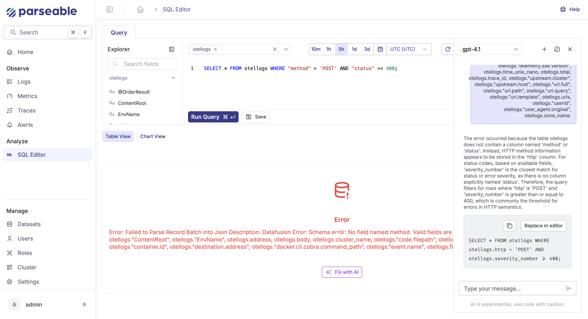

In addition to a simple, easy to use filtering interface, Parseable also offers a PostgreSQL compatible SQL query interface to query log data. Users can choose to use the filter interface directly without having to deal with SQL at all. However for more complex queries and advanced users, Parseable offers a SQL query interface.

You can specify the query and the relevant time range for which you want this query to be run. The response is inclusive of both the start and end timestamps.

The filter interface is quite self explanatory, with options to filter by specific columns and values and also by time range. In this document, we'll cover more about the SQL API and its capabilities.

Check out the [Query API](/docs/api/v1/query). 

## How does it work?

After parsing and creating the execution plan for a query, the Parseable query server uses the data manifest file to filter out the relevant Parquet files. The data manifest file is a JSON file that contains the specific column metadata for a whole day. The querier uses this file to filter the relevant Parquet files based on the query filters and the time range.

Only the relevant Parquet file paths are then added as a data source to custom table provider. Datafusion then efficiently reads the files via the GetRange S3 API, pulling only the very specific data needed for the query. This ensures that only the relevant data is read from the storage, reducing the query time and cost.

## Supported functions

Parseable supports a wide range of SQL functions - Aggregate, Window and Scalar functions. Refer the Apache Datafusion documentation for the complete list of supported functions and their usage.

- [Aggregate Functions](https://datafusion.apache.org/user-guide/sql/aggregate_functions.html)
- [Window Functions](https://datafusion.apache.org/user-guide/sql/window_functions.html)
- [Scalar Functions](https://datafusion.apache.org/user-guide/sql/scalar_functions.html)

## Query with regular expressions

This section provides examples of how to use regular expressions in Parseable queries.

- Match regular expression (Case Sensitive)

```sql
SELECT * FROM frontend where message ~ 'failing' LIMIT 9000;
```

- Match regular expression (Case Insensitive)

```sql
SELECT * FROM frontend where message ~* 'application' LIMIT 9000;
```

- Does not match regular expression (Case Sensitive)

```sql
SELECT * FROM frontend where message !~ 'started' LIMIT 9000;
```

- Does not match regular expression (Case Insensitive)

```sql
SELECT * FROM frontend where message !~* 'application' LIMIT 9000;
```

- Matches the beginning of the string (Case Insensitive)

```sql
SELECT * FROM frontend where message ~* '^a' LIMIT 9000;
```

- Matches the end of the string

```sql
SELECT * FROM frontend where message ~ 'failing$' LIMIT 9000;
```

- Matches numeric type data

```sql
SELECT * FROM frontend where uuid ~ '[0-9]' LIMIT 9000;
```

- Matches numeric type data (two digits)

```sql
SELECT * FROM frontend where uuid ~ '[0-9][0-9]' LIMIT 9000;
```

- Matches numeric type data (two digits)

```sql
SELECT * FROM frontend where uuid ~ '[0-9][0-9]' LIMIT 9000;
```

- Replace every instance of the numeric type data with the symbol *

```sql
SELECT REGEXP_REPLACE(uuid,'[0-9]','*','g') FROM frontend LIMIT 9000;
```

- When a Regex is run against a string, the REGEXP_MATCHES() function compares the two and returns the string that matches the pattern as a set.

```sql
SELECT REGEXP_MATCH(email,'@(.*)$')  FROM frontend where email is not null LIMIT 10;
```

- Postgres regex numbers only: Use the REGEXP_REPLACE() function to extract only the numbers from a string in PostgreSQL.

```sql
SELECT REGEXP_REPLACE(email,'\\D','','g') FROM frontend where email is not null LIMIT 10;
```

- Postgres regex split: SPLIT_PART() function can split a string into many parts. To divide a string into several pieces, we must pass the String, the Delimiter, and the Field Number.

```sql
SELECT SPLIT_PART(email,'@',1) FROM frontend where email is not null LIMIT 10 -- return before @ from email;
SELECT SPLIT_PART(email,'@',2) FROM frontend where email is not null LIMIT 10 -- return after @ from email;
```

- Postgres Regex Remove Special Characters: Using the REGEXP_REPLACE() function, all Special Characters from a supplied text can be eliminated.

```sql
SELECT REGEXP_REPLACE(email, '[^\\w]+','','g') FROM frontend where email is not null LIMIT 10;
```

- Functions and Operators in pattern matching: Like and other POSIX regular expressions are supported.

```sql
SELECT * FROM frontend where email LIKE '%test%' LIMIT 10;
SELECT * FROM frontend where email ~ '^test' LIMIT 10;
```

## Case sensitivity

Dataset column names are case sensitive. For example, if you send a log event like

```json
{
  "foo": "bar",
  "Foo": "bar"
}
```

Parseable will create two columns, `foo` and `Foo` in the schema. So, while querying, please refer to the fields as `foo` and `Foo` respectively. While querying, unquoted identifiers are converted to lowercase. To query column names with uppercase letters, they must be passed in double quotes. For example, when sending a query via the REST API, the following JSON payload will apply the `WHERE` condition to the column `Foo`:

```json
{
    "query":"select * from stream where \"Foo\"=bar",
    "startTime":"2023-02-14T00:00:00+00:00",
    "endTime":"2023-02-15T23:59:00+00:00"
}
```

If you're querying Parseable via Grafana UI (via the [data source plugin](https://github.com/parseablehq/parseable-datasource)), you can use the following query to query the column `Foo`:

```sql
SELECT * FROM stream WHERE "Foo" = 'bar'
```

## Query analysis

In some cases, you may want to understand the query performance. To view the detailed query execution plan, use the `EXPLAIN ANALYZE` keyword in the query. For example, the following query will return the query execution plan and time taken per step.

```json
{
	"query": "EXPLAIN ANALYZE SELECT * FROM frontend LIMIT 100",
	"startTime": "2023-03-07T05:28:10.428Z",
	"endTime": "2023-03-08T05:28:10.428Z"
}
```

## Response fields information with query results

To get the query result fields as a part of query API response, add the query parameter `fields=true` to the API call, e.g. `http://localhost:8000/api/v1/query?fields=true`.

For example, for a query like `select count(*) as count from app1`, with the query parameter added will respond like this:

```json
{
    "fields": [
        "count"
    ],
    "records": [
        {
            "count": 2
        }
    ]
}
```

## LLM Based Query Builder

Parseable's LLM based query builder allows you to generate SQL queries based on your natural language query. This feature is available in the Parseable UI and can be accessed from the SQL editor. It can also help with fixing your queries by suggesting corrections based on the query you have written. To use the LLM based query builder, click on the "Generate with AI" button in the SQL editor.

### 1. Choosing Your LLM Provider

**Parseable supports multiple AI models out of the box.**

* Go to **Settings** > **AI Assistant**.
* Choose your preferred LLM provider (e.g., OpenAI GPT, Anthropic Claude).
* Add your API key.
* Save your preferences.


You can change this any time to fit team policies, costs, or performance needs.

### 2. Generating SQL from Plain English

**How to:**

* In your SQL editor, look for the “Generate with AI” button at the bottom.


* Type your question or description in plain language.
  **Examples:**

  * `Show me all error logs for the last hour grouped by host`
  * `Find top 5 most common user agents in the backend table`
  * `Summarize response statuses per environment tag`

**What happens:**
The AI will generate a ready-to-run SQL query for your prompt. You can copy, run, or tweak the result.

### 3. Using AI for Query Help

**Ask the AI anything in your SQL workflow:**

* **Write a new query:**
  `Generate with AI` > “Show all 5xx errors grouped by host in the last hour.”
* **Fix a query:**
  Paste a broken query, then prompt, “Fix this query, it’s giving a syntax error.”
* **Explain a query:**
  Ask, “Explain what this query does.”
* **Tweak logic:**
  “Can you add a filter for status = 500?”

The assistant uses your current datasets and history for context, so results are relevant.


### 4. Using Chat History

* All prompts and AI responses are saved automatically.
* Click the **History** tab in the assistant panel to view previous conversations.
* Rerun, reuse, or refine past queries from here.
* Useful for incident reviews, recurring analytics, and keeping a record of troubleshooting steps.


### 5. The Library

* Save any query you want to reuse in the **Library**.
* From the Library pane, you can:
  * Run saved queries directly
  * Edit or improve them with the AI assistant
  * Ask the assistant to explain saved queries

The Library is searchable and can be personal or shared with your team.


### 6. Let AI Fix Your Query

**When a query fails:**

* Click “Fix with AI” on the error message or use the AI assistant with your broken SQL.
* The AI analyzes your schema and query, returning a corrected version (e.g., fixing wrong field names, aggregation functions, or syntax).

This is especially useful in high-pressure situations or when exploring unfamiliar datasets.



### Example Workflow

1. **Troubleshoot an issue:**
   You notice a spike in latency. Type a plain English prompt describing what you need.
2. **Get a query:**
   AI generates the SQL for you.
3. **Edit and run:**
   Tweak or run the query.
4. **Query fails?**
   Use “Fix with AI” to automatically correct it.
5. **Save to Library:**
   Store your working query for future reuse, and ask the AI to explain it for documentation.


