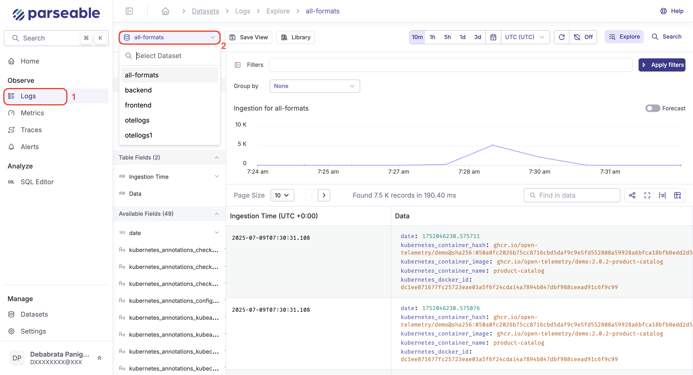

## Start Parseable

Download the relevant binary and start Parseable in local-store mode with the following commands:

```sh
curl -fsSL https://logg.ing/install | bash
parseable local-store
```

This will start Parseable on port 8000. You can access the Parseable Console at [http://localhost:8000](http://localhost:8000).

## Ingest data

Send your first log event to the demo dataset using below command.

```bash
curl --location --request POST \
'http://localhost:8000/api/v1/ingest' \
--header 'X-P-Stream: demo' \
--header 'Authorization: Basic YWRtaW46YWRtaW4=' \
--header 'Content-Type: application/json' \
--data-raw '[
    {
        "id": "434a5f5e-2f5f-11ed-a261-0242ac120002",
        "datetime": "2023-01-05T07:20:50.52Z",
        "host": "153.10.110.81",
        "user-identifier": "Mozilla/5.0 (Windows NT 6.1; Win64; x64) Firefox/64.0",
        "method": "PUT",
        "status": 500,
        "referrer": "http://www.google.com/"
    }
]'
```

Parseable uses datasets to organize log data. Here we posted a sample log data to the demo dataset, by adding the header `X-P-Stream: demo` in the request.

## Query data

To query the data via Console, login at http://localhost:8000. Default username and password is `admin:admin`. Then select the demo dataset under the log explorer page.

