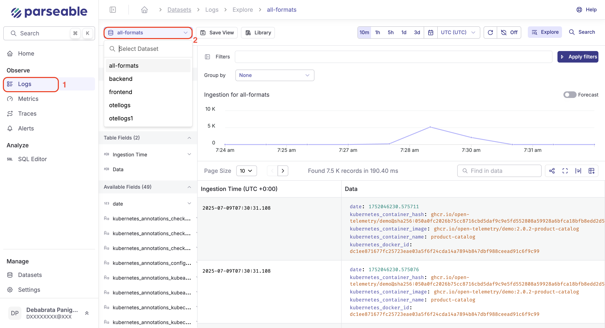

Ensure Docker is installed on your machine. Refer to [this doc](https://www.docker.com/products/docker-desktop/) to install Docker.

## Start Parseable

<EditableCode 
  language="sh"
  title="Docker Run Command"
  code={`docker run -p 8000:8000 \\
-p 8001:8001 \\
-p 8002:8002 \\
-v /tmp/parseable/data:/parseable/data \\
-v /tmp/parseable/staging:/parseable/staging \\
-e P_FS_DIR=/parseable/data \\
-e P_STAGING_DIR=/parseable/staging \\
parseable/parseable:latest \\
parseable local-store`}
/>

This will start Parseable on port 8000. You can access the Parseable Console at [http://localhost:8000](http://localhost:8000).

## Ingest data

You can post log data to the demo dataset using a POST call to the dataset endpoint.

<CurlTerminal 
  title="Send log event to demo dataset"
  command={`curl --location --request POST \\
'http://localhost:8000/api/v1/ingest' \\
--header 'X-P-Stream: demo' \\
--header 'Authorization: Basic YWRtaW46YWRtaW4=' \\
--header 'Content-Type: application/json' \\
--data-raw '[
    {
        "id": "434a5f5e-2f5f-11ed-a261-0242ac120002",
        "datetime": "2023-01-05T07:20:50.52Z",
        "host": "153.10.110.81",
        "user-identifier": "Mozilla/5.0 (Windows NT 6.1; Win64; x64) Firefox/64.0",
        "method": "PUT",
        "status": 500,
        "referrer": "http://www.google.com/"
    }
]'`}
/>

Parseable uses datasets to organize log data. Here we posted a sample log data to the demo dataset, by adding the header `X-P-Stream: demo` in the request.

## Query data

To query the data via Console, login at http://localhost:8000. Default username and password is `admin:admin`. Then select the demo dataset under the log explorer page.

