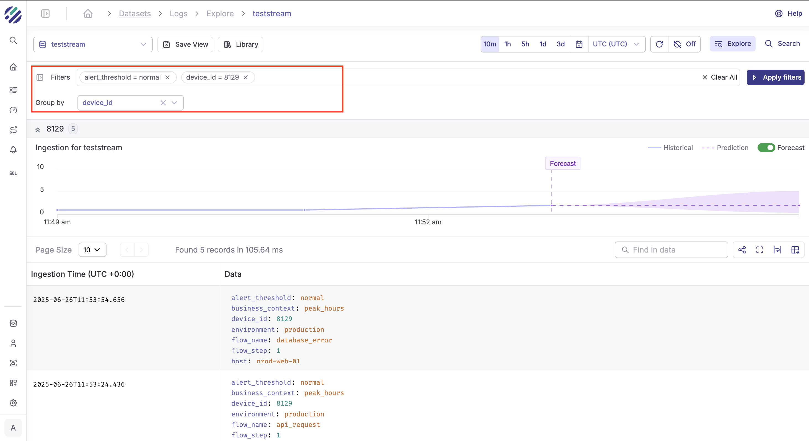

## v2.5 (December 8, 2025)

**Parseable v2.5.0** is here! This major update significantly expands our platform capabilities, introducing a dedicated **Trace View**, a **Metrics View**, and powerful AI-native integrations connecting Keystone with the alerting ecosystem.

### 1. Trace View Implementation
We have unlocked a new dimension of observability with the introduction of the **Trace View**. This feature is designed to help you visualize the complete lifecycle of requests as they traverse your distributed systems, making it easier than ever to diagnose latency issues and bottlenecks.
* **Full Trace Visualization:** Users can now view comprehensive waterfall charts of traces, providing deep visibility into service interactions.
* **Enhanced Navigation:** We added intuitive breadcrumbs to the Traces Span detail sheet, allowing for seamless navigation through complex span hierarchies.
* **OpenTelemetry Standardization:** Trace field names for events and links have been updated to align strictly with OpenTelemetry standards, ensuring consistent data ingestion and better interoperability.


### 2. Metrics View
The Metrics experience has been overhauled to provide deeper insights and a more fluid user experience.
* **Data Consistency:** Attribute field names have been standardized across all metric types, simplifying queries and ensuring consistency across your data.


### 3. Keystone Integration with Alerts
We are bringing AI-native capabilities closer to your incident response workflow. Keystone is now tightly integrated with the alerting system.
* **Automated Investigation:** You can now initiate a Keystone analysis session directly from a triggered alert. This seamless handoff reduces the time between detecting an anomaly and understanding its root cause.


### 4. SQL Editor & Visualization
We have enhanced the SQL Editor to support more complex data exploration and reporting needs.
* **Table Chart Support:** We introduced the **'Table' chart type**, allowing you to visualize raw data rows directly within your dashboards for detailed reporting.
* **Multi-Dataset Expansion:** The SQL editor now supports up to **3 distinct datasets** simultaneously, enabling more complex joins and comparative analysis.
* **UX Enhancements:**
    * Added a **"Clear All"** button to instantly reset GroupBy selections, speeding up exploratory data analysis.
    * Improved state management for SQL editor tabs to prevent data loss when switching contexts.
    * Refined the `dbName` logic to better handle complex subqueries.

### 5. Alerting Improvements
The alerting engine has been optimized for performance and better context.
* **State History:** Parseable now saves the history of alert states, providing a valuable audit trail of when alerts fired, resolved, or changed status.
* **Contextual Alerts:** You can now include the `metric_name` context when creating alerts, making notifications more informative at a glance.
* **Performance & Clarity:** We optimized the underlying queries used for alert creation to reduce load and removed redundant text from notification messages for cleaner, easier-to-read alerts.

### 6. Bug Fixes
* **SQL Editor:** Fixed an issue where error messages were not being displayed when a query failed, ensuring users now see the correct feedback.
* **Visualization Logic:** Refined query data checks in the `GaugeStyleSection` to correctly respect `rangeTo` values for accurate gauge rendering.
* **Recents Management:** The "Recents" list now automatically cleans itself by removing entries that are no longer valid.
* **Timezones:** Fixed an issue with URL parameter handling to ensure selected timezones persist correctly during navigation.

## v2.4.3 (September 22, 2025)

We're excited to announce Parseable v2.4.3. This release was focussed on improving the user experience of using SQL via our SQL editor. 

###  New SQL editor

The SQL editor has a new sidebar to showcase all the columns and their types for fast lookups. After the query is run and results are available, you can now use the chart view customization options and add these charts to dashboards directly.

AI assistant, saved queries are now rearranged to the right side of the screen for better visibility and access.


<iframe width="560" height="315" src="https://www.youtube.com/embed/VjwFONGGqaE?si=hMkSWfwGWmfb4HfY" title="YouTube video player" frameBorder="0" allow="accelerometer; autoplay; clipboard-write; encrypted-media; gyroscope; picture-in-picture; web-share" referrerPolicy="strict-origin-when-cross-origin" allowFullScreen></iframe>

<iframe width="560" height="315" src="https://www.youtube.com/embed/O_lyg-0wBFY?si=FdfyUFnVs1zkHiql" title="YouTube video player" frameBorder="0" allow="accelerometer; autoplay; clipboard-write; encrypted-media; gyroscope; picture-in-picture; web-share" referrerPolicy="strict-origin-when-cross-origin" allowFullScreen></iframe>

### Create alerts from Dashboard

Visualization gives you a good idea of patterns forming, and many times you want to be alerted when these patterns cross a certain threshold. You can now create alerts directly from the dashboard.

Click on the "three dots" button in a dashboard tile and select "Create Alert" from the dropdown menu. You will be redirected to the Alert Builder page, where your current filters and group-by options are automatically applied. Once satisfied with the configuration, click "Create" to activate your alert.


### Investigation flows

As you analyze the data in your dashboard, you may identify specific trends or anomalies that require further exploration. Our new investigation flows make it easy to dive deeper into the data. You can now drill down into the data from the Dashboard or a triggered Alert.

In a dashboard tile:

- Select the "Investigate" option under the "three dots" button in chart.
- You'll be redirected to the Explore Page of the dataset with the same filters and group by options as the chart.


From a triggered Alert:

- Select the "Investigate" option from the Triggered Alert page.
- You'll be redirected to the Explore Page of the dataset with the same filters and group by options as the chart along with the timeline of the alert.


## v2.4.1 (August 18, 2025)

We're thrilled to announce Parseable v2.4.1, packed with powerful new features that enhance monitoring, visualization, and data ingestion capabilities. This release introduces advanced alerting mechanisms, expanded dashboard visualization options, and native Protocol Buffer support.

### 1. Advanced Alert Types

Building on our alerting capabilities, v2.4.1 introduces three sophisticated alert types to help you proactively monitor your systems. [Learn more about Alerts](/docs/features/alerts)

**Threshold Alerts**
- Set precise boundaries for your metrics.
- Trigger alerts when values exceed defined limits.
- Example: Alert when response time > 500ms.
- Configure multiple conditions with "Filter" and "Group by". 

**Anomaly Detection** 

<Callout type="info">
  <EnterpriseBadge /> This feature requires an Enterprise license.
</Callout>

- Leverage machine learning to automatically identify unusual patterns.
- No manual threshold configuration required.
- Detects deviations from normal behavior patterns.
- Reduces alert fatigue by focusing on genuine anomalies.

**Forecasting Alerts**

<Callout type="info">
  <EnterpriseBadge /> This feature requires an Enterprise license.
</Callout>

- Predict future metric values based on historical trends.
- Alert on expected limit violations before they occur.
- Enable proactive capacity planning.
- Example: Alert when disk space is predicted to run out in 24 hours.


### 2. New Dashboard Visualization Types

Expand your data visualization capabilities with four new chart types. [Learn more about Dashboards](/docs/features/dashboards)

**Pie Charts**
- Visualize proportional data at a glance.
- Perfect for showing distribution across categories.
- Interactive legends with click-to-filter functionality

**Donut Charts**
- Modern alternative to pie charts with hollow center
- Display key metrics in the center space
- Ideal for showing completion percentages

**Gauge Charts**
- Real-time performance indicators
- Configurable color-coded segments for thresholds
- Support for custom ranges and units
- Perfect for KPI monitoring (CPU usage, memory utilization)

**Query Value**
- Display single, prominent metric values
- Ideal for highlighting critical KPIs
- Support for auto-formatting and precision control
- Color coding based on thresholds

**Enhanced Styling Options:**
- Custom color palettes for all chart types
- Configurable units and number formatting
- Threshold-based color coding
- Responsive design for all screen sizes

### 3. Protocol Buffer (Protobuf) Support

<Callout type="info">
  <EnterpriseBadge /> This feature requires an Enterprise license.
</Callout>

Native support for Protocol Buffer format significantly improves data ingestion efficiency:

**Key Benefits:**
- **Prometheus Compatibility Path**: Protobuf support is a crucial step towards enabling full Prometheus compatibility.
- **Reduced Bandwidth**: Up to 50% smaller payload sizes compared to JSON
- **Faster Processing**: Binary format enables quicker parsing
- **Type Safety**: Strong typing prevents data corruption

**Implementation:**
```bash
# Send protobuf encoded logs
curl -X POST https://parseable.example.com/api/v1/ingest \
  -H "Content-Type: application/x-protobuf" \
  -H "X-P-Stream: my-dataset" \
  --data-binary @logs.pb
```

### 4. Enhanced Column Support

Parseable now supports up to **1000 columns** per dataset, a significant increase from previous limits:

- **Maximum Columns**: Support for up to 1000 columns per dataset.
- **Recommended Threshold**: Beyond 800 columns, consider splitting the dataset into multiple datasets based on schema similarity or query patterns for optimal performance.
- **Hard Limit**: The server will reject ingestion requests with more than 1000 columns.

### Upgrade Instructions

```bash
# Docker
docker pull parseable/parseable:v2.4.1

# Kubernetes
kubectl set image deployment/parseable parseable=parseable/parseable:v2.4.1
```


## v2.4.0 (July 22, 2025)

It’s that time again, a new Parseable release, and this one’s big. We’re moving up from v2.3.x to v2.4.0. Read on for all the highlights, new features, and tips to get the most out of v2.4.0

### 1. AI Powered Summarization

<Callout type="info">
  <EnterpriseBadge /> This feature requires an Enterprise license.
</Callout>

We're excited to introduce AI-powered summarization, a powerful new feature designed to simplify data analysis and debugging in Parseable.

**How It Works:**

- Select any dataset within Parseable.

- Click on `Summarize my data` to automatically generate a concise overview of your data.


- The AI identifies key patterns, anomalies, and potential faults in your dataset.

- Receive actionable recommendations and SQL queries to drill deeper into specific issues directly from the summary.

<iframe width="560" height="315" src="https://www.youtube.com/embed/mKjn_uNLZV0?si=J2A1SmWiQERsalMs" title="YouTube video player" frameBorder="0" allow="accelerometer; autoplay; clipboard-write; encrypted-media; gyroscope; picture-in-picture; web-share" referrerPolicy="strict-origin-when-cross-origin" allowFullScreen></iframe>

**Benefits:**

- Quickly gain insights without manually combing through extensive datasets.

- Reduce troubleshooting time by pinpointing anomalies and root causes effortlessly.

- Simplify collaboration by sharing clear, concise summaries across your team.

- Leverage AI-driven recommendations to proactively address issues before they escalate.

**Example:**

Imagine you’re troubleshooting elevated error rates in your logs. With AI-powered summarization, Parseable instantly highlights:

- An unusual spike in errors between specific timestamps.

- Affected services and hosts.

- Suggested SQL queries to drill down further, such as:

```sql
SELECT host, COUNT(*) as error_count
FROM logs
WHERE status='error' AND timestamp BETWEEN '2025-07-20T00:00:00' AND '2025-07-20T06:00:00'
GROUP BY host
ORDER BY error_count DESC;
```

### 2. User Groups

<Callout type="info">
  <EnterpriseBadge /> This feature requires an Enterprise license.
</Callout>

We’ve added **User Groups** to Parseable’s RBAC system to make access management enterprise ready.

  

**How It Works:**

- Create groups for teams, projects, or any logical set of users.

- Assign roles (Admin, Editor, Writer, Reader, Ingestor) to the entire group in one go.

- Users in a group instantly inherit all permissions assigned to that group.

**All previous RBAC rules remain unchanged:**

- Admin/Editor: Roles apply platform-wide (Editor is owner of all datasets but can’t manage users/groups or see cluster details).

- Writer/Reader: Assignable at the resource level—fine-grained access for specific datasets or resources.

- Ingestor: Can only be assigned at the dataset level (for managing ingest operations).


**Benefits:**

- No more repetitive, user-by-user role assignments.

- Simplifies audits and permission reviews.

**Example:**

Say your SRE team needs full write access to all logs, while support staff should only view error logs:

- Create an “SRE” group and give it Writer on all datasets.

- Create a “Support” group with Reader on the errors dataset.

- Onboard a new SRE? Just add them to the group—done.

### 3. Introducing Dashboards in Parseable

Dashboards are here! Now you can visualize your data in Parseable, your way.


**How It Works:**

- **Start from the Side Nav:** Head over to Dashboards in the sidebar and hit Create New.

- **Name & Tag:** Give your dashboard a name and a tag (for easy organizing), then click Create Dashboard.

- **Build Your Canvas:** Select your new dashboard to land on the dashboard canvas. Click Add Tiles to start building charts.

- **Chart Builder Flow:** Choose your chart type: Timeseries, Line, Bar, or Area.


  - Select the dataset you want to visualize.

  - See a live preview as you build.

  - Pick the plot fields from your dataset, aggregate/group/sort on the x-axis, and set your y-axis (typically count, time, or number).

  - Want a quick table instead? Just click Table in the top right, skip the chart setup!

  - Style your chart as you like, then hit Create.

- **Save and Favorite:** Add as many tiles as you need, then save your dashboard. You can also mark dashboards as favorites for quick access later.

**Benefits:**

- Instantly visualize logs and metrics, no need to export or use external tools.

- Flexible charting with live previews and quick customization.

- Organize dashboards by tags, share them with your team, and pin your favorites.

**Example:**

- Want to monitor API error rates over time?

- Create a dashboard called “API Health,” tag it “ops.”

- Add a Timeseries chart for error counts from your logs.

- Save it, mark as favorite—and you’ve got a live, auto-updating view for your team.


### 4. All-New Onboarding Wizard 

Getting started with Parseable just got a whole lot easier. With this release, we’ve overhauled the first-time user experience:


**How It Works:**

- Right after installation, you’re greeted by an onboarding wizard.

- In just 3 minutes, the wizard sets up everything you need to explore Parseable:

  - **Demo Data:** A ready-made dataset of 5,000 events.

  - **Pre-configured Alerts:** See how to catch spikes and anomalies out of the box.

  - **Interactive Dashboards:** Instantly visualize and play with your sample data.

  - **Practical Saved Filters:** Jump straight into real-world troubleshooting examples.

  - **Example SQL Queries:** Learn how to slice and dice your data with practical queries.

### 5. Native GCP Object Store Support

Parseable now supports Google Cloud Storage (GCS) as a native object store backend.

**How It Works:**

- Set the following environment variables when starting Parseable:

```bash
GOOGLE_APPLICATION_CREDENTIALS=/parseable/svc/${GCS_CREDENTIALS_FILE:-key.json}
P_GCS_BUCKET=<your-bucket-name>
```
- Parseable will use your specified GCS bucket for all data storage.

## v2.3.5 (June 26, 2025)

We’re excited to roll out Parseable **v2.3.5**, a release packed with features that make exploring, debugging, and managing your observability data simpler and more powerful than ever. Here’s everything new:

### 1. **Filters & Group By: Slice, Dice, and Save Your Logs**

**What’s new?**
You can now filter and group logs directly from the log explorer using a flexible, built-in filter panel. Not only can you **filter logs by any field** (e.g., `service=payments`, `env=prod`), you can also **group them by any field** to spot patterns and outliers fast.



**How it works:**

* **Build a filter:** Type in the filter panel just like a search box—e.g., `status=error AND region=us-west-2`.
* **Add a group by:** Instantly group results by `error_code` or `user_id` to see which issues are most frequent or which users are affected.

* **Save filter views:** Liked what you built? Click “Save to Library” and name the view (e.g., `Payments Errors Last Week`). Next time, just apply it from the Library to debug similar issues—no more rebuilding filters from scratch.


**Example:**
Troubleshooting an incident in the `payments` service?

* Filter: `service=payments AND status=error`
* Group by: `error_code`
* Result: A quick tally of error types, so you can spot if a particular error is spiking.

**Benefits:**

* Saved filters help you build a library of ready-to-use “debug recipes.”
* The panel is as easy as typing, no complex query syntax required.
* Perfect for SREs and devs who want fast, repeatable root cause analysis.

### 2. **AI-Powered Forecasts—Now Available for Filters**

<Callout type="info">
  <EnterpriseBadge /> This feature requires an Enterprise license.
</Callout>

We’ve extended our **AI-based ingestion forecasting** to work with *any* filter you apply. This means you can select a filtered view (e.g., just logs for a specific team or region) and get **automatic predictions** for future log volumes based on your selection.

**Benefits:**

* Filter logs to `env=prod AND region=eu-central-1`
* Instantly see a chart forecasting ingestion volume for just those logs
* Plan ahead for traffic spikes, storage needs, or incident response
* No more guessing how much your filtered logs will grow over time!

### 3. **Field Stats: Occurrence Counts & Drill Down Made Easy**

You can now see detailed stats for any field in your telemetry, right in the UI. For every field (like `status`, `endpoint`, `customer_id`), Parseable shows:

* **Count of unique values** (e.g., how many different status codes?)
* **Frequency/occurrence** of each value (e.g., how many times did `status=error` appear?)
* **Order and drill down**: Click any value to instantly filter logs to just that slice.


**Example:**
Investigating API failures?

* Click `status` → see all possible values (e.g., `200`, `404`, `500`) and how often each occurred
* Click on `500` → now you’re only seeing server errors, ready to debug further
* Combine with group by `endpoint` to see which routes are most affected

Here's a demo video showcasing the filters feature: 

<YouTubeEmbed videoId="btme5j9kzKY" />

### 4. **Multi-Role Support for OIDC Users**

Teams often need flexible, fine-grained access control—now Parseable’s OIDC integration supports **assigning multiple roles to a single user**.

**Benefits:**

* Give a DevOps engineer both `admin` and `reader` roles for different datasets
* Grant a user `editor` + `reader` permissions, so they can review logs across datasets without manual role shuffling
* All roles are respected in UI and API, just assign them in your OIDC provider and Parseable does the rest


## v2.3.3 (June 17, 2025)

### Performance Improvements

- **Optimized Conversion Task Assignment**: Improved the conversion task system to assign a definite set of arrow files for each conversion task, preventing multiple tasks from processing the same files during heavy loads.

- **Parallel Object Store Sync**: Enhanced object store synchronization to run in parallel for each dataset, significantly improving performance under heavy loads compared to the previous sequential approach.

- **Full Core Utilization**: Increased thread allocation for conversion and sync task handlers from 2 threads to utilizing all available server cores, resulting in better overall performance of conversion and sync workflows.

- **Startup Recovery Process**: Added a conversion and sync task that runs at server startup to process any pending files that weren't processed due to unplanned server shutdowns, improving system resilience.

### Bug Fixes

- **Fixed Poison Errors**: Resolved issues with poison errors that occurred when write locks acquired by ingestion threads panicked.

## v2.3.2 (June 3, 2025)

### New Features

Today is a big milestone for us at Parseable. With the release of Parseable v2.3.2, we're not just adding new features, we're officially welcoming AI to the heart of your observability workflows. This release marks our very first step into AI-powered developer tools, making it even easier to explore, query, and anticipate your data. Whether you're a SQL pro or a newcomer, or simply want to stay ahead of your growing telemetry, v2.3.2 brings smarter, more intuitive capabilities straight into your workflow.

### AI Assistant for SQL Editor

If you've ever stared at a blinking cursor in the SQL editor, wondering how to build the right query for your latest troubleshooting adventure, you're not alone. With Parseable v2.3.2, you now have an AI-powered sidekick right inside your SQL editor.

Here's what's new:

- **Query in Plain English**: Simply tell the assistant what you want, "show me all error logs for the last hour grouped by host," and it'll generate the SQL for you.

- **Multiple LLM Providers**: We know teams have preferences and constraints, so you can pick your favorite large language model (LLM) from the settings page. Out of the box, we support:
  - OpenAI GPT
  - Anthropic Claude

- **Plug-and-Play Configuration**: No extra setup headaches. Add your provider key, set your preferences, and you're ready to start querying.

This feature isn't just about convenience, it's about making data exploration accessible to everyone on your team, from SREs to product managers. The AI Assistant means faster queries, less context-switching, and more time for actual problem-solving.

### Chat with AI

At the bottom of your SQL editor, you'll now see a "Generate with AI" button. Use this to ask anything from:

- "Show me the number of 5xx errors grouped by host for the last hour"
- "Fix this query, it's giving a syntax error"
- "Summarize response statuses per environment tag"

The assistant understands context from your current datasets and query history, giving you results tailored to what you're working on. It also comes in handy when onboarding new team members. Junior engineers or analysts often need help crafting their first few queries. With the AI assistant, they can describe what they're looking for in plain language, like "Find the top 5 most common user agents in the backend table and how many times each appears?" and get an immediate, working query they can tweak and learn from.

Even seasoned users benefit when dealing with complex joins, window functions, or new datasets they haven't touched before. You can prompt the assistant with "Can you help me write a query that shows trends in status codes over time, grouped by host and tag-environment, and highlights spikes in error responses?" and get a scaffolded SQL with placeholders or editable sections you can refine.

In high-pressure situations, like an ongoing incident, the AI assistant acts as a query co-pilot. It reduces cognitive load, speeds up iteration, and lowers the risk of human error when time is critical. And because you can configure your preferred LLM in the settings, teams can balance performance, compliance, and cost based on their stack.


### Chat History

Every prompt and response is automatically saved. Click the "History" tab in the assistant panel to revisit, rerun, or refine past prompts. To make your workflow even smoother, Parseable also stores the full history of your AI interactions. Every prompt you've sent to the assistant, whether it's fixing a query, generating one from scratch, or just exploring a new dataset is saved alongside the responses. This means you can revisit past queries, reuse them in future investigations, or track how a particular issue evolved over time.

This is especially useful during incident retrospectives or recurring analytics, you'll never lose a good query again.


### The Library (Saved SQL, Now Smarter)

With Parseable 2.3.0, saved SQL queries live in the new Library. You can now:

- Save queries you want to reuse
- Edit queries with the help of AI
- Run them directly from the library pane
- Explain what a query does using the assistant

The library is your personal or team-wide knowledge base for telemetry insights.


### Failed Query? Let AI Fix It

Let's say you're investigating a sudden spike in latency reported by your alerting system. You jump into Parseable, type a rough query to check average response times, but something's off, either the field doesn't exist or the aggregation logic is incorrect. Instead of trial-and-error debugging, you can now ask the AI assistant:

"Fix with AI"


The assistant returns a corrected version using the correct percentile function and known schema fields, saving minutes or even hours of digging through docs and schema dumps.

This turns errors into learning moments and lets you recover faster in the middle of a high-pressure incident.

### Forecasting for Log Ingestion

Ever wish you could see into the future of your observability pipeline? Along with AI assisted SQL queries, now you can forecast the future ingestion load, with Parseable's new forecasting for log ingestion.


What this means for you:

- **Data-Driven Forecasts**: Our forecasting engine uses your recent log ingestion patterns to predict what's coming next. Enable it, and you'll see projected ingestion volumes right in your dashboards.

- **Smarter Planning**: Spot upcoming spikes before they happen. Plan capacity, staffing, and alerting based on real forecasts, not just yesterday's numbers.

- **Visualized Right Where You Need It**: Forecasts appear directly in the Parseable Explore UI, so you can compare historical and predicted loads at a glance.

Whether you're scaling infrastructure or just want to avoid surprises, forecasting helps you move from reactive to proactive.

## v2.3.1

### Highlights

- Global search datasets, saved filters, SQL snippets… anything Parseable tracks.
- 𝗣_𝗠𝗔𝗫_𝗙𝗟𝗔𝗧𝗧𝗘𝗡_𝗟𝗘𝗩𝗘𝗟 env var to configure nested lists; default depth is 10, but you call configure as per your use-case.

## v2.3.0

### Enhancements

- SQL editor visualisation - SQL editor page allows slicing and dicing data exactly as you wish. We now added visualisation capabilities to the SQL editor. After running a query, you can either inspect the raw rows or quickly switch to a visual chart for better pattern recognition.

- Home chart improvements - Landing page shows a high level overview of your Parseable instance. We have now enhanced the overview section with deeper insights into total ingestion, compression and storage details.

- We’ve also improved the search API response in the sidebar, so you can quickly look up saved filters, alerts, datasets among others.

- Streaming response - We have now added support for streaming response for query. This improves responsiveness for queries that involve downloading larger data chunks. This is available as a flag for the query API. Refer to the Parseable docs on how to use this API.

### Enterprise updates

- Schema detection improvements: Parseable Enterprise edition supports automatic schema detection. The server identifies formats sent by a client when a header is set. Server also validates if the format is actually the same as set by header. This allows a consistent experience on the server side - so users can reliably build dashboards, alerts and other visualisations without being concerned about an offending client.

- In some cases where the format doesn’t match the header specified, we now added support for a column that marks this result. You can now decide to use the mismatched data or not based on the value of p_format_verified.

- LLM configuration across roles - As we proceed our journey of adding native Large Language Model (LLM) support to improve MTTR and leverage user’s time better. We have now added user specific actions to add LLM config.

- This means every user can have a separate LLM key and related config and use their config for their tasks with complete isolation from other user’s actions, history etc.

### Bug Fixes

- Timezone handling explore page - Fix timezone management on log explore page ensuring accurate log display aligned to user-selected timezones.

- Settings page access - Ensured the Settings page is consistently accessible to all users, addressing previous visibility inconsistencies.

- Loaders & error states - Added loading indicators and improved error messaging on user and dataset pages, resulting in a clearer user experience during data fetching and error scenarios.

- Distinct SQL query in Datasets API - Corrected SQL queries to accurately fetch distinct values, improving dataset API responses.

- Date stats deletion fix - Fixed deletion issues in date-level statistics, enhancing data consistency.

- Date level stats fix - Addressed inaccuracies in date-level statistics calculation, ensuring reliable data insights.

- Reject events when the dataset has too many fields - Implemented validation to reject events with more than 250 fields, improving platform stability.

- Allow invalid certificates - Allowed intra-cluster communication using invalid certificates, easing integration scenarios.

### Enterprise fixes

- ALB Log Regex Fix - Resolved regex parsing issues for ALB logs, ensuring accurate log ingestion.

- Create Index Form Validation - Fixed validation logic in the Create Index form, resolving form submission issues and improving user feedback during index creation.
b