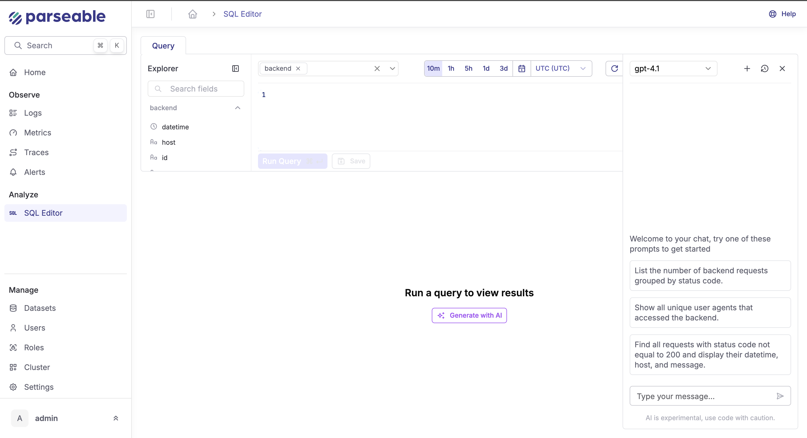

# Release Notes

## Version 2.3.2 (June 3, 2025)

### New Features

Today is a big milestone for us at Parseable. With the release of Parseable v2.3.2, we're not just adding new features, we're officially welcoming AI to the heart of your observability workflows. This release marks our very first step into AI-powered developer tools, making it even easier to explore, query, and anticipate your data. Whether you're a SQL pro or a newcomer, or simply want to stay ahead of your growing telemetry, v2.3.2 brings smarter, more intuitive capabilities straight into your workflow.

### AI Assistant for SQL Editor

If you've ever stared at a blinking cursor in the SQL editor, wondering how to build the right query for your latest troubleshooting adventure, you're not alone. With Parseable v2.3.2, you now have an AI-powered sidekick right inside your SQL editor.

Here's what's new:

- **Query in Plain English**: Simply tell the assistant what you want, "show me all error logs for the last hour grouped by host," and it'll generate the SQL for you.

- **Multiple LLM Providers**: We know teams have preferences and constraints, so you can pick your favorite large language model (LLM) from the settings page. Out of the box, we support:
  - OpenAI GPT
  - Anthropic Claude

- **Plug-and-Play Configuration**: No extra setup headaches. Add your provider key, set your preferences, and you're ready to start querying.

This feature isn't just about convenience, it's about making data exploration accessible to everyone on your team, from SREs to product managers. The AI Assistant means faster queries, less context-switching, and more time for actual problem-solving.

### Chat with AI

At the bottom of your SQL editor, you'll now see a "Generate with AI" button. Use this to ask anything from:

- "Show me the number of 5xx errors grouped by host for the last hour"
- "Fix this query, it's giving a syntax error"
- "Summarize response statuses per environment tag"

The assistant understands context from your current datasets and query history, giving you results tailored to what you're working on. It also comes in handy when onboarding new team members. Junior engineers or analysts often need help crafting their first few queries. With the AI assistant, they can describe what they're looking for in plain language, like "Find the top 5 most common user agents in the backend table and how many times each appears?" and get an immediate, working query they can tweak and learn from.

Even seasoned users benefit when dealing with complex joins, window functions, or new datasets they haven't touched before. You can prompt the assistant with "Can you help me write a query that shows trends in status codes over time, grouped by host and tag-environment, and highlights spikes in error responses?" and get a scaffolded SQL with placeholders or editable sections you can refine.

In high-pressure situations, like an ongoing incident, the AI assistant acts as a query co-pilot. It reduces cognitive load, speeds up iteration, and lowers the risk of human error when time is critical. And because you can configure your preferred LLM in the settings, teams can balance performance, compliance, and cost based on their stack.

### Chat History

Every prompt and response is automatically saved. Click the "History" tab in the assistant panel to revisit, rerun, or refine past prompts. To make your workflow even smoother, Parseable also stores the full history of your AI interactions. Every prompt you've sent to the assistant, whether it's fixing a query, generating one from scratch, or just exploring a new dataset is saved alongside the responses. This means you can revisit past queries, reuse them in future investigations, or track how a particular issue evolved over time.

This is especially useful during incident retrospectives or recurring analytics, you'll never lose a good query again.

### The Library (Saved SQL, Now Smarter)

With Parseable 2.3.0, saved SQL queries live in the new Library. You can now:

- Save queries you want to reuse
- Edit queries with the help of AI
- Run them directly from the library pane
- Explain what a query does using the assistant

The library is your personal or team-wide knowledge base for telemetry insights.

### Failed Query? Let AI Fix It

Let's say you're investigating a sudden spike in latency reported by your alerting system. You jump into Parseable, type a rough query to check average response times, but something's off, either the field doesn't exist or the aggregation logic is incorrect. Instead of trial-and-error debugging, you can now ask the AI assistant:

"Fix with AI"

The assistant returns a corrected version using the correct percentile function and known schema fields, saving minutes or even hours of digging through docs and schema dumps.

This turns errors into learning moments and lets you recover faster in the middle of a high-pressure incident.

### Forecasting for Log Ingestion

Ever wish you could see into the future of your observability pipeline? Along with AI assisted SQL queries, now you can forecast the future ingestion load, with Parseable's new forecasting for log ingestion.

What this means for you:

- **Data-Driven Forecasts**: Our forecasting engine uses your recent log ingestion patterns to predict what's coming next. Enable it, and you'll see projected ingestion volumes right in your dashboards.

- **Smarter Planning**: Spot upcoming spikes before they happen. Plan capacity, staffing, and alerting based on real forecasts, not just yesterday's numbers.

- **Visualized Right Where You Need It**: Forecasts appear directly in the Parseable Explore UI, so you can compare historical and predicted loads at a glance.

Whether you're scaling infrastructure or just want to avoid surprises, forecasting helps you move from reactive to proactive.
