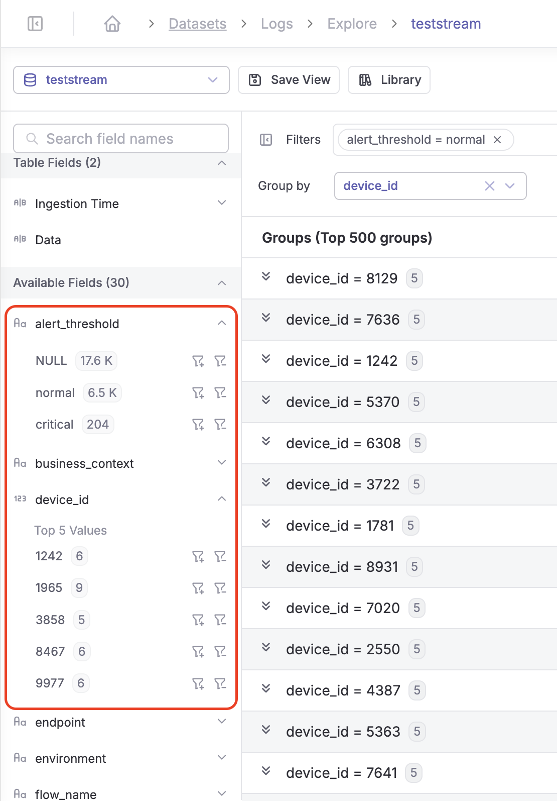
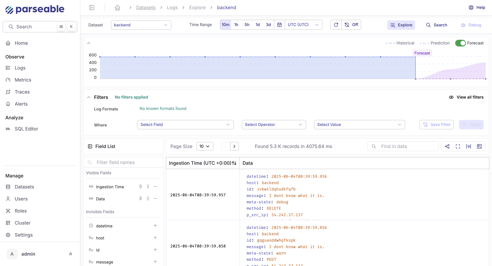

## v2.3.4 (June 26, 2025)

We’re excited to roll out Parseable **v2.3.4**, a release packed with features that make exploring, debugging, and managing your observability data simpler and more powerful than ever. Here’s everything new:

### 1. **Filters & Group By: Slice, Dice, and Save Your Logs**

**What’s new?**
You can now filter and group logs directly from the log explorer using a flexible, built-in filter panel. Not only can you **filter logs by any field** (e.g., `service=payments`, `env=prod`), you can also **group them by any field** to spot patterns and outliers fast.

**How it works:**

* **Build a filter:** Type in the filter panel just like a search box—e.g., `status=error AND region=us-west-2`.
* **Add a group by:** Instantly group results by `error_code` or `user_id` to see which issues are most frequent or which users are affected.

* **Save filter views:** Liked what you built? Click “Save to Library” and name the view (e.g., `Payments Errors Last Week`). Next time, just apply it from the Library to debug similar issues—no more rebuilding filters from scratch.

**Example:**
Troubleshooting an incident in the `payments` service?

* Filter: `service=payments AND status=error`
* Group by: `error_code`
* Result: A quick tally of error types, so you can spot if a particular error is spiking.

**Benefits:**

* Saved filters help you build a library of ready-to-use “debug recipes.”
* The panel is as easy as typing, no complex query syntax required.
* Perfect for SREs and devs who want fast, repeatable root cause analysis.

### 2. **AI-Powered Forecasts—Now Available for Filters**

We’ve extended our **AI-based ingestion forecasting** to work with *any* filter you apply. This means you can select a filtered view (e.g., just logs for a specific team or region) and get **automatic predictions** for future log volumes based on your selection.

**Benefits:**

* Filter logs to `env=prod AND region=eu-central-1`
* Instantly see a chart forecasting ingestion volume for just those logs
* Plan ahead for traffic spikes, storage needs, or incident response
* No more guessing how much your filtered logs will grow over time!

### 3. **Field Stats: Occurrence Counts & Drill Down Made Easy**

You can now see detailed stats for any field in your telemetry, right in the UI. For every field (like `status`, `endpoint`, `customer_id`), Parseable shows:

* **Count of unique values** (e.g., how many different status codes?)
* **Frequency/occurrence** of each value (e.g., how many times did `status=error` appear?)
* **Order and drill down**: Click any value to instantly filter logs to just that slice.

**Example:**
Investigating API failures?

* Click `status` → see all possible values (e.g., `200`, `404`, `500`) and how often each occurred
* Click on `500` → now you’re only seeing server errors, ready to debug further
* Combine with group by `endpoint` to see which routes are most affected

Here's a demo video showcasing the filters feature: 

<YouTubeEmbed videoId="btme5j9kzKY" />

### 4. **Multi-Role Support for OIDC Users**

Teams often need flexible, fine-grained access control—now Parseable’s OIDC integration supports **assigning multiple roles to a single user**.

**Benefits:**

* Give a DevOps engineer both `admin` and `reader` roles for different datasets
* Grant a user `editor` + `reader` permissions, so they can review logs across datasets without manual role shuffling
* All roles are respected in UI and API, just assign them in your OIDC provider and Parseable does the rest

## v2.3.3 (June 17, 2025)

### Performance Improvements

- **Optimized Conversion Task Assignment**: Improved the conversion task system to assign a definite set of arrow files for each conversion task, preventing multiple tasks from processing the same files during heavy loads.

- **Parallel Object Store Sync**: Enhanced object store synchronization to run in parallel for each dataset, significantly improving performance under heavy loads compared to the previous sequential approach.

- **Full Core Utilization**: Increased thread allocation for conversion and sync task handlers from 2 threads to utilizing all available server cores, resulting in better overall performance of conversion and sync workflows.

- **Startup Recovery Process**: Added a conversion and sync task that runs at server startup to process any pending files that weren't processed due to unplanned server shutdowns, improving system resilience.

### Bug Fixes

- **Fixed Poison Errors**: Resolved issues with poison errors that occurred when write locks acquired by ingestion threads panicked.

## v2.3.2 (June 3, 2025)

### New Features

Today is a big milestone for us at Parseable. With the release of Parseable v2.3.2, we're not just adding new features, we're officially welcoming AI to the heart of your observability workflows. This release marks our very first step into AI-powered developer tools, making it even easier to explore, query, and anticipate your data. Whether you're a SQL pro or a newcomer, or simply want to stay ahead of your growing telemetry, v2.3.2 brings smarter, more intuitive capabilities straight into your workflow.

### AI Assistant for SQL Editor

If you've ever stared at a blinking cursor in the SQL editor, wondering how to build the right query for your latest troubleshooting adventure, you're not alone. With Parseable v2.3.2, you now have an AI-powered sidekick right inside your SQL editor.

Here's what's new:

- **Query in Plain English**: Simply tell the assistant what you want, "show me all error logs for the last hour grouped by host," and it'll generate the SQL for you.

- **Multiple LLM Providers**: We know teams have preferences and constraints, so you can pick your favorite large language model (LLM) from the settings page. Out of the box, we support:
  - OpenAI GPT
  - Anthropic Claude

- **Plug-and-Play Configuration**: No extra setup headaches. Add your provider key, set your preferences, and you're ready to start querying.

This feature isn't just about convenience, it's about making data exploration accessible to everyone on your team, from SREs to product managers. The AI Assistant means faster queries, less context-switching, and more time for actual problem-solving.

### Chat with AI

At the bottom of your SQL editor, you'll now see a "Generate with AI" button. Use this to ask anything from:

- "Show me the number of 5xx errors grouped by host for the last hour"
- "Fix this query, it's giving a syntax error"
- "Summarize response statuses per environment tag"

The assistant understands context from your current datasets and query history, giving you results tailored to what you're working on. It also comes in handy when onboarding new team members. Junior engineers or analysts often need help crafting their first few queries. With the AI assistant, they can describe what they're looking for in plain language, like "Find the top 5 most common user agents in the backend table and how many times each appears?" and get an immediate, working query they can tweak and learn from.

Even seasoned users benefit when dealing with complex joins, window functions, or new datasets they haven't touched before. You can prompt the assistant with "Can you help me write a query that shows trends in status codes over time, grouped by host and tag-environment, and highlights spikes in error responses?" and get a scaffolded SQL with placeholders or editable sections you can refine.

In high-pressure situations, like an ongoing incident, the AI assistant acts as a query co-pilot. It reduces cognitive load, speeds up iteration, and lowers the risk of human error when time is critical. And because you can configure your preferred LLM in the settings, teams can balance performance, compliance, and cost based on their stack.

### Chat History

Every prompt and response is automatically saved. Click the "History" tab in the assistant panel to revisit, rerun, or refine past prompts. To make your workflow even smoother, Parseable also stores the full history of your AI interactions. Every prompt you've sent to the assistant, whether it's fixing a query, generating one from scratch, or just exploring a new dataset is saved alongside the responses. This means you can revisit past queries, reuse them in future investigations, or track how a particular issue evolved over time.

This is especially useful during incident retrospectives or recurring analytics, you'll never lose a good query again.

### The Library (Saved SQL, Now Smarter)

With Parseable 2.3.0, saved SQL queries live in the new Library. You can now:

- Save queries you want to reuse
- Edit queries with the help of AI
- Run them directly from the library pane
- Explain what a query does using the assistant

The library is your personal or team-wide knowledge base for telemetry insights.

### Failed Query? Let AI Fix It

Let's say you're investigating a sudden spike in latency reported by your alerting system. You jump into Parseable, type a rough query to check average response times, but something's off, either the field doesn't exist or the aggregation logic is incorrect. Instead of trial-and-error debugging, you can now ask the AI assistant:

"Fix with AI"

The assistant returns a corrected version using the correct percentile function and known schema fields, saving minutes or even hours of digging through docs and schema dumps.

This turns errors into learning moments and lets you recover faster in the middle of a high-pressure incident.

### Forecasting for Log Ingestion

Ever wish you could see into the future of your observability pipeline? Along with AI assisted SQL queries, now you can forecast the future ingestion load, with Parseable's new forecasting for log ingestion.

What this means for you:

- **Data-Driven Forecasts**: Our forecasting engine uses your recent log ingestion patterns to predict what's coming next. Enable it, and you'll see projected ingestion volumes right in your dashboards.

- **Smarter Planning**: Spot upcoming spikes before they happen. Plan capacity, staffing, and alerting based on real forecasts, not just yesterday's numbers.

- **Visualized Right Where You Need It**: Forecasts appear directly in the Parseable Explore UI, so you can compare historical and predicted loads at a glance.

Whether you're scaling infrastructure or just want to avoid surprises, forecasting helps you move from reactive to proactive.

## v2.3.1

### Highlights

- Global search datasets, saved filters, SQL snippets… anything Parseable tracks.
- 𝗣_𝗠𝗔𝗫_𝗙𝗟𝗔𝗧𝗧𝗘𝗡_𝗟𝗘𝗩𝗘𝗟 env var to configure nested lists; default depth is 10, but you call configure as per your use-case.

## v2.3.0

### Enhancements

- SQL editor visualisation - SQL editor page allows slicing and dicing data exactly as you wish. We now added visualisation capabilities to the SQL editor. After running a query, you can either inspect the raw rows or quickly switch to a visual chart for better pattern recognition.

- Home chart improvements - Landing page shows a high level overview of your Parseable instance. We have now enhanced the overview section with deeper insights into total ingestion, compression and storage details.

- We’ve also improved the search API response in the sidebar, so you can quickly look up saved filters, alerts, datasets among others.

- Streaming response - We have now added support for streaming response for query. This improves responsiveness for queries that involve downloading larger data chunks. This is available as a flag for the query API. Refer to the Parseable docs on how to use this API.

### Enterprise updates

- Schema detection improvements: Parseable Enterprise edition supports automatic schema detection. The server identifies formats sent by a client when a header is set. Server also validates if the format is actually the same as set by header. This allows a consistent experience on the server side - so users can reliably build dashboards, alerts and other visualisations without being concerned about an offending client.

- In some cases where the format doesn’t match the header specified, we now added support for a column that marks this result. You can now decide to use the mismatched data or not based on the value of p_format_verified.

- LLM configuration across roles - As we proceed our journey of adding native Large Language Model (LLM) support to improve MTTR and leverage user’s time better. We have now added user specific actions to add LLM config.

- This means every user can have a separate LLM key and related config and use their config for their tasks with complete isolation from other user’s actions, history etc.

### Bug Fixes

- Timezone handling explore page - Fix timezone management on log explore page ensuring accurate log display aligned to user-selected timezones.

- Settings page access - Ensured the Settings page is consistently accessible to all users, addressing previous visibility inconsistencies.

- Loaders & error states - Added loading indicators and improved error messaging on user and dataset pages, resulting in a clearer user experience during data fetching and error scenarios.

- Distinct SQL query in Datasets API - Corrected SQL queries to accurately fetch distinct values, improving dataset API responses.

- Date stats deletion fix - Fixed deletion issues in date-level statistics, enhancing data consistency.

- Date level stats fix - Addressed inaccuracies in date-level statistics calculation, ensuring reliable data insights.

- Reject events when the dataset has too many fields - Implemented validation to reject events with more than 250 fields, improving platform stability.

- Allow invalid certificates - Allowed intra-cluster communication using invalid certificates, easing integration scenarios.

### Enterprise fixes

- ALB Log Regex Fix - Resolved regex parsing issues for ALB logs, ensuring accurate log ingestion.

- Create Index Form Validation - Fixed validation logic in the Create Index form, resolving form submission issues and improving user feedback during index creation.

