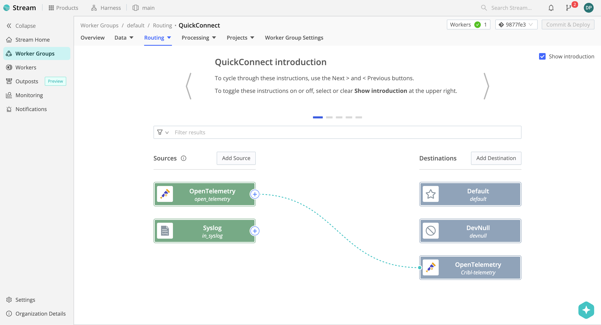
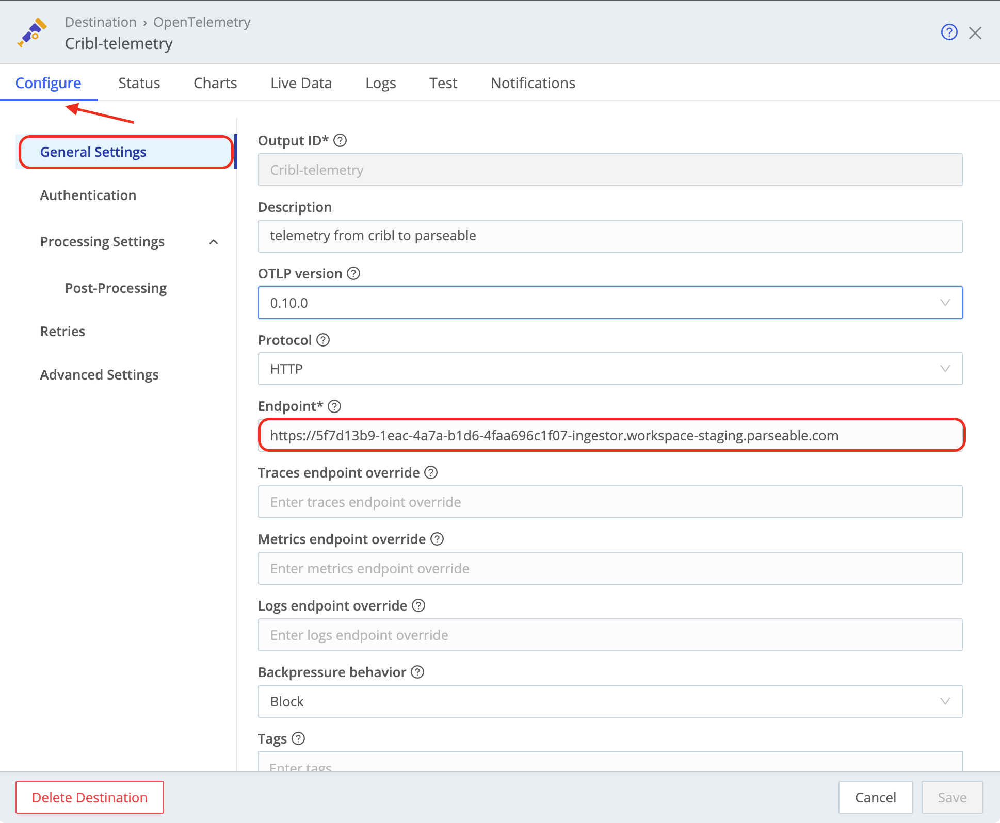
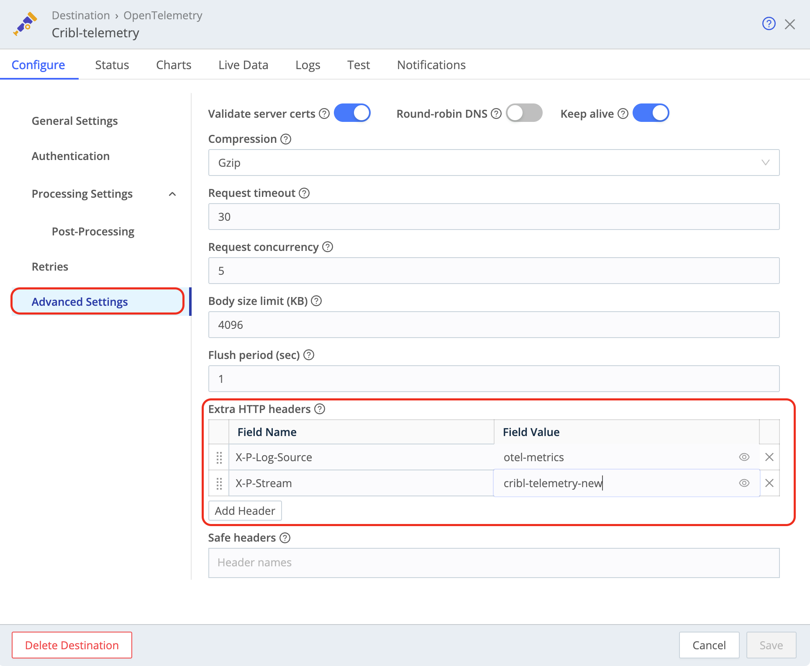
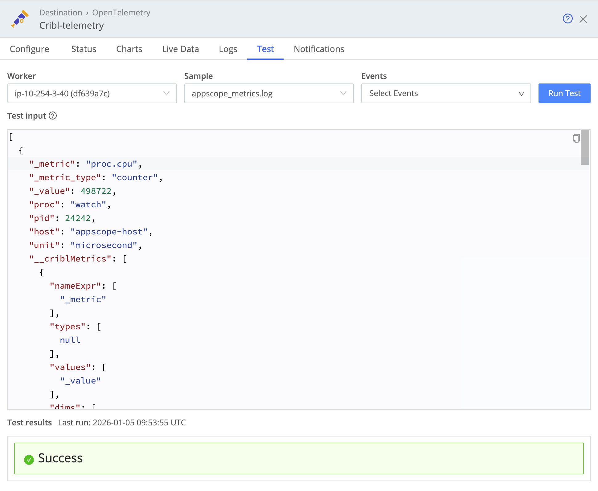

This guide explains how to add Parseable as a destination in Cribl Stream to forward your telemetry data.

## Prerequisites

- A running Cribl Stream instance
- [Parseable Cloud account](https://app.parseable.com)
- Your Parseable ingestor endpoint URL (obtain this from your Parseable Cloud dashboard)

## Adding Parseable as a Destination

To add a destination, you can use either QuickConnect or Routes. Here's how to use QuickConnect:

### Using QuickConnect

1. If on a Distributed deployment, select **Worker Groups** in the sidebar and choose a Worker Group.
2. Navigate to **Routing > QuickConnect**.
3. Select **Add Destination** and choose **OpenTelemetry** from the list.

### Configure General Settings

After selecting OpenTelemetry as your destination, configure the following settings:

| Setting | Value |
|---------|-------|
| **Output ID** | A unique identifier for this destination (e.g., `Cribl-telemetry`) |
| **Description** | A description for this destination (e.g., `telemetry from cribl to parseable`) |
| **OTLP version** | `0.10.0` |
| **Protocol** | `HTTP` |
| **Endpoint** | Your Parseable ingestor URL (e.g., `https://<your-instance>-ingestor.workspace-staging.parseable.com`) - make sure to use the correct ingestor URL for your environment without any trailing slash in the end |

### Configure Advanced Settings

Navigate to **Advanced Settings** to configure additional options:

| Setting | Recommended Value |
|---------|-------------------|
| **Validate server certs** | Enabled |
| **Keep alive** | Enabled |
| **Compression** | `Gzip` |
| **Request timeout** | `30` |
| **Request concurrency** | `5` |
| **Body size limit (KB)** | `4096` |
| **Flush period (sec)** | `1` |

### Configure Extra HTTP Headers

Add the following HTTP headers to route data to the correct Parseable stream:

| Field Name | Field Value |
|------------|-------------|
| `X-P-Log-Source` | `otel-metrics`, `otel-logs`, `otel-traces` (or your preferred log source) |
| `X-P-Stream` | Your target stream name (e.g., `cribl-telemetry-new`) |

## Authentication

Parseable instance requires authentication, navigate to the **Authentication** tab and configure your credentials:

- For Parseable Cloud, use your Login credentials

## Save and Test

1. Click **Save** to save your destination configuration.
2. Use the **Test** tab to verify connectivity to your Parseable instance.

3. Check the **Live Data** tab to monitor incoming data.
