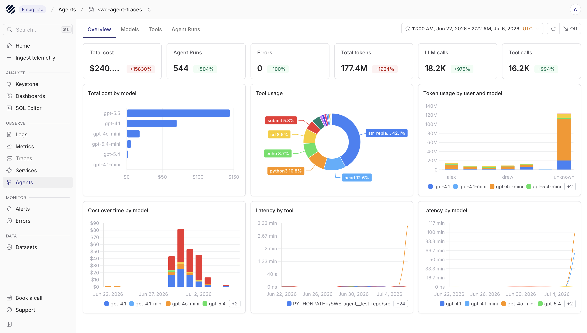
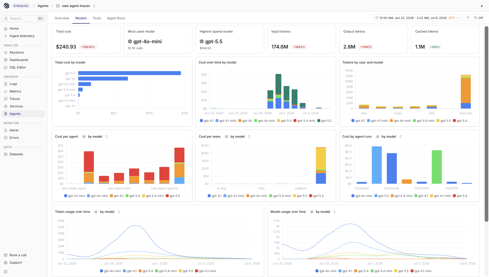
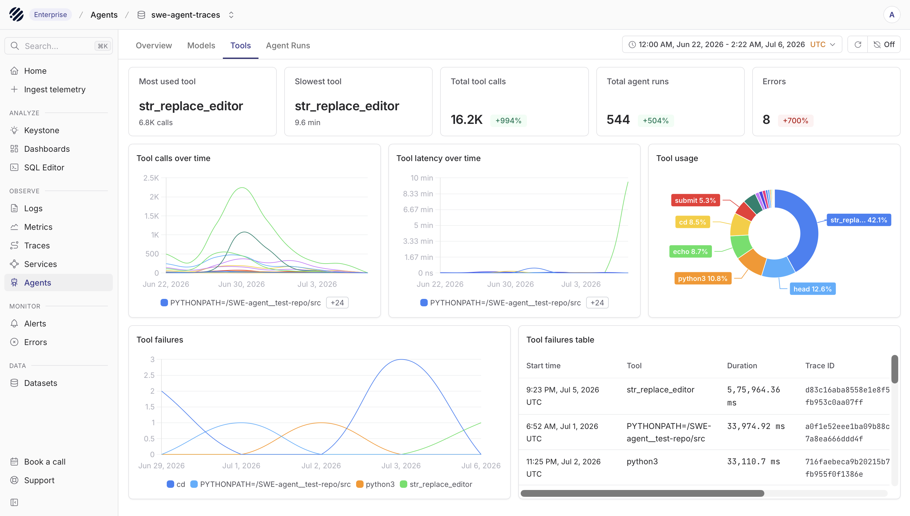

<OfferingPills cloud enterprise className="mb-4" />

Agents are already becoming part of everyday software. Sometimes users work with them directly. Sometimes they sit behind a workflow and quietly make decisions on their own. In both cases, a single request can quickly turn into multiple model calls, tool calls, retries, and intermediate steps before the final answer shows up.

That is usually where debugging gets hard. When the final answer is wrong, slow, or incomplete, the answer itself is not enough. You need to see the full run: what prompt started it, which model was used, what tools were called, what each tool received, what came back, how many tokens were spent, and where the run started to drift. That is the job of Agent Observability.

## Agent observability with Parseable

Parseable Agent Observability gives you that view inside Prism. You can begin with a high-level view of agent activity, look at model and tool behavior separately, and then move into a single agent run when you need the full execution path.

It is built on the [OpenTelemetry GenAI semantic conventions](https://opentelemetry.io/docs/specs/semconv/gen-ai/), so the telemetry follows a standard shape for model calls, token usage, inputs, outputs, tool calls, and agent spans. For message content, Parseable follows the native GenAI model: use `gen_ai.input.messages`, `gen_ai.output.messages`, `gen_ai.system_instructions`, and the `gen_ai.client.inference.operation.details` event when you capture full request and response details.

Once your agent is instrumented, the Agents page becomes the place where you understand how that agent behaves in production. You can see how often it runs, which models it uses, how many tokens it consumes, where it spends time, which tools it calls, and where a run needs review.

## Explore agent activity

The Agents page is organized around four tabs: Overview, Models, Tools, and Agent Runs. The dataset selector at the top lets you choose the traces dataset you want to inspect, while the time range picker controls the window used by every chart and table on the page.

### Overview



Start with the Overview tab when you want to understand the shape of agent activity before going deeper. It gives you the main health and usage signals in one place.

The summary cards show total cost, agent runs, errors, total tokens, LLM calls, and tool calls for the selected period. These are useful first checks. You can quickly see whether usage increased, whether errors appeared, and whether the growth is coming from more agent runs, more model calls, more tool calls, or heavier token usage.

Below the summary, the charts break the run down by model, tool, user, and time. Total cost by model shows which model is driving spend. Tool usage shows which tools are being called most often. Token usage by user and model helps you see who or what is consuming tokens. Cost over time, latency by tool, and latency by model help you spot spikes that are easier to miss in a table.

Use the time range picker in the top-right corner when you want to move from a broad view to a smaller investigation window. The whole page follows that selected range.

### Models



The Models tab is for understanding model behavior. Use it when you want to answer questions like: which model is used most, which model is the most expensive, where are tokens being spent, and whether a model is getting slower over time.

The top cards show total cost, most used model, highest spend model, input tokens, output tokens, and cached tokens. This gives you a quick model-level summary before you inspect the charts.

The charts let you compare total cost by model, cost over time by model, tokens by user and model, cost per agent, cost per team, cost by agent run, token usage over time, and model usage over time. This helps you see whether a cost spike came from a model switch, a specific user, a team, or a small number of expensive agent runs.

### Tools



The Tools tab helps you understand how the agent interacts with the outside world. This matters because many agent failures are not model failures. They happen when a tool is slow, returns unexpected output, fails repeatedly, or gets called too often.

The top cards show the most used tool, slowest tool, total tool calls, total agent runs, and errors. The charts below show tool calls over time, tool latency over time, tool usage, and tool failures.

The tool failures table gives you a path back to the run that failed. It includes the start time, tool name, duration, and trace ID, so you can move from a failing tool trend to the exact trace that explains it.

### Agent Runs


The Agent Runs tab is where you move from charts to individual runs. Use it when you need to inspect a specific prompt, a failed run, an expensive run, or a run that called too many tools.

The timeline at the top shows when runs happened. The table below lists each run with date, prompt, model, tokens, cost, duration, and operations. Operations show how many model interactions and tool calls happened inside the run, including failed tool calls when they exist.

Use Add filter to narrow the table when you already know what kind of run you are looking for. You can filter by fields such as model, tool, token counts, duration, errors, and other captured attributes. Use Find in data when you want to search within the currently visible results.

When you open a run, Parseable shows the trace behind it. User-facing input appears as user messages in the UI. Model or agent output appears as agent messages. Under the hood, keep this telemetry native to OpenTelemetry by recording message content with `gen_ai.input.messages`, `gen_ai.output.messages`, and `gen_ai.client.inference.operation.details` rather than relying on custom message event names.

## Instrument agents with Pydantic AI

Parseable now supports Agent Observability through Pydantic AI. If your agent is built with Pydantic AI, enable its OpenTelemetry instrumentation and send the traces to Parseable through an OpenTelemetry Collector. Parseable then uses those spans to build the Overview, Models, Tools, and Agent Runs views.

This is the recommended path because Pydantic AI already understands the agent structure. It emits spans for the agent run, model requests, and tool execution, while Parseable turns that telemetry into a UI that is easier to navigate than raw traces alone.

At a high level, the flow looks like this:

```text
Pydantic AI agent
  |
  | OpenTelemetry traces
  v
OpenTelemetry Collector
  |
  v
Parseable traces dataset
  |
  v
Agents page in Prism
```

In your Pydantic AI application, configure OpenTelemetry before the agent runs and enable Pydantic AI instrumentation:

```python
import os

from opentelemetry.exporter.otlp.proto.http.trace_exporter import OTLPSpanExporter
from opentelemetry.sdk.resources import Resource
from opentelemetry.sdk.trace import TracerProvider
from opentelemetry.sdk.trace.export import BatchSpanProcessor
from opentelemetry.trace import set_tracer_provider
from pydantic_ai import Agent, InstrumentationSettings


provider = TracerProvider(
    resource=Resource.create(
        {"service.name": os.getenv("OTEL_SERVICE_NAME", "pydantic-ai-agent")}
    )
)
provider.add_span_processor(BatchSpanProcessor(OTLPSpanExporter()))
set_tracer_provider(provider)

Agent.instrument_all(
    InstrumentationSettings(
        version=5,
        include_content=True,
    )
)
```

`version=5` uses Pydantic AI's current OpenTelemetry instrumentation format. `include_content=True` captures prompts, completions, and tool payloads in telemetry, so use it only when that content is safe to store.

## Language support matrix

Pydantic AI is a Python framework, so the supported setup in this guide is Python first. The telemetry still travels through OpenTelemetry, which means the data path stays open and standards-based.

| Path | Status |
| --- | --- |
| Pydantic AI with OpenTelemetry | Recommended |
| OpenTelemetry Collector export | Recommended for production |
| Direct OTLP export to Parseable | Useful for small or local setups |

---

## Collector configuration

After instrumentation is in place, the next step is deciding how you want to send the trace data to Parseable. For most teams, an OpenTelemetry Collector is the better default because it gives you batching and a more reliable path. If your setup is small, you can also export directly from the application.

### OpenTelemetry Collector (Recommended)

Put an OpenTelemetry Collector between your application and Parseable when you want a cleaner and more production-friendly path for export. Save the following as `parseable-genai-collector.yaml`:

```yaml
receivers:
  otlp:
    protocols:
      grpc:
        endpoint: 0.0.0.0:4317
      http:
        endpoint: 0.0.0.0:4318

processors:
  batch:
    timeout: 5s
    send_batch_size: 256

exporters:
  otlphttp/parseable:
    endpoint: ${PARSEABLE_URL}
    encoding: json
    headers:
      X-API-Key: "${PARSEABLE_API_KEY}"
      X-P-Stream: "${STREAM_NAME}"
      X-P-Log-Source: "otel-traces"
      X-P-Dataset-Tag: "agent-observability"

service:
  pipelines:
    traces:
      receivers: [otlp]
      processors: [batch]
      exporters: [otlphttp/parseable]
```

Run the collector:

```bash
export PARSEABLE_URL=${PARSEABLE_URL}          # e.g. https://ingest.parseable.com
export PARSEABLE_API_KEY=${PARSEABLE_API_KEY}
export STREAM_NAME=${PARSEABLE_DATASET_NAME}

otelcol-contrib --config parseable-genai-collector.yaml
```

### Direct to Parseable

For smaller setups, you can send traces directly from the application to Parseable with OTLP environment variables. This avoids running a separate collector process.

```bash
export OTEL_EXPORTER_OTLP_ENDPOINT=${PARSEABLE_URL}
export OTEL_EXPORTER_OTLP_HEADERS="X-API-Key=${PARSEABLE_API_KEY},X-P-Stream=${PARSEABLE_DATASET_NAME},X-P-Log-Source=otel-traces,X-P-Dataset-Tag=agent-observability"
export OTEL_SERVICE_NAME=my-agent
export OTEL_INSTRUMENTATION_GENAI_CAPTURE_MESSAGE_CONTENT=true
```

## SQL query templates

The Agents page should be the first place you inspect agent behavior. When you need to go deeper, you can query the same traces dataset directly with SQL. The examples below assume a dataset named `genai-traces`. Replace it with your dataset name if you use something different.

Span rows have `event_name IS NULL`. Most analytics queries should include this filter so span data is not mixed with event rows that carry prompt, completion, or other event-level content.

### LLM call summary

Use this when you want a quick per-model view of call volume, token usage, latency, and errors over the last 24 hours.

```sql
SELECT
    "gen_ai.request.model" AS model,
    COUNT(*) AS call_count,
    SUM("gen_ai.usage.input_tokens") AS total_input_tokens,
    SUM("gen_ai.usage.output_tokens") AS total_output_tokens,
    SUM(p_genai_tokens_total) AS total_tokens,
    ROUND(AVG(p_genai_duration_ms), 2) AS avg_latency_ms,
    ROUND(100.0 * SUM(CASE WHEN span_status_code = 2 THEN 1 ELSE 0 END) / COUNT(*), 2) AS error_rate_pct
FROM "genai-traces"
WHERE p_timestamp > NOW() - INTERVAL '24 hours'
    AND event_name IS NULL
    AND "gen_ai.operation.name" = 'chat'
GROUP BY "gen_ai.request.model"
ORDER BY total_tokens DESC;
```

### Reconstruct an agent run

Use this after you find a trace ID in the Agent Runs table. It lists the spans in that run in the order they happened.

```sql
SELECT
    span_name,
    "gen_ai.operation.name" AS operation,
    ROUND(p_genai_duration_ms, 2) AS duration_ms,
    "gen_ai.usage.input_tokens" AS input_tokens,
    "gen_ai.usage.output_tokens" AS output_tokens,
    span_status_description AS status,
    span_parent_span_id
FROM "genai-traces"
WHERE span_trace_id = '<TRACE_ID>'
    AND event_name IS NULL
ORDER BY span_start_time_unix_nano;
```

### Token usage over time

Use this to see hourly token consumption by model over the last 7 days.

```sql
SELECT
    DATE_TRUNC('hour', p_timestamp) AS hour,
    "gen_ai.request.model" AS model,
    SUM("gen_ai.usage.input_tokens") AS input_tokens,
    SUM("gen_ai.usage.output_tokens") AS output_tokens,
    SUM(p_genai_tokens_total) AS total_tokens
FROM "genai-traces"
WHERE p_timestamp > NOW() - INTERVAL '7 days'
    AND event_name IS NULL
    AND "gen_ai.usage.input_tokens" IS NOT NULL
GROUP BY hour, "gen_ai.request.model"
ORDER BY hour DESC, total_tokens DESC;
```

### Tool usage

Use this to understand which tools are called most often, how long they take, and how often they fail.

```sql
SELECT
    "gen_ai.tool.name" AS tool,
    COUNT(*) AS invocations,
    ROUND(AVG(p_genai_duration_ms), 2) AS avg_duration_ms,
    ROUND(100.0 * SUM(CASE WHEN span_status_code = 2 THEN 1 ELSE 0 END) / COUNT(*), 2) AS failure_rate_pct
FROM "genai-traces"
WHERE "gen_ai.operation.name" = 'execute_tool'
    AND p_timestamp > NOW() - INTERVAL '24 hours'
    AND event_name IS NULL
GROUP BY "gen_ai.tool.name"
ORDER BY invocations DESC;
```

### Recent errors

Use this when you want the latest failing model calls, tool calls, or agent spans.

```sql
SELECT
    p_timestamp,
    "gen_ai.request.model" AS model,
    "gen_ai.operation.name" AS operation,
    span_status_message AS error_message,
    span_trace_id,
    span_span_id,
    "gen_ai.agent.name" AS agent
FROM "genai-traces"
WHERE span_status_code = 2
    AND event_name IS NULL
    AND p_timestamp > NOW() - INTERVAL '24 hours'
ORDER BY p_timestamp DESC
LIMIT 50;
```

### Model comparison

Use this to compare models by latency, throughput, and token usage over the last 7 days.

```sql
SELECT
    "gen_ai.request.model" AS model,
    COUNT(*) AS calls,
    ROUND(AVG(p_genai_duration_ms), 2) AS avg_latency_ms,
    ROUND(PERCENTILE_CONT(0.95) WITHIN GROUP (ORDER BY p_genai_duration_ms), 2) AS p95_latency_ms,
    ROUND(AVG(p_genai_tokens_per_sec), 2) AS avg_tokens_per_sec,
    SUM(p_genai_tokens_total) AS total_tokens
FROM "genai-traces"
WHERE event_name IS NULL
    AND "gen_ai.operation.name" = 'chat'
    AND p_timestamp > NOW() - INTERVAL '7 days'
GROUP BY "gen_ai.request.model"
ORDER BY total_tokens DESC;
```
