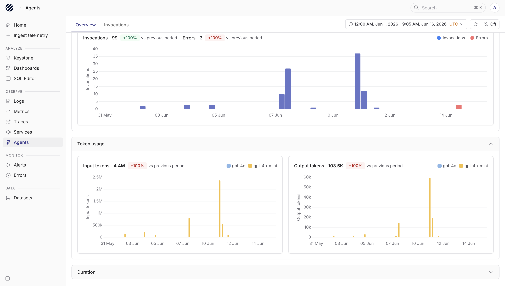
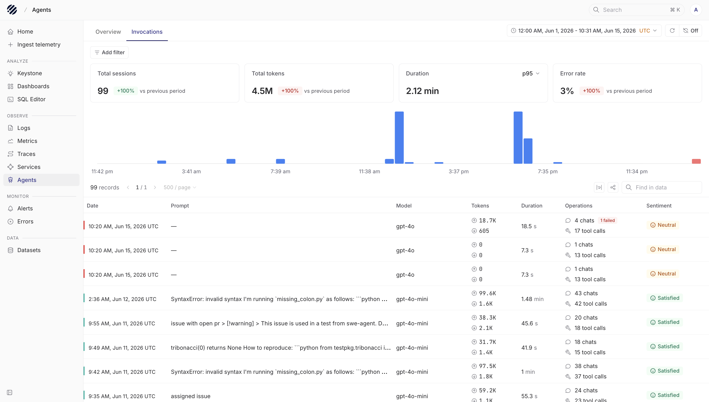
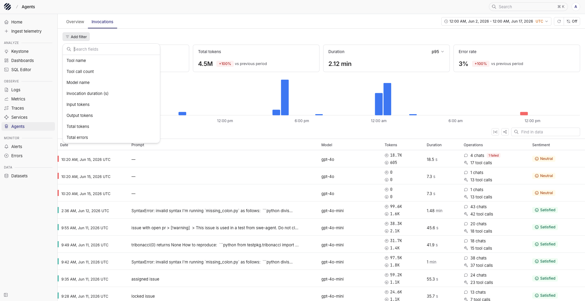
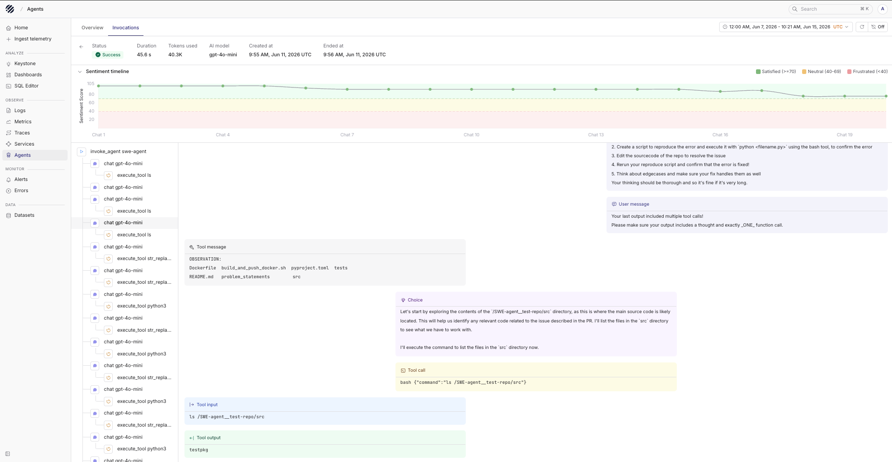

import { IconDatabase, IconCode, IconTerminal2 } from '@tabler/icons-react';

<OfferingPills pro enterprise className="mb-4" />

Agents are already becoming part of everyday software, sometimes users interact with them directly, and sometimes they run quietly behind a workflow. A single request can turn into a chain of model calls, tool calls, external APIs, retries, and intermediate outputs before the final answer is returned.

When that final answer is wrong, slow, or hard to explain, the response alone does not tell you enough. You need to see the complete invocation. This includes the original prompt, the model used, the tools called, the input sent to those tools, the output received, token usage, latency, and where the answer started to drift. That is the problem Agent Observability is meant to solve.

## Agent observability with Parseable

Parseable Agent Observability gives you that view in Prism. You can start with a high-level view of agent activity, move into a single invocation, and then inspect the exact LLM call or tool execution that explains what happened.

This is built on the [OpenTelemetry GenAI semantic conventions](https://github.com/open-telemetry/semantic-conventions-genai), so telemetry follows a standard shape for model calls, token usage, inputs, outputs, tool calls, and agent spans. Instead of putting agent telemetry in a custom black box, Parseable lets you observe it alongside the rest of your telemetry.

Once your agent is instrumented, the Agents page becomes the place to understand how your agents are behaving in production. You can see how often they run, which models they use, how many tokens they consume, where they spend time, what they call, and where the answer starts to drift.

<Callout type="idea">
Parseable enriches GenAI telemetry at ingest time with fields like `p_genai_tokens_total`, `p_genai_tokens_per_sec`, and `p_genai_duration_ms`, so token usage and latency analysis is available without extra client-side tracking.
</Callout>

## Typical workflow

### Overview tab



When you open the Agents page, you first land on the Overview tab. Start here when you want a quick health check of your agents over a selected time range.

The Invocations chart shows how many agent runs happened and how many of them ended in error. Token usage is split into input tokens and output tokens, grouped by model, so you can quickly see which model is consuming the most tokens. The Duration section helps you compare latency by tool and by model.

Use the time range picker in the top-right corner to change the window you are investigating. The charts update with the selected time range, so you can move from a broad view to a smaller incident window without leaving the page.

### Invocations tab



When you need to inspect actual runs, switch to the Invocations tab. This is where the aggregate view turns into individual agent sessions.

At the top, Parseable shows total sessions, total tokens, duration, and error rate for the selected period. Below that, the timeline shows when invocations happened and where errors appeared.

The table lists each invocation with the timestamp, prompt, model, token usage, duration, operations, and sentiment. The Operations column shows how many chats and tool calls were part of the run, including failed tool calls when they are present. The Sentiment column helps you scan whether the response looked satisfied, neutral, or frustrated.

You can also change the duration percentile from the dropdown in the Duration card, for example `p50`, `p95`, or `p99`, depending on whether you want to inspect typical latency or tail latency.

#### Filtering and time range



When the list gets large, filters help you reduce the noise. Use Add filter to narrow the investigation to a smaller set of invocations.

You can filter by fields such as tool name, tool call count, model name, invocation duration, input tokens, output tokens, total tokens, and total errors. This is useful when you already know the shape of the problem. For example, you can filter to a specific model, look at sessions with a high token count, or focus only on invocations where a tool failed.

The Find in data search box helps you search within the visible invocation data after the time range and filters are applied.

### Drill into an invocation



The real debugging starts when you open a row from the Invocations table. This opens the invocation detail view for that specific agent run.

The header shows the status, duration, tokens used, AI model, created time, and ended time. The Sentiment timeline shows how the interaction changed across the conversation, so you can see where the answer stayed useful, where satisfaction dipped, and where the run may need review.

Under it, the waterfall tree shows the full agent flow: the top-level invocation, each chat span, and each tool execution span. Selecting a chat or tool span opens the related details on the right, including user messages, assistant responses, tool inputs, tool outputs, and span-level details.

Use this view when you need to understand which prompt started the run, which model was used, which tools were called, what input was sent to the tool, what output came back, and where the run slowed down or failed.

## Manual instrumentation using the OpenTelemetry SDK

You can manually create spans with `gen_ai.*` attributes using the OpenTelemetry SDK directly.
This lets you instrument any provider, framework, or custom LLM client, and add the exact attributes your team needs for debugging and analysis.

At minimum, instrument these parts of the agent workflow:

1. **Agent-level spans:** `invoke_agent` spans that wrap the full agent loop
2. **Chat spans:** one `chat {model}` span for every LLM request
3. **Tool execution spans:** one `execute_tool {tool.name}` span for every tool or command execution
4. **GenAI event logs:** user messages, assistant messages, choices, tool calls, tool inputs, tool outputs, and reasoning blocks

Refer the [manual instrumentation guide](/docs/user-guide/agent-observability/manual-instrumentation) for detailed instructions on how to structure spans and what attributes to capture for complete agent observability.

## Language support matrix

Any language that can emit OpenTelemetry traces and logs over OTLP can send agent observability data to Parseable. The manual guide currently uses Python examples, but the schema is language-agnostic.

| Language   | Manual OpenTelemetry SDK |
|------------|-----------------|
| Python     | Yes             |
| TypeScript | Yes             |
| Java       | Yes             |
| Go         | Yes             |
| .NET       | Yes             |

---

## Collector configuration

After the instrumentation is set up in your application, configure how telemetry data is sent to Parseable. We recommend using an OpenTelemetry Collector for buffering, batching, and reliability, but you can also export directly from your application for simpler setups.

### OpenTelemetry Collector (Recommended)

Deploy an OpenTelemetry Collector between your application and Parseable for buffering, batching, and reliability. Save the following as `parseable-genai-collector.yaml`:

```yaml
receivers:
  otlp:
    protocols:
      grpc:
        endpoint: 0.0.0.0:4317
      http:
        endpoint: 0.0.0.0:4318

processors:
  batch:
    timeout: 5s
    send_batch_size: 256

exporters:
  otlphttp/parseable:
    endpoint: ${PARSEABLE_URL}
    encoding: json
    headers:
      Authorization: "Basic ${PARSEABLE_AUTH}"
      X-P-Stream: "${STREAM_NAME}"
      X-P-Log-Source: "otel-traces"
      X-P-Dataset-Tag: "agent-observability"

service:
  pipelines:
    traces:
      receivers: [otlp]
      processors: [batch]
      exporters: [otlphttp/parseable]
```

Run the collector:

```bash
export PARSEABLE_URL=${PARSEABLE_URL}          # e.g. https://ingest.parseable.com
export PARSEABLE_AUTH=${PARSEABLE_AUTH}          # base64(username:password)
export STREAM_NAME=${PARSEABLE_DATASET_NAME}

otelcol-contrib --config parseable-genai-collector.yaml
```

### Direct to Parseable

For simpler setups, you can export traces directly from your application to Parseable by setting OTLP environment variables. No collector process is needed.

```bash
export OTEL_EXPORTER_OTLP_ENDPOINT=${PARSEABLE_URL}
export OTEL_EXPORTER_OTLP_HEADERS="Authorization=Basic ${PARSEABLE_AUTH},X-P-Stream=${PARSEABLE_DATASET_NAME},X-P-Log-Source=otel-traces,X-P-Dataset-Tag=agent-observability"
export OTEL_SERVICE_NAME=my-agent
export OTEL_INSTRUMENTATION_GENAI_CAPTURE_MESSAGE_CONTENT=true
```

## Next steps

<Cards>

<Card href="/docs/user-guide/agent-observability/manual-instrumentation" icon={<IconTerminal2 className="text-purple-600" />} title='Manual instrumentation guide'>
Complete reference for instrumenting any GenAI agent with OpenTelemetry traces and correlated logs.
</Card>

<Card href="/docs/user-guide/agent-observability/schema-reference" icon={<IconDatabase className="text-purple-600" />} title='Schema Reference'>
Complete column reference for the flattened GenAI trace.
</Card>

<Card href="/docs/user-guide/agent-observability/sql-queries" icon={<IconCode className="text-purple-600" />} title='SQL Query Templates'>
Sample SQL queries for common agent observability tasks like.
</Card>

</Cards>
