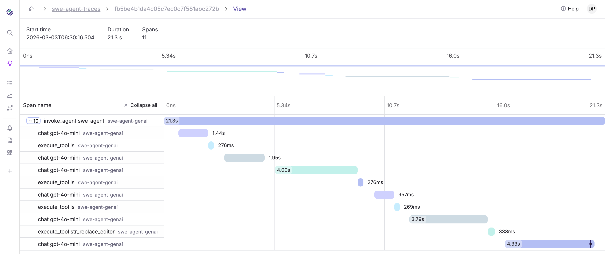

import { IconRocket, IconDatabase, IconCode, IconTerminal2 } from '@tabler/icons-react';

Parseable is a zero-SDK, OTel-native backend purpose-built for GenAI agent observability. Instead of requiring proprietary SDKs or lock-in instrumentation, Parseable ingests standard OpenTelemetry `gen_ai.*` semantic convention traces and correlated logs, storing them in a SQL-queryable columnar format. This gives you end-to-end visibility into agent runs — from the problem statement that triggers an agent, through every LLM call and tool execution, to the final result.

Key differentiators:

- **Complete agent waterfall** -- See every operation in an agent run: the problem statement, each LLM call with full conversation content, each tool execution with input/output, and the agent completion summary. All correlated via `trace_id`.
- **SQL-native querying** -- Run standard SQL directly on your agent traces and logs. No proprietary query language, no dashboards-only access. Full ad-hoc analysis from day one.
- **Server-side cost enrichment** -- Parseable automatically computes `p_genai_cost_usd`, `p_genai_tokens_total`, `p_genai_tokens_per_sec`, and `p_genai_duration_ms` at ingest time, so you never need client-side cost tracking.
- **Fully open-source** -- No vendor lock-in. Deploy on your own infrastructure, retain full ownership of your data, and integrate with the OTel ecosystem you already use.

<Cards>

<Card href="/docs/user-guide/agent-observability/quickstart" icon={<IconRocket className="text-purple-600" />} title='Quickstart'>
Get LLM call traces flowing into Parseable in under 5 minutes. Covers zero-code, two-line, and manual instrumentation paths with OTel Collector and direct export configurations.
</Card>

<Card href="/docs/user-guide/agent-observability/instrumentation-guide" icon={<IconTerminal2 className="text-purple-600" />} title='Instrumentation Guide'>
Complete reference for instrumenting any GenAI agent with OpenTelemetry traces and correlated logs — agent runs, LLM calls, tool executions, conversation content, and reasoning blocks.
</Card>

<Card href="/docs/user-guide/agent-observability/schema-reference" icon={<IconDatabase className="text-purple-600" />} title='Schema Reference'>
Complete column reference for the flattened GenAI trace schema, including core OTel span fields, gen_ai.* semantic conventions, and Parseable-enriched computed columns.
</Card>

<Card href="/docs/user-guide/agent-observability/sql-queries" icon={<IconCode className="text-purple-600" />} title='SQL Query Templates'>
Copy-paste SQL queries for common agent observability tasks: cost analysis, token tracking, error debugging, tool usage, model comparison, and more.
</Card>

</Cards>
