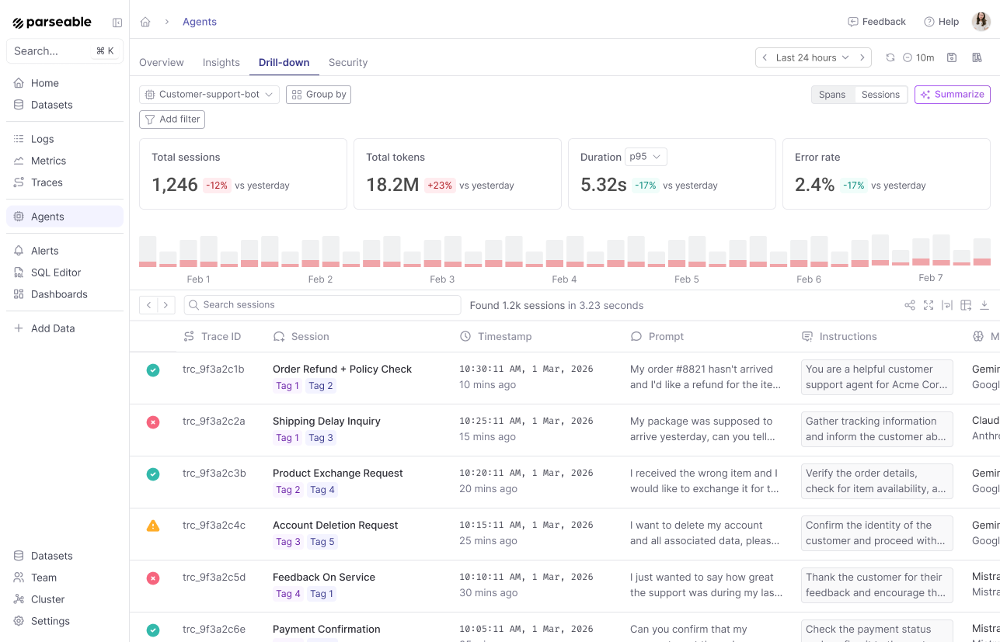
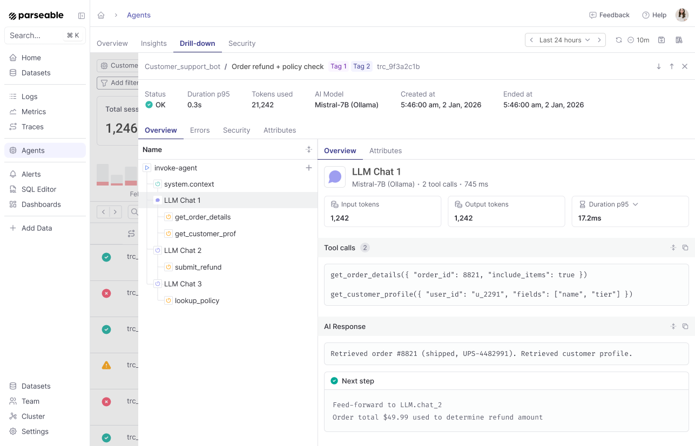
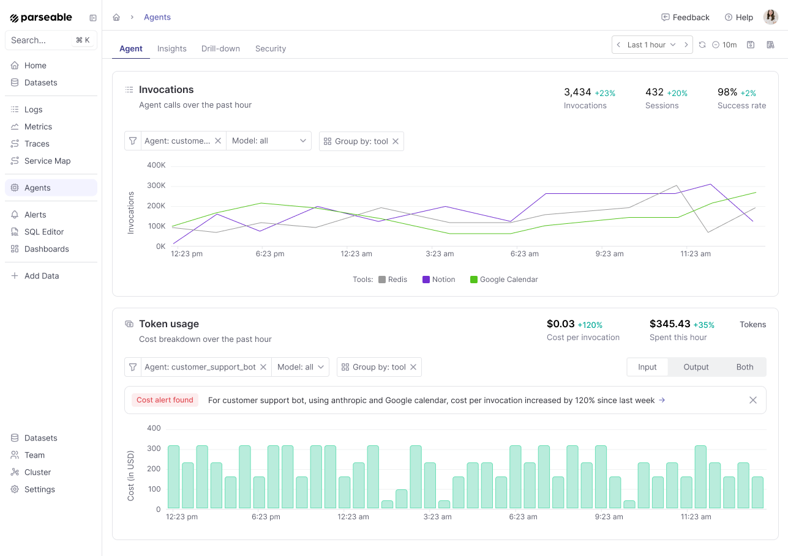
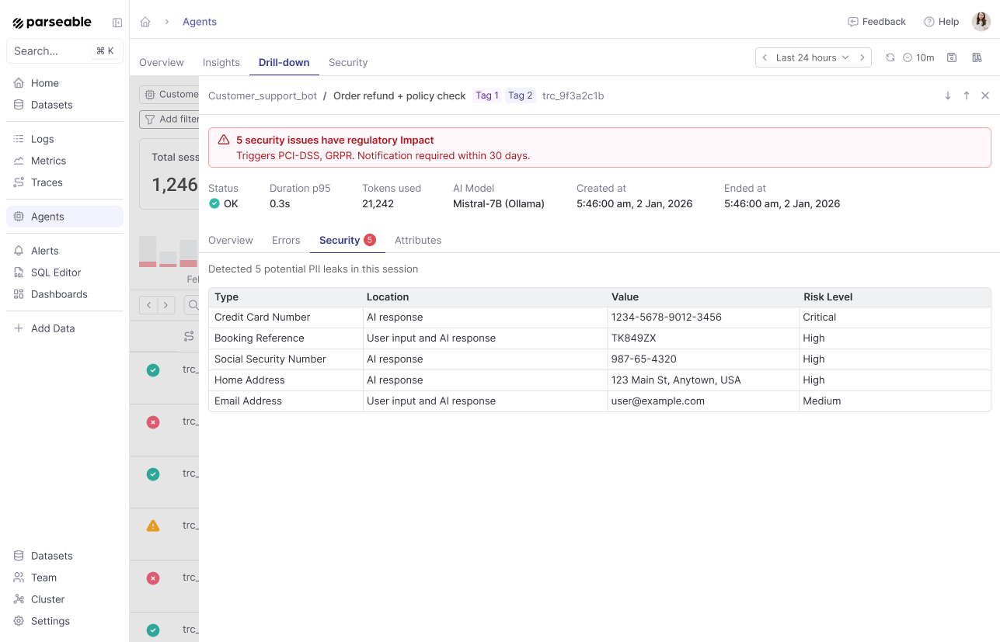

import { IconRocket, IconDatabase, IconCode, IconTerminal2 } from '@tabler/icons-react';

<OfferingPills pro enterprise className="mb-4" />

AI agents interact with LLMs, tools, and API - all in one workflow. In essence, agents are complex distributed applications, and require end-to-end visibility across all systems for effective observability.

Take for example a customer support agent that uses a vector database for knowledge retrieval, an LLM for response generation, and a third-party API for order management. 

If the agent produces an incorrect response, you need to know whether the issue was with the knowledge retrieval, the LLM generation, or the API call. Furthermore, if the issue was with say the vector database responding slowly, you want to know why the vector database was slow - was it a CPU bottleneck, memory pressure, or something else.

## Agent observability with Parseable

Parseable enables agent observability using zero SDK, OTel native instrumentation. Instead of proprietary SDKs and formats, Parseable ingests standard OpenTelemetry `gen_ai.*` semantic convention traces and correlates logs. 



## Key differentiators

### Unified waterfall view
With Parseable you can see every operation in an agent's workflow: the problem statement, each LLM call with full conversation content, each tool execution with input/output, and the agent completion summary. All correlated via `trace_id`.



### Session drill down 
Browse all agent sessions with prompts, instructions, models, and status. Filter by agent, time range, or tags to find exactly the sessions you need.



### Server side cost enrichment 
Parseable automatically computes `p_genai_cost_usd`, `p_genai_tokens_total`, `p_genai_tokens_per_sec`, and `p_genai_duration_ms` at ingest time, so you never need client-side cost tracking.

### Security and PII detection 
Automatically detect PII leaks in agent sessions — credit card numbers, SSNs, addresses, and more — with risk levels and regulatory impact flags.



### SQL querying 
Run standard SQL directly on your agent traces and logs. No proprietary query language, no dashboards only access. Slice and dice your agent data any way you want, and join with your own datasets for deeper analysis.

### Open standards for extensibility 
No vendor lock-in. Deploy on your own infrastructure, retain full ownership of your data, and integrate with the OTel ecosystem you already use.

## Instrumentation paths

### Path A: Auto instrumentation with OpenAI SDK

In this approach, you get zero code change, auto instrumentation of all LLM calls, including conversation content, token counts, and latency. This is the fastest way to get LLM call traces flowing into Parseable, and is ideal if you are using the OpenAI Python SDK.

Refer the [OpenAI SDK quickstart guide](/docs/user-guide/agent-observability/quickstart#auto-instrumentation-with-openai-sdk) for detailed instructions on setting up auto instrumentation with the OpenAI Python SDK.

### Path B: Auto instrumentation with other SDKs

For broader provider support (Anthropic, Cohere, Mistral, Bedrock, VertexAI, and more), use OpenLLMetry (Traceloop SDK) or OpenLIT. These require only two lines of code added to your application entry point.

Refer to the [Other SDKs quickstart guide](/docs/user-guide/agent-observability/quickstart#auto-instrumentation-with-other-sdks) for detailed instructions on setting up auto instrumentation with OpenLLMetry or OpenLIT.

### Path C: Manual instrumentation using OTel SDK

For maximum control, you can manually create spans with `gen_ai.*` attributes using the OpenTelemetry SDK directly.
This requires more code changes, but allows you to instrument any provider or custom LLM client, and to add custom attributes as needed.

Manual instrumentation is also necessary for:

1. **Agent-level spans** — `invoke_agent` spans that wrap the entire agent loop are not created by auto-instrumentors
2. **Tool execution spans** — `execute_tool` spans for tool/command execution are application-specific
3. **Thinking/reasoning blocks** — Claude's `thinking_blocks` and DeepSeek's `reasoning_content` are provider-specific extensions not captured by auto-instrumentors
4. **Full control** — manual instrumentation gives you exact control over what attributes are set, what content is captured, and how spans are structured

Typically manual instrumentation replaces auto-instrumentation entirely (disable auto with `OTEL_PYTHON_DISABLED_INSTRUMENTATIONS=openai_v2`).

## Language support matrix

| Language   | Path A: OpenAI SDK  | Path B: Other providers SDK | Path C: OTEL SDK    |
|------------|---------------------|-----------------------------|---------------------|
| Python     | Yes                 | Yes (Traceloop, OpenLIT)    | Yes                 |
| TypeScript | Yes                 | Yes (Traceloop)             | Yes                 |
| Java       | No                  | No                          | Yes                 |
| Go         | No                  | No                          | Yes                 |
| .NET       | No                  | No                          | Yes                 |

---

## Collector configuration

After the instrumentation is set up in your application, configure how telemetry data is sent to Parseable. We recommend using an OpenTelemetry Collector for buffering, batching, and reliability, but you can also export directly from your application for simpler setups.

### OTel Collector (Recommended)

Deploy an OpenTelemetry Collector between your application and Parseable for buffering, batching, and reliability. Save the following as `parseable-genai-collector.yaml`:

```yaml
receivers:
  otlp:
    protocols:
      grpc:
        endpoint: 0.0.0.0:4317
      http:
        endpoint: 0.0.0.0:4318

processors:
  batch:
    timeout: 5s
    send_batch_size: 256

exporters:
  otlphttp/parseable:
    endpoint: ${PARSEABLE_URL}
    encoding: json
    headers:
      Authorization: "Basic ${PARSEABLE_AUTH}"
      X-P-Stream: "${STREAM_NAME}"
      X-P-Log-Source: "otel-traces"
      X-P-Dataset-Tag: "agent-observability"

service:
  pipelines:
    traces:
      receivers: [otlp]
      processors: [batch]
      exporters: [otlphttp/parseable]
```

Run the collector:

```bash
export PARSEABLE_URL=${PARSEABLE_URL}          # e.g. https://ingest.parseable.com
export PARSEABLE_AUTH=${PARSEABLE_AUTH}          # base64(username:password)
export STREAM_NAME=${PARSEABLE_DATASET_NAME}

otelcol-contrib --config parseable-genai-collector.yaml
```

### Direct to Parseable

For simpler setups, you can export traces directly from your application to Parseable by setting OTLP environment variables. No collector process is needed.

```bash
export OTEL_EXPORTER_OTLP_ENDPOINT=${PARSEABLE_URL}
export OTEL_EXPORTER_OTLP_HEADERS="Authorization=Basic ${PARSEABLE_AUTH},X-P-Stream=${PARSEABLE_DATASET_NAME},X-P-Log-Source=otel-traces,X-P-Dataset-Tag=agent-observability"
export OTEL_SERVICE_NAME=my-agent
export OTEL_INSTRUMENTATION_GENAI_CAPTURE_MESSAGE_CONTENT=true
```

## Next steps

<Cards>

<Card href="/docs/user-guide/agent-observability/quickstart" icon={<IconRocket className="text-purple-600" />} title='Quickstart'>
Get LLM call traces flowing into Parseable in under 5 minutes
</Card>

<Card href="/docs/user-guide/agent-observability/instrumentation-guide" icon={<IconTerminal2 className="text-purple-600" />} title='Instrumentation Guide'>
Complete reference for instrumenting any GenAI agent with OpenTelemetry traces and correlated logs.
</Card>

<Card href="/docs/user-guide/agent-observability/schema-reference" icon={<IconDatabase className="text-purple-600" />} title='Schema Reference'>
Complete column reference for the flattened GenAI trace.
</Card>

<Card href="/docs/user-guide/agent-observability/sql-queries" icon={<IconCode className="text-purple-600" />} title='SQL Query Templates'>
Sample SQL queries for common agent observability tasks like.
</Card>

</Cards>
