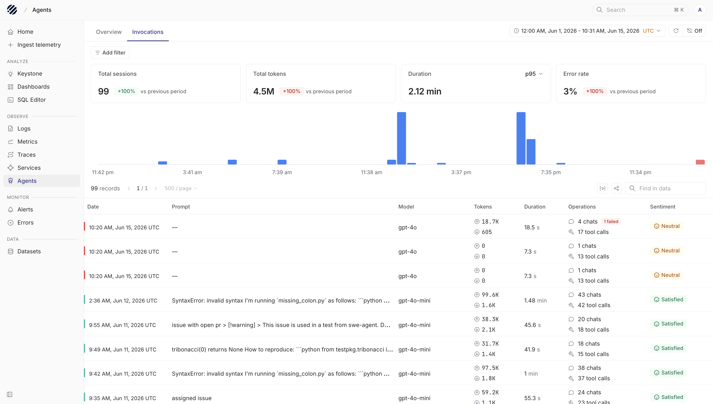
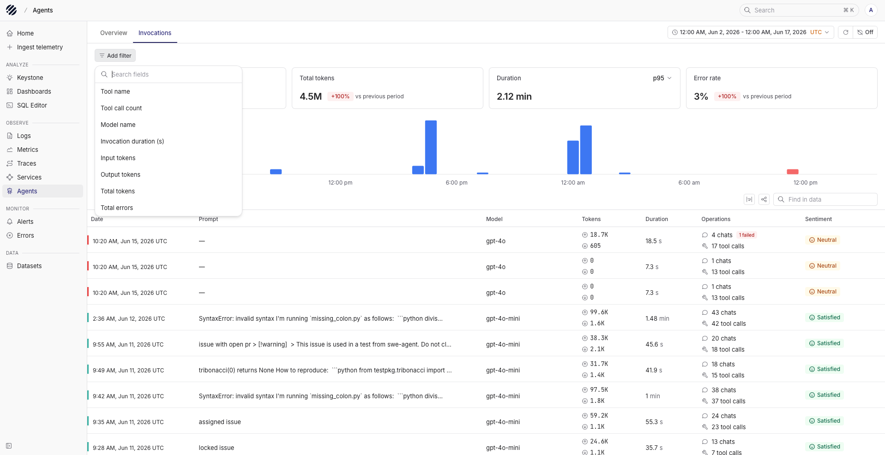
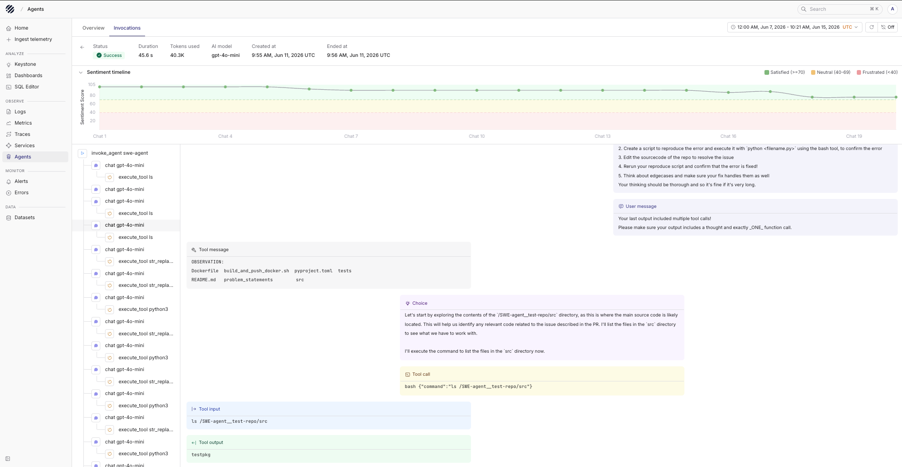

import { IconDatabase, IconCode, IconTerminal2 } from '@tabler/icons-react';

<OfferingPills cloud enterprise className="mb-4" />

Agents are already becoming part of everyday software. Sometimes users work with them directly. Sometimes they sit behind a workflow and quietly make decisions on their own. In both cases, a single request can quickly turn into multiple model calls, tool calls, retries, and intermediate steps before the final answer shows up.

That is usually where debugging gets hard. When the final answer is wrong, slow, or incomplete, the answer itself is not enough. You need to see the full run: what prompt started it, which model was used, what tools were called, what each tool received, what came back, how many tokens were spent, and where the run started to drift. That is the job of Agent Observability.

## Agent observability with Parseable

Parseable Agent Observability gives you that view inside Prism. You can begin with a high-level view of agent activity, move into a single invocation, and then drill down to the exact LLM call or tool execution that explains what happened.

It is built on the [OpenTelemetry GenAI semantic conventions](https://github.com/open-telemetry/semantic-conventions-genai), so the telemetry follows a standard shape for model calls, token usage, inputs, outputs, tool calls, and agent spans. That means you are not pushing agent telemetry into a custom black box. You are sending it in a format that stays close to the OpenTelemetry model and remains easy to reason about.

Once your agent is instrumented, the Agents page becomes the place where you understand how that agent behaves in production. You can see how often it runs, which models it uses, how many tokens it consumes, where it spends time, what it calls, and where the answer starts to go off track.

<Callout type="idea">
Parseable enriches GenAI telemetry at ingest time with fields like `p_genai_tokens_total`, `p_genai_tokens_per_sec`, and `p_genai_duration_ms`, so token usage and latency analysis is available without extra client-side tracking.
</Callout>

## Typical workflow

### Overview tab


When you open the Agents page, this is where you land first. The Overview tab is the quickest way to understand whether things look healthy over a selected time range.

The Invocations chart shows how many agent runs happened and how many of them ended in error. Token usage is split into input tokens and output tokens, grouped by model, so you can quickly see which model is consuming the most tokens. The Duration section helps you compare latency by tool and by model.

Use the time range picker in the top-right corner to change the window you are investigating. The charts update with the selected time range, so you can move from a broad view to a smaller incident window without leaving the page.

### Invocations tab



When you want to move from trends to actual runs, switch to the Invocations tab. This is where the broad view becomes a list of real agent sessions that you can inspect one by one.

At the top, Parseable shows total sessions, total tokens, duration, and error rate for the selected period. Below that, the timeline shows when invocations happened and where errors appeared.

The table lists each invocation with the timestamp, prompt, model, token usage, duration, operations, and sentiment. The Operations column shows how many chats and tool calls were part of the run, including failed tool calls when they are present. The Sentiment column helps you scan whether the response looked satisfied, neutral, or frustrated.

You can also change the duration percentile from the dropdown in the Duration card, for example `p50`, `p95`, or `p99`, depending on whether you want to inspect typical latency or tail latency.

#### Filtering and time range



Once the list grows, filters help you cut through the noise. Use Add filter when you already have a rough idea of what you are looking for and want to narrow the list to a smaller set of invocations.

You can filter by fields such as tool name, tool call count, model name, invocation duration, input tokens, output tokens, total tokens, and total errors. This is useful when you already know the shape of the problem. For example, you can filter to a specific model, look at sessions with a high token count, or focus only on invocations where a tool failed.

The Find in data search box helps you search within the visible invocation data after the time range and filters are applied.

### Drill into an invocation



This is where the real investigation starts. Open any row from the Invocations table to see the full detail view for that run.

The header shows the status, duration, tokens used, AI model, created time, and ended time. The Sentiment timeline shows how the interaction changed across the conversation, so you can see where the answer stayed useful, where satisfaction dipped, and where the run may need review.

Under it, the waterfall tree shows the full agent flow: the top-level invocation, each chat span, and each tool execution span. Selecting a chat or tool span opens the related details on the right, including user messages, assistant responses, tool inputs, tool outputs, and span-level details.

Use this view when you need to understand which prompt started the run, which model was used, which tools were called, what input was sent to the tool, what output came back, and where the run slowed down or failed.

## Manual instrumentation using the OpenTelemetry SDK

If you want to instrument your own agent, you can do that directly with the OpenTelemetry SDK. This works well when you have a custom agent, a provider-specific client, or a framework setup where you want full control over what gets captured.

At minimum, instrument these parts of the agent workflow:

1. **Agent-level spans:** `invoke_agent` spans that wrap the full agent loop
2. **Chat spans:** one `chat {model}` span for every LLM request
3. **Tool execution spans:** one `execute_tool {tool.name}` span for every tool or command execution
4. **Span events:** user messages, assistant messages, choices, tool calls, tool inputs, tool outputs, reasoning blocks, and evaluation results attached to the active span

The [manual instrumentation guide](/docs/user-guide/agent-observability/manual-instrumentation) shows how to structure those spans and what to capture so the data shows up cleanly in Parseable.

## Language support matrix

Any language that can emit OpenTelemetry traces over OTLP can send agent observability data to Parseable. The manual guide currently uses Python examples, but the schema is language-agnostic.

| Language   | Manual OpenTelemetry SDK |
|------------|-----------------|
| Python     | Yes             |
| TypeScript | Yes             |
| Java       | Yes             |
| Go         | Yes             |
| .NET       | Yes             |

---

## Collector configuration

After instrumentation is in place, the next step is deciding how you want to send the trace data to Parseable. For most teams, an OpenTelemetry Collector is the better default because it gives you batching and a more reliable path. If your setup is small, you can also export directly from the application.

### OpenTelemetry Collector (Recommended)

Put an OpenTelemetry Collector between your application and Parseable when you want a cleaner and more production-friendly path for export. Save the following as `parseable-genai-collector.yaml`:

```yaml
receivers:
  otlp:
    protocols:
      grpc:
        endpoint: 0.0.0.0:4317
      http:
        endpoint: 0.0.0.0:4318

processors:
  batch:
    timeout: 5s
    send_batch_size: 256

exporters:
  otlphttp/parseable:
    endpoint: ${PARSEABLE_URL}
    encoding: json
    headers:
      Authorization: "Basic ${PARSEABLE_AUTH}"
      X-P-Stream: "${STREAM_NAME}"
      X-P-Log-Source: "otel-traces"
      X-P-Dataset-Tag: "agent-observability"

service:
  pipelines:
    traces:
      receivers: [otlp]
      processors: [batch]
      exporters: [otlphttp/parseable]
```

Run the collector:

```bash
export PARSEABLE_URL=${PARSEABLE_URL}          # e.g. https://ingest.parseable.com
export PARSEABLE_AUTH=${PARSEABLE_AUTH}          # base64(username:password)
export STREAM_NAME=${PARSEABLE_DATASET_NAME}

otelcol-contrib --config parseable-genai-collector.yaml
```

### Direct to Parseable

For smaller setups, you can send traces directly from the application to Parseable with OTLP environment variables. This avoids running a separate collector process.

```bash
export OTEL_EXPORTER_OTLP_ENDPOINT=${PARSEABLE_URL}
export OTEL_EXPORTER_OTLP_HEADERS="Authorization=Basic ${PARSEABLE_AUTH},X-P-Stream=${PARSEABLE_DATASET_NAME},X-P-Log-Source=otel-traces,X-P-Dataset-Tag=agent-observability"
export OTEL_SERVICE_NAME=my-agent
export OTEL_INSTRUMENTATION_GENAI_CAPTURE_MESSAGE_CONTENT=true
```

## Next steps

<Cards>

<Card href="/docs/user-guide/agent-observability/manual-instrumentation" icon={<IconTerminal2 className="text-purple-600" />} title='Manual instrumentation guide'>
Complete reference for instrumenting any GenAI agent with OpenTelemetry traces, spans, and events.
</Card>

<Card href="/docs/user-guide/agent-observability/schema-reference" icon={<IconDatabase className="text-purple-600" />} title='Schema Reference'>
Complete column reference for the flattened GenAI trace.
</Card>

<Card href="/docs/user-guide/agent-observability/sql-queries" icon={<IconCode className="text-purple-600" />} title='SQL Query Templates'>
Sample SQL queries for common agent observability tasks like.
</Card>

</Cards>
