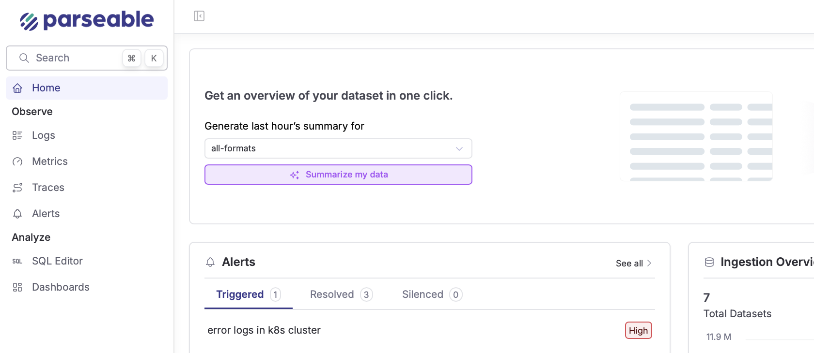
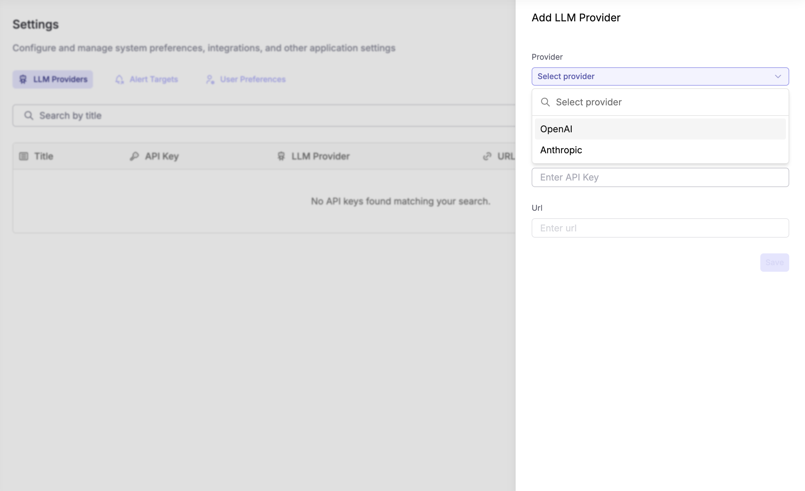

<OfferingPills pro enterprise className="mb-4" />

Parseable brings AI-native capabilities to your observability workflow, helping you get answers faster and reduce mean time to resolution.

## Features

### Keystone

Ask questions about your telemetry data in natural language. Keystone uses multiple AI agents to find the best answer across your datasets.

[Learn more about Keystone →](./keystone)

### Dataset Summarization

Get AI-powered summaries of your datasets to quickly identify patterns, anomalies, and potential issues.

[Learn more about Summarization →](./summary)

### Text to SQL

Generate SQL queries from plain English descriptions. The AI assistant can also fix broken queries and explain complex SQL.

[Learn more about Text to SQL →](./text-to-sql)

## Configuration

To enable AI features, configure your LLM provider:

1. Go to **Settings** > **AI Assistant**
2. Choose your preferred LLM provider (OpenAI GPT or Anthropic Claude)
3. Add your API key
4. Save your preferences

