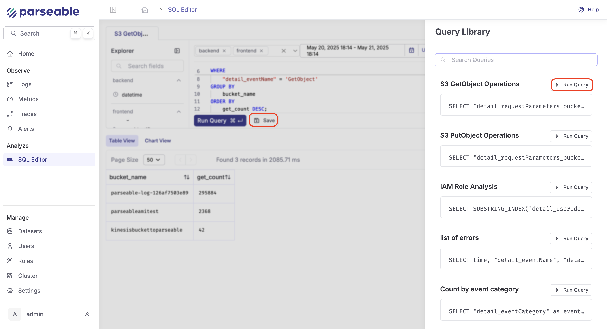

<OfferingPills pro enterprise className="mb-4" />

Parseable's LLM based query builder allows you to generate SQL queries based on your natural language query. This feature is available in the Prism and can be accessed from the SQL editor. It can also help with fixing your queries by suggesting corrections based on the query you have written.

## 1. Choosing Your LLM Provider

**Parseable supports multiple AI models out of the box.**

* Go to **Settings** > **AI Assistant**.
* Choose your preferred LLM provider (e.g., OpenAI GPT, Anthropic Claude).
* Add your API key.
* Save your preferences.

You can change this any time to fit team policies, costs, or performance needs.

## 2. Generating SQL from Plain English

**How to:**

* In your SQL editor, look for the "Generate with AI" button at the bottom.

* Type your question or description in plain language.
  **Examples:**

  * `Show me all error logs for the last hour grouped by host`
  * `Find top 5 most common user agents in the backend table`
  * `Summarize response statuses per environment tag`

**What happens:**
The AI will generate a ready-to-run SQL query for your prompt. You can copy, run, or tweak the result.

## 3. Using AI for Query Help

**Ask the AI anything in your SQL workflow:**

* **Write a new query:**
  `Generate with AI` > "Show all 5xx errors grouped by host in the last hour."
* **Fix a query:**
  Paste a broken query, then prompt, "Fix this query, it's giving a syntax error."
* **Explain a query:**
  Ask, "Explain what this query does."
* **Tweak logic:**
  "Can you add a filter for status = 500?"

The assistant uses your current datasets and history for context, so results are relevant.

## 4. Using Chat History

* All prompts and AI responses are saved automatically.
* Click the **History** tab in the assistant panel to view previous conversations.
* Rerun, reuse, or refine past queries from here.
* Useful for incident reviews, recurring analytics, and keeping a record of troubleshooting steps.

## 5. The Library

* Save any query you want to reuse in the **Library**.
* From the Library pane, you can:
  * Run saved queries directly
  * Edit or improve them with the AI assistant
  * Ask the assistant to explain saved queries

The Library is searchable and can be personal or shared with your team.

## 6. Let AI Fix Your Query

**When a query fails:**

* Click "Fix with AI" on the error message or use the AI assistant with your broken SQL.
* The AI analyzes your schema and query, returning a corrected version (e.g., fixing wrong field names, aggregation functions, or syntax).

This is especially useful in high-pressure situations or when exploring unfamiliar datasets.

## Example Workflow

1. **Troubleshoot an issue:**
   You notice a spike in latency. Type a plain English prompt describing what you need.
2. **Get a query:**
   AI generates the SQL for you.
3. **Edit and run:**
   Tweak or run the query.
4. **Query fails?**
   Use "Fix with AI" to automatically correct it.
5. **Save to Library:**
   Store your working query for future reuse, and ask the AI to explain it for documentation.