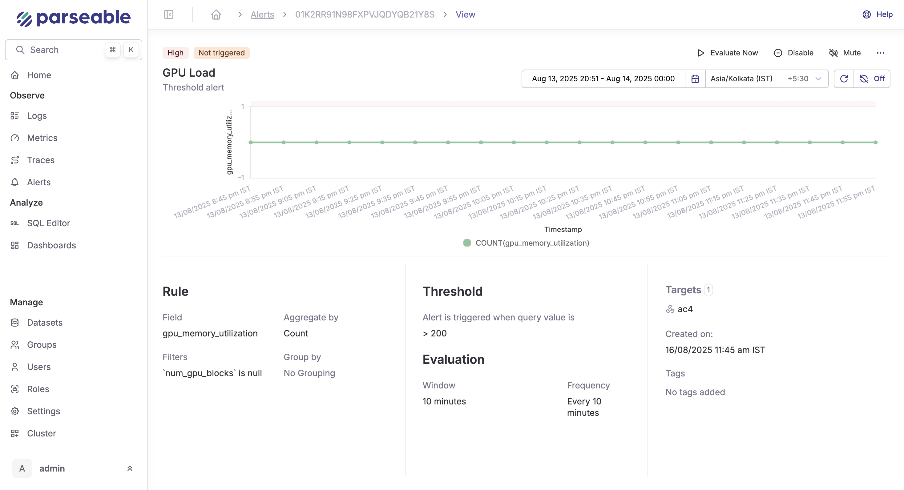
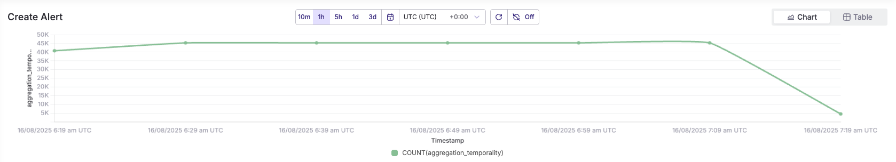
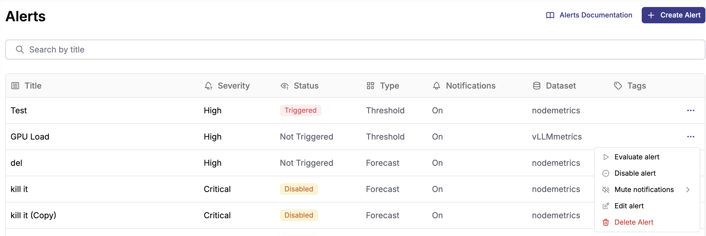

Parseable offers realtime alerting based on contents of incoming events. Each dataset can have several alerts and each alert is evaluated independently.

## How to set-up alerts

1. Navigate to the Alerts page from the side navigation menu
2. Click on "Create Alert" to set up a new alert
3. Set the "Preview", it could be either chart or table for 10m, 1h, 5h 1d or any custom timerange. 
  

### Configure Alert Rules

Configure the alert rules for all alert types:

- **Dataset**: Select the log stream or dataset you want to monitor
- **Monitor**: Choose the specific field to track (e.g., `response_time`, `error_count`, `status_code`)
- **Filter** (Optional): Add conditions to narrow down the data (e.g., `status = 500`, `environment = production`)
- **Group By** (Optional): Group results by specific fields for more granular alerting (e.g., group by `service_name` or `region`)

### Configure Targets

Targets are the destinations where notifications are sent when an alert is triggered. Parseable supports Webhook, Slack, and Alertmanager targets.

The list of configured targets can be seen under Settings > Alert Targets.

### Add Title and Save

- **Title**: Give your alert a descriptive name (e.g., "High CPU Usage", "API Error Rate")
- **Severity**: Select the appropriate level: Low, Medium, High, or Critical
- **Tags** (Optional): Add tags to categorize your alerts

Click **"Save"** to create your alert.

## Managing Alerts

After creating alerts, you can manage them from the Alerts page:

- **Evaluate alert**: Manually trigger an evaluation
- **Disable alert**: Temporarily disable without deleting
- **Mute notifications**: Stop notifications during maintenance
- **Edit alert**: Modify configuration
- **Delete Alert**: Permanently remove
