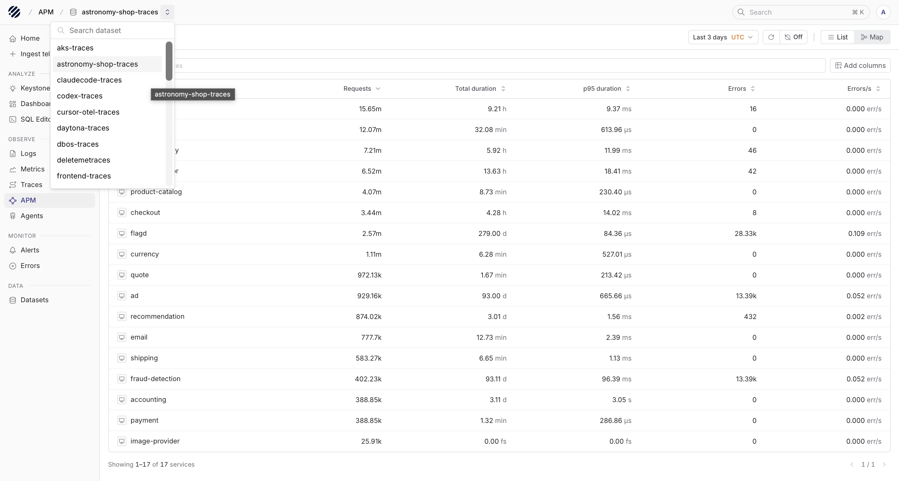
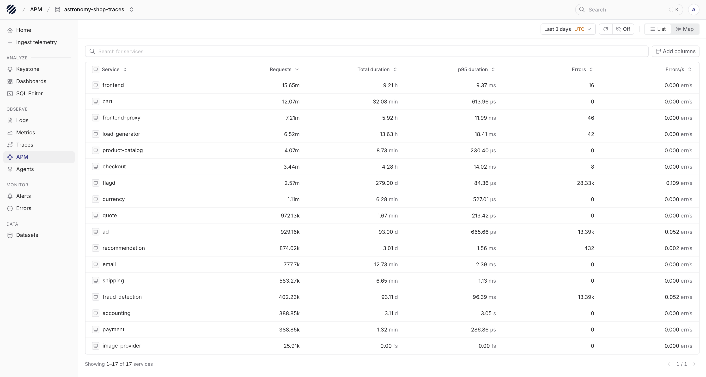
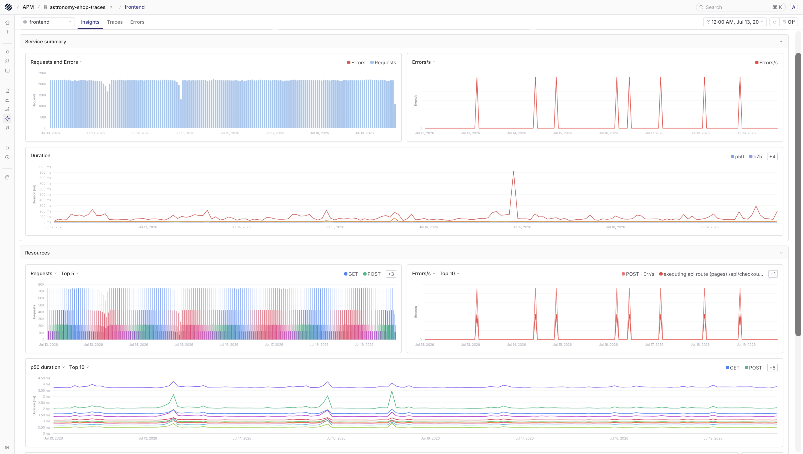
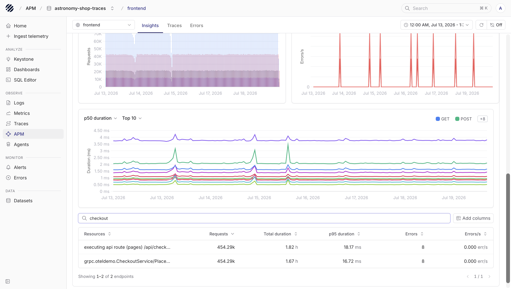
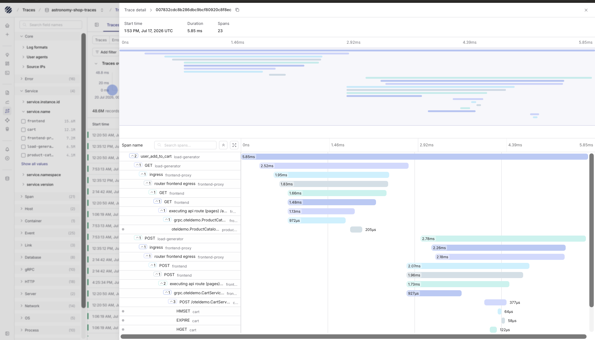
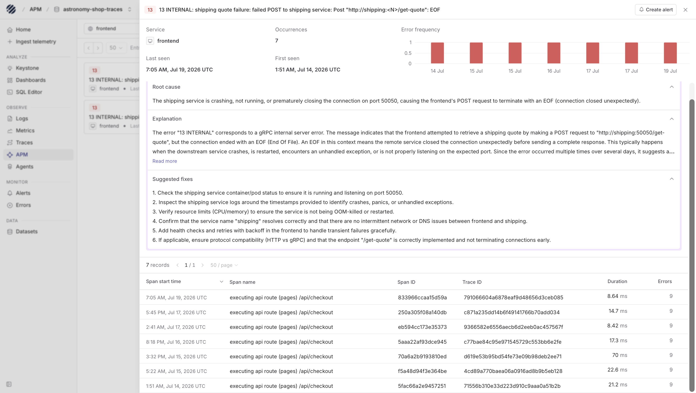

APM in Parseable gives you a service-level view of your traced applications. It is where you start when you know something is happening in the application, but you still need to understand which service is involved and which trace explains the behavior.

The page is built on trace data. You choose a trace dataset, inspect the services found in that dataset, open a service, and then move between `Insights`, `Traces`, and `Errors`. The idea is simple: start from the service, understand the shape of traffic and failures, then open the trace that gives you the exact request path.

## APM with Parseable

The APM page is most helpful when you want to compare services by request volume, latency, and errors before opening individual traces. For example, you may want to know which service is receiving the most traffic, which one has the highest p95 duration, or whether errors are isolated to one service or visible across a larger request path.

APM is different from the raw Traces page because it starts from services. The Traces page is better when you already want to inspect trace records directly. APM is better when you want a higher-level service view first and then drill down.

## Typical workflow

### Dataset and time range

Start from the `dataset selector` at the top of the page. Pick the trace dataset you want to inspect. The services list, filters, and service-level details all update around that dataset.

The `time range` picker controls how much data is included. A shorter range works well during an active incident or rollout. A wider range is better when you want to compare service behavior across days.

You can also choose the timezone from the picker, including UTC or your local timezone, so the charts and trace timestamps match how your team is investigating the issue.

The top toolbar also includes `refresh` and `auto-refresh`. `Auto-refresh` is useful when you are watching a live system and want the service view to keep updating.

<Callout type="info">
APM reads from trace datasets. Make sure your application is sending OpenTelemetry traces into Parseable before using this page.
</Callout>

### Services list

The default APM view shows the services found in the selected trace dataset. Each row represents a service and gives you the basic health signals for that service.

The table shows the service name, request count, total duration, p95 duration, error count, and error rate. This makes it easy to scan the application from a service point of view instead of starting with thousands of individual spans.

The `search` bar helps when you already know the service name. Column sorting helps when you want to bring the busiest, slowest, or highest-error services to the top.

If your traces contain extra service metadata, `Add columns` lets you bring those fields into the table. This helps when service name alone is not enough and you want to include fields such as namespace, version, environment, or deployment metadata.

### Service list

The service list is usually the fastest way to compare services by request count, p95 duration, or errors. It uses the selected dataset and `time range`, so changing either one updates the service table around the same investigation context.

### Open a service

Click a service row to open the service-level APM view. This scopes the page to that service and gives you three tabs. `Insights` shows request, duration, error, and resource charts. `Traces` shows traces related to the selected service. `Errors` focuses on traces and spans where failures were reported.

The `service selector` at the top lets you move between services without returning to the main list. This is useful when you are comparing two services during the same investigation.

## Insights tab

The `Insights` tab is the first place to look after opening a service. It summarizes the selected service over the current `time range`.

At the top, you get service-level numbers such as request count, duration, and error rate. Below that, the charts show how the service behaved over time.

This is where you can quickly tell whether traffic changed, whether errors appeared as one-off spikes or repeated patterns, and whether latency moved at the same time as request volume. The resource charts and table help you see which routes, operations, or resources are contributing the most requests, duration, or errors.

The resources table helps you move from service-level behavior into endpoint or operation-level behavior. When you already know the route or operation name, search within resources. When the default columns are not enough, add the fields you need to the table.

For example, if a service has an error spike, use the resource charts and table to check whether the errors are coming from one route, one operation, or the service more broadly.

## Traces tab

The `Traces` tab shows traces related to the selected service. It becomes useful once `Insights` tells you that something changed and you want to open the actual traces behind that change.

This tab is useful when you want to find slow traces for a service, traces with many spans, traces around a specific time window, or traces related to a resource you noticed in `Insights`.

Open a trace row to move into trace detail. The trace detail view shows the trace start time, total duration, span count, and waterfall.

The waterfall shows how the request moved across services and where time was spent. Expand span groups when you need more detail. Click a span when you want to inspect fields, events, service metadata, HTTP attributes, database attributes, or other span-level data.

This is usually where APM becomes a debugging workflow. You start from the service, narrow down to the trace, and then inspect the spans that explain the behavior.

## Errors tab

The `Errors` tab focuses the service view on failed traces and error spans. It is the tab to open when the service list or `Insights` tab shows an error count or error-rate spike.

This is the place to check which traces failed for the service, which operation or resource is involved, and whether the errors are spread across many traces or concentrated in a few repeated paths. From there, open the trace and inspect the span that reported the error.

If the same error needs to be watched going forward, you can also create an alert directly from the error detail view.

From here, open a trace and inspect the waterfall the same way you would from the `Traces` tab. The difference is that the `Errors` tab starts from failures, so you spend less time filtering the broader trace list.

## Working through an issue

A usual investigation starts by selecting the trace dataset and `time range`, then looking at the service list to see which service needs attention. From there, open the service, check `Insights` for request volume, latency, and error patterns, and then move into `Traces` or `Errors` when you need the request-level detail.

Once you open a trace, the waterfall gives you the full path of the request. Click into spans when you need the exact fields, events, and service metadata behind the behavior. APM works best when your traces include consistent service names, span names, status fields, and resource attributes, because those fields make the service list easier to scan and the drilldown easier to trust.
