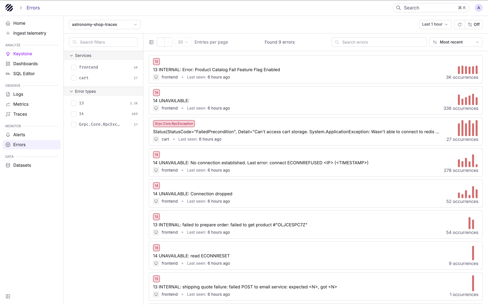
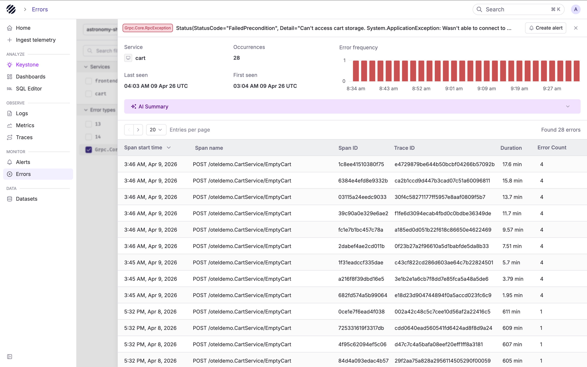
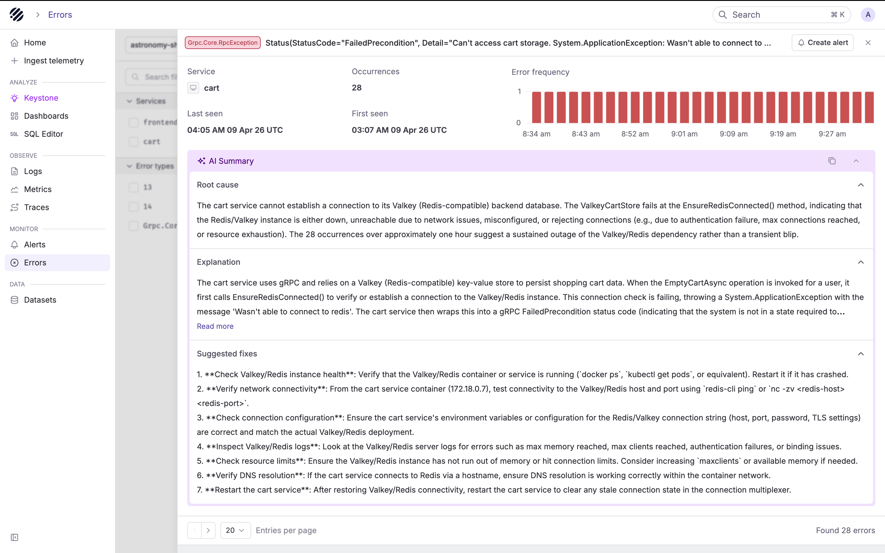
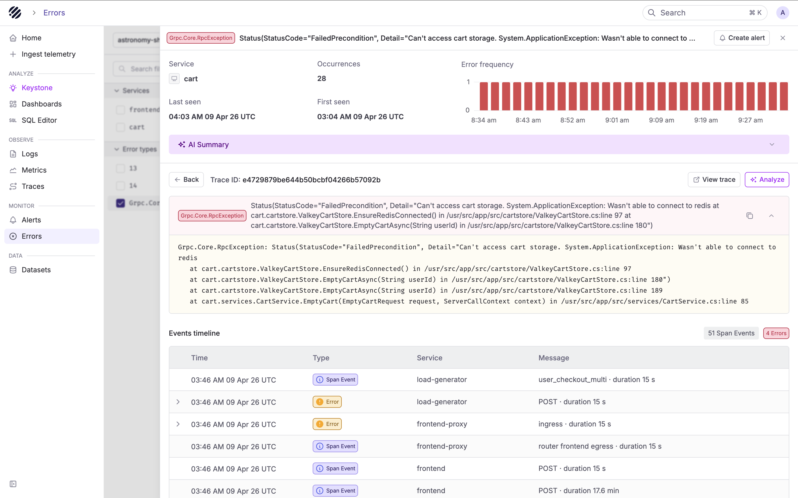

<OfferingPills pro enterprise className="mb-4" />

Parseable Errors page is purpose built to help you debug errors in OpenTelemetry traces. It surfaces the most important errors in your stack, gives you a high-level understanding of what is breaking, and helps you jump into the right trace to see the full context of a failure.

The error page collapses thousands of exception spans into a short list of distinct failures. This saves time and effort in scrolling through the Traces explorer with a filter on error status.

## Data pre-requisites

- Error view works with **OTel Trace** datasets only. Error groups are built from the `event_exception.type`, `event_exception.message`, and `event_exception.stacktrace` fields that OpenTelemetry records on span events. 

- Error view requires events with `event_exception.type`, `event_exception.message`, and `service.name` fields.

If you are chasing log-level errors instead, start from the [Logs explorer](/docs/user-guide/logs) with a filter on your log level field. Log based error grouping is not available here yet.

## When to use this page

- You were paged or noticed a dashboard spike and need to find what is actually failing
- You want to know which service is the source of a wave of errors rippling across your stack
- You need to tell a new error apart from a long-running one: "has this been failing for hours, or did it start five minutes ago?"
- You want an LLM-generated first guess at the root cause and a remediation checklist before diving into stack traces

If you already have a trace ID, skip this page and jump straight to the [Traces explorer](/docs/user-guide/traces). If you know the log line you are after, use the [Logs explorer](/docs/user-guide/logs).

## The debugging workflow

The page is designed around a single flow: **scope, triage, open, correlate, escalate**. Each section below is one step of that flow. Read them in order the first time and skip around later.

### Scope the investigation

Pick the trace dataset of the service you suspect, then narrow the time range to the incident window. Keep the window tight: a one-hour range over a fresh deploy almost always carries more signal than "last 24 hours" because the spark charts and the AI summary both work better when the list is not dominated by background noise. Widen it only after you have ruled out a recent regression.

### Find the error that matters

Read the error list the way you would read a ranked incident list rather than a UI inventory:

- **Scan the Occurrences column for the loudest error.** High-count rows are the ones most likely to match whatever your alert fired on.
- **Use the spark chart to read the shape of the failure.** A steady bar pattern is a chronic issue that has been running for a while. A single tall block is a burst tied to a specific moment. A "started, stopped, started again" pattern usually points at a flapping dependency.
- **Narrow with the sidebar facets when you have a hunch.** Click a service under **Services** to see only that service's errors. Click an exception class under **Error types** (for example `14 UNAVAILABLE` or `Grpc.Core.RpcException`) when you want to look at one failure mode across services.
- **Use Search errors for a known message.** If a teammate told you "the cart service is throwing `Wasn't able to connect to redis`", paste that phrase and jump directly to the group.

### Understand what broke

Click the error row to open its detail view.

Start with the header. The **first seen / last seen** pair and the **error frequency** chart answer two triage questions you need before doing anything else:

- **Is this new?** A first-seen timestamp within the last few minutes almost always means a recent deploy, config change, or traffic shift. Check the deploy log before anything else.
- **Is this getting worse?** A frequency chart that is climbing rather than flat means the situation is escalating. Do not wait on a long investigation before paging upstream teams.

Then expand the **AI Summary**.

The summary takes the exception type, message, and stack trace as context and returns three things: a plain-language **root cause**, an **explanation** of how the error manifests and which components are involved, and a numbered **suggested fixes** checklist. Treat it as a knowledgeable first responder. It is often enough to unblock a known-class error (dependency down, misconfiguration, misrouted traffic) without reading a single stack frame.

If the summary nails it, follow the suggested fixes and stop here. If it feels generic or wrong, move on.

### Open a real failing request

Below the header, the **impacted spans** table lists every span that carried this exception. Pick a representative one, usually the most recent, but prefer a long-duration row when you are chasing a latency-plus-error problem.

Clicking a span opens the error trace view.

This view exists to answer the "what was the request doing when it failed" question using two pieces of evidence:

- **The stack trace** shows exactly where in your code the exception was raised. Copy it into your issue tracker or a chat thread with one click.
- **The events timeline** lists every span event in the trace in chronological order, with errors highlighted in red. Read it to see what else was happening in the same request: retries, upstream calls, and the normal span events that surrounded the failure.

Click **View trace** in the header to jump to the full waterfall in the [Traces explorer](/docs/user-guide/traces) with the failing span highlighted. Do that when you need the end-to-end request tree, for example to verify that a timeout in an upstream service is the real cause rather than the local service itself.

### Correlate with logs

Errors on this page are linked to logs via OpenTelemetry trace and span IDs. Two pivots matter:

- **Trace to logs**: from an error trace, jump to every log line that shares the same `trace.id` to see what the services in the request were logging around the failure
- **Span to logs**: from a specific error span, jump to log lines that share the same `span.id` for the narrow slice of logs tied to that one operation

Reach for the trace-level pivot when you want the full story of a request and the span-level pivot when you already know which operation broke and want the logs that service emitted right around it. Both only work when your logs and traces are ingested with matching IDs. See [Manual Instrumentation](/docs/user-guide/agent-observability/manual-instrumentation) for the required attributes if you are instrumenting by hand.

### Escalate to Keystone when the surface info is not enough

Click **Analyze** on the error detail or trace view to hand the full error context to [Keystone](/docs/user-guide/ai-native/keystone), Parseable's agentic debugging assistant. Keystone receives the exception type, message, stack trace, the full span tree for the trace, and service and operation metadata, and gives you a natural-language debugging session on top of that data.

Use Keystone when:

- The failure touches multiple services and you want to know which one is the actual source
- The AI Summary is correct but not specific enough, and you want to ask follow-ups like "are other services seeing the same upstream error right now?"
- You want a probable root cause backed by SQL queries you can run directly against your data
- You need mitigation steps that take the rest of your telemetry into account, not just the stack trace of one span

If all you need is a quick explanation of the exception in front of you, the AI Summary is faster. Reach for Keystone when you need the broader picture.

### Monitor if it happens again

Before closing the detail view, use **Create alert** in the header to create an [alert](/docs/user-guide/alerting) scoped to this error group. This is especially valuable for silent failures (ones you only found out about because a customer complained), so the next occurrence pages an on-call engineer instead of quietly piling up.

## Debugging tips

- **Compare first seen and last seen before writing an RCA.** The same `14 UNAVAILABLE` that has been quietly failing all week is a very different story from one that started ten minutes ago.
- **Trust the spark chart to judge urgency.** A tall, sharp block means "something happened now." A steady bar pattern means "this has been broken and nobody noticed."
- **Do not stop at the AI Summary for novel errors.** It is strong on known-class failures and weaker on one-off bugs. When it feels generic, drop into a real trace.
- **Filter before you paginate.** On a noisy dataset, narrowing by service or exception type is much faster than scrolling through the full list.
- **Close the loop with an alert.** Every error you triage from a customer report is an alert you should have had. The **Create alert** button in the header is one click away.
