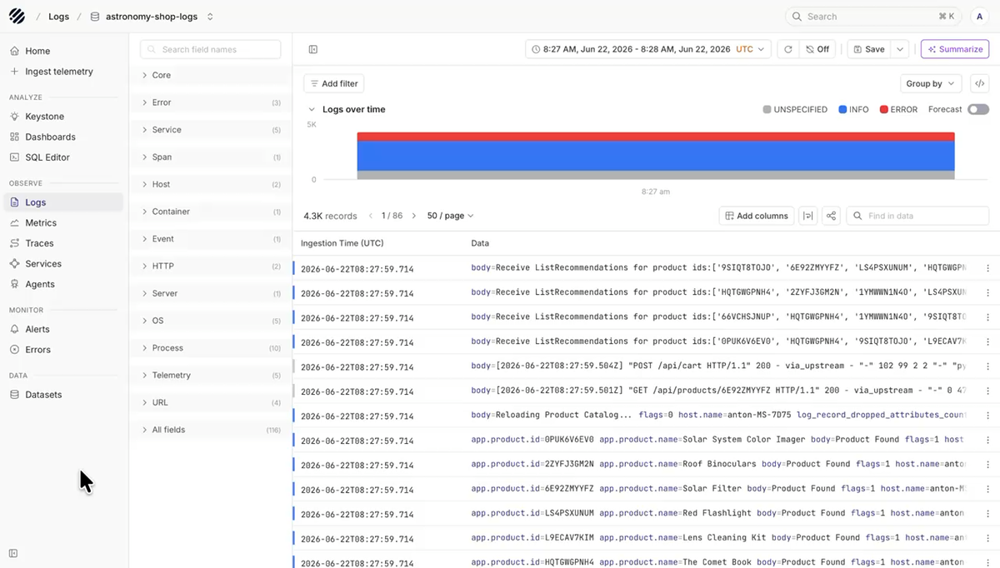
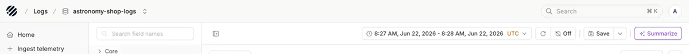
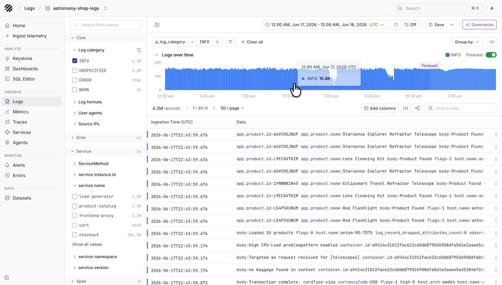
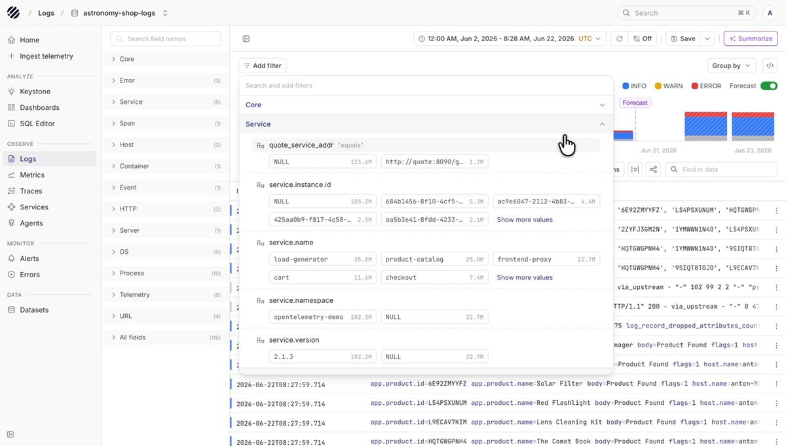
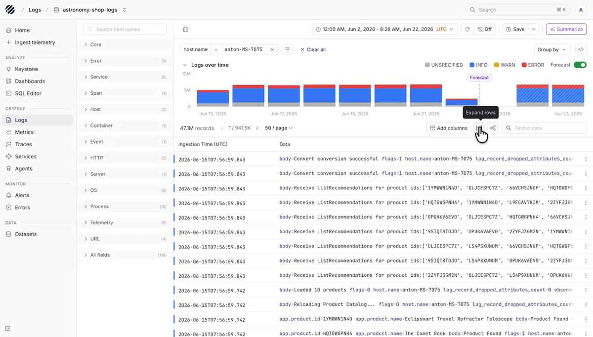
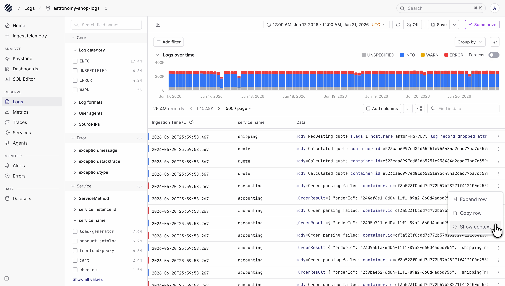
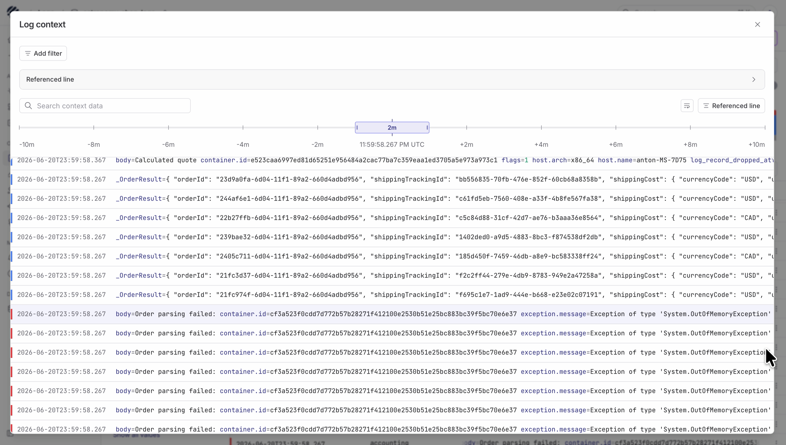
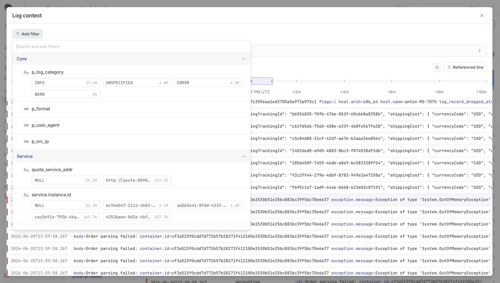
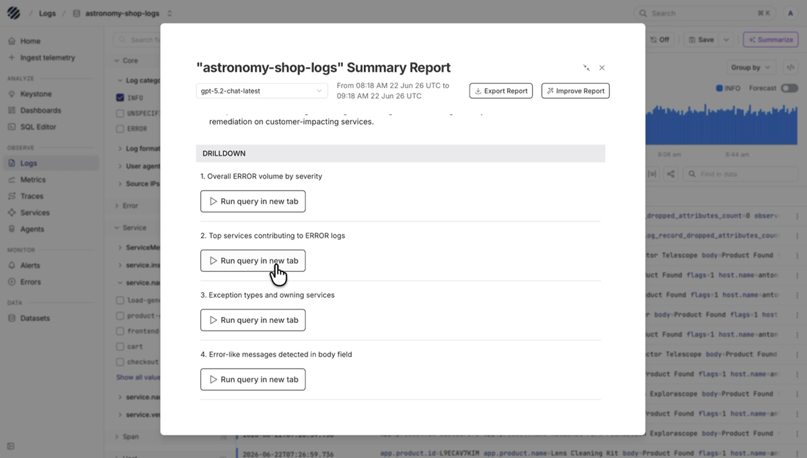

Logs are often the first place you go when something in production needs context. A chart can tell you that traffic changed. An alert can tell you something failed. Logs help you see what the service actually wrote at that exact moment.

The Logs page in Parseable is built for that flow. You choose a dataset, pick the time range, look at log volume, narrow the data with fields and filters, and then inspect the records that explain what happened.

## Logs with Parseable

Parseable stores logs as structured records. That means the Logs page is not only a place to search text. You can use fields like service name, host name, container metadata, HTTP details, trace ids, span ids, and log category to move from a broad view to a focused set of rows.

Use this page when you want to answer questions like:

- Which service produced these logs
- When did the log volume change
- Are the records mostly `INFO`, `WARN`, `ERROR`, or `UNSPECIFIED`
- Which host, container, endpoint, or trace is involved
- What fields should be added to the table so the data is easier to scan

## Typical workflow

### Dataset and time range

Start with the dataset selector and the time range picker.

Select the log dataset from the dataset selector at the top of the page. The rest of the page updates for that dataset, including the available fields, filters, chart, and table columns.

Use the time range picker to decide how much data you want to inspect. A smaller time range works well when you already know when something happened. A wider range is useful when you want to see how log volume changed over time.

You can also choose the timezone from the picker, including your local timezone, so timestamps are easier to read for your team.

The top toolbar also gives you quick access to refresh, auto-refresh, saved views, and summarization. Use auto-refresh when you want to keep watching a live window of logs.

<Callout type="info">
Every logs query is scoped by time. This keeps the query focused on the period you want to inspect and avoids reading more data than needed.
</Callout>

### Logs over time

After choosing the dataset and time range, look at the Logs over time chart. It shows how many log records were found in the selected window.

The chart is split by log category. Categories such as `UNSPECIFIED`, `INFO`, `WARN`, and `ERROR` appear in the legend. Click a category when you want to focus on that type of log. The chart and table update around that selection.

Turn on **Forecast** when you want Parseable to project the current log volume forward. This is useful when you are watching traffic during a rollout, load test, or spike.

### Field groups

The fields panel on the left shows the fields Parseable found in the selected dataset. Use it before adding filters or columns. It helps you understand what data is available.

Fields are grouped into sections such as:

- **Core**, for common log fields and log category
- **Error**, for error-related fields
- **Service**, for service name, service instance, namespace, and version
- **Span**, for trace and span context
- **Host**, **Container**, **HTTP**, **Process**, **Telemetry**, and other runtime fields
- **All fields**, when you want to search across everything

Use **Search field names** when you already know the field you need. Expand a field group to see values and counts. The counts help you decide which values are worth filtering on.

### Filters

When the table has too many records, use **Add filter** to narrow the page.

The filter panel lets you search across fields and values. Values are shown with counts, so you can choose the value that matches what you want to inspect.

For example:

- Filter by `service.name` to inspect one service
- Filter by `host.name` when a problem looks node-specific
- Filter by `p_log_category` to look at `INFO`, `WARN`, or `ERROR` logs
- Filter by HTTP fields when you are following a request path
- Filter by trace or span fields when you want to connect logs back to traces

Active filters appear as pills above the chart. You can remove one filter at a time, or use **Clear all** to return to the broader view.

After filters are applied, use **Find in data** to search within the visible rows. This is useful when you want to find a word, id, product name, endpoint, or message fragment inside the current page.

### Group by

Use **Group by** when you want to compare records by a field instead of reading individual rows.

Good fields to group by include:

- `p_log_category`, to compare `INFO`, `WARN`, and `ERROR` volume
- `service.name`, to see which service is producing the most logs
- `host.name` or container fields, to find noisy infrastructure
- `http.status_code`, to separate successful and failing requests
- Error fields, to see repeated failure patterns

Grouping is useful when the table is too large to read directly. It helps you see which services, hosts, categories, or status codes are contributing the most records.

### Log table

The table shows the actual log records. By default, you see ingestion time and log data. If the dataset has many fields, add the columns that are useful for the current task.

Use **Add columns** to choose fields that should appear as table columns. For example, you might add `service.name`, `host.name`, `http.status_code`, `trace_id`, or a field from the log body.

The table toolbar also gives you a few useful controls:

- **Expand rows**, to show more of each record without opening records one by one
- **Share**, to copy a link to the current view
- **Find in data**, to search within the current rows
- **Pagination and page size**, to move through large result sets without changing the query

If a record contains a long message or many fields, use the row actions to inspect more detail. Structured logs make this easier because each field can be read, filtered, or added as a column.

### Log context

Sometimes one log row is not enough. An error record usually makes more sense when you can see what the service wrote just before it and what happened immediately after it.

Open the row actions menu at the end of a log row and choose **Show context**.

Parseable opens the **Log context** view around that row. The row you started from becomes the referenced line. By default, the view starts with one minute before and one minute after the referenced line, so you can inspect the short window around the event without building a new query from scratch.

Use the timeline to widen or narrow the context window when you need more history around the event. For example, you can move from a small window around the error to a wider window when the cause may have started earlier.

If you scroll away from the original row, use **Referenced line** to jump back to the log line that opened the context. Use search when you want to find a value inside the surrounding records, and use wrap when long messages need to be easier to read.

You can also apply filters inside Log context. This helps when the surrounding window has many records and you only want to keep a service, log category, source IP, user agent, or another field that matters for the investigation.

### Saved views, sharing, and summaries

When you have a useful view, save it. Saved views help you come back to the same dataset, filters, fields, and time range without setting everything again.

Use the share control when you want another teammate to open the same view. Use export when you need the current result set outside Parseable.

The **Summarize** button can generate a report for the selected data. Use it when you want a quick read of the current logs before looking deeper.

The summary can also suggest drilldown queries. Use those as starting points. Open a query in a new tab when you want to keep the current Logs page open and continue in SQL.

## A simple way to use the page

Most log investigations follow the same loop:

1. Pick the dataset and time range.
2. Look at the chart to understand volume and severity.
3. Use fields or **Add filter** to narrow the data.
4. Add columns that make the table easier to scan.
5. Open or expand the records that look relevant.
6. Save, share, export, summarize, or move into SQL when needed.

With Parseable logs, the goal is to narrow the data until the records you need are easy to inspect.
