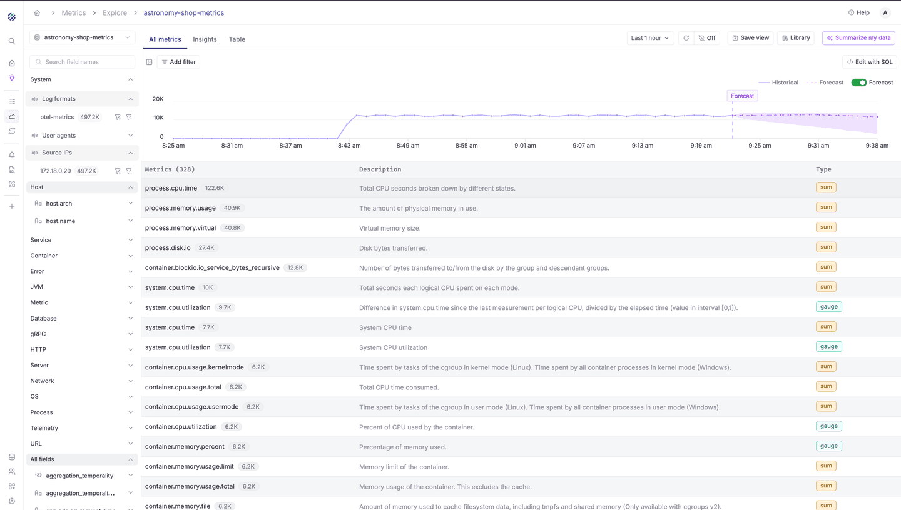
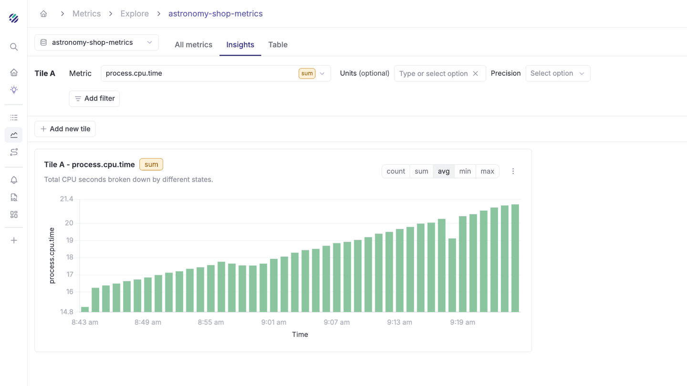
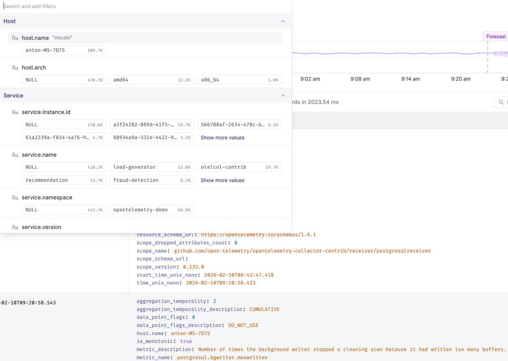
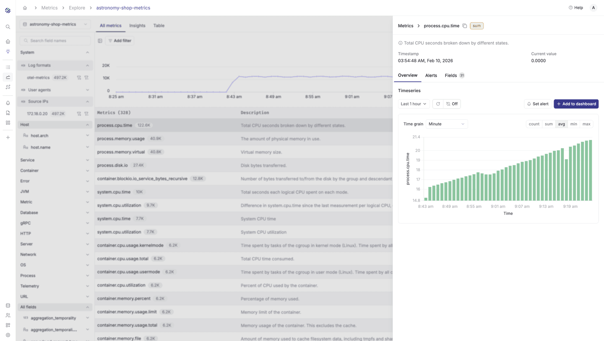

Metrics Explore is the central interface for browsing, analyzing, and acting on metrics data in Parseable. It provides a visual overview of all metrics in a dataset, tools for filtering and drilling down into individual metrics, and pathways to create alerts, dashboards, and SQL queries directly from your metric data.

## Page Layout

The Metrics Explore page is organized into three main areas:

- **Left Sidebar (Field Browser)** - A categorized and searchable list of all fields (labels) present in the selected metrics dataset
- **Central Content Area** - A summary chart of total metric volume over time, and a table listing all discovered metrics with their descriptions, data point counts, and types
- **Right Detail Panel** - Appears when you click on a specific metric, showing an expanded overview, timeseries chart, alert configuration, and field details

## Selecting a Dataset

A dataset selector dropdown at the top-left lets you choose which metrics dataset to explore. Click the dropdown to search for and switch between available datasets.

## Main Tabs

Three tabs at the top of the content area provide different ways to interact with your metric data.

### All Metrics Tab

This is the default view. It displays a summary timeseries chart at the top showing total metric data point volume, followed by a metrics table listing all metrics in the dataset. Each row shows the metric name, a data point count badge (e.g., 338.3K), a description, and a type badge (such as `sum` or `gauge`). Metrics are sorted by data point count in descending order.

Click any metric row to open the metric detail panel on the right.

### Insights Tab

The Insights tab provides a tile-based analysis view for deeper exploration.

The configuration panel at the top includes:

- **Metric selector** - The metric to analyze
- **Type badge** - The metric type (e.g., `sum`) with a dropdown
- **Units** - Optional unit label
- **Precision** - Decimal precision selector
- **Add filter** - Filter the metric by label values
- **Group & sort** - Expand to reveal Group by and Sort by fields for slicing data by any label dimension

Each tile displays a bar chart with aggregation toggles: count, sum, avg, min, and max. A **Time grain** dropdown (defaulting to Minute) controls the temporal resolution.

A three-dot menu on each tile offers:

- **Add to dashboard** - Adds the chart to a dashboard
- **Set alert** - Opens the alert creation form pre-filled with the metric
- **Download as PNG** - Exports the chart image

Click **+ Add new tile** to compare different metrics side by side.

### Table Tab

The Table tab shows raw metric data in a tabular format.

The left sidebar adapts to show:

- **System fields** - Built-in fields like Log formats, User agents, and Source IPs
- **Table fields** - Currently displayed columns (by default, Ingestion Time and Data)
- **Available fields** - All 48+ fields available in the dataset that can be added as table columns

The data table shows an Ingestion Time column and a Data column containing the full key-value pairs for each data point. Above the table, pagination controls, a record count indicator (e.g., "Found 2.2M records in 292.88 ms"), and a **Find in data** search box are available. A **Group by** button lets you group raw records by specific field values.

## Field Browser

The left sidebar provides a categorized view of all fields in the metrics dataset. Fields are organized under semantic categories such as System, Service, Kubernetes, Container, Error, Metric, Cloud, Database, Network, Telemetry, and All fields.

A **Search field names** text box at the top lets you quickly find specific fields. Expanding an individual field shows its distinct values along with occurrence counts. Next to each field value, two filter icons appear:

- **Include filter** (funnel with +) - Adds a positive filter for that value
- **Exclude filter** (funnel with −) - Filters out records with that value

The sidebar can be collapsed using the toggle button to give the main content area more space.

## Filtering

Click **Add filter** to open the filter panel. Fields are organized by category (Service, Kubernetes, Container, Error, Metric, Cloud, Database, Telemetry, All fields). Each field displays its distinct values as clickable chips with occurrence counts.

Use the **Search and add filters** text box to locate specific fields or values. Click any value chip to add it as an active filter. Filters can also be added directly from the field browser sidebar by clicking the include/exclude icons next to field values.

## Time Range

Click the time range button (e.g., "Last 1 hour") to configure the query window:

- **Quick presets** - 10 min, 1 hr, 5 hrs, 1 day, 3 days
- **Custom range** - Calendar-based date/time selection with From and To fields
- **Timezone** - Timezone selector (defaults to UTC)

Click **Apply** to confirm or **Cancel** to discard.

## Auto-Refresh

- **Manual refresh** - The circular arrow icon triggers an immediate data refresh
- **Auto-refresh** - Dropdown with interval options: 10s, 30s, 1m, 5m, 10m, or 20m

## Forecast

A **Forecast** toggle in the upper-right area of the summary chart enables predictive visualization. When enabled, the chart extends beyond the current time to show forecasted values. The legend distinguishes between "Historical" data (solid line) and "Forecast" data (dashed line).

## Metric Detail Panel

Click any metric in the metrics table to open the detail panel on the right. The panel header shows the metric name (with a copy icon), type badge, description, latest timestamp, and current value.

### Overview Sub-tab

Displays a timeseries bar chart showing the metric's behavior over the selected time range. Controls include:

- A dedicated time range selector and refresh controls
- **Set alert** button to create an alert directly from the metric
- **Add to dashboard** button to add the chart to a dashboard
- **Time grain** dropdown (defaults to Minute) for temporal resolution
- **Aggregation buttons** - count, sum, avg, min, max

### Alerts Sub-tab

Shows all alerts configured for the selected metric. If no alerts exist, a **Set alert** button is available to create one. See [Alerting](/docs/user-guide/alerting) for details.

### Fields Sub-tab

Displays all fields associated with the selected metric organized by category (Service, Kubernetes, Container, Metric, Cloud, Telemetry, All fields). Each row shows a field name and its value for the most recent data point. A **Search field name** text box filters the field list.

## Creating Alerts from Metrics

Click **Set alert** from either the metric detail panel or the Insights tile menu. This navigates to the **Alerts > Create** page with the metric context pre-filled. The alert creation form has four steps:

1. **Set rule** - Configure the dataset, metric, aggregation function (e.g., AVG), optional units, filters, and optional Group by fields
2. **Set Evaluation** - Choose the alert type: Threshold, Anomaly Detection, or Forecast. Configure the evaluation window, repetition interval, and trigger condition
3. **Targets** - Specify notification delivery targets and repeat interval
4. **Title and severity** - Enter the alert title, select severity, and optionally add tags

A live chart/table preview at the top shows the metric data alongside the configured threshold. For more details, see [Alerting](/docs/user-guide/alerting).

## Adding Metrics to Dashboards

Click **Add to dashboard** to open a dialog where you can search existing dashboards, select one, or click **+ Create new** to create a new dashboard. The metric chart is added as a tile on the chosen dashboard. For more on dashboards, see [Dashboards](/docs/user-guide/dashboards).

## Edit with SQL

Click **Edit with SQL** to open the [SQL Editor](/docs/user-guide/sql-editor) in a new tab with a pre-populated query (e.g., `select * from "otel-demo-metrics"`).

## Save View

Click **Save view** to persist the current filters, time range, and configuration as a reusable view. Provide a Title (required), optional Description, and toggle **Include time range** to save the time window as part of the view.

## View Library

Click **Library** to open the view library with three tabs:

- **Recent** - Recently accessed views
- **My views** - Views you created
- **All views** - All views across the team

A search field lets you find views by name.

## Summarize My Data

Click the **Summarize my data** button (sparkle icon) for an AI-powered summary of your metrics dataset. This provides automated insights and observations about the data. See [AI Native](/docs/user-guide/ai-native) for more details.
